# Stage 3 Artifact Enrichment Review - Case 228086

## Summary

| Metric | Value |
| --- | --- |
| Artifacts | 23 |
| Enriched | 23 |
| Failed | 0 |
| Validation errors | 0 |
| Warnings | 1 |
| Artifacts with uncertainty or quality notes | 23 |

## Counts

### Evidence Roles

| Role | Count |
| --- | --- |
| diagnostic_evidence | 14 |
| incident_context_evidence | 5 |
| symptom_evidence | 2 |
| action_evidence | 1 |
| validation_evidence | 1 |

### OCR Quality

| Quality | Count |
| --- | --- |
| usable | 11 |
| garbled | 8 |
| low | 4 |

## Warnings

- One or more artifacts were flagged as having garbled OCR.

## Artifact Index

| Page | Artifact | Role | OCR | Summary | Review flags |
| --- | --- | --- | --- | --- | --- |
| 3 | artifact_incident_228086_page_003_embedded_image_01 | diagnostic_evidence | garbled | Photograph of a Dell monitor displaying a UPS/warehouse control interface on the RMS page for ACB System 1. | uncertainty, quality, ocr:garbled |
| 4 | artifact_incident_228086_page_004_embedded_image_01 | diagnostic_evidence | garbled | Photograph of a Dell monitor displaying a UPS/operations interface for "ACB System 1 - RMS" with the Primary tab selected. | uncertainty, quality, ocr:garbled, duplicate:duplicate |
| 5 | artifact_incident_228086_page_005_embedded_image_01 | symptom_evidence | garbled | RMS/HMI screenshot for ACB System 1 showing a mostly blank status page with a visible message: ".NET Control not created." | uncertainty, quality, ocr:garbled, duplicate:unique |
| 6 | artifact_incident_228086_page_006_full_page_01 | incident_context_evidence | usable | Teams chat screenshot showing coordination around remote access, tech support hotline updates, and questions about whether Ignition crashed. | uncertainty, quality, duplicate:unique |
| 8 | artifact_incident_228086_page_008_embedded_image_01 | diagnostic_evidence | usable | Memory trend chart showing an initial high memory level followed by a sustained lower plateau over time. | uncertainty, quality, duplicate:unique |
| 12 | artifact_incident_228086_page_012_nested_image_01 | diagnostic_evidence | low | Memory trend chart showing usage remaining well below a higher threshold line over time. | uncertainty, quality, ocr:low, duplicate:unique |
| 12 | artifact_incident_228086_page_012_nested_image_02 | diagnostic_evidence | low | Windows command prompt screenshot showing an attempted restart of an Ignition Gateway from the Ignition installation directory. | uncertainty, quality, ocr:low, duplicate:unique |
| 13 | artifact_incident_228086_page_013_embedded_image_01 | diagnostic_evidence | low | Memory trend chart showing usage remaining below a higher red threshold line over roughly an overnight-to-midday time window. | uncertainty, quality, ocr:low, duplicate:unique |
| 14 | artifact_incident_228086_page_014_embedded_image_01 | symptom_evidence | garbled | Geek+ RMS Map Monitor screenshot showing a warehouse map, a selected robot details panel, and an emergency stop control area. | uncertainty, quality, ocr:garbled, duplicate:unique |
| 15 | artifact_incident_228086_page_015_embedded_image_01 | action_evidence | usable | Windows command prompt showing navigation to the Ignition installation directory, a failed `ls -1` command, and execution of `gwcmd -r` with a gateway restart in progress. | uncertainty, quality, duplicate:unique |
| 16 | artifact_incident_228086_page_016_embedded_image_01 | diagnostic_evidence | usable | Ignition gateway Systems Overview screenshot showing performance and connection status widgets. | uncertainty, quality, duplicate:unique |
| 17 | artifact_incident_228086_page_017_embedded_image_01 | validation_evidence | low | API client screenshot showing a GET request to GetAgvStatuses with HTTP 200 and a response validation warning. | uncertainty, quality, ocr:low, duplicate:unique |
| 19 | artifact_incident_228086_page_019_embedded_image_01 | diagnostic_evidence | usable | Windows Services console screenshot showing the OptiSweep service selected and in a running state, with restart/stop links visible. | uncertainty, quality, duplicate:unique |
| 21 | artifact_incident_228086_page_021_full_page_01 | incident_context_evidence | usable | Salesforce case activity page for case 00228086 showing case creation details, internal comments, and status updates. | uncertainty, quality, duplicate:unique |
| 21 | artifact_incident_228086_page_021_nested_image_01 | incident_context_evidence | garbled | Small embedded screenshot thumbnail of a software UI, likely included in a case comment as requested evidence. | uncertainty, quality, ocr:garbled, duplicate:unique |
| 24 | artifact_incident_228086_page_024_embedded_image_01 | diagnostic_evidence | garbled | Microsoft Teams call screenshot showing participants while a shared SQL Server Management Studio window displays robotics-related database query results. | uncertainty, quality, ocr:garbled, duplicate:unique |
| 25 | artifact_incident_228086_page_025_embedded_image_01 | incident_context_evidence | usable | CBRE ServiceInsight Vendor Activity Website screenshot showing a dispatched emergency work order for conveyor/sorting equipment with notes that the robotic system is not respond... | uncertainty, quality, duplicate:unique |
| 26 | artifact_incident_228086_page_026_full_page_01 | incident_context_evidence | usable | Teams chat page showing incident updates from Jinhao Liu about an OptiSweep service crash, AGVs going out of sync, service reset, RMS follow-up, and a webservice memory issue. | uncertainty, quality, duplicate:unique |
| 26 | artifact_incident_228086_page_026_nested_image_01 | diagnostic_evidence | garbled | Small embedded screenshot thumbnail of a desktop application window with tabular rows; text is not legible at this crop size. | uncertainty, quality, ocr:garbled, duplicate:unique |
| 26 | artifact_incident_228086_page_026_nested_image_02 | diagnostic_evidence | garbled | Small embedded screenshot of a Windows-style application or service list with text too small to read reliably. | uncertainty, quality, ocr:garbled, duplicate:unique |
| 27 | artifact_incident_228086_page_027_embedded_image_01 | diagnostic_evidence | usable | Windows Event Viewer screenshot showing an Event 1001 Windows Error Reporting dialog and multiple nearby application errors. | uncertainty, quality, duplicate:unique |
| 28 | artifact_incident_228086_page_028_embedded_image_01 | diagnostic_evidence | usable | Remote Desktop screenshot showing Windows Event Viewer with repeated WCSWebApplication errors and an Event 20102 details dialog. | uncertainty, quality, duplicate:unique |
| 29 | artifact_incident_228086_page_029_embedded_image_01 | diagnostic_evidence | usable | Windows Event Viewer screenshot showing a Service Control Manager error for the OptiSweep service terminating unexpectedly and an automatic restart action. | uncertainty, quality, duplicate:unique |

## Artifact Details

### artifact_incident_228086_page_003_embedded_image_01

| Field | Value |
| --- | --- |
| Page | 3 |
| Image type | unknown_incident_evidence |
| Evidence role | diagnostic_evidence |
| OCR quality | garbled |
| Duplicate group | dup_incident_001 |
| Validation status | needs_sme_review |

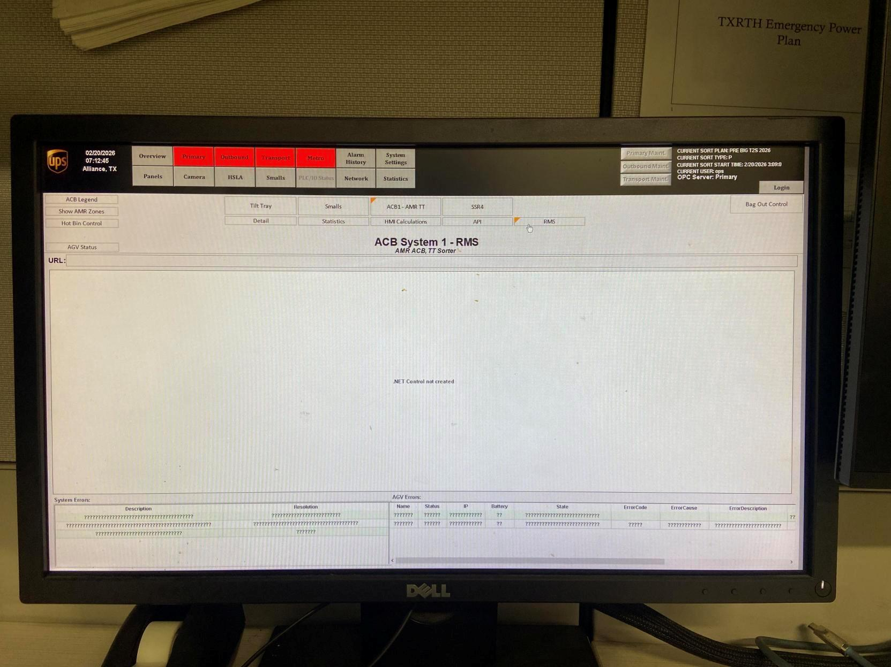

**Short description:** Photograph of a Dell monitor displaying a UPS/warehouse control interface on the RMS page for ACB System 1.

**Detailed description:** The image is a photo of a physical monitor showing an operational control UI with UPS branding and multiple navigation tabs. The selected page appears to be an RMS-related screen labeled "ACB System 1 - RMS" with a subtitle that appears to reference an AMR/ACB server. The main central panel is largely blank and includes small text indicating that no NET control has been created. Along the bottom are tabular sections for system and AGV errors, but much of the row text is unreadable or rendered as question marks in the photographed image. A status box in the upper-right shows current sort information and an OPC server entry. Because OCR is garbled and much of the small text is difficult to read, the screenshot should be treated as diagnostic context rather than a definitive record of specific alarms or failures.

#### What To Look At

- The page title "ACB System 1 - RMS" near the top center.
- The small center message that appears to say "NET Control not created".
- The upper-right status panel with current sort and OPC server information.
- The bottom System Errors and AGV Errors tables for any legible entries.
- Whether the duplicate artifact on page 4 provides a clearer view of the same screen.

#### Source Supported Claims

- The artifact is a photo of a monitor displaying a UPS-branded control interface. (visual_image)
- The visible page title is "ACB System 1 - RMS". (visual_image)
- The center of the screen appears to contain the message "NET Control not created". (visual_image)
- The bottom of the interface includes sections labeled for system and AGV errors. (visual_image)
- OCR for both the artifact and the page is marked garbled, so text extraction is unreliable. (stage2_classification)
- This artifact is the primary item in duplicate group dup_incident_001. (duplicate_metadata)

#### Review Uncertainty

- Small text across the interface is difficult to read from the photographed monitor.
- Artifact OCR and page OCR are both garbled and should not be relied on for exact text.
- The operational significance of the apparent "NET Control not created" message requires SME review.
- The lower error rows are not legible enough to extract specific incidents or codes.

#### Quality Notes

- Artifact OCR quality is garbled.
- Page OCR quality is garbled.
- This is a photo of a monitor rather than a direct screenshot, reducing text clarity.
- The image is still useful for identifying the general UI, page title, and approximate system state.

### artifact_incident_228086_page_004_embedded_image_01

| Field | Value |
| --- | --- |
| Page | 4 |
| Image type | unknown_incident_evidence |
| Evidence role | diagnostic_evidence |
| OCR quality | garbled |
| Duplicate group | dup_incident_001 |
| Validation status | needs_sme_review |

**Short description:** Photograph of a Dell monitor displaying a UPS/operations interface for "ACB System 1 - RMS" with the Primary tab selected.

**Detailed description:** The artifact is a photo of a physical monitor showing an operational control interface with UPS branding in the upper left and multiple navigation tabs across the top. The visible page title reads "ACB System 1 - RMS," with smaller text beneath that appears to reference an AMR/ACB server. The main content area is largely blank and includes a centered message that appears to say "NET Control not created." The lower portion of the screen contains tables for system and AGV errors, but much of the row content is unreadable or appears garbled in the image/OCR. A small status panel in the upper right shows current sort/type information and includes visible text indicating "OPC Server: Primary." The artifact appears to be a duplicate of another screenshot in the same duplicate group and likely adds little unique context beyond being another capture of the same UI state.

#### What To Look At

- The title "ACB System 1 - RMS" in the center top area
- The selected Primary tab in the top navigation
- The upper-right status box, especially the visible "OPC Server: Primary" text
- The small centered message in the blank main panel that appears to read "NET Control not created"
- The bottom system/AGV error tables for any reviewer-confirmed readable entries

#### Source Supported Claims

- The artifact shows a monitor displaying a UPS-branded interface titled "ACB System 1 - RMS." (visual_image)
- The Primary tab is selected in the visible interface. (visual_image)
- A status area in the upper right visibly includes the text "OPC Server: Primary." (visual_image)
- The main content area appears mostly blank and includes a small centered message that appears to read "NET Control not created." (visual_image)
- This artifact is marked as a duplicate in duplicate group dup_incident_001, with primary artifact artifact_incident_228086_page_003_embedded_image_01. (duplicate_metadata)
- Stage 2 detected the page as an ignition_status_screenshot. (stage2_classification)

#### Review Uncertainty

- OCR is garbled and should not be relied on for detailed text extraction.
- The exact wording of the small centered message is somewhat uncertain from the image alone.
- The bottom error table contents are too unclear to extract specific error details.
- The operational significance of "OPC Server: Primary" cannot be determined from this artifact alone.

#### Quality Notes

- Artifact OCR quality is marked garbled.
- Page OCR quality is marked garbled.
- This is a photo of a monitor rather than a direct screenshot, which reduces text clarity.
- Useful interpretation depends primarily on visible UI structure and a few readable labels.

### artifact_incident_228086_page_005_embedded_image_01

| Field | Value |
| --- | --- |
| Page | 5 |
| Image type | rms_screenshot |
| Evidence role | symptom_evidence |
| OCR quality | garbled |
| Duplicate group |  |
| Validation status | needs_sme_review |

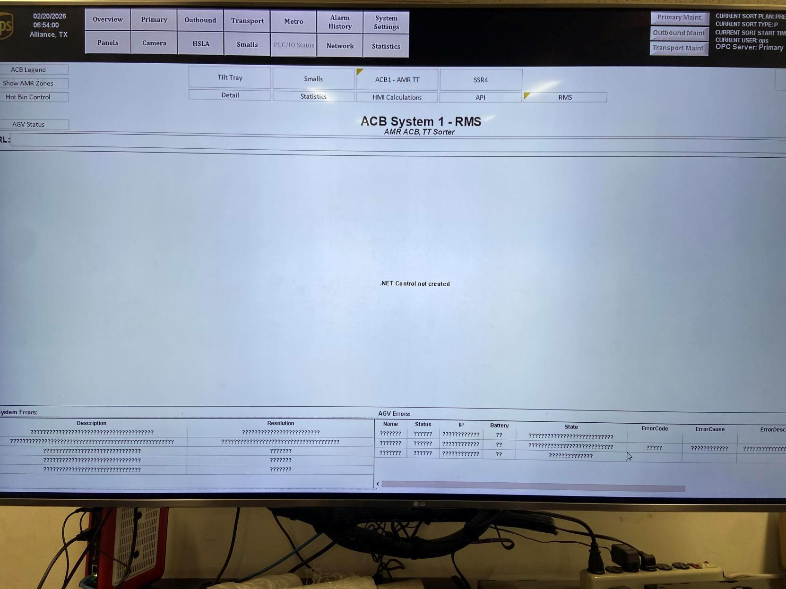

**Short description:** RMS/HMI screenshot for ACB System 1 showing a mostly blank status page with a visible message: ".NET Control not created."

**Detailed description:** This artifact is a photographed monitor displaying an RMS-style operational screen titled "ACB System 1 - RMS" with subtitle text that appears to reference "AMR ACB, TT Sorter." The top navigation includes multiple tabs and maintenance buttons, and the upper-left corner shows a timestamp and location reading approximately "02/20/2026 06:54:00 Alliance, TX." The main content area is largely blank. Near the center of the screen, a visible message states ".NET Control not created." At the bottom, there are tables labeled for system and AGV errors, but much of the row content is unreadable or garbled in the image/OCR. The screenshot suggests the RMS interface is not rendering expected content normally, but the exact operational impact is unclear from this artifact alone.

#### What To Look At

- The centered message ".NET Control not created"
- Whether the main RMS panel is blank instead of showing expected controls or status widgets
- The bottom AGV/system error tables for any readable names, statuses, or codes
- The timestamp/location in the upper-left corner for incident timing context

#### Source Supported Claims

- The screenshot shows an RMS interface titled "ACB System 1 - RMS." (visual_image)
- A visible message in the center of the screen reads ".NET Control not created." (visual_image)
- The main content area appears mostly blank rather than populated with normal operational details. (visual_image)
- The artifact was classified in Stage 2 as an RMS screenshot and symptom/state evidence. (stage2_classification)
- OCR quality for the artifact and page context is marked garbled, limiting reliable extraction of detailed text. (artifact_ocr)

#### Review Uncertainty

- Specific AGV IDs, task/status values, and error codes are not readable from the screenshot.
- The screenshot appears to show an abnormal UI state, but the operational consequence is not directly visible.
- OCR is garbled, so detailed text extraction should be SME-verified against the original source.

#### Quality Notes

- Artifact OCR quality is marked garbled.
- Page OCR quality is marked garbled.
- Image is a photo of a monitor, which reduces readability of small text in lower tables.
- Interpretation relies primarily on visible large text and layout.

### artifact_incident_228086_page_006_full_page_01

| Field | Value |
| --- | --- |
| Page | 6 |
| Image type | teams_chat_screenshot |
| Evidence role | incident_context_evidence |
| OCR quality | usable |
| Duplicate group |  |
| Validation status | needs_sme_review |

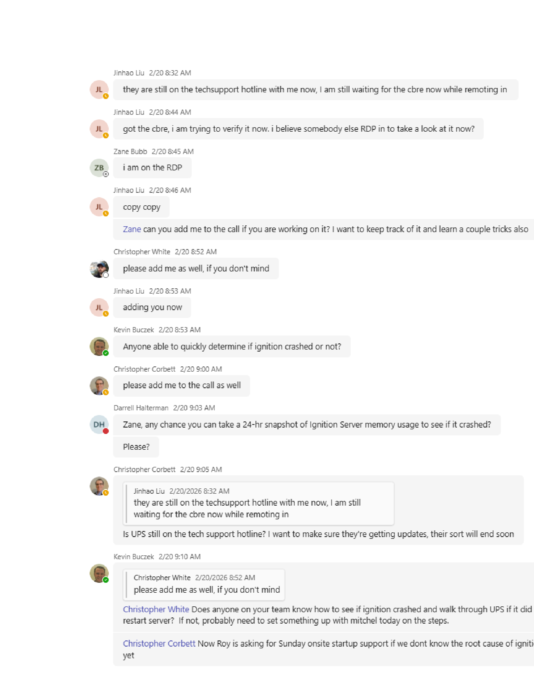

**Short description:** Teams chat screenshot showing coordination around remote access, tech support hotline updates, and questions about whether Ignition crashed.

**Detailed description:** This full-page artifact is a Microsoft Teams chat screenshot. The visible conversation shows multiple participants coordinating live incident response activity, including being on an RDP session, waiting for and verifying a CBRE-related item, asking to be added to a call, checking whether UPS is still on the tech support hotline, and requesting a 24-hour snapshot of Ignition Server memory usage to determine whether Ignition crashed. Later messages discuss whether someone knows how to verify an Ignition crash and walk UPS through a server restart if needed, and mention possible Sunday onsite startup support if the root cause is still unknown. The artifact provides incident coordination and diagnostic discussion context rather than direct system-state proof.

#### What To Look At

- Message timestamps and ordering
- Named participants involved in the response
- Statements about remote access and hotline status
- Questions about whether Ignition crashed
- Request for 24-hour Ignition Server memory snapshot
- Discussion of walking UPS through a server restart
- Mention of possible Sunday onsite startup support

#### Source Supported Claims

- The artifact is a Teams chat screenshot showing multiple participants discussing incident response activity. (visual_image)
- A visible message says the sender is still on the tech support hotline and is remoting in while waiting. (visual_image)
- A visible message from Zane Bubb says, "i am on the RDP." (visual_image)
- A visible message asks, "Anyone able to quickly determine if ignition crashed or not?" (visual_image)
- A visible message requests a 24-hour snapshot of Ignition Server memory usage to see if it crashed. (visual_image)
- A visible message asks whether UPS is still on the tech support hotline so they continue getting updates. (visual_image)
- A visible message asks whether someone knows how to see if Ignition crashed and walk UPS through restarting the server if it did. (visual_image)
- A visible message says Roy is asking for Sunday onsite startup support if the root cause is still not known. (visual_image)
- Stage 2 classified this artifact as incident context evidence. (stage2_classification)

#### Review Uncertainty

- The artifact is a full-page chat screenshot, so conclusions are limited to what participants said rather than direct system evidence.
- The term "cbre" appears in the visible text, but its exact meaning is not established by this artifact alone.
- The chat discusses a possible Ignition crash, but does not confirm that a crash occurred.
- Some OCR contains minor recognition errors, though the image text is mostly readable.

#### Quality Notes

- OCR quality is marked usable and generally aligns with the visible chat text.
- This artifact is better suited for incident timeline and coordination context than for proving system state.
- Quoted reply boxes in the chat may repeat earlier content.

### artifact_incident_228086_page_008_embedded_image_01

| Field | Value |
| --- | --- |
| Page | 8 |
| Image type | memory_trend_screenshot |
| Evidence role | diagnostic_evidence |
| OCR quality | usable |
| Duplicate group |  |
| Validation status | needs_sme_review |

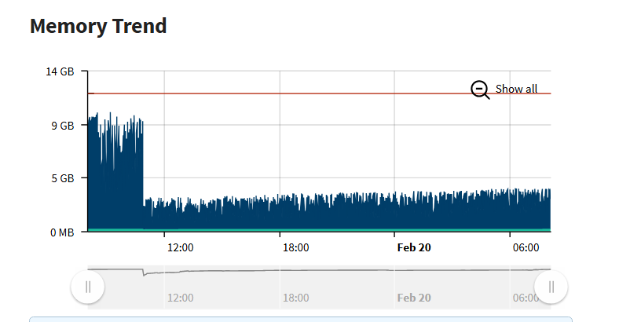

**Short description:** Memory trend chart showing an initial high memory level followed by a sustained lower plateau over time.

**Detailed description:** This artifact is a screenshot of a chart titled "Memory Trend." The y-axis appears labeled from 0 MB up to 14 GB, and the x-axis shows time markers including 12:00, 18:00, Feb 20, and approximately 06:00. Visually, the chart shows memory usage starting near the upper mid-range around the 9 GB area with noticeable fluctuation, then dropping sharply to a much lower level before 12:00, after which it remains relatively stable in a lower band around a few GB through the rest of the displayed period. A horizontal red reference line is visible above the 9 GB mark, and a "Show all" control appears near the upper right. The screenshot suggests a memory reduction event or reset followed by steadier lower usage, but no explicit alarm, crash, or threshold breach text is visible in the image.

#### What To Look At

- The sharp drop in memory level before the 12:00 marker
- The difference between the initial high-memory period and the later lower plateau
- Whether the red horizontal line represents a threshold or limit
- The time range spanning 12:00, 18:00, Feb 20, and about 06:00

#### Source Supported Claims

- The artifact is a chart titled "Memory Trend." (visual_image)
- The chart displays memory scale labels including 0 MB, 5 GB, 9 GB, and 14 GB. (visual_image)
- The chart includes time labels such as 12:00, 18:00, Feb 20, and approximately 06:00. (visual_image)
- The plotted memory trend starts high, drops sharply, and then remains at a lower level for the rest of the visible time range. (visual_image)
- OCR also identifies the artifact as a memory trend with GB and time labels. (artifact_ocr)
- Stage 2 classified this artifact as diagnostic evidence and a memory trend screenshot. (stage2_classification)

#### Review Uncertainty

- The OCR includes garbled segments and should not be used to infer unlabeled details.
- The chart suggests an abnormal memory transition, but the exact operational significance is not explicitly stated in the image.
- The red line is visible but unlabeled, so it should not be described as a confirmed threshold without SME review.

#### Quality Notes

- Image quality is sufficient to identify the chart title, axes, and overall trend shape.
- Artifact OCR is partially noisy despite being marked usable.
- Interpretation is based primarily on the visible chart rather than OCR text.

### artifact_incident_228086_page_012_nested_image_01

| Field | Value |
| --- | --- |
| Page | 12 |
| Image type | unknown_incident_evidence |
| Evidence role | diagnostic_evidence |
| OCR quality | low |
| Duplicate group |  |
| Validation status | needs_sme_review |

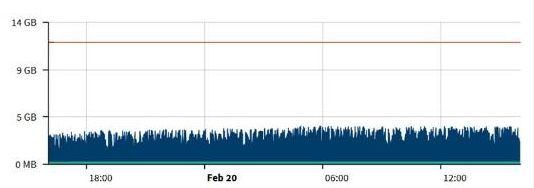

**Short description:** Memory trend chart showing usage remaining well below a higher threshold line over time.

**Detailed description:** This cropped artifact appears to be a system memory trend chart. The y-axis is labeled from 0 MB up to 14 GB, and the x-axis shows times spanning around Feb 20 with labels including 18:00, 06:00, and 12:00. A blue filled usage band stays in the lower portion of the chart, roughly below the 5 GB mark, while a red horizontal line is drawn much higher near the top of the chart. The artifact itself does not clearly show alarms or status text. Page context indicates this chart was being discussed as evidence that the memory trend was improving, but that interpretation comes from surrounding page text rather than the cropped image alone.

#### What To Look At

- Relative position of the blue usage band versus the red horizontal line
- Y-axis scale labels from 0 MB to 14 GB
- Time labels across the x-axis around Feb 20
- Whether the chart supports the surrounding statement that memory was improving

#### Source Supported Claims

- The cropped artifact shows a time-series chart with y-axis labels including 0 MB, 5 GB, 9 GB, and 14 GB. (visual_image)
- A blue usage band stays in the lower portion of the chart while a red horizontal line remains much higher across the graph. (visual_image)
- OCR extracted chart-related text including '14GB', '5GB', 'OMB', '18:00', 'Feb20', '06:00', and '12:00', but artifact OCR quality is low. (artifact_ocr)
- Surrounding page text states 'The memory trend is looking better' and references 'Memory Trend'. (page_ocr_context)
- Stage 2 classified this artifact as unknown incident evidence from a nested message image. (stage2_classification)

#### Review Uncertainty

- Confirm from the original source UI whether this chart is definitively a memory usage graph.
- Confirm whether the red horizontal line is a threshold, limit, or another reference marker.
- Confirm whether the chart was intended as evidence of improvement before a possible restart.

#### Quality Notes

- Artifact OCR is low quality and contains likely misreads such as '9G6B' and 'OMB'.
- The cropped image is clear enough for general chart interpretation but not for precise metric labeling.
- Page OCR provides useful surrounding context but should not be treated as text visible inside the crop.

### artifact_incident_228086_page_012_nested_image_02

| Field | Value |
| --- | --- |
| Page | 12 |
| Image type | ignition_status_screenshot |
| Evidence role | diagnostic_evidence |
| OCR quality | low |
| Duplicate group |  |
| Validation status | needs_sme_review |

**Short description:** Windows command prompt screenshot showing an attempted restart of an Ignition Gateway from the Ignition installation directory.

**Detailed description:** The cropped artifact appears to be a Windows command prompt window. Visible text shows navigation into an Inductive Automation Ignition directory under Program Files, an attempted command that returns a standard Windows error indicating a term is not recognized as an internal or external command, and then a subsequent command that appears to invoke an Ignition gateway executable with a restart-related action. The final visible line indicates the system is waiting for the gateway restart. OCR quality for the artifact is low, so exact command syntax should be treated as uncertain. Page context indicates this screenshot is part of restart instructions for Ignition and post-restart verification of the OptiSweep service.

#### What To Look At

- The exact command entered after changing into the Ignition directory
- The standard Windows error line showing one attempted command failed
- The final line indicating the gateway restart is being waited on
- Whether the executable name and flags can be confirmed by an SME from the image

#### Source Supported Claims

- The artifact is a Windows command prompt screenshot. (visual_image)
- The screenshot shows navigation into an Inductive Automation Ignition directory under Program Files. (artifact_ocr)
- The screenshot includes a standard Windows error message indicating a command was not recognized. (artifact_ocr)
- The screenshot ends with text indicating the system is waiting for gateway restart. (visual_image)
- The surrounding page context describes restart instructions for Ignition and waiting for it to come back up before verifying the OptiSweep service. (page_ocr_context)
- Stage 2 classified this artifact as diagnostic evidence and an Ignition status screenshot. (stage2_classification)

#### Review Uncertainty

- Exact command syntax is uncertain because artifact OCR is low quality.
- The specific failed command token before the not-recognized error cannot be reliably confirmed from OCR alone.
- The screenshot does not confirm whether the gateway restart ultimately succeeded.

#### Quality Notes

- Artifact OCR is low quality and partially garbled.
- Use the image and page context together; do not rely on OCR alone for exact command reconstruction.
- The artifact is suitable for showing restart activity but not for extracting a precise runbook command without SME review.

### artifact_incident_228086_page_013_embedded_image_01

| Field | Value |
| --- | --- |
| Page | 13 |
| Image type | memory_trend_screenshot |
| Evidence role | diagnostic_evidence |
| OCR quality | low |
| Duplicate group |  |
| Validation status | needs_sme_review |

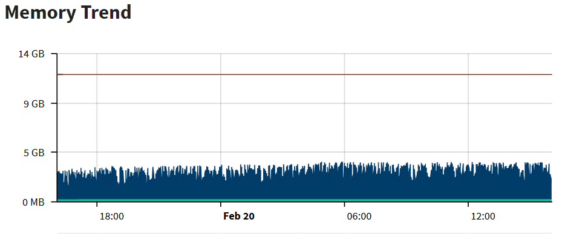

**Short description:** Memory trend chart showing usage remaining below a higher red threshold line over roughly an overnight-to-midday time window.

**Detailed description:** This artifact is a screenshot of a chart titled "Memory Trend." The y-axis is labeled from 0 MB up to 14 GB, with intermediate labels at 5 GB and 9 GB. The x-axis shows times including 18:00, Feb 20, 06:00, and 12:00. A red horizontal line appears near the upper portion of the chart, around the 11–12 GB level, while the blue filled memory usage area stays much lower, fluctuating roughly in the lower several gigabytes range throughout the displayed period. No obvious crash, spike to the threshold, or recovery transition is visible in the chart itself. Because this is a chart screenshot rather than a full application UI, the interpretation is limited to the visible trend and scale.

#### What To Look At

- Whether the blue memory usage trend ever approaches the red upper line
- Any sustained upward drift in memory usage over the displayed period
- Whether the red line represents a threshold, limit, or alert boundary
- Whether the thin green baseline has any documented meaning in the source system

#### Source Supported Claims

- The artifact is a chart titled "Memory Trend." (visual_image)
- The chart scale includes 0 MB, 5 GB, 9 GB, and 14 GB. (visual_image)
- The visible time labels include 18:00, Feb 20, 06:00, and 12:00. (visual_image)
- A red horizontal line is visible above the blue memory trend area. (visual_image)
- OCR extracted text consistent with the chart includes "Memory Trend 14GB 9GB 5GB OMB 18:00 Feb 20 06:00 12:00." (artifact_ocr)
- Stage 2 classified the artifact as a memory trend screenshot and hinted diagnostic evidence. (stage2_classification)

#### Review Uncertainty

- The exact semantic meaning of the red and green lines is not visible in the crop.
- OCR quality is marked low even though the visible chart text is mostly readable.
- The chart alone does not establish whether memory behavior was causal, incidental, or healthy relative to the incident.

#### Quality Notes

- Artifact OCR and page OCR are both marked low quality.
- Visual content is clearer than the OCR and should be preferred for interpretation.
- The screenshot is a cropped chart without legend or surrounding application controls.

### artifact_incident_228086_page_014_embedded_image_01

| Field | Value |
| --- | --- |
| Page | 14 |
| Image type | rms_screenshot |
| Evidence role | symptom_evidence |
| OCR quality | garbled |
| Duplicate group |  |
| Validation status | needs_sme_review |

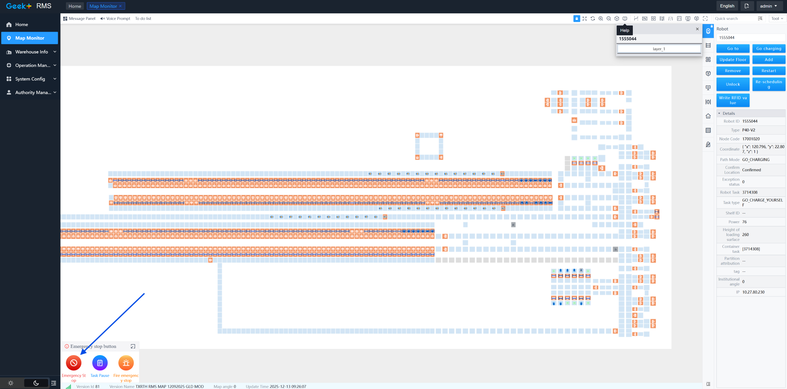

**Short description:** Geek+ RMS Map Monitor screenshot showing a warehouse map, a selected robot details panel, and an emergency stop control area.

**Detailed description:** This artifact is a Geek+ RMS Map Monitor screenshot. The main view shows a warehouse-style path/grid map with many light-blue cells and numerous orange-highlighted cells or markers across several long horizontal aisles and smaller clustered areas. A robot appears selected, with a details panel on the right side and a small popup near the top showing robot ID 1555044. The right-side action panel includes controls such as Go to, Go charging, Update Floor, Add, Remove, Restart, Unlock, Re-scheduling, and Write RFID value. The details panel visibly shows the selected robot status as GO_CHARGING and confirm state as Confirmed. In the lower-left corner, an emergency stop widget is visible with a blue arrow annotation pointing toward the red emergency stop button. OCR is marked garbled, so interpretation is based primarily on visible UI elements in the image.

#### What To Look At

- Selected robot ID 1555044 in the popup and right-side details panel
- Path Mode field showing GO_CHARGING
- Confirm field showing Confirmed
- Lower-left emergency stop control area and blue arrow annotation
- Orange-highlighted cells/markers across the map aisles
- Available robot action buttons on the right-side panel

#### Source Supported Claims

- The artifact is a Geek+ RMS Map Monitor screenshot. (visual_image)
- A robot with ID 1555044 is selected in the interface. (visual_image)
- The selected robot details panel shows Path Mode as GO_CHARGING. (visual_image)
- The selected robot details panel shows Confirm status as Confirmed. (visual_image)
- The screenshot includes an emergency stop control area in the lower-left corner with a blue arrow pointing toward it. (visual_image)
- Stage 2 classified this artifact as an RMS screenshot with symptom or state evidence relevance. (stage2_classification)

#### Review Uncertainty

- Need SME review to determine whether the emergency stop annotation indicates an active stop condition, a suspected cause, or simply an area of interest.
- Need SME review to interpret the operational meaning of the orange map markers and aisle highlights.
- Need SME review to confirm whether GO_CHARGING reflects normal recovery behavior or an incident symptom.

#### Quality Notes

- Artifact OCR quality is garbled and should not be relied on for detailed extraction.
- Page OCR quality is also garbled, so surrounding textual context is unavailable.
- Descriptions are based primarily on visible UI elements in the screenshot.

### artifact_incident_228086_page_015_embedded_image_01

| Field | Value |
| --- | --- |
| Page | 15 |
| Image type | ignition_command_screenshot |
| Evidence role | action_evidence |
| OCR quality | usable |
| Duplicate group |  |
| Validation status | needs_sme_review |

**Short description:** Windows command prompt showing navigation to the Ignition installation directory, a failed `ls -1` command, and execution of `gwcmd -r` with a gateway restart in progress.

**Detailed description:** This artifact is a screenshot of a Windows Command Prompt session run as Administrator. The visible commands show the operator changing into `C:\Program Files\Inductive Automation\Ignition\data`, attempting to run `ls -1` and receiving a Windows error that `ls` is not recognized, then moving up one directory and running `gwcmd -r` from the Ignition directory. The final visible line reads `Waiting for Gateway restart...`, which indicates a restart command was issued and the process was still waiting at the time of capture. The screenshot supports that an operational action was being performed against an Ignition gateway, but it does not show completion or success of the restart.

#### What To Look At

- Exact command text entered before the restart
- The Windows error for the attempted `ls -1` command
- The directory path where `gwcmd -r` was executed
- The `Waiting for Gateway restart...` line indicating in-progress state

#### Source Supported Claims

- The screenshot shows a Windows Command Prompt session on Microsoft Windows version 10.0.17763.2114. (visual_image)
- The operator changed directory to `C:\Program Files\Inductive Automation\Ignition\data`. (visual_image)
- The command `ls -1` was attempted and Windows returned that `ls` is not recognized as a command. (visual_image)
- The operator then moved to `C:\Program Files\Inductive Automation\Ignition>` and ran `gwcmd -r`. (visual_image)
- The final visible console output says `Waiting for Gateway restart...`. (visual_image)
- Stage 2 classified this artifact as an Ignition command screenshot and hinted it as action evidence. (stage2_classification)

#### Review Uncertainty

- The restart outcome is not visible in the screenshot.
- OCR contains minor errors such as `Naiting` for `Waiting` and `Ils` for `ls`; interpretation relies on the visible image.
- The screenshot does not establish root cause, only that a restart action was initiated.

#### Quality Notes

- Artifact OCR quality is marked usable and aligns closely with the visible command prompt text.
- Page OCR includes some garbled surrounding text, so page context should be used cautiously.
- The image itself is sufficiently clear to support the main command and status observations.

### artifact_incident_228086_page_016_embedded_image_01

| Field | Value |
| --- | --- |
| Page | 16 |
| Image type | ignition_status_screenshot |
| Evidence role | diagnostic_evidence |
| OCR quality | usable |
| Duplicate group |  |
| Validation status | needs_sme_review |

**Short description:** Ignition gateway Systems Overview screenshot showing performance and connection status widgets.

**Detailed description:** This artifact is a screenshot of an Ignition web interface on the Status > Systems > Overview page. The left navigation shows system, connection, and diagnostics sections. The main panel displays a green banner stating that the license is incomplete with a visible trial/reset indicator, along with summary widgets for CPU, memory, and threads. Additional charts show CPU trend and memory trend, and a diagnostics area shows current system response time and a table for recent slow response events that appears empty. The screenshot appears to be a diagnostic status view rather than an action or remediation step.

#### What To Look At

- Top banner showing License Incomplete
- CPU, Memory, and Threads widgets
- CPU Trend and Memory Trend charts
- Current Response Time value
- Recent Slow Response Events table
- Left navigation sections under Systems, Connections, and Diagnostics

#### Source Supported Claims

- The artifact is an Ignition Systems Overview status page. (visual_image)
- The browser address bar includes localhost:8088/web/status/sys.performance. (artifact_ocr)
- A green banner indicates License Incomplete. (visual_image)
- The page shows CPU, Memory, and Threads summary widgets. (visual_image)
- The diagnostics area shows Current Response Time of 11 ms. (visual_image)
- The Recent Slow Response Events section shows No events to display. (visual_image)
- Stage 2 classified this artifact as diagnostic evidence and an ignition status screenshot. (stage2_classification)

#### Review Uncertainty

- Reviewer should confirm whether the License Incomplete banner is incident-relevant or incidental.
- Reviewer should confirm whether the localhost gateway shown is the affected production-like system or a local/admin view.
- Some small labels and thread counts may require manual verification from the image due to OCR noise.

#### Quality Notes

- Artifact OCR is usable but contains noticeable noise and misreads.
- The image itself is clear enough to support the main UI observations.
- Page OCR is consistent with the artifact being an Ignition status screenshot.

### artifact_incident_228086_page_017_embedded_image_01

| Field | Value |
| --- | --- |
| Page | 17 |
| Image type | api_client_screenshot |
| Evidence role | validation_evidence |
| OCR quality | low |
| Duplicate group |  |
| Validation status | needs_sme_review |

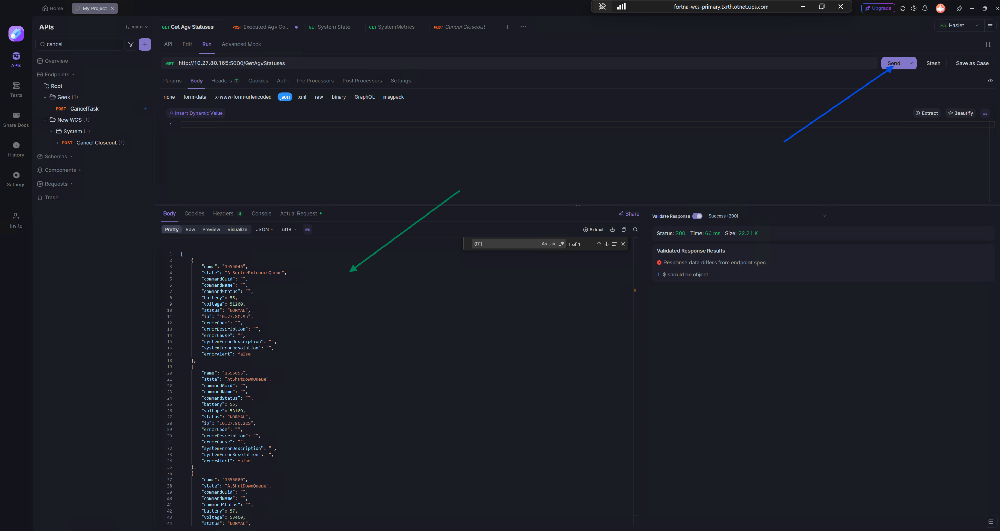

**Short description:** API client screenshot showing a GET request to GetAgvStatuses with HTTP 200 and a response validation warning.

**Detailed description:** This artifact is a screenshot of an API client interface. The visible request appears to be a GET call to a GetAgvStatuses endpoint. The response panel shows Success (200) / Status: 200 with a short response time and a JSON response body listing multiple AGV-like records. A validation panel on the right indicates that the response data differs from the endpoint specification and includes the message '$ should be object.' The visible response entries include fields such as name, state, battery, voltage, status, ip, and error-related fields. Several visible status values are NORMAL, while some state values appear to reference queue positions such as sorter entrance queue and shutdown queue. Because the OCR quality is low, exact field spellings and all values should be treated cautiously, but the screenshot clearly supports that the API responded successfully while schema validation reported a mismatch.

#### What To Look At

- The selected request name 'Get Agv Statuses'
- The endpoint path ending in '/GetAgvStatuses'
- The HTTP response status showing 200
- The validation panel stating the response differs from the endpoint spec
- The JSON response body entries and visible NORMAL status values

#### Source Supported Claims

- The artifact is an API client screenshot. (stage2_classification)
- The screenshot shows a GET request for 'Get Agv Statuses'. (visual_image)
- The visible endpoint ends with '/GetAgvStatuses'. (artifact_ocr)
- The API response is shown as Success (200) / Status: 200. (visual_image)
- The validation panel states that the response data differs from the endpoint specification. (visual_image)
- A visible validation message says '$ should be object'. (visual_image)
- The response body includes multiple records with fields such as name, state, battery, voltage, status, ip, and error-related fields. (visual_image)
- Several visible response records show status values of 'NORMAL'. (artifact_ocr)

#### Review Uncertainty

- Artifact OCR is low quality and contains garbled text in several places.
- Exact JSON field spellings and all record values should be verified from the image or original source.
- It is unclear whether the schema validation warning reflects the incident itself or only an API spec mismatch.

#### Quality Notes

- Primary interpretation relies on visible UI elements because artifact OCR quality is low.
- Page OCR was used only as surrounding context and not as independent proof of image-only details.
- The screenshot is strong evidence of API reachability and returned data, but weaker evidence for deeper operational conclusions.

### artifact_incident_228086_page_019_embedded_image_01

| Field | Value |
| --- | --- |
| Page | 19 |
| Image type | windows_services_screenshot |
| Evidence role | diagnostic_evidence |
| OCR quality | usable |
| Duplicate group |  |
| Validation status | needs_sme_review |

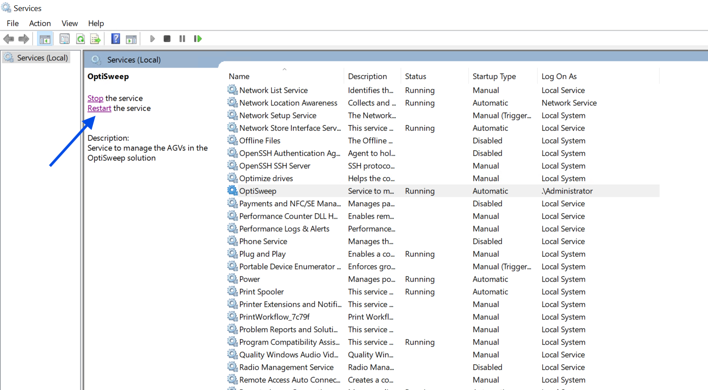

**Short description:** Windows Services console screenshot showing the OptiSweep service selected and in a running state, with restart/stop links visible.

**Detailed description:** This artifact is a screenshot of the Windows Services management console. The selected service appears to be "OptiSweep." In the left details pane, links for "Stop the service" and "Restart the service" are visible, along with a description stating that the service manages AGVs in the OptiSweep solution. In the service list, the OptiSweep row appears selected and shows status "Running," startup type "Automatic," and logon account ".\Administrator." The screenshot also shows nearby Windows services and their statuses. The image suggests the operator was viewing or preparing to manage the OptiSweep Windows service, but it does not by itself prove that a restart was actually executed.

#### What To Look At

- The selected OptiSweep service row
- Status column for OptiSweep showing Running
- Startup Type column for OptiSweep showing Automatic
- Log On As column for OptiSweep showing .\Administrator
- Left pane links for Stop the service and Restart the service
- Left pane description referencing AGVs in the OptiSweep solution

#### Source Supported Claims

- The artifact is a screenshot of the Windows Services console. (visual_image)
- A service named "OptiSweep" is selected in the Services list. (visual_image)
- The selected OptiSweep service is shown as "Running." (visual_image)
- The selected OptiSweep service is shown with startup type "Automatic." (visual_image)
- The selected OptiSweep service is shown logging on as ".\Administrator." (visual_image)
- The left pane shows "Stop the service" and "Restart the service" links. (visual_image)
- The service description indicates it manages AGVs in the OptiSweep solution. (visual_image)
- Stage 2 classified this artifact as a windows_services_screenshot. (stage2_classification)

#### Review Uncertainty

- The screenshot shows available service control links but does not prove a restart action occurred.
- OCR contains some garbling and truncation in service names and descriptions.
- The artifact does not show a timestamp or explicit incident outcome.

#### Quality Notes

- Artifact OCR quality is marked usable, but several OCR tokens are noisy or truncated.
- Visual content is clearer than OCR for the key service state details.
- Interpretation should remain limited to visible service state and controls.

### artifact_incident_228086_page_021_full_page_01

| Field | Value |
| --- | --- |
| Page | 21 |
| Image type | salesforce_case_screenshot |
| Evidence role | incident_context_evidence |
| OCR quality | usable |
| Duplicate group |  |
| Validation status | needs_sme_review |

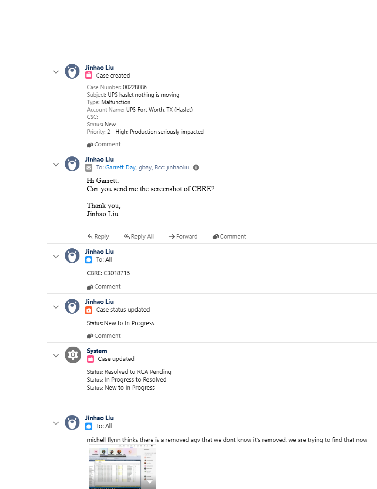

**Short description:** Salesforce case activity page for case 00228086 showing case creation details, internal comments, and status updates.

**Detailed description:** This artifact is a full-page Salesforce case screenshot. It shows the case header and activity feed for case number 00228086. Visible case details include the subject "UPS haslet nothing is moving," type "Malfunction," account name "UPS Fort Worth, TX (Haslet)," status "New," and priority "2 - High: Production seriously impacted." The activity feed includes a message from Jinhao Liu requesting a screenshot of CBRE, a follow-up note with "CBRE: C3018715," a case status update from New to In Progress, a system case update listing status transitions including In Progress to Resolved and Resolved to RCA Pending, and a later comment stating there may be a removed AGV that was not known to be removed and that they are trying to find it. A small embedded thumbnail image appears at the bottom of the page, but its contents are too small to interpret reliably from this artifact.

#### What To Look At

- Case number and subject
- Priority and account/site fields
- Comments requesting CBRE screenshot
- CBRE reference value C3018715
- Case status transition entries
- Comment about removed AGV

#### Source Supported Claims

- The screenshot shows case number 00228086. (visual_image)
- The case subject shown is "UPS haslet nothing is moving." (visual_image)
- The case type is shown as "Malfunction." (visual_image)
- The account name shown is "UPS Fort Worth, TX (Haslet)." (visual_image)
- The case status is shown as "New" in the case creation details. (visual_image)
- The priority is shown as "2 - High: Production seriously impacted." (visual_image)
- A visible comment asks Garrett Day to send a screenshot of CBRE. (visual_image)
- A visible message includes "CBRE: C3018715." (visual_image)
- A case status update entry shows "Status: New to In Progress." (visual_image)
- A system case update lists status changes including "Status: In Progress to Resolved" and "Status: Resolved to RCA Pending." (visual_image)
- A later comment states there may be a removed AGV that was not known to be removed and that they are trying to find it. (artifact_ocr)
- Stage 2 classified this artifact as incident context evidence. (stage2_classification)

#### Review Uncertainty

- The AGV comment is supported by readable text, but the final line area includes some OCR noise.
- The small embedded thumbnail cannot be reliably interpreted from this page-level screenshot.
- Case workflow statuses should not be treated as direct proof of equipment recovery without corroborating system evidence.

#### Quality Notes

- OCR quality is marked usable and aligns well with the visible Salesforce text.
- Some OCR tokens near the bottom are garbled and should be ignored.
- This is a full-page context artifact, not a focused screenshot of the affected operational interface.

### artifact_incident_228086_page_021_nested_image_01

| Field | Value |
| --- | --- |
| Page | 21 |
| Image type | unknown_incident_evidence |
| Evidence role | incident_context_evidence |
| OCR quality | garbled |
| Duplicate group |  |
| Validation status | needs_sme_review |

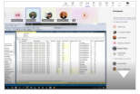

**Short description:** Small embedded screenshot thumbnail of a software UI, likely included in a case comment as requested evidence.

**Detailed description:** This artifact is a small, low-detail thumbnail image embedded within the incident record. Visually it appears to show a desktop application or web UI with a top toolbar/header area, a left navigation pane, and a central tabular/grid view with multiple rows and columns. Due to the small size and garbled artifact OCR, specific labels, values, or system names cannot be read reliably from the cropped image itself. Surrounding page context indicates the case discussion requested a 'screenshot of CBRE,' so this thumbnail may be the referenced screenshot, but that identification comes from page context rather than legible text inside the artifact.

#### What To Look At

- Any readable UI title or application name in the original full-resolution source
- Column headers and highlighted cells in the central grid
- Whether the screenshot corresponds to the requested 'CBRE' screenshot from the case comments
- Any status indicators in the right-side panel or top toolbar
- Whether the image shows AGV-related inventory, task, or equipment state

#### Source Supported Claims

- The artifact is a small screenshot thumbnail of a software user interface with a left navigation area and a central grid/list view. (visual_image)
- The artifact OCR is not usable for extracting reliable text from the image. (artifact_ocr)
- The surrounding case page includes a request asking for a 'screenshot of CBRE.' (page_ocr_context)
- The artifact is marked as unique rather than a duplicate in Stage 2 metadata. (stage2_classification)

#### Review Uncertainty

- The cropped image is too small to identify the application with confidence.
- No reliable text can be extracted from the artifact itself.
- Incident relevance is inferred mainly from surrounding page context rather than readable artifact content.
- Operational state cannot be determined from the visible screenshot.

#### Quality Notes

- Artifact OCR is marked garbled and should not be relied on for text extraction.
- The image is a small embedded thumbnail with limited legibility.
- Use the original parent image or source PDF for reviewer verification if available.

### artifact_incident_228086_page_024_embedded_image_01

| Field | Value |
| --- | --- |
| Page | 24 |
| Image type | rms_screenshot |
| Evidence role | diagnostic_evidence |
| OCR quality | garbled |
| Duplicate group |  |
| Validation status | needs_sme_review |

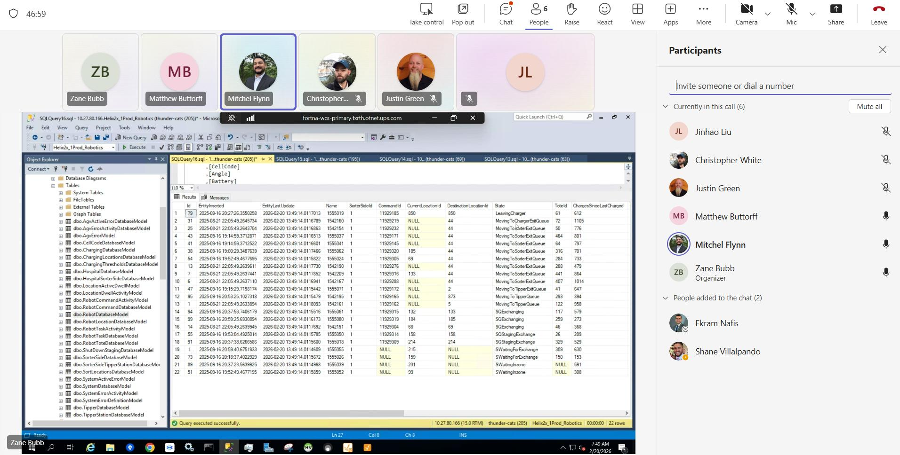

**Short description:** Microsoft Teams call screenshot showing participants while a shared SQL Server Management Studio window displays robotics-related database query results.

**Detailed description:** The image appears to be a screenshot taken during a Microsoft Teams call. The Teams interface shows multiple participants and the Participants panel on the right. In the shared content area, a SQL Server Management Studio window is open to a robotics-related database and displays a query results grid. The Object Explorer on the left lists many database tables, and the results pane shows columns including identifiers, timestamps, location-related fields, a state column, and count-like numeric fields. Visible state values in the grid include entries such as LeavingCharger, MovingToChargerExitQueue, MovingToSorterExitQueue, MovingToTipperQueue, SQExchanging, SQStagingExchange, SWaitingForExchange, and SWaitingInzone. The screenshot provides operational context about AGV or robotics system states during a live troubleshooting or review call, but it does not by itself clearly prove whether the system is healthy or failed overall.

#### What To Look At

- State column values in the SQL results grid
- CurrentLocationId and DestinationLocationId fields
- Rows showing waiting, exchange, charger, sorter, or tipper-related states
- The successful query execution status
- Whether the screenshot was captured during a live troubleshooting call

#### Source Supported Claims

- The artifact shows a Microsoft Teams call with the Participants panel open. (visual_image)
- A SQL Server Management Studio window is being shared in the call. (visual_image)
- The shared SQL window is connected to a robotics-related database context. (visual_image)
- The query results grid includes a State column with values such as LeavingCharger, MovingToSorterExitQueue, MovingToTipperQueue, SQExchanging, SQStagingExchange, SWaitingForExchange, and SWaitingInzone. (visual_image)
- The SQL status bar indicates the query executed successfully. (visual_image)
- Stage 2 classified this artifact as an RMS screenshot and symptom/state evidence. (stage2_classification)

#### Review Uncertainty

- The artifact is visually clear enough for high-level interpretation, but exact database object names and all row values are not fully legible.
- OCR is marked garbled, so text extraction should not be trusted for detailed field-level analysis.
- The operational meaning of the listed states requires SME familiarity with the robotics/RMS workflow.

#### Quality Notes

- Artifact OCR quality is garbled despite substantial detected word count.
- Page OCR quality is low and provides no usable surrounding text context.
- Interpretation is based primarily on visible UI elements in the screenshot.

### artifact_incident_228086_page_025_embedded_image_01

| Field | Value |
| --- | --- |
| Page | 25 |
| Image type | api_client_screenshot |
| Evidence role | incident_context_evidence |
| OCR quality | usable |
| Duplicate group |  |
| Validation status | needs_sme_review |

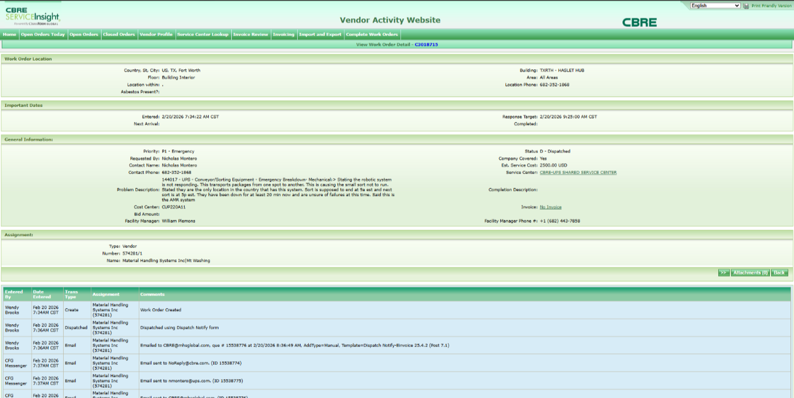

**Short description:** CBRE ServiceInsight Vendor Activity Website screenshot showing a dispatched emergency work order for conveyor/sorting equipment with notes that the robotic system is not responding.

**Detailed description:** This artifact is a screenshot of the CBRE ServiceInsight Vendor Activity Website on a 'View Work Order Detail' page. The visible page shows work order location details for Fort Worth, TX, building 'TXRTH - HASLET HUB,' important dates, general information, assignment details, and an activity log. The general information section shows Priority 'P1 - Emergency' and Status 'D - Dispatched.' The problem description text states that the robotic system is not responding, that it transports packages from one spot to another, and that the small sort is not running. Additional visible text indicates the site had been down for at least 20 minutes and that the failure cause was still uncertain at the time of entry. The lower activity table shows work order creation, dispatch, and email notification actions. OCR is usable overall, but some fields and names are noisy, so exact spelling of some identifiers should be reviewed by an SME.

#### What To Look At

- Work order identifier near the page title
- Priority and status fields in the General Information section
- Problem Description text describing the robotic system issue
- Assignment section showing the vendor
- Activity/history table entries for creation, dispatch, and email notifications

#### Source Supported Claims

- The artifact shows the CBRE ServiceInsight Vendor Activity Website. (visual_image)
- The page is a work order detail view. (visual_image)
- The work order location is in Fort Worth, Texas. (visual_image)
- The building appears as 'TXRTH - HASLET HUB.' (visual_image)
- The work order priority is shown as 'P1 - Emergency.' (visual_image)
- The work order status is shown as 'D - Dispatched.' (visual_image)
- The problem description states that the robotic system is not responding. (visual_image)
- The problem description states that the issue is causing the small sort not to run. (visual_image)
- The visible notes indicate the site had been down for at least 20 minutes and the failures were still uncertain at that time. (artifact_ocr)
- The assignment section appears to list Material Handling Systems Inc as the vendor. (visual_image)
- The activity log includes entries for work order creation, dispatch, and email notifications. (visual_image)
- Stage 2 classified this artifact as an api_client_screenshot, but the visible image more closely resembles a service/work-order web application screenshot. (stage2_classification)

#### Review Uncertainty

- The exact work order number should be verified from the image because OCR and visible text may differ slightly.
- Some names, phone numbers, and internal identifiers are partially blurred or OCR-distorted.
- Stage 2 labeled this as an api client screenshot, but the visible artifact is a work-order web application page.

#### Quality Notes

- Artifact OCR is usable but contains noticeable recognition errors.
- Page OCR context is garbled and was not relied on for substantive claims.
- Visual content was used as the primary source for key observations.

### artifact_incident_228086_page_026_full_page_01

| Field | Value |
| --- | --- |
| Page | 26 |
| Image type | teams_chat_screenshot |
| Evidence role | incident_context_evidence |
| OCR quality | usable |
| Duplicate group |  |
| Validation status | needs_sme_review |

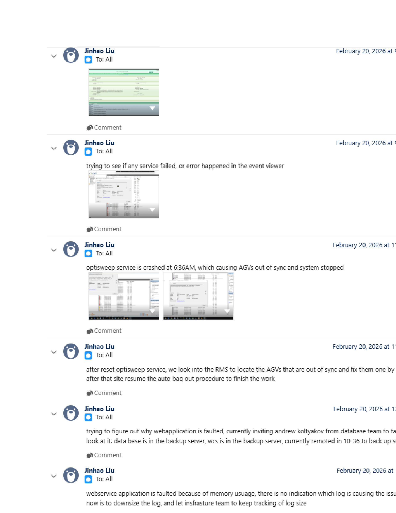

**Short description:** Teams chat page showing incident updates from Jinhao Liu about an OptiSweep service crash, AGVs going out of sync, service reset, RMS follow-up, and a webservice memory issue.

**Detailed description:** This full-page artifact appears to be a Microsoft Teams conversation thread with multiple messages from Jinhao Liu on February 20, 2026. The visible messages describe incident investigation and recovery steps. Source-supported text indicates a check for failed services or Event Viewer errors, a report that the OptiSweep service crashed at 6:36 AM causing AGVs to go out of sync and the system to stop, a follow-up that the service was reset and RMS was used to locate and fix out-of-sync AGVs, and later notes that a web application/webservice was faulted due to memory usage with a plan to reduce log size and have infrastructure continue monitoring. Several embedded screenshot thumbnails are visible, but their internal details are too small to read reliably from this page image.

#### What To Look At

- Visible message text describing the OptiSweep service crash
- The message stating AGVs were out of sync and the system stopped
- The follow-up message about resetting the service and using RMS to fix AGVs
- The later messages about the web application/webservice fault and memory usage
- Embedded screenshot thumbnails for possible related evidence in separate artifacts

#### Source Supported Claims

- The artifact is a Teams chat screenshot containing multiple messages from Jinhao Liu. (visual_image)
- A message says they were trying to see if any service failed or if an error happened in Event Viewer. (artifact_ocr)
- A message reports that the OptiSweep service crashed at 6:36 AM, causing AGVs to go out of sync and the system to stop. (artifact_ocr)
- A message says that after resetting the OptiSweep service, RMS was used to locate AGVs that were out of sync and fix them, and then the site resumed the auto bag out procedure. (artifact_ocr)
- A message says they were trying to determine why a web application was faulted and were inviting Andrew Koltyakov from the database team to look at it. (artifact_ocr)
- A message says the webservice application was faulted because of memory usage and that the next step was to downsize the log and have the infrastructure team keep tracking log size. (artifact_ocr)
- Stage 2 classified this artifact as incident context evidence from a Teams chat screenshot. (stage2_classification)

#### Review Uncertainty

- Some OCR characters and timestamps are garbled.
- The first post appears to include an embedded screenshot, but its detailed contents are not readable at this scale.
- One OCR line refers to 'AGWs' while the visible image text appears to indicate 'AGVs'; SME review should confirm exact wording.
- The OCR includes a possibly incorrect term 'wes'; SME review should confirm whether this refers to another system name.

#### Quality Notes

- OCR quality is marked usable, but several symbols and timestamp fragments are noisy.
- This is a full-page communication artifact, so embedded screenshots should be reviewed separately if available for direct system evidence.
- The strongest evidence here is the visible chat narrative rather than the unreadable thumbnail details.

### artifact_incident_228086_page_026_nested_image_01

| Field | Value |
| --- | --- |
| Page | 26 |
| Image type | unknown_incident_evidence |
| Evidence role | diagnostic_evidence |
| OCR quality | garbled |
| Duplicate group |  |
| Validation status | needs_sme_review |

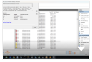

**Short description:** Small embedded screenshot thumbnail of a desktop application window with tabular rows; text is not legible at this crop size.

**Detailed description:** This artifact is a small nested image extracted from a larger page. Visually it appears to show a Windows-style desktop application or management console with a left navigation pane, a central table/list of many rows, and a narrower pane on the right. Because the thumbnail is very small and the artifact OCR is garbled, specific labels, row contents, and status text cannot be read reliably from this artifact alone. The surrounding page OCR suggests the page discusses OptiSweep service failure, AGVs out of sync, RMS investigation, and webservice/web application faults, but those details come from page context rather than clearly readable text inside this cropped image.

#### What To Look At

- Any readable UI title or pane labels in the original full-resolution source
- Whether the central table contains service, AGV, or RMS-related entries
- Any visible status icons, error markers, or timestamps
- Whether the screenshot corresponds to RMS, Services, Event Viewer, or another diagnostic tool

#### Source Supported Claims

- The artifact shows a small screenshot of a desktop application with multiple panes and a central list/table. (visual_image)
- The artifact OCR is not usable for extracting reliable text from the cropped image. (artifact_ocr)
- The surrounding page context discusses checking whether any service failed or whether errors appeared in Event Viewer. (page_ocr_context)
- The surrounding page context states that the OptiSweep service crashed at 6:36AM, causing AGVs to go out of sync and the system to stop. (page_ocr_context)
- The surrounding page context states that after resetting the OptiSweep service, RMS was used to locate AGVs that were out of sync and fix them. (page_ocr_context)
- Stage 2 classified this artifact's evidence role as unknown. (stage2_classification)

#### Review Uncertainty

- The exact application shown in the screenshot cannot be identified confidently.
- The screenshot may be incident-relevant, but the specific diagnostic content is not readable in this crop.
- Page OCR context should not be assumed to be visible inside the cropped image.

#### Quality Notes

- Artifact OCR quality is marked garbled.
- The image is a very small thumbnail, limiting reliable interpretation.
- Use the original page or parent image for SME review if precise UI details are needed.

### artifact_incident_228086_page_026_nested_image_02

| Field | Value |
| --- | --- |
| Page | 26 |
| Image type | unknown_incident_evidence |
| Evidence role | diagnostic_evidence |
| OCR quality | garbled |
| Duplicate group |  |
| Validation status | needs_sme_review |

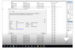

**Short description:** Small embedded screenshot of a Windows-style application or service list with text too small to read reliably.

**Detailed description:** This artifact is a small nested image extracted from a larger page. Visually it appears to show a Windows desktop application window with a multi-column list or table and a right-side pane or scrollbar area. The text inside the cropped image is too small to read clearly, and the artifact OCR is garbled, so specific labels, service names, or statuses cannot be confirmed from this artifact alone. The surrounding page context discusses checking for failed services and Event Viewer activity, an OptiSweep service crash, RMS follow-up work, and a faulted webservice application related to memory usage, but those details come from page context rather than legible text inside this cropped image.

#### What To Look At

- Any readable window title or application name in the screenshot
- Column headers or status fields in the list view
- Whether the image corresponds to Services, Event Viewer, or another Windows admin tool
- Any visible error, stopped state, or warning indicator not captured by OCR

#### Source Supported Claims

- The cropped artifact shows a Windows-style application window with a tabular or list-based interface. (visual_image)
- The text inside the cropped screenshot is not reliably readable from this artifact. (visual_image)
- Artifact OCR for this image is garbled and does not provide usable text evidence. (artifact_ocr)
- The surrounding page context mentions trying to see if any service failed or if an error happened in Event Viewer. (page_ocr_context)
- The surrounding page context states that the OptiSweep service crashed at 6:36AM, causing AGVs to go out of sync and the system to stop. (page_ocr_context)

#### Review Uncertainty

- The exact software window shown in the screenshot cannot be identified confidently.
- No specific service name, error message, or status can be read from the image.
- Incident relevance is inferred mainly from page context rather than readable content inside the crop.

#### Quality Notes

- Artifact OCR quality is marked garbled.
- The screenshot is very small, making UI text unreadable.
- Use page OCR only as surrounding context, not as proof of text visible inside the cropped image.

### artifact_incident_228086_page_027_embedded_image_01

| Field | Value |
| --- | --- |
| Page | 27 |
| Image type | ignition_status_screenshot |
| Evidence role | diagnostic_evidence |
| OCR quality | usable |
| Duplicate group |  |
| Validation status | needs_sme_review |

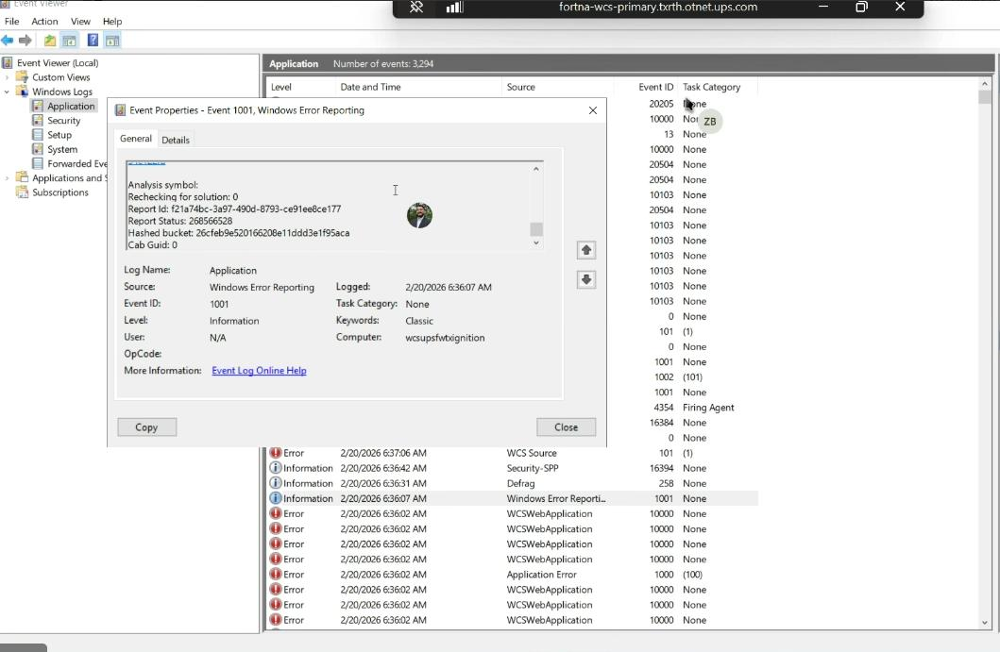

**Short description:** Windows Event Viewer screenshot showing an Event 1001 Windows Error Reporting dialog and multiple nearby application errors.

**Detailed description:** The artifact is a screenshot of Windows Event Viewer focused on the Application log. An Event Properties window is open for Event 1001 from Windows Error Reporting. The visible details include a logged time of 2/20/2026 6:36:07 AM, log name Application, source Windows Error Reporting, event ID 1001, level Information, and computer name that appears as wcsupsfwtxignition. In the background event list, several red error entries are visible around 2/20/2026 6:36:02 AM, including repeated WCSWebApplication events with event ID 10000 and an Application Error event with event ID 1000. This appears to be diagnostic evidence showing system/application fault activity rather than a normal operating state.

#### What To Look At

- The Event Properties dialog title and selected event source
- Logged timestamp in the Event 1001 dialog
- Computer name field in the dialog
- Repeated WCSWebApplication error rows in the background list
- Application Error row with Event ID 1000
- Cluster of errors around 2/20/2026 6:36:02 AM

#### Source Supported Claims

- The artifact is a screenshot of Windows Event Viewer with the Application log selected. (visual_image)
- An Event Properties window is open for Event 1001 from Windows Error Reporting. (visual_image)
- The open event shows Logged: 2/20/2026 6:36:07 AM. (artifact_ocr)
- The open event shows Log Name Application, Source Windows Error Reporting, Event ID 1001, and Level Information. (artifact_ocr)
- The computer name in the event details appears to be 'wesupsfwtxignition' in OCR, while the visible image appears closer to 'wcsupsfwtxignition'. (artifact_ocr)
- Multiple WCSWebApplication error entries with Event ID 10000 are visible in the background event list around 2/20/2026 6:36:02 AM. (visual_image)
- An Application Error entry with Event ID 1000 is visible in the background event list around 2/20/2026 6:36:02 AM. (visual_image)
- Stage 2 classified this artifact as diagnostic evidence. (stage2_classification)

#### Review Uncertainty

- Reviewer should confirm the exact computer name because OCR and visible text differ slightly.
- Reviewer should confirm whether some background WCSWebApplication event IDs are all 10000; page OCR contains at least one likely OCR error reading 70000.
- The screenshot supports fault evidence but not definitive root cause or resolution.

#### Quality Notes

- Artifact OCR is usable but contains noticeable character substitutions and some garbled tokens.
- Page OCR is usable for context but should not override the visible screenshot.
- The image itself is sufficiently clear to support the main observations.

### artifact_incident_228086_page_028_embedded_image_01

| Field | Value |
| --- | --- |
| Page | 28 |
| Image type | rms_screenshot |
| Evidence role | diagnostic_evidence |
| OCR quality | usable |
| Duplicate group |  |
| Validation status | needs_sme_review |

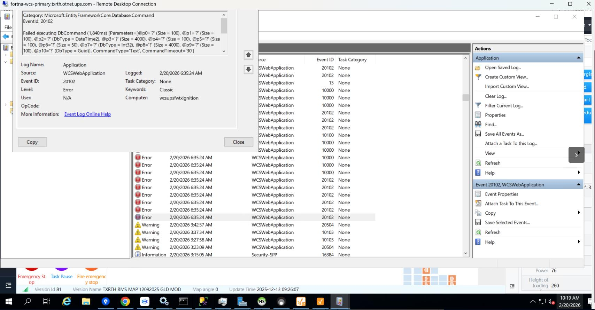

**Short description:** Remote Desktop screenshot showing Windows Event Viewer with repeated WCSWebApplication errors and an Event 20102 details dialog.

**Detailed description:** This artifact appears to be a Remote Desktop session to a Fortna/WCS host with Windows Event Viewer open on the Application log. An Event Properties dialog is visible for WCSWebApplication Event ID 20102. The visible event text indicates a Microsoft.EntityFrameworkCore Database.Command category and a failed DbCommand execution. In the event list behind the dialog, multiple red error entries for WCSWebApplication are shown at the same timestamp, along with several warning entries earlier in the morning. A partially visible RMS/HMI strip is present at the bottom of the screenshot, but only limited labels are readable there. The screenshot primarily serves as diagnostic/symptom evidence of application-level errors rather than a confirmed system-wide failure state.

#### What To Look At

- Event Properties dialog for the exact WCSWebApplication error text
- Event ID 20102 and Level Error fields
- Cluster of repeated red error entries at 6:35:24 AM
- Any correlation between the Event Viewer errors and the partially visible RMS/HMI strip at the bottom

#### Source Supported Claims

- The artifact shows a Remote Desktop Connection window to a host labeled fortna-wcs-primary.txrth.otnet.ups.com. (visual_image)
- An Event Properties dialog for WCSWebApplication Event ID 20102 is visible. (visual_image)
- The visible event text includes Category Microsoft.EntityFrameworkCore.Database.Command and the message 'Failed executing DbCommand (1,840ms)'. (artifact_ocr)
- The event metadata shown includes Log Name Application, Source WCSWebApplication, Level Error, and Logged 2/20/2026 6:35:24 AM. (page_ocr_context)
- Multiple WCSWebApplication error entries are visible in the event list around 6:35:24 AM. (visual_image)
- Stage 2 classified this artifact as an RMS screenshot and symptom/state evidence. (stage2_classification)

#### Review Uncertainty

- The OCR is usable but noisy, especially in parameter details and some host text.
- The lower RMS/HMI content is only partially visible and should be interpreted cautiously.
- The screenshot supports application error evidence but not a definitive root cause or full operational impact.

#### Quality Notes

- Artifact OCR quality is marked usable, but several strings are garbled.
- Page OCR provides consistent support for the Event Viewer details.
- Visual evidence is strongest for the Event Viewer error state; weaker for the partially obscured RMS/HMI area.

### artifact_incident_228086_page_029_embedded_image_01

| Field | Value |
| --- | --- |
| Page | 29 |
| Image type | windows_services_screenshot |
| Evidence role | diagnostic_evidence |
| OCR quality | usable |
| Duplicate group |  |
| Validation status | needs_sme_review |

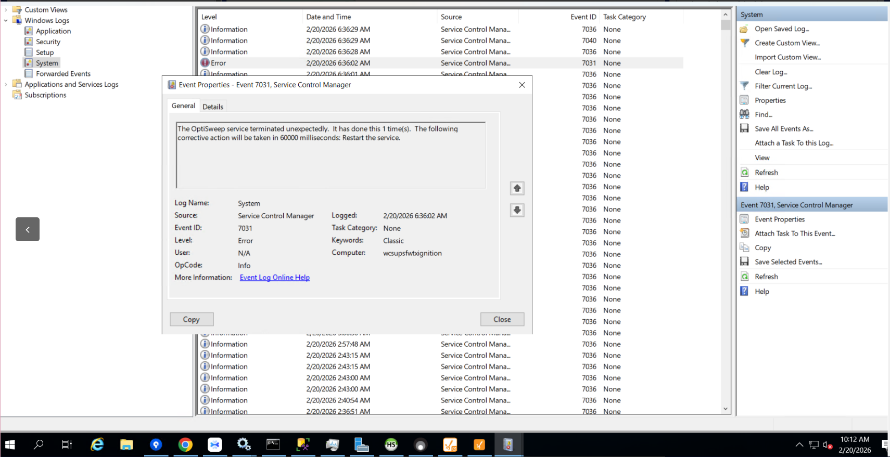

**Short description:** Windows Event Viewer screenshot showing a Service Control Manager error for the OptiSweep service terminating unexpectedly and an automatic restart action.

**Detailed description:** This artifact is a screenshot of Windows Event Viewer with the System log selected. An Event Properties dialog for Event 7031 from Service Control Manager is open in the foreground. The visible message states that the OptiSweep service terminated unexpectedly, had done so 1 time, and that corrective action would be taken in 60000 milliseconds by restarting the service. The event details pane shows Level as Error and includes a logged timestamp of 2/20/2026 6:36:02 AM. The surrounding event list contains multiple Service Control Manager entries, mostly informational events, with the error row highlighted.

#### What To Look At

- Event Properties dialog title and Event ID 7031
- The message text about the OptiSweep service terminating unexpectedly
- The corrective action text indicating restart in 60000 milliseconds
- Level field showing Error
- Computer field showing wcsupsfwtxignition
- Background System log entries around the highlighted error

#### Source Supported Claims

- The screenshot shows Windows Event Viewer with an Event Properties window for Event 7031 from Service Control Manager. (visual_image)
- The visible event message states: "The OptiSweep service terminated unexpectedly. It has done this 1 time(s). The following corrective action will be taken in 60000 milliseconds: Restart the service." (visual_image)
- The event level shown is Error. (visual_image)
- The artifact OCR also captures Event ID 7031, Service Control Manager, and the OptiSweep termination message. (artifact_ocr)
- Page OCR context also indicates a System log error event in Event Viewer with the OptiSweep service termination and restart text. (page_ocr_context)
- Stage 2 classified this artifact as a windows_services_screenshot. (stage2_classification)

#### Review Uncertainty

- The screenshot shows an automatic restart action is configured, but it does not prove the service successfully restarted.
- Some OCR text is noisy and partially garbled, though the key event message is legible in the image.

#### Quality Notes

- Image content is clear enough to read the main event message and metadata.
- Artifact OCR is usable but contains noise and truncation in several areas.
- Page OCR context is consistent with the visible screenshot content.
