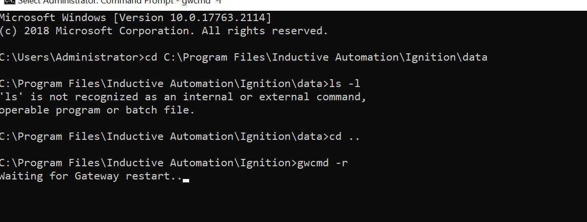
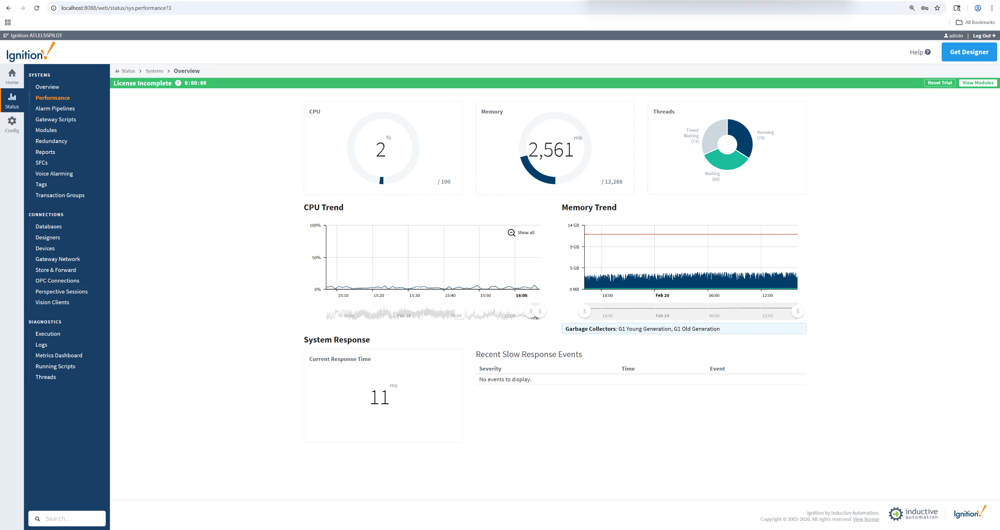
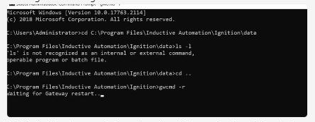

# Restart Ignition and verify OptiSweep service response with GetAgvStatuses

## Runbook Header

| Field | Value |
| --- | --- |
| Procedure ID | `proc_restart_ignition_and_verify_optisweep_service_response_with_getagvstatuses_v1` |
| Title | Restart Ignition and verify OptiSweep service response with GetAgvStatuses |
| Procedure Type | `recovery` |
| Primary Role | `L2_support` |
| Supporting Roles | `operator` |
| Support Safe | Yes |
| Validation Status | `needs_sme_review` |
| Merge Status | `source_finalized` |

## Summary

Conditional incident-derived recovery guidance for restarting Ignition and confirming OptiSweep service responsiveness before releasing the E-stop. The source instructs the operator to first E-stop the system, restart Ignition with `gwcmd -r`, wait until the gateway is back up and login is possible, then verify OptiSweep by sending a GetAgvStatuses request. If no response is returned, restart OptiSweep, send the request again, and only then release the E-stop.

## When To Use

Use when the incident-specific guidance indicates Ignition may need to be restarted and you need to confirm the OptiSweep service is responding again before releasing the E-stop.

## Do Not Use For

* Do not use for undocumented recovery actions beyond the source-shared restart sequence.
* Do not treat the schema validation warning alone as a service outage when the request still returns HTTP 200 with data.
* Do not use this runbook as a click-by-click OptiSweep Windows Services restart procedure; the source only supports a high-level restart instruction.
* Do not release the E-stop before response is confirmed from GetAgvStatuses.

## Safety And Operational Notes

* First E-stop the system before attempting the restart.
* Do not release the E-stop until OptiSweep response is confirmed.
* If Ignition does not come back up to a login-capable state, stop and do not perform undocumented changes beyond the source-shared restart sequence.
* If response still cannot be confirmed after the documented restart steps, stop and escalate rather than inventing additional recovery actions.

## Access Or Tools Needed

* Access to the system E-stop control
* Windows command prompt on the Ignition host
* Ignition installation directory access
* Ignition web status/login page access
* API client identified in the source as api dog
* Access to the GetAgvStatuses endpoint
* Windows Services access for OptiSweep restart if needed
* Network access to `http://10.27.80.165:5000/GetAgvStatuses`
* Permission to query the OptiSweep API

## Screens And Visual References

*RMS map monitor screenshot with emergency stop control area highlighted for E-stop context.*

*Windows command prompt showing `gwcmd -r` and `Waiting for Gateway restart...`.*

*Ignition Status > Systems > Overview page showing the gateway is reachable.*

*API client showing GetAgvStatuses request, HTTP 200 response, and returned AGV records.*

*Windows Services console showing OptiSweep selected with restart control visible.*

*Page 12 restart-instructions screenshot context for the Ignition restart guidance.*

## Procedure Steps

### Step 1 — E-stop the system before restart

**Responsible role:** L2_support

**Instruction:**
First E-stop the system before attempting the restart.

**Expected result:**
The system is placed in E-stop before any Ignition restart action is taken.

**Screens / Images:**

*Emergency stop control area highlighted in the RMS/system control context.*

**Stop or Escalate If:**

* The system cannot be safely placed in E-stop.
* The E-stop state cannot be confirmed before proceeding.

---

### Step 2 — Restart Ignition from the Ignition directory

**Responsible role:** L2_support

**Instruction:**
Open a Windows command prompt on the Ignition host, navigate to the Ignition installation directory, and run `gwcmd -r` from `C:\Program Files\Inductive Automation\Ignition>`. Observe the console message `Waiting for Gateway restart...`.

**Expected result:**
The Ignition gateway restart command is accepted and the console shows `Waiting for Gateway restart...`.

**Screens / Images:**

*Command prompt in `C:\Program Files\Inductive Automation\Ignition>` showing `gwcmd -r` and `Waiting for Gateway restart...`.*

*Restart-instruction screenshot context showing the Ignition restart command sequence.*

**Stop or Escalate If:**

* The documented restart command cannot be executed.
* The expected `Waiting for Gateway restart...` message does not appear.
* Ignition restart requires undocumented commands or changes not present in the source.

---

### Step 3 — Wait for Ignition to come back up

**Responsible role:** L2_support

**Instruction:**
Wait for Ignition to come back up, meaning it lets you log in and does not show the gateway starting up. Use the Ignition status/login page to confirm the gateway is reachable.

**Expected result:**
Ignition is reachable again and presents a login-capable or status page rather than a startup screen.

**Screens / Images:**

*Ignition Status > Systems > Overview page reachable in the browser, with Current Response Time and no startup screen.*

**Stop or Escalate If:**

* Ignition does not come back up to a login-capable state.
* The gateway remains on a startup screen or is unreachable.
* Additional undocumented recovery actions would be required.

---

### Step 4 — Send GetAgvStatuses request after Ignition restart

**Responsible role:** L2_support

**Instruction:**
Open the API client identified in the source as api dog and send a GetAgvStatuses request to `http://10.27.80.165:5000/GetAgvStatuses`.

**Expected result:**
The request executes against the shown endpoint and returns a response from the OptiSweep service.

**Screens / Images:**

*API client showing GET request to `http://10.27.80.165:5000/GetAgvStatuses`.*

**Stop or Escalate If:**

* The endpoint is unreachable or returns no response.
* The request cannot be executed with the documented API client and endpoint.
* Undocumented troubleshooting would be required beyond the source-supported sequence.

---

### Step 5 — Confirm HTTP 200 and returned AGV records

**Responsible role:** L2_support

**Instruction:**
Check that the GetAgvStatuses request returns HTTP 200 and returned AGV records. Visible records in the source include status values such as `NORMAL`. Do not treat the visible schema validation warning alone as a service outage if the request still returns HTTP 200 with data.

**Expected result:**
The API response shows Success/Status 200 and returned AGV records, including visible status values such as `NORMAL`.

**Screens / Images:**

*Response panel showing Success/Status 200 and returned records with visible `NORMAL` values; note the validation warning but do not treat it alone as outage proof.*

**Stop or Escalate If:**

* The request does not return a response.
* The endpoint returns no data.
* Response still cannot be confirmed after the documented retry path.

---

### Step 6 — If no response, restart OptiSweep and retry GetAgvStatuses

**Responsible role:** L2_support

**Instruction:**
If no response is given, restart OptiSweep, then send another GetAgvStatuses request to confirm response. The source supports this at a high level only; use the Windows Services console context shown for OptiSweep and do not invent additional click-by-click steps not present in the source.

**Expected result:**
OptiSweep is restarted and a follow-up GetAgvStatuses request is sent to confirm response.

**Screens / Images:**

*Windows Services console with OptiSweep selected, showing Running state and restart control visible.*

*Use the same GetAgvStatuses request view to retry and confirm response.*

**Stop or Escalate If:**

* Response still cannot be confirmed after the documented OptiSweep restart and retry.
* The endpoint remains unreachable or returns no data after the documented steps.
* Additional recovery would require undocumented actions.

---

### Step 7 — Release the E-stop after response is confirmed

**Responsible role:** L2_support

**Instruction:**
Once the response is confirmed, release the E-stop.

**Expected result:**
The E-stop is released only after OptiSweep response has been confirmed.

**Screens / Images:**

*System control context with emergency stop control area relevant to release after confirmation.*

**Stop or Escalate If:**

* Response has not been confirmed.
* Ignition or OptiSweep health remains unconfirmed.
* Releasing the E-stop would occur without completing the documented validation sequence.

---

## Success Criteria

* Ignition is reachable again and allows login or status-page access rather than showing gateway startup.
* The GetAgvStatuses request to `http://10.27.80.165:5000/GetAgvStatuses` returns HTTP 200.
* Returned AGV records are visible in the response, including status values such as `NORMAL`.
* If OptiSweep had to be restarted, a follow-up GetAgvStatuses request confirms response.
* The E-stop is released only after response confirmation.

## Failure Conditions

* Ignition does not come back up to a login-capable state.
* The GetAgvStatuses endpoint is unreachable or returns no response.
* The request returns no data.
* Response still cannot be confirmed after the documented OptiSweep restart and retry.
* Recovery would require undocumented actions beyond the source-shared sequence.

## Escalation Guidance

* If Ignition does not come back up to a login-capable state, stop and do not perform undocumented changes beyond the source-shared restart sequence.
* If GetAgvStatuses gives no response after the Ignition restart, restart OptiSweep and repeat the request.
* If response still cannot be confirmed after the documented restart steps, stop and escalate rather than inventing additional recovery actions.
* If the endpoint is unreachable or returns no data, stop and use only source-supported recovery actions.

## Missing Details / Known Gaps

* The source does not provide a documented click-by-click procedure for restarting OptiSweep in Windows Services.
* The source does not provide an estimated completion time.
* The source does not explicitly state whether production stop or LOTO is required beyond the E-stop instruction.
* The source does not define exact role boundaries for who physically applies or releases the E-stop at the site.
* The source does not provide additional recovery steps if Ignition or OptiSweep still fail after the documented restart sequence.

## Source Lineage

- Candidate IDs: candidate_incident_228086_restart_ignition_and_verify_optisweep_response
- Source ID: `source_case_228086`
- Source Type: `incident_case`
