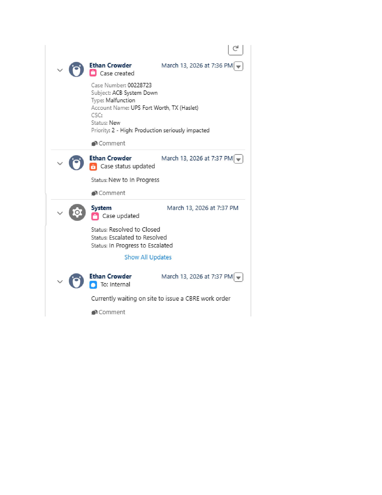
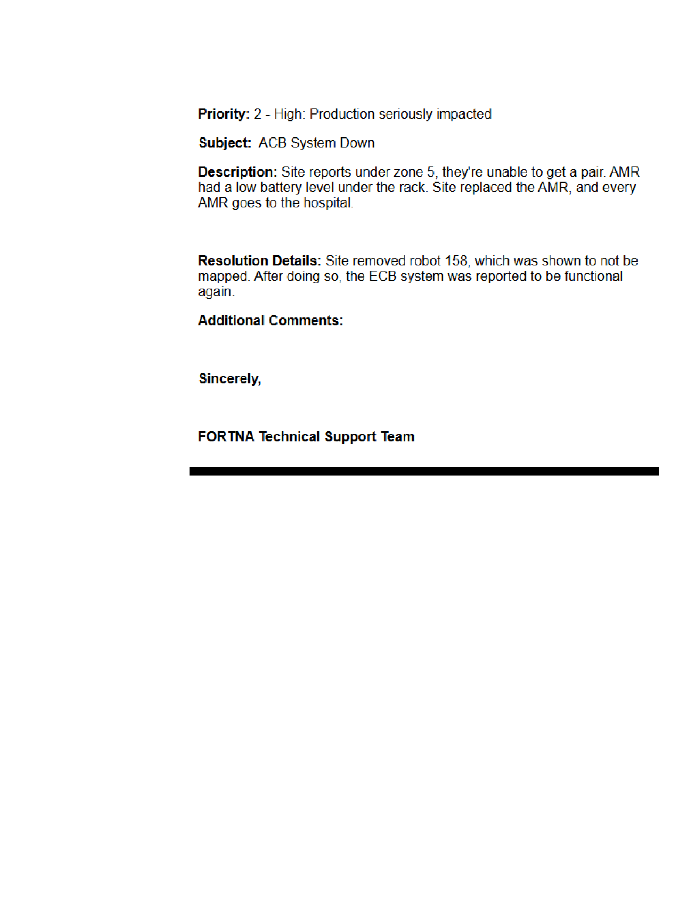

# Stage 3 Artifact Enrichment Review - Case 228723

## Summary

| Metric | Value |
| --- | --- |
| Artifacts | 10 |
| Enriched | 10 |
| Failed | 0 |
| Validation errors | 0 |
| Warnings | 1 |
| Artifacts with uncertainty or quality notes | 10 |

## Counts

### Evidence Roles

| Role | Count |
| --- | --- |
| incident_context_evidence | 6 |
| validation_evidence | 2 |
| action_evidence | 1 |
| escalation_evidence | 1 |

### OCR Quality

| Quality | Count |
| --- | --- |
| usable | 9 |
| garbled | 1 |

## Warnings

- One or more artifacts were flagged as having garbled OCR.

## Artifact Index

| Page | Artifact | Role | OCR | Summary | Review flags |
| --- | --- | --- | --- | --- | --- |
| 6 | artifact_incident_228723_page_006_embedded_image_01 | incident_context_evidence | garbled | Screenshot showing two RMS web UI views of a robot status table, with a note stating that site removed robot 158 from the system. | uncertainty, quality, ocr:garbled, duplicate:unique |
| 8 | artifact_incident_228723_page_008_embedded_image_01 | incident_context_evidence | usable | Salesforce case activity screenshot showing case creation, rapid status changes, and an internal note about waiting for a CBRE work order. | uncertainty, quality, duplicate:unique |
| 8 | artifact_incident_228723_page_008_full_page_01 | incident_context_evidence | usable | Salesforce case activity screenshot showing case creation, rapid status changes, and an internal note about waiting for a CBRE work order. | uncertainty, quality, duplicate:unique |
| 9 | artifact_incident_228723_page_009_embedded_image_01 | escalation_evidence | usable | Screenshot of a case activity feed showing a status escalation and an internal support chat image. | uncertainty, quality, duplicate:unique |
| 10 | artifact_incident_228723_page_010_embedded_image_01 | validation_evidence | usable | Teams message showing two embedded RMS screenshots and a status update that robot 158 was removed from the system and placed on charge, after which the system reportedly resumed... | uncertainty, quality, duplicate:unique |
| 10 | artifact_incident_228723_page_010_embedded_image_02 | validation_evidence | usable | Screenshot of case activity showing a status update to Resolved and a case closed entry by Ethan Crowder. | uncertainty, quality, duplicate:unique |
| 11 | artifact_incident_228723_page_011_embedded_image_01 | incident_context_evidence | usable | Email-style notification showing that case 00228723 has been closed for the UPS Fort Worth, TX (Haslet) account. | uncertainty, quality, duplicate:unique |
| 12 | artifact_incident_228723_page_012_embedded_image_01 | incident_context_evidence | usable | Salesforce-style case screenshot summarizing a high-priority ACB system outage and a reported recovery after removal of robot 158. | uncertainty, quality, duplicate:unique |
| 12 | artifact_incident_228723_page_012_full_page_01 | incident_context_evidence | usable | Salesforce-style case text page summarizing a high-priority ACB system outage, AMR behavior, and a reported recovery action. | uncertainty, quality, duplicate:unique |
| 13 | artifact_incident_228723_page_013_embedded_image_01 | action_evidence | usable | Screenshot of a work order detail page shared in a Teams chat, showing an emergency mechanical breakdown ticket for the Haslet hub. | uncertainty, quality, duplicate:unique |

## Artifact Details

### artifact_incident_228723_page_006_embedded_image_01

| Field | Value |
| --- | --- |
| Page | 6 |
| Image type | unknown_incident_evidence |
| Evidence role | incident_context_evidence |
| OCR quality | garbled |
| Duplicate group |  |
| Validation status | needs_sme_review |

**Short description:** Screenshot showing two RMS web UI views of a robot status table, with a note stating that site removed robot 158 from the system.

**Detailed description:** The artifact appears to be a screenshot captured within a chat or document view. It contains two stacked images of an RMS web interface displayed in a browser window. Both views show a tabular list of robots or assets with multiple columns and several rows. Some entries in the table are highlighted in red, suggesting error or exception-related fields. A visible caption beneath the lower screenshot reads, "Site removed robot 158 from system." The OCR for this artifact and the surrounding page is marked garbled, so interpretation is based primarily on the visible image content.

#### What To Look At

- The red-highlighted rows or fields in both RMS screenshots
- Any readable robot identifiers in the table, especially around the red entries
- The caption stating that robot 158 was removed from the system
- Whether the two screenshots show before/after or duplicate views of the same RMS table

#### Source Supported Claims

- The artifact contains two screenshots of an RMS web interface displayed in a browser. (visual_image)
- The RMS interface shows tabular robot or system status information with multiple rows and columns. (visual_image)
- Some entries in the RMS table are shown in red text. (visual_image)
- Visible text below the lower screenshot states, "Site removed robot 158 from system." (visual_image)
- Artifact OCR quality is garbled, so text extraction from the screenshot is unreliable. (artifact_ocr)
- Stage 2 classified the page context as an RMS screenshot. (stage2_classification)

#### Review Uncertainty

- Exact table column names and row values are not reliably readable
- It is unclear whether the two RMS screenshots represent the same moment or a before/after comparison
- The specific status or error associated with robot 158 cannot be confirmed from the screenshot alone

#### Quality Notes

- Artifact OCR quality is marked garbled and should not be relied on for detailed text extraction.
- Page OCR quality is also garbled, limiting surrounding context.
- Image-based interpretation is conservative due to small UI text.

### artifact_incident_228723_page_008_embedded_image_01

| Field | Value |
| --- | --- |
| Page | 8 |
| Image type | salesforce_case_screenshot |
| Evidence role | incident_context_evidence |
| OCR quality | usable |
| Duplicate group |  |
| Validation status | needs_sme_review |

**Short description:** Salesforce case activity screenshot showing case creation, rapid status changes, and an internal note about waiting for a CBRE work order.

**Detailed description:** This artifact is a screenshot of a Salesforce-style case activity feed for case 00228723. The visible entries show the case being created by Ethan Crowder on March 13, 2026 at 7:36 PM with subject "ACB System Down," type "Malfunction," account name "UPS Fort Worth, TX (Haslet)," status "New," and priority "2 - High: Production seriously impacted." Additional visible feed items at 7:37 PM show a status update from New to In Progress, a system-generated case update listing status transitions including In Progress to Escalated, Escalated to Resolved, and Resolved to Closed, and an internal note stating that they are currently waiting on site to issue a CBRE work order. The screenshot provides incident case context and workflow history rather than direct system telemetry.

#### What To Look At

- Case number and subject
- Priority and initial status
- Timeline timestamps
- Status transition history
- Internal note about CBRE work order

#### Source Supported Claims

- The screenshot shows case number 00228723. (visual_image)
- The visible subject is "ACB System Down." (visual_image)
- The case type is shown as "Malfunction." (visual_image)
- The account name is shown as "UPS Fort Worth, TX (Haslet)." (visual_image)
- The case was shown with status "New" and priority "2 - High: Production seriously impacted" at creation. (visual_image)
- A visible update shows the status changed from New to In Progress. (visual_image)
- A system-generated update lists status transitions including In Progress to Escalated, Escalated to Resolved, and Resolved to Closed. (visual_image)
- An internal note states: "Currently waiting on site to issue a CBRE work order." (visual_image)
- Stage 2 classified the artifact as a Salesforce case screenshot. (stage2_classification)

#### Review Uncertainty

- The artifact shows case workflow history but not the underlying system state directly.
- The acronym or field label "CSC" is visible but its meaning is not clear from the screenshot alone.
- The system-generated status transitions are visible, but the exact sequence semantics should be confirmed in Salesforce if needed.

#### Quality Notes

- OCR quality is usable and aligns well with the visible screenshot text.
- Some OCR symbols and feed icons are noisy, but the main case fields and note text are readable.
- Interpretation is based primarily on the visible screenshot content.

### artifact_incident_228723_page_008_full_page_01

| Field | Value |
| --- | --- |
| Page | 8 |
| Image type | salesforce_case_screenshot |
| Evidence role | incident_context_evidence |
| OCR quality | usable |
| Duplicate group |  |
| Validation status | needs_sme_review |

**Short description:** Salesforce case activity screenshot showing case creation, rapid status changes, and an internal note about waiting for a CBRE work order.

**Detailed description:** This artifact is a Salesforce case timeline screenshot for case 00228723. The visible entries show Ethan Crowder creating a case with subject "ACB System Down," type "Malfunction," account name "UPS Fort Worth, TX (Haslet)," initial status "New," and priority "2 - High: Production seriously impacted" at March 13, 2026 7:36 PM. A subsequent entry by Ethan Crowder at 7:37 PM shows the case status changing from New to In Progress. A system-generated update at 7:37 PM lists multiple status transitions, including In Progress to Escalated, Escalated to Resolved, and Resolved to Closed. Another Ethan Crowder internal note at 7:37 PM states that they are currently waiting on site to issue a CBRE work order. The screenshot provides incident context and workflow progression rather than direct technical diagnostics from a system UI.

#### What To Look At

- Case number and subject
- Priority and account/site fields
- Status transition timestamps
- System-generated workflow updates
- Internal note about waiting for CBRE work order

#### Source Supported Claims

- The screenshot shows case number 00228723. (visual_image)
- The case subject shown is "ACB System Down." (visual_image)
- The case type shown is "Malfunction." (visual_image)
- The account name shown is "UPS Fort Worth, TX (Haslet)." (visual_image)
- The initial case status shown is "New." (visual_image)
- The priority shown is "2 - High: Production seriously impacted." (visual_image)
- An entry shows the case status changed from New to In Progress at March 13, 2026 7:37 PM. (visual_image)
- A system-generated update lists status transitions including In Progress to Escalated, Escalated to Resolved, and Resolved to Closed. (visual_image)
- An internal note says, "Currently waiting on site to issue a CBRE work order." (visual_image)
- Stage 2 classified this artifact as incident context evidence from a Salesforce case screenshot. (stage2_classification)

#### Review Uncertainty

- The screenshot supports case workflow details, but not the direct technical condition of the ACB system.
- The system-generated status sequence is visible, but the exact order and business meaning should be SME-validated.

#### Quality Notes

- OCR quality is usable and aligns closely with the visible screenshot text.
- Some OCR tokens are noisy around icons and labels, but key case fields and comments are readable.
- This is a full-page Salesforce evidence screenshot rather than a cropped technical artifact.

### artifact_incident_228723_page_009_embedded_image_01

| Field | Value |
| --- | --- |
| Page | 9 |
| Image type | ignition_status_screenshot |
| Evidence role | escalation_evidence |
| OCR quality | usable |
| Duplicate group |  |
| Validation status | needs_sme_review |

**Short description:** Screenshot of a case activity feed showing a status escalation and an internal support chat image.

**Detailed description:** The artifact appears to be a screenshot of a case or ticket activity timeline. It shows an entry by Ethan Crowder at March 13, 2026 at 8:30 PM stating that the case status was updated from In Progress to Escalated. A second entry by Ethan Crowder at March 13, 2026 at 8:45 PM is marked To: Internal and includes an embedded screenshot of a dark-themed support chat window. The embedded chat text is too small to read reliably from the image, but it appears to be an internal support conversation used as supporting context for the escalation.

#### What To Look At

- The status change line showing In Progress to Escalated
- The timestamps for the two Ethan Crowder entries
- The To: Internal label on the second entry
- The presence of the embedded support chat screenshot
- Whether the embedded chat can be reviewed elsewhere at higher resolution

#### Source Supported Claims

- The artifact shows a case status update from In Progress to Escalated. (visual_image)
- The status update entry is attributed to Ethan Crowder and timestamped March 13, 2026 at 8:30 PM. (artifact_ocr)
- A second entry by Ethan Crowder at March 13, 2026 at 8:45 PM is marked To: Internal. (artifact_ocr)
- The second entry includes an embedded screenshot of an internal support chat. (visual_image)
- Stage 2 classified this artifact as diagnostic_evidence and as an ignition_status_screenshot, but the visible content is more consistent with a case activity feed screenshot containing a chat image. (stage2_classification)

#### Review Uncertainty

- The embedded chat screenshot content is not legible enough to summarize safely.
- The artifact type hint of ignition_status_screenshot does not align cleanly with the visible case feed screenshot.
- Some OCR characters are noisy, though the main status change text appears reliable.

#### Quality Notes

- Artifact OCR is usable for the main status and timestamp text.
- Page OCR includes garbled text for the embedded chat content and should not be relied on for detailed chat transcription.
- Visual inspection is sufficient to confirm the escalation event but not the detailed contents of the attached chat.

### artifact_incident_228723_page_010_embedded_image_01

| Field | Value |
| --- | --- |
| Page | 10 |
| Image type | rms_screenshot |
| Evidence role | validation_evidence |
| OCR quality | usable |
| Duplicate group |  |
| Validation status | needs_sme_review |

**Short description:** Teams message showing two embedded RMS screenshots and a status update that robot 158 was removed from the system and placed on charge, after which the system reportedly resumed operating.

**Detailed description:** The artifact is a screenshot of a Microsoft Teams-style message from Ethan Crowder dated March 13, 2026 at 9:17 PM to 'All'. The message includes the label 'Geek+' and two small embedded screenshots of an RMS or similar operations interface showing tabular robot/system data, though the UI details are too small to read reliably. Between and below the screenshots, the visible message text states that the site removed robot 158 from the system and that it was currently on charger. The message further states that Tony reported the system began functioning again after removing robot 158, that monitoring continued for approximately 10 minutes, and that the system remained operational before the Teams call ended. The surrounding page OCR also indicates later case workflow context, including a status update to resolved and case closure, but that appears to be page context rather than text inside the cropped artifact itself.

#### What To Look At

- The visible text describing removal of robot 158 and placement on charger
- The statement that the system began functioning again after robot removal
- The note about approximately 10 minutes of continued monitoring
- The two embedded RMS screenshots for any legible robot or status details

#### Source Supported Claims

- The artifact shows a message from Ethan Crowder dated March 13, 2026 at 9:17 PM. (visual_image)
- The visible message says the site removed robot 158 from the system and that it was currently on charger. (visual_image)
- The visible message says that after removing robot 158, the system began functioning again. (visual_image)
- The visible message says monitoring continued for approximately 10 minutes and that the system remained operational. (visual_image)
- The page context indicates a later case status update to resolved and case closure. (page_ocr_context)
- Stage 2 classified this artifact as an RMS screenshot / symptom or state evidence candidate. (stage2_classification)

#### Review Uncertainty

- The embedded RMS screenshots are not legible enough to extract specific robot IDs, statuses, or alarms from the UI itself.
- Some OCR text is noisy around the Teams header and surrounding interface elements.
- The later resolved/closed case text comes from page context and should not be assumed to be part of the cropped artifact image.

#### Quality Notes

- Artifact OCR is usable and aligns with the visible message text.
- Image-level message text is readable, but the embedded RMS screenshots are too small for detailed UI interpretation.
- Page OCR includes surrounding case-management context beyond the cropped artifact.

### artifact_incident_228723_page_010_embedded_image_02

| Field | Value |
| --- | --- |
| Page | 10 |
| Image type | ignition_status_screenshot |
| Evidence role | validation_evidence |
| OCR quality | usable |
| Duplicate group |  |
| Validation status | needs_sme_review |

**Short description:** Screenshot of case activity showing a status update to Resolved and a case closed entry by Ethan Crowder.

**Detailed description:** The cropped image appears to be a case activity or case history UI rather than an Ignition system status screen. It shows two entries attributed to Ethan Crowder, both timestamped March 13, 2026 at 9:20 PM. One entry states that the case status was updated, with visible text indicating "Status: Escalated to Resolved." A second entry shows "Case closed." Comment links or icons are visible under both entries. The surrounding page OCR provides incident context that the system began functioning again after robot 158 was removed and that the system remained operational, but that context is from the page and not necessarily visible inside this cropped artifact.

#### What To Look At

- The first activity entry showing "Case status updated"
- The status line reading "Status: Escalated to Resolved"
- The second activity entry showing "Case closed"
- The shared timestamp of March 13, 2026 at 9:20 PM

#### Source Supported Claims

- The artifact shows a case activity entry labeled "Case status updated." (visual_image)
- The artifact shows visible status text reading "Status: Escalated to Resolved." (visual_image)
- The artifact shows a second activity entry labeled "Case closed." (visual_image)
- OCR extracted the name Ethan Crowder and the timestamp March 13, 2026 at 9:20 PM for both entries. (artifact_ocr)
- The surrounding page context states that after robot 158 was removed, the system began functioning again and remained operational. (page_ocr_context)

#### Review Uncertainty

- The stage 2 image type hint labels this as an ignition_status_screenshot, but the visible content is a case activity feed.
- The exact platform UI is not explicitly identified from the cropped image alone.
- The operational recovery narrative comes from page context, not directly from the cropped artifact.

#### Quality Notes

- Artifact OCR is usable and aligns with the visible case activity text.
- Some OCR characters around icons and controls are noisy, but the main status and closure text is readable.
- Use page OCR only as surrounding context, not as proof of text visible inside the crop.

### artifact_incident_228723_page_011_embedded_image_01

| Field | Value |
| --- | --- |
| Page | 11 |
| Image type | unknown_incident_evidence |
| Evidence role | incident_context_evidence |
| OCR quality | usable |
| Duplicate group |  |
| Validation status | needs_sme_review |

**Short description:** Email-style notification showing that case 00228723 has been closed for the UPS Fort Worth, TX (Haslet) account.

**Detailed description:** The artifact appears to be a screenshot of an email or message notification from Ethan Crowder to Tony Angton. The visible body includes a FORTNA header and a structured case summary stating that the following case has been closed. The screenshot lists case number 00228723, account UPS Fort Worth, TX (Haslet), contact name Tony Angton, installation group IG0011744 - UPS - TXRTH - HASLET, TX, affected asset Z - UPS Fort Worth, TX (Haslet), case opened time of 3/13/2026 7:36 PM, and case resolved date of 3/13/2026. This artifact provides incident context and closure-status evidence rather than technical diagnostic detail.

#### What To Look At

- Sender and recipient fields at the top of the message
- Timestamp in the upper right
- FORTNA header/logo
- The line stating the case has been closed
- Case number 00228723
- Account, contact name, installation group, and affected asset fields
- Case opened and case resolved fields

#### Source Supported Claims

- The artifact shows a notification stating that the following case has been closed. (visual_image)
- The visible case number is 00228723. (visual_image)
- The visible account is UPS Fort Worth, TX (Haslet). (visual_image)
- The visible contact name is Tony Angton. (visual_image)
- The visible installation group is IG0011744 - UPS - TXRTH - HASLET, TX. (visual_image)
- The visible affected asset is Z - UPS Fort Worth, TX (Haslet). (visual_image)
- The visible case opened time is 3/13/2026 7:36 PM. (visual_image)
- The visible case resolved date is 3/13/2026. (visual_image)
- The OCR also identifies this as a case-closed notification sent from Ethan Crowder to Tony Angton. (artifact_ocr)

#### Review Uncertainty

- The screenshot confirms case closure messaging but does not independently confirm the technical condition of the affected asset.
- Some OCR characters are inconsistent with the visible image, such as installation group leading character and affected asset character, so visual text should be preferred.

#### Quality Notes

- Artifact OCR quality is marked usable and generally aligns with the visible screenshot.
- Page OCR appears to contain minor character substitution errors, including | versus I and 7 versus Z.
- The image is clear enough to rely primarily on visible text.

### artifact_incident_228723_page_012_embedded_image_01

| Field | Value |
| --- | --- |
| Page | 12 |
| Image type | salesforce_case_screenshot |
| Evidence role | incident_context_evidence |
| OCR quality | usable |
| Duplicate group |  |
| Validation status | needs_sme_review |

**Short description:** Salesforce-style case screenshot summarizing a high-priority ACB system outage and a reported recovery after removal of robot 158.

**Detailed description:** The cropped artifact appears to be a text-based case or support summary screenshot. Visible text shows a priority of "2 - High: Production seriously impacted" and a subject of "ACB System Down." The description states that under zone 5 the site was unable to get a pair, mentions an AMR with a low battery level under the rack, says the site replaced the AMR, and reports that every AMR goes to the hospital. The resolution details state that the site removed robot 158, which was shown to not be mapped, and that after doing so the ECB system was reported to be functional again. The screenshot ends with a support-team signoff from FORTNA Technical Support Team.

#### What To Look At

- Priority and subject fields
- Description text describing zone 5 and AMR behavior
- Resolution details mentioning robot 158 not mapped
- Reported statement that the system was functional again
- Support-team signoff

#### Source Supported Claims

- The screenshot shows a priority of "2 - High: Production seriously impacted." (visual_image)
- The screenshot subject is "ACB System Down." (visual_image)
- The description states that under zone 5 the site was unable to get a pair. (artifact_ocr)
- The description mentions an AMR with a low battery level under the rack and says the site replaced the AMR. (artifact_ocr)
- The description says every AMR goes to the hospital. (artifact_ocr)
- The resolution details state that site removed robot 158, which was shown to not be mapped. (visual_image)
- The resolution details say that after removing robot 158, the ECB system was reported to be functional again. (visual_image)
- Stage 2 classified this artifact as a Salesforce case screenshot and hinted it as incident context evidence. (stage2_classification)

#### Review Uncertainty

- The artifact documents reported incident details but does not directly show live system state.
- The text references both ACB and ECB; this may be a source typo or differing subsystem names and should be SME-reviewed.
- The phrase "unable to get a pair" is domain-specific and may need SME interpretation.

#### Quality Notes

- Artifact OCR quality is marked usable and aligns closely with the visible screenshot text.
- Minor OCR noise appears at the end of the signoff line.
- The screenshot is text-heavy and readable enough to support conservative extraction.

### artifact_incident_228723_page_012_full_page_01

| Field | Value |
| --- | --- |
| Page | 12 |
| Image type | salesforce_case_screenshot |
| Evidence role | incident_context_evidence |
| OCR quality | usable |
| Duplicate group |  |
| Validation status | needs_sme_review |

**Short description:** Salesforce-style case text page summarizing a high-priority ACB system outage, AMR behavior, and a reported recovery action.

**Detailed description:** This artifact is a full-page text screenshot showing incident case content. Visible fields include Priority, Subject, Description, Resolution Details, and Additional Comments. The page states a Priority 2 high-impact production issue with subject 'ACB System Down.' The description says the site reported an issue under zone 5 where they were unable to get a pair, mentions an AMR with a low battery level under the rack, and says the site replaced the AMR but every AMR goes to the hospital. The resolution section states that site removed robot 158, which was shown to not be mapped, and that after doing so the ECB system was reported to be functional again. The page ends with a signoff from the FORTNA Technical Support Team.

#### What To Look At

- Priority and impact wording
- Subject line naming the affected system
- Description text about zone 5 and AMR behavior
- Resolution details mentioning robot 158 and mapping status
- Any wording indicating restoration of service

#### Source Supported Claims

- The case priority is shown as '2 - High: Production seriously impacted.' (visual_image)
- The subject shown on the page is 'ACB System Down.' (visual_image)
- The description states the site reported under zone 5 that they were unable to get a pair. (artifact_ocr)
- The description states an AMR had a low battery level under the rack and that the site replaced the AMR. (artifact_ocr)
- The description states that every AMR goes to the hospital. (artifact_ocr)
- The resolution details state that site removed robot 158, which was shown to not be mapped. (artifact_ocr)
- The resolution details state that after removing robot 158, the ECB system was reported to be functional again. (artifact_ocr)
- Stage 2 classified this artifact as incident context evidence from a Salesforce case screenshot. (stage2_classification)

#### Review Uncertainty

- The artifact is a rendered text page rather than a native Salesforce UI capture with clearly visible field chrome.
- The phrase 'every AMR goes to the hospital' is preserved from source text but may be domain-specific shorthand requiring SME interpretation.
- The text references 'ACB System Down' while the resolution mentions 'ECB system'; SME review should confirm whether this is source wording, OCR ambiguity, or a true system-name distinction.

#### Quality Notes

- OCR quality is marked usable and aligns closely with the visible text.
- The final OCR token 'ee' appears to be stray noise and does not affect the main incident content.
- This artifact is strong for incident summary and reported resolution context, but weak for direct technical validation.

### artifact_incident_228723_page_013_embedded_image_01

| Field | Value |
| --- | --- |
| Page | 13 |
| Image type | api_client_screenshot |
| Evidence role | action_evidence |
| OCR quality | usable |
| Duplicate group |  |
| Validation status | needs_sme_review |

**Short description:** Screenshot of a work order detail page shared in a Teams chat, showing an emergency mechanical breakdown ticket for the Haslet hub.

**Detailed description:** The artifact is a screenshot embedded in a Teams-style chat message from Ethan Crowder to an internal audience. The screenshot shows a structured work order detail page with sections including Work Order Location, Important Dates, General Information, and Assignment. Visible fields indicate a Fort Worth, TX location, building labeled THETH/HASLET HUB, emergency priority, dispatched status, an estimated service cost, and a problem description referencing a conveyor/sorting equipment emergency breakdown and an ACB needing repair in zone 5. The image appears to document a facility/vendor work order rather than an API response. OCR is partially noisy, but the image and OCR consistently support the presence of a work order record and key ticket fields.

#### What To Look At

- Work order identifier in the top banner
- Priority and status fields in General Information
- Problem description text referencing the equipment issue
- Entered and response target timestamps
- Vendor assignment details

#### Source Supported Claims

- The artifact includes a Teams-style message from Ethan Crowder to an internal audience dated March 17, 2026 at 4:01 PM. (visual_image)
- The embedded screenshot shows a 'View Work Order Detail' page. (visual_image)
- The work order location is shown as US, TX, Fort Worth. (visual_image)
- The building field appears as 'THETH - HASLET HUB'. (visual_image)
- The work order shows priority 'P1 - Emergency' and status 'D - Dispatched'. (visual_image)
- The screenshot shows 'Company Covered: Yes' and an estimated service cost of 2500.00 USD. (visual_image)
- The problem description references conveyor/sorting equipment, emergency breakdown, and an ACB needing repair in zone 5. (visual_image)
- The assignment section indicates the type is 'Vendor'. (visual_image)
- Artifact OCR and page OCR both align with the screenshot showing a work order for an emergency mechanical issue at the Haslet hub. (artifact_ocr)
- Stage 2 classified this artifact as an api_client_screenshot and hinted validation evidence, but the visible image more closely resembles a work order or service management page. (stage2_classification)

#### Review Uncertainty

- The artifact was classified in Stage 2 as an API client screenshot, but the visible image appears to be a work order/service management page.
- Several OCR-derived names, numbers, and timestamps are partially garbled and should be SME-verified.
- The exact work order ID and vendor name are difficult to confirm from the provided image and OCR.

#### Quality Notes

- Artifact OCR is usable but contains notable spelling and character errors.
- Page OCR quality is low and should be used only as surrounding context.
- Image text is small; exact field values should be verified manually if operationally important.
