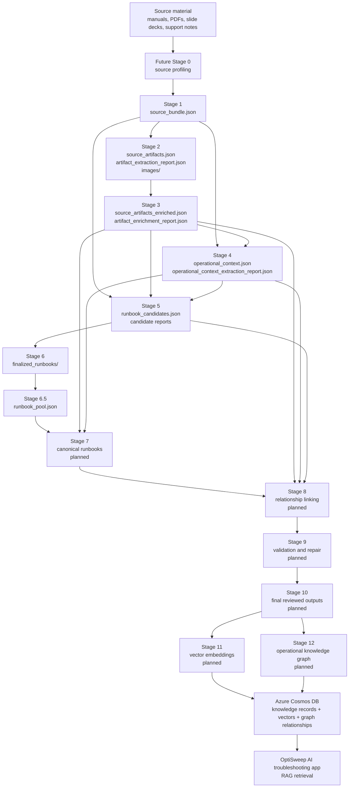

# OptiSweep Ingestion

`optisweep-ingestion` is the local ingestion workspace for turning OptiSweep operational source material into structured, traceable knowledge records.

The long-term goal is a repeatable LangGraph ingestion pipeline that product and operations teammates can use to add more OptiSweep operational knowledge without hand-building data records. The pipeline should produce reviewed JSON outputs locally first, then feed Azure Cosmos DB, vector search, and a future operational knowledge graph for retrieval-augmented generation (RAG) in the OptiSweep AI troubleshooting app.

## Why This Pipeline Exists

OptiSweep troubleshooting knowledge currently lives in manuals, figures, tables, screenshots, procedures, and engineering context. Those sources are useful to people, but they are not directly usable by a RAG assistant unless they are broken into reliable, source-linked records.

This project is building that bridge. Each ingestion stage keeps provenance back to the original source so product reviewers can answer:

- What source document did this knowledge come from?
- Which page, section, figure, table, or image supports it?
- Is this a stable operational fact, a visual artifact, or a possible procedure?
- Is it ready for retrieval, or does it need review before production use?

The first source is the OptiSweep Operation and Maintenance Manual, with the heartbeat diagnostic flow used as an early proof case.

## Pipeline At A Glance

The current pipeline is stage-based and writes local JSON files under `data/output/`. Some stages are deterministic, and some require Azure OpenAI through the project LLM client.

```text
Stage 1: Source bundle extraction
  -> Stage 2: Source artifact and image extraction
  -> Stage 3: Source artifact enrichment
  -> Stage 4: Operational context extraction
  -> Stage 5: Runbook candidate discovery
  -> Stage 6: Source runbook finalization
  -> Stage 6.5: Shared runbook pool generation
  -> Training video bundle generation: video + VTT normalization
  -> Stage 7: Canonical runbook drafting and merging
  -> Stage 8: Relationship linking
  -> Stage 9: Validation and repair
  -> Stage 10: Final output writing
  -> Stage 11: Vector embedding generation
  -> Stage 12: Operational knowledge graph generation
  -> Future: LangGraph orchestration and Cosmos DB publishing
  -> Future: RAG retrieval in the OptiSweep AI troubleshooting app
```

The intended production shape is one LangGraph pipeline with explicit nodes for source profiling, extraction, enrichment, validation, review, and publishing. The current scripts are the local, testable building blocks for those future graph nodes.

## Directed Stage Graph

This graph shows the intended direction of data flow. Stages 1 through 6.5 are implemented as local scripts today. Stages 7 through 12 and the production publishing path are planned next steps.



## Standard Paths

Examples below use the current manual output folder:

```text
data/input/manuals/OptiSweep Operation and Maintenance Manual - Final 1.pdf
data/output/manual_optisweep_om_v3/
```

Generated images are written inside the output folder, usually under:

```text
data/output/manual_optisweep_om_v3/stage_2_source_artifacts/images/
```

Stage outputs are grouped by stage number:

```text
data/output/manual_optisweep_om_v3/
  stage_1_source_bundle/
  stage_2_source_artifacts/
  stage_3_artifact_enrichment/
  stage_4_operational_context/
  stage_5_runbook_candidates/
  stage_6_finalized_runbooks/
  stage_6_5_runbook_pool/
  stage_10_final_outputs/
```

To run the implemented manual stages through one orchestrator, use:

```bash
python scripts/extract_operational_knowledge.py \
  --source-pdf "data/input/manuals/OptiSweep Operation and Maintenance Manual - Final 1.pdf" \
  --output-dir data/output/manual_optisweep_om_v3 \
  --stages 1,2
```

Stage modules and scripts follow the same stage numbering as output folders:

```text
src/optisweep_ingestion/
  stage1_source_bundle.py
  stage1_training_video_builder.py
  stage2_source_artifacts.py
  stage2_training_video_preparer.py
  stage3_artifact_enrichment.py
  stage4_operational_context.py
  stage5_runbook_candidates.py
  stage6_runbook_finalization.py
  stage6_5_runbook_pool.py
  stage7_runbook_drafter.py
  stage8_relationship_linking.py
  stage9_validation_repair.py
  stage10_report_writer.py
  tools/artifact_linker.py
  tools/pdf_parser.py
  tools/docx_parser.py
  tools/source_bundle_loader.py
scripts/
  stage1_extract_source_bundle.py
  stage1_build_training_video_bundle.py
  stage2_extract_source_artifacts.py
  stage2_prepare_training_video_for_extraction.py
  stage3_enrich_source_artifacts.py
  stage4_extract_operational_context.py
  stage4_repair_operational_context_sections.py
  stage4_rerun_artifact_link_enrichment.py
  stage4_report_image_link_metrics.py
  stage5_extract_runbook_candidates.py
  stage6_finalize_runbooks.py
  stage6_5_build_runbook_pool.py
  stage9_validate_output.py
  stage10_inspect_output.py
  stage10_migrate_source_lineage.py
  extract_operational_knowledge.py
```

## Stage 1: Source Bundle Extraction

Stage 1 reads the source PDF and creates the canonical text and reference bundle for downstream stages.

**Purpose**

Create a stable source inventory: document metadata, pages, detected sections, figure references, table references, and source identifiers. This is the foundation for traceability.

**Inputs**

```text
data/input/manuals/OptiSweep Operation and Maintenance Manual - Final 1.pdf
```

Optional CLI metadata can also be supplied, including source bundle ID, source document ID, source ID, source type, source title, source version, and ingestion batch ID.

**Outputs**

```text
data/output/manual_optisweep_om_v3/stage_1_source_bundle/source_bundle.json
```

`source_bundle.json` contains:

- source metadata and ingestion batch metadata
- page-level extracted text
- section records
- figure and table references
- stable source references used by later records

**Run**

```bash
python scripts/stage1_extract_source_bundle.py \
  --source-pdf "data/input/manuals/OptiSweep Operation and Maintenance Manual - Final 1.pdf" \
  --output-dir data/output/manual_optisweep_om_v3
```

Stage 1 is deterministic and does not call an LLM.

## Stage 2: Source Artifact And Image Extraction

Stage 2 reads the Stage 1 bundle and the original PDF, then extracts source artifacts such as figures and page-rendered fallback images.

**Purpose**

Capture visual and structural artifacts that are important for troubleshooting, including screenshots, diagrams, figures, and fallback page renders when an embedded image cannot be extracted cleanly.

**Inputs**

```text
data/output/manual_optisweep_om_v3/stage_1_source_bundle/source_bundle.json
data/input/manuals/OptiSweep Operation and Maintenance Manual - Final 1.pdf
```

**Outputs**

```text
data/output/manual_optisweep_om_v3/stage_2_source_artifacts/source_artifacts.json
data/output/manual_optisweep_om_v3/stage_2_source_artifacts/artifact_extraction_report.json
data/output/manual_optisweep_om_v3/stage_2_source_artifacts/images/
```

`source_artifacts.json` contains artifact records with IDs, source references, artifact type, page/figure linkage, image paths, extraction method, and review hints.

`artifact_extraction_report.json` summarizes extraction counts, saved images, missing figure images, warnings, and priority checks such as whether the heartbeat artifact was found.

**Run**

```bash
python scripts/stage2_extract_source_artifacts.py \
  --source-bundle data/output/manual_optisweep_om_v3/stage_1_source_bundle/source_bundle.json \
  --source-pdf "data/input/manuals/OptiSweep Operation and Maintenance Manual - Final 1.pdf" \
  --output-dir data/output/manual_optisweep_om_v3
```

Stage 2 is deterministic and does not call an LLM.

## Stage 3: Source Artifact Enrichment

Stage 3 uses Azure OpenAI to make source artifacts more useful for review and retrieval.

**Purpose**

Turn raw artifact records into retrieval-friendly records. For example, a raw image reference becomes an enriched artifact with a plain-language description, tags, what-to-look-at guidance, and text that can later be embedded or indexed.

**Inputs**

```text
data/output/manual_optisweep_om_v3/stage_2_source_artifacts/source_artifacts.json
data/output/manual_optisweep_om_v3/stage_2_source_artifacts/artifact_extraction_report.json
```

**Outputs**

```text
data/output/manual_optisweep_om_v3/stage_3_artifact_enrichment/source_artifacts_enriched.json
data/output/manual_optisweep_om_v3/stage_3_artifact_enrichment/artifact_enrichment_report.json
```

`source_artifacts_enriched.json` preserves the original artifact identity and source linkage while adding LLM-generated descriptions, retrieval text, tags, and reviewer-facing guidance.

`artifact_enrichment_report.json` records input counts, enriched counts, failures, warnings, and priority checks.

**Run**

```bash
python scripts/stage3_enrich_source_artifacts.py \
  --source-artifacts data/output/manual_optisweep_om_v3/stage_2_source_artifacts/source_artifacts.json \
  --artifact-report data/output/manual_optisweep_om_v3/stage_2_source_artifacts/artifact_extraction_report.json \
  --output-dir data/output/manual_optisweep_om_v3 \
  --llm
```

Stage 3 requires `--llm`.

## Stage 4: Operational Context Extraction

Stage 4 extracts reusable operational knowledge from the source bundle and enriched artifacts.

**Purpose**

Create retrieval-ready context records that explain systems, components, screens, metrics, alarms, statuses, constraints, and operating concepts. These records are meant to answer "what is this thing and how should support think about it?"

Stage 4 does not create runbooks, workflows, trigger rules, or final procedures.

**Inputs**

```text
data/output/manual_optisweep_om_v3/stage_1_source_bundle/source_bundle.json
data/output/manual_optisweep_om_v3/stage_3_artifact_enrichment/source_artifacts_enriched.json
```

**Outputs**

```text
data/output/manual_optisweep_om_v3/stage_4_operational_context/operational_context.json
data/output/manual_optisweep_om_v3/stage_4_operational_context/operational_context_extraction_report.json
```

`operational_context.json` contains context records with source references, related artifact references, normalized topic fields, retrieval text, and evidence links.

`operational_context_extraction_report.json` records context counts, failed packets, warnings, and priority coverage checks.

**Run**

```bash
python scripts/stage4_extract_operational_context.py \
  --source-bundle data/output/manual_optisweep_om_v3/stage_1_source_bundle/source_bundle.json \
  --source-artifacts data/output/manual_optisweep_om_v3/stage_3_artifact_enrichment/source_artifacts_enriched.json \
  --output-dir data/output/manual_optisweep_om_v3 \
  --llm
```

Stage 4 requires `--llm`.

## Stage 5: Runbook Candidate Discovery

Stage 5 identifies likely reusable troubleshooting or operational procedures.

**Purpose**

Create lightweight runbook candidate records for product review. A candidate is not an approved runbook. It is an evidence-linked suggestion that says, "this source material appears to describe a reusable procedure."

**Inputs**

```text
data/output/manual_optisweep_om_v3/stage_1_source_bundle/source_bundle.json
data/output/manual_optisweep_om_v3/stage_3_artifact_enrichment/source_artifacts_enriched.json
data/output/manual_optisweep_om_v3/stage_4_operational_context/operational_context.json
```

**Outputs**

```text
data/output/manual_optisweep_om_v3/stage_5_runbook_candidates/runbook_candidates.json
data/output/manual_optisweep_om_v3/stage_5_runbook_candidates/runbook_candidate_extraction_report.json
data/output/manual_optisweep_om_v3/stage_5_runbook_candidates/runbook_candidate_coverage_report.json
```

`runbook_candidates.json` contains candidate IDs, titles, likely procedure type, likely role, rough steps, source references, related context IDs, related artifact IDs, and review metadata.

`runbook_candidate_extraction_report.json` records failed packets, dropped candidates, deduplicated candidates, warnings, and extraction statistics.

`runbook_candidate_coverage_report.json` highlights source sections or priority areas that may still need candidate coverage.

**Run**

```bash
python scripts/stage5_extract_runbook_candidates.py \
  --source-bundle data/output/manual_optisweep_om_v3/stage_1_source_bundle/source_bundle.json \
  --source-artifacts data/output/manual_optisweep_om_v3/stage_3_artifact_enrichment/source_artifacts_enriched.json \
  --operational-context data/output/manual_optisweep_om_v3/stage_4_operational_context/operational_context.json \
  --output-dir data/output/manual_optisweep_om_v3 \
  --llm
```

Stage 5 requires `--llm`. Use `--backfill-missing-sections` only when conservative missing-section candidates are desired after the main LLM pass.

## Stage 6: Source Runbook Finalization

Stage 6 turns Stage 5 runbook candidates into finalized source runbooks.

**Purpose**

Draft one finalized runbook JSON per accepted candidate, grounded in source artifacts, operational context, and the source bundle.

**Inputs**

```text
data/output/manual_optisweep_om_v3/stage_5_runbook_candidates/runbook_candidates.json
data/output/manual_optisweep_om_v3/stage_3_artifact_enrichment/source_artifacts_enriched.json
data/output/manual_optisweep_om_v3/stage_4_operational_context/operational_context.json
data/output/manual_optisweep_om_v3/stage_1_source_bundle/source_bundle.json
```

**Outputs**

```text
data/output/manual_optisweep_om_v3/stage_6_finalized_runbooks/finalized_runbooks/<candidate_id>.json
data/output/manual_optisweep_om_v3/stage_6_finalized_runbooks/runbook_finalization_report.json
```

**Run**

```bash
python scripts/stage6_finalize_runbooks.py \
  --runbook-candidates data/output/manual_optisweep_om_v3/stage_5_runbook_candidates/runbook_candidates.json \
  --source-artifacts data/output/manual_optisweep_om_v3/stage_3_artifact_enrichment/source_artifacts_enriched.json \
  --operational-context data/output/manual_optisweep_om_v3/stage_4_operational_context/operational_context.json \
  --source-bundle data/output/manual_optisweep_om_v3/stage_1_source_bundle/source_bundle.json \
  --output-dir data/output/manual_optisweep_om_v3 \
  --llm
```

Stage 6 requires `--llm`.

## Stage 6.5: Shared Runbook Pool Generation

Stage 6.5 combines one or more runbook candidate files into a shared runbook pool.

**Purpose**

Prepare candidates for cross-source review by grouping and summarizing discovered procedure opportunities. This matters once OptiSweep knowledge comes from more than one manual, slide deck, support note, or product source.

**Inputs**

```text
data/output/manual_optisweep_om_v3/stage_5_runbook_candidates/runbook_candidates.json
```

The `--candidates` option can be repeated for multiple sources.

**Outputs**

```text
data/output/manual_optisweep_om_v3/stage_6_5_runbook_pool/candidate_pool.json
```

`candidate_pool.json` contains pooled candidates and generated cluster information for review.

**Run**

```bash
python scripts/stage6_5_build_runbook_pool.py \
  --candidates data/output/manual_optisweep_om_v3/stage_5_runbook_candidates/runbook_candidates.json \
  --output-dir data/output/manual_optisweep_om_v3
```

Stage 6.5 is deterministic and does not call an LLM.

## Training Video Bundle Generation

The v1 training video builder normalizes a screen-share training recording and external `.vtt` transcript into source artifacts and timestamped slide segment records. It does not directly create operational context records or runbook candidates.

**Purpose**

Capture the video timeline as source evidence. The builder detects slide intervals from cropped video frames, can use local Tesseract OCR to catch slide title/text changes, saves representative slide-frame artifacts, captures limited extra frames when visual content changes within an interval, parses VTT cues, and aligns transcript text to detected slide intervals.

**Inputs**

```text
data/input/videos/example.mp4
data/input/videos/example.vtt
```

**Outputs**

```text
data/output/training_video_example/stage_1_source_bundle/source_artifacts.json
data/output/training_video_example/stage_1_source_bundle/training_video_slide_segments.json
data/output/training_video_example/stage_1_source_bundle/training_video_ingestion_report.json
data/output/training_video_example/stage_1_source_bundle/images/
```

**Run**

```bash
python scripts/stage1_build_training_video_bundle.py \
  --source-video "data/input/videos/example.mp4" \
  --transcript-vtt "data/input/videos/example.vtt" \
  --output-dir data/output/training_video_example \
  --source-id training_video_example \
  --source-title "OptiSweep Training Video" \
  --crop-box "0,68,1676,1012" \
  --ocr-backend tesseract \
  --sample-ocr-interval-seconds 3 \
  --max-segment-seconds 120 \
  --write-segmentation-inspection
```

The default transcript alignment buffer is 1.5 seconds before each slide interval and 3.0 seconds after each slide interval. The builder preserves original VTT cue timestamps and labels each cue alignment as `exact_overlap`, `buffered_overlap`, or `nearest_slide`.

When `--ocr-backend tesseract` is used, local Tesseract must be available as `tesseract` on `PATH` or via `TESSERACT_CMD` / `--tesseract-command`. OCR text is stored with backend, confidence, timestamp, source image path, text hash, and detected title metadata. Use `--ocr-backend none` to disable OCR.

`--write-segmentation-inspection` also writes:

```text
data/output/training_video_example/stage_1_source_bundle/candidate_cuts.json
data/output/training_video_example/stage_1_source_bundle/segmentation_quality_report.json
data/output/training_video_example/stage_1_source_bundle/segmentation_contact_sheet.jpg
```

Use `--fail-on-low-quality-segmentation` when long or high cue-density segments should stop the run before Stage 4/5.

## Training Video Extraction Preparation

Training video bundle generation is followed by a deterministic preparation step that converts `training_video_slide_segments.json` into a source-bundle-compatible shape for the existing Stage 4 and Stage 5 extractors.

This keeps the semantic pipeline consistent: training videos do not get separate operational context or runbook-candidate extractors. They reuse the same Stage 4 and Stage 5 logic after source normalization.

**Inputs**

```text
data/output/training_video_example/stage_1_source_bundle/training_video_slide_segments.json
data/output/training_video_example/stage_1_source_bundle/source_artifacts.json
```

**Outputs**

```text
data/output/training_video_example/stage_2_source_artifacts/source_bundle.json
data/output/training_video_example/stage_2_source_artifacts/source_artifacts_enriched.json
data/output/training_video_example/stage_2_source_artifacts/training_video_preparation_report.json
```

**Run**

```bash
python scripts/stage2_prepare_training_video_for_extraction.py \
  --training-segments data/output/training_video_example/stage_1_source_bundle/training_video_slide_segments.json \
  --source-artifacts data/output/training_video_example/stage_1_source_bundle/source_artifacts.json \
  --output-dir data/output/training_video_example
```

After this preparation step, the same Stage 4 and Stage 5 commands can run against the training video output directory:

```bash
python scripts/stage4_extract_operational_context.py \
  --source-bundle data/output/training_video_example/stage_2_source_artifacts/source_bundle.json \
  --source-artifacts data/output/training_video_example/stage_2_source_artifacts/source_artifacts_enriched.json \
  --output-dir data/output/training_video_example \
  --llm

python scripts/stage5_extract_runbook_candidates.py \
  --source-bundle data/output/training_video_example/stage_2_source_artifacts/source_bundle.json \
  --source-artifacts data/output/training_video_example/stage_2_source_artifacts/source_artifacts_enriched.json \
  --operational-context data/output/training_video_example/stage_4_operational_context/operational_context.json \
  --output-dir data/output/training_video_example \
  --llm
```

## Stage 7: Canonical Runbook Drafting And Merging

Stage 7 is planned in [manual_ingestion_plan.md](cursorprompts/manual_ingestion_prompts/manual_ingestion_plan.md) as the point where source-specific runbook candidates become canonical runbooks.

**Purpose**

Create reusable runbooks from the candidate pool. Multiple source candidates may describe the same procedure, and the canonical runbook should merge evidence rather than treating one source as the owner.

Examples from the plan:

- a manual candidate named "Start Operator Station"
- a training slide candidate named "Operator Startup"
- an incident-derived candidate named "Restart Operator Station"

These may consolidate into one canonical procedure such as `proc_start_operator_station`.

**Inputs**

```text
data/output/manual_optisweep_om_v3/stage_6_5_runbook_pool/candidate_pool.json
data/output/manual_optisweep_om_v3/stage_3_artifact_enrichment/source_artifacts_enriched.json
data/output/manual_optisweep_om_v3/stage_4_operational_context/operational_context.json
```

In a multi-source run, this stage should also accept candidate pools from training slides, transcripts, incidents, SOPs, and SME-authored documentation.

**Planned outputs**

```text
data/output/manual_optisweep_om_v3/stage_7_canonical_runbooks/runbooks.json
data/output/manual_optisweep_om_v3/stage_7_canonical_runbooks/runbook_drafting_report.json
```

`runbooks.json` should contain canonical procedures with merged source references, supporting artifacts, related operational context, role, procedure type, steps, success criteria, escalation guidance, and review status.

Stage 7 should not create workflow branches, trigger conditions, routing logic, or ML labels.

## Stage 8: Relationship Linking

Stage 8 is planned in [manual_ingestion_plan.md](cursorprompts/manual_ingestion_prompts/manual_ingestion_plan.md) as the final linking point after artifacts, operational context, candidates, and runbooks exist.

**Purpose**

Populate relationships conservatively so product reviewers and the future troubleshooting app can move between visual evidence, operational explanations, and procedures.

**Inputs**

```text
data/output/manual_optisweep_om_v3/stage_3_artifact_enrichment/source_artifacts_enriched.json
data/output/manual_optisweep_om_v3/stage_4_operational_context/operational_context.json
data/output/manual_optisweep_om_v3/stage_5_runbook_candidates/runbook_candidates.json
data/output/manual_optisweep_om_v3/stage_7_canonical_runbooks/runbooks.json
```

**Planned outputs**

```text
data/output/manual_optisweep_om_v3/stage_8_relationship_linking/source_artifacts_linked.json
data/output/manual_optisweep_om_v3/stage_8_relationship_linking/operational_context_linked.json
data/output/manual_optisweep_om_v3/stage_8_relationship_linking/runbooks_linked.json
data/output/manual_optisweep_om_v3/stage_8_relationship_linking/relationship_linking_report.json
```

The plan says `linked_context_ids` and `linked_runbook_ids` should remain empty until this stage. Links should prefer shared section IDs, source references, artifact references, title similarity, and component or screen tags.

## Stage 9: Validation And Repair

Stage 9 is planned in [manual_ingestion_plan.md](cursorprompts/manual_ingestion_prompts/manual_ingestion_plan.md) as the quality gate before final outputs are written.

**Purpose**

Validate schema shape, references, allowed values, forbidden fields, image references, source references, and relationship integrity. LLM repair may be used only for formatting or wording issues, not for inventing missing facts.

**Inputs**

```text
data/output/manual_optisweep_om_v3/stage_8_relationship_linking/source_artifacts_linked.json
data/output/manual_optisweep_om_v3/stage_8_relationship_linking/operational_context_linked.json
data/output/manual_optisweep_om_v3/stage_8_relationship_linking/runbooks_linked.json
```

**Planned outputs**

```text
data/output/manual_optisweep_om_v3/stage_9_validation_repair/validation_report.json
data/output/manual_optisweep_om_v3/stage_9_validation_repair/repaired_records.json
```

Validation should confirm that no runbook contains workflow, routing, decision-tree, or ML-label fields, and that linked IDs only appear after the relationship linking stage.

## Stage 10: Final Output Writing

Stage 10 is planned in [manual_ingestion_plan.md](cursorprompts/manual_ingestion_prompts/manual_ingestion_plan.md) as the final local write step.

**Purpose**

Write reviewed local JSON outputs and a final extraction report. This keeps the ingestion layer inspectable before anything is published to production storage.

**Planned outputs**

```text
data/output/manual_optisweep_om_v3/stage_2_source_artifacts/source_artifacts.json
data/output/manual_optisweep_om_v3/manual_references.json
data/output/manual_optisweep_om_v3/stage_4_operational_context/operational_context.json
data/output/manual_optisweep_om_v3/stage_5_runbook_candidates/runbook_candidates.json
data/output/manual_optisweep_om_v3/stage_7_canonical_runbooks/runbooks.json
data/output/manual_optisweep_om_v3/stage_10_final_outputs/extraction_report.json
```

`extraction_report.json` should include counts, missing images, unresolved references, possible duplicates, conflicts, warnings, and validation errors that could not be repaired.

## Stage 11: Vector Embedding Generation

Stage 11 will create vector embeddings for retrieval-ready knowledge records.

**Purpose**

Convert reviewed text fields into embedding vectors that can support semantic search in the OptiSweep AI troubleshooting app. This stage is where local, source-linked records become queryable RAG retrieval units.

Stage 11 should embed the fields that best represent retrieval intent, not every raw source field. Likely embedding inputs include artifact retrieval text, operational context retrieval text, approved runbook summaries, runbook candidate summaries, candidate pool summaries, titles, tags, systems, components, and source metadata needed for filtering.

**Inputs**

```text
data/output/manual_optisweep_om_v3/stage_3_artifact_enrichment/source_artifacts_enriched.json
data/output/manual_optisweep_om_v3/stage_4_operational_context/operational_context.json
data/output/manual_optisweep_om_v3/stage_5_runbook_candidates/runbook_candidates.json
data/output/manual_optisweep_om_v3/stage_6_5_runbook_pool/candidate_pool.json
data/output/manual_optisweep_om_v3/stage_7_canonical_runbooks/runbooks.json
```

In the production pipeline, this stage should run after validation and product review so embeddings represent approved or reviewable knowledge, not discarded extraction noise.

**Planned outputs**

```text
data/output/manual_optisweep_om_v3/stage_11_embeddings/embedding_records.json
data/output/manual_optisweep_om_v3/stage_11_embeddings/embedding_generation_report.json
```

`embedding_records.json` should contain one record per retrievable knowledge unit, including:

- stable record ID
- source record type, such as artifact, operational context, runbook candidate, or approved runbook
- source record ID
- text that was embedded
- vector embedding
- embedding model name and version
- source references for citation and review
- filter metadata such as component, subsystem, procedure type, role, source document, and ingestion batch

`embedding_generation_report.json` should summarize generated vectors, skipped records, model configuration, validation findings, and any records that need review before publishing.

**Run**

```bash
# Planned; script not implemented yet.
python scripts/generate_embeddings.py \
  --source-artifacts data/output/manual_optisweep_om_v3/stage_3_artifact_enrichment/source_artifacts_enriched.json \
  --operational-context data/output/manual_optisweep_om_v3/stage_4_operational_context/operational_context.json \
  --runbook-candidates data/output/manual_optisweep_om_v3/stage_5_runbook_candidates/runbook_candidates.json \
  --candidate-pool data/output/manual_optisweep_om_v3/stage_6_5_runbook_pool/candidate_pool.json \
  --output-dir data/output/manual_optisweep_om_v3
```

Stage 11 will require an embedding model provider, likely Azure OpenAI in the production path.

## Stage 12: Operational Knowledge Graph Generation

Stage 12 will create a graph of operational entities and relationships found across the ingested knowledge.

**Purpose**

Make the operational information navigable by relationship, not only by semantic similarity. A knowledge graph can help the troubleshooting app understand how systems, components, alarms, metrics, screens, artifacts, operating states, and procedures relate to each other.

This should support questions like:

- Which components are associated with this alarm?
- Which procedures mention this screen or metric?
- Which artifacts explain this subsystem?
- Which operational contexts support this runbook candidate?
- What upstream or downstream concepts should be retrieved with this issue?

**Inputs**

```text
data/output/manual_optisweep_om_v3/stage_1_source_bundle/source_bundle.json
data/output/manual_optisweep_om_v3/stage_3_artifact_enrichment/source_artifacts_enriched.json
data/output/manual_optisweep_om_v3/stage_4_operational_context/operational_context.json
data/output/manual_optisweep_om_v3/stage_5_runbook_candidates/runbook_candidates.json
data/output/manual_optisweep_om_v3/stage_6_5_runbook_pool/candidate_pool.json
data/output/manual_optisweep_om_v3/stage_7_canonical_runbooks/runbooks.json
data/output/manual_optisweep_om_v3/stage_11_embeddings/embedding_records.json
```

The graph stage should rely on stable IDs and source references from earlier stages so graph edges can be reviewed and explained.

**Planned outputs**

```text
data/output/manual_optisweep_om_v3/stage_12_knowledge_graph/knowledge_graph.json
data/output/manual_optisweep_om_v3/stage_12_knowledge_graph/knowledge_graph_generation_report.json
```

`knowledge_graph.json` should contain graph nodes and edges, such as:

- nodes for systems, subsystems, components, screens, metrics, alarms, statuses, source artifacts, operational context records, runbook candidates, and approved runbooks
- edges such as `mentions`, `explains`, `depends_on`, `is_part_of`, `troubleshoots`, `uses_artifact`, `supports_context`, `has_metric`, and `has_alarm`
- source references for each edge so relationships remain auditable
- confidence or review status for LLM-inferred relationships

`knowledge_graph_generation_report.json` should summarize graph size, inferred relationships, deterministic relationships, dropped edges, low-confidence edges, and review needs.

**Run**

```bash
# Planned; script not implemented yet.
python scripts/build_knowledge_graph.py \
  --source-bundle data/output/manual_optisweep_om_v3/stage_1_source_bundle/source_bundle.json \
  --source-artifacts data/output/manual_optisweep_om_v3/stage_3_artifact_enrichment/source_artifacts_enriched.json \
  --operational-context data/output/manual_optisweep_om_v3/stage_4_operational_context/operational_context.json \
  --runbook-candidates data/output/manual_optisweep_om_v3/stage_5_runbook_candidates/runbook_candidates.json \
  --candidate-pool data/output/manual_optisweep_om_v3/stage_6_5_runbook_pool/candidate_pool.json \
  --embedding-records data/output/manual_optisweep_om_v3/stage_11_embeddings/embedding_records.json \
  --output-dir data/output/manual_optisweep_om_v3
```

Stage 12 may combine deterministic linking with LLM-assisted relationship extraction. Any inferred relationship should carry provenance and review metadata.

## Future Production Flow

The current local outputs are intended to become the reviewed source of truth for production publishing.

Future stages should:

- orchestrate the stage scripts as LangGraph nodes
- add source profiling so manuals, slide PDFs, native presentations, OCR-heavy files, and mixed source packages can route through the right extraction strategy
- add a video/source inspection node that can sample training video frames, parse external VTT transcripts, recommend a stable screen-share crop, estimate slide-change thresholds, flag whether OCR is recommended, and write a `source_profile.json` for downstream extractors
- let training video builders accept either an explicit crop box or a generated `source_profile.json`, so early deterministic runs can stay simple while the future LangGraph pipeline can add LLM or vision-assisted inspection when crop/layout confidence is low
- implement the remaining planned stages from [manual_ingestion_plan.md](cursorprompts/manual_ingestion_prompts/manual_ingestion_plan.md): canonical runbook drafting, relationship linking, validation and repair, and final output writing
- validate records before publishing
- support product team review and approval
- generate vector embeddings for retrieval-ready records
- generate an operational knowledge graph from reviewed records and relationships
- publish approved records, vectors, and graph relationships into Azure Cosmos DB
- support vector retrieval, graph-aware retrieval, and citation-backed answers in the OptiSweep AI troubleshooting app

Cosmos publishing is intentionally not the first step. The pipeline needs to make the knowledge repeatable, inspectable, and explainable before production storage is introduced.

## Docs Guide

`docs/data_contracts.md`

Defines the main planned record types at a conceptual level: source bundles, source artifacts, manual references, operational context, runbooks, embedding records, knowledge graph records, and extraction reports. Start here when you need to understand what kinds of JSON records the pipeline is trying to produce.

`docs/development_log.md`

Tracks what changed, what was added, and what decisions have been made. The README includes an auto-synced copy of this log at the bottom so newcomers can see the current project state quickly.

`docs/operational_knowledge_pipeline_architecture.md`

Captures architecture decisions for the broader operational knowledge pipeline. It explains why the future system should profile sources before extraction, treat PyMuPDF as one adapter rather than the whole architecture, handle PowerPoint-exported PDFs differently from manuals, and treat OCR as additive provenance rather than replacement text.

`cursorprompts/manual_ingestion_prompts/manual_ingestion_plan.md`

Contains the manual-specific stage plan used while building the current ingestion path. It is the detailed planning reference for the staged source extraction model: source bundle, artifacts, enrichment, operational context, runbook candidates, candidate pool, canonical runbook drafting, relationship linking, validation/repair, and final output writing.

## Project Layout

```text
.
  README.md
  pyproject.toml
  data/
    input/      source files provided by product or engineering
    output/     generated local JSON and image outputs
    processed/  optional intermediate files
    review/     reviewer-facing samples and validation outputs
  docs/         project decisions, contracts, and architecture notes
  scripts/      runnable stage entrypoints
  src/
    optisweep_ingestion/
      graph/    future LangGraph orchestration pieces
      prompts/  LLM prompts used by enrichment and extraction stages
      schemas/  Pydantic data contracts
      services/ shared clients and ID/reference helpers
      tools/    stage implementations
  tests/        unit tests for stage behavior and contracts
```

## Development Workflow

1. Add source files under `data/input/`.
2. Run stages locally and write outputs under `data/output/`.
3. Inspect extraction reports and review generated records before treating them as production-ready.
4. Update schemas, prompts, and tools as the source material reveals new cases.
5. Keep docs current so product teammates can understand what the pipeline expects and produces.
6. Only publish to production storage after records are validated and reviewable.

## README Update Hook

Run the README update hook after meaningful project changes:

```bash
python scripts/update_readme.py
```

The hook refreshes the marked development log section while preserving the rest of this README.

## Current Status

Stages 1 through 6 are implemented as local scripts. Stages 7 through 10 from [manual_ingestion_plan.md](cursorprompts/manual_ingestion_prompts/manual_ingestion_plan.md), Stage 11 vector embedding generation, Stage 12 operational knowledge graph generation, LangGraph orchestration, and Azure Cosmos DB publishing are the next production-shape milestones.

<!-- AUTO:DEVELOPMENT_LOG_START -->
# Development Log

## Unreleased

### Added
- Stage 1 source bundle extraction for the OptiSweep Operation and Maintenance Manual.
- Stage 2 source artifact and image extraction with artifact reports and priority figure checks.
- Stage 3 Azure AI Foundry source artifact enrichment with descriptions, tags, what-to-look-at guidance, and retrieval text.
- Stage 4 operational context extraction scaffolding for reusable context records.
- V1 training video bundle builder for video plus external VTT transcript inputs.
- Training video slide-segment normalization with cropped frame artifacts and timestamped transcript alignment.
- CLI entrypoint for building local training video source artifacts and slide segment records.

### Changed
- README current-stage guidance now reflects the implemented ingestion stages.

### Decisions
- Keep this repo focused on local ingestion and data quality before database writes.
- Use one future LangGraph pipeline with multiple stage nodes.
- Keep source artifact enrichment separate from operational context, runbooks, workflows, and relationship linking.
- Training video ingestion should normalize video evidence first; Stage 4 context extraction and Stage 5 runbook candidate discovery should run afterward through the main pipeline.
<!-- AUTO:DEVELOPMENT_LOG_END -->

