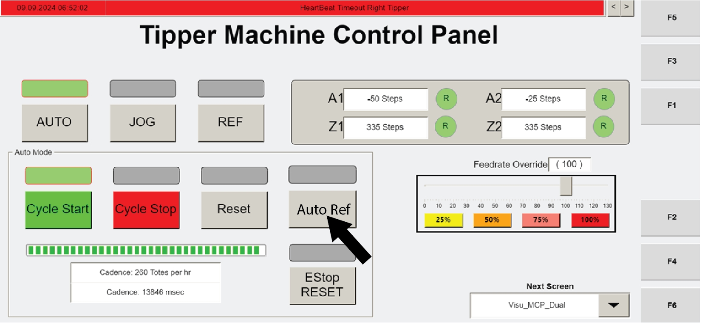

# Automatically reference all tipper axes

## Runbook Header

| Field | Value |
| --- | --- |
| Procedure ID | `proc_automatically_reference_all_tipper_axes_v1` |
| Title | Automatically reference all tipper axes |
| Procedure Type | `recovery` |
| Primary Role | `L1_support` |
| Supporting Roles | None |
| Support Safe | Yes |
| Validation Status | `needs_sme_review` |
| Merge Status | `source_finalized` |

## Summary

Use the operator HMI controls RESET, AUTO REF, AUTO, and CYCLE START to reference all tipper axes and return the tipper system to operation. Referencing is complete when the "R" icons turn green.

## When To Use

Use when tipper axes need to be referenced using the HMI and the system must be returned to operation. The source places this procedure in maintenance procedures and indicates completion by green "R" icons.

## Do Not Use For

* Do not restart operation until referencing is completed and the "R" icons are green.
* Not for cases where additional recovery is required after referencing fails to complete; the source does not provide further recovery steps.

## Safety And Operational Notes

* Do not proceed to restart operation until referencing is completed and the "R" icons are green.
* The source does not provide additional recovery steps if referencing does not complete.

## Access Or Tools Needed

* Access to the relevant HMI controls: RESET, AUTO REF, AUTO, and CYCLE START

## Related Operational Context

* ctx_manual_tipper_axis_homing_reference_v1
* ctx_manual_axis_reference_completion_status_v1

## Procedure Steps

### Step 1 — Press RESET

**Responsible role:** L1_support

**Instruction:**
On the relevant operator HMI, press RESET.

**Expected result:**
The system is reset and ready for the automatic reference action.

**Screens / Images:**

*Relevant operator station HMI screen used for axis referencing actions.*

*Operator station HMI context on page 103 where nearby text includes RESET and automatic referencing actions.*

**Stop or Escalate If:**

* RESET is not accepted on the HMI.
* The system does not proceed to allow automatic referencing.

---

### Step 2 — Start automatic reference for all tipper axes

**Responsible role:** L1_support

**Instruction:**
Press AUTO REF to reference all of the axes of the tippers.

**Expected result:**
Automatic referencing begins for all tipper axes.

**Screens / Images:**

*Operator station HMI used for referencing axes.*

*Startup/reference context showing AUTO REF used to home axes.*

**Stop or Escalate If:**

* AUTO REF does not initiate referencing.
* Axis reference motion does not begin as expected.

---

### Step 3 — Verify reference completion

**Responsible role:** L1_support

**Instruction:**
Verify that the "R" icons turn green to indicate referencing is completed.

**Expected result:**
The "R" icons are green, indicating referencing is complete.

**Screens / Images:**

*The HMI status area where the 'R' icons indicate reference completion.*

*Operator station HMI context associated with reference completion indication.*

**Stop or Escalate If:**

* The "R" icons do not turn green.
* Referencing does not complete.
* You cannot confirm reference completion on the HMI.

---

### Step 4 — Return the tipper to AUTO mode

**Responsible role:** L1_support

**Instruction:**
When referencing is completed, press AUTO.

**Expected result:**
The tipper is placed in AUTO mode.

**Screens / Images:**

*AUTO control on the operator station control panel.*

*AUTO control used to return the system to automatic operation.*

**Stop or Escalate If:**

* Referencing is not complete.
* The "R" icons are not green.
* AUTO mode cannot be selected.

---

### Step 5 — Restart operation with CYCLE START

**Responsible role:** L1_support

**Instruction:**
Press CYCLE START to restart operation.

**Expected result:**
Operation restarts.

**Screens / Images:**

*CYCLE START control on the operator station control panel.*

*CYCLE START control used to resume automatic operation.*

**Stop or Escalate If:**

* The "R" icons are not green before restart.
* AUTO mode is not active.
* Operation does not restart after CYCLE START is pressed.

---

## Success Criteria

* All tipper axes are referenced.
* The "R" icons are green.
* The system is returned to AUTO mode.
* Operation restarts after CYCLE START is pressed.

## Failure Conditions

* RESET is not accepted.
* AUTO REF does not start referencing.
* The "R" icons do not turn green.
* Referencing does not complete.
* AUTO mode cannot be selected after referencing.
* Operation does not restart after CYCLE START is pressed.

## Escalation Guidance

* Do not proceed to restart operation until referencing is completed and the "R" icons are green.
* If referencing does not complete, stop and escalate because the source does not provide additional recovery steps.

## Missing Details / Known Gaps

* The source packet does not provide the full page 103 procedure text beyond the candidate summary and related evidence.
* No estimated completion time is provided.
* No explicit production-stop or LOTO requirement is provided.
* No additional troubleshooting or alternate recovery steps are provided if automatic referencing fails.
* The packet does not explicitly identify the exact HMI screen name for this automatic reference procedure, though related page 103 artifacts reference operator station HMI context.

## Source Lineage

- Candidate IDs: auto_reference_tipper_axes
- Source ID: `manual_optisweep_om_v3`
- Source Type: `manual`
