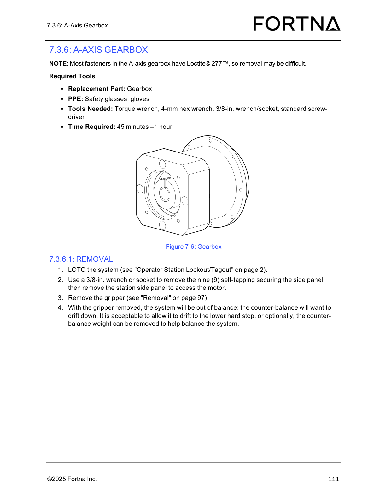
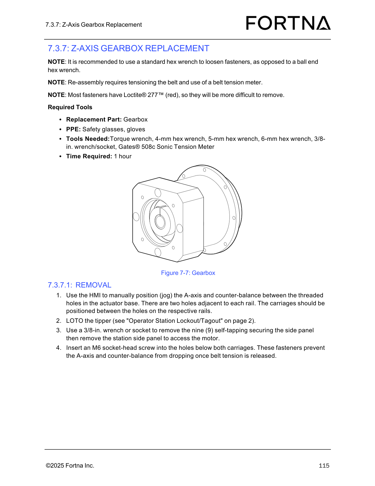

# Back up Teknic SD motor parameters before replacement

## Runbook Header

| Field | Value |
| --- | --- |
| Procedure ID | `proc_backup_teknic_sd_motor_parameters_before_replacement_v1` |
| Title | Back up Teknic SD motor parameters before replacement |
| Procedure Type | `operation` |
| Primary Role | `L2_support` |
| Supporting Roles | None |
| Support Safe | Yes |
| Validation Status | `needs_sme_review` |
| Merge Status | `source_finalized` |

## Summary

Use the Teknic manufacturer software to connect to a Teknic SD motor and save its custom parameters before motor or gearbox replacement work proceeds. The source identifies required tools, download selections, and the need to preserve parameters for Teknic SD motors used on the Z-axis and A-axis.

## When To Use

Use before replacing a Teknic SD motor, and when preparing for related gearbox replacement work involving Teknic SD motors on the Z-axis or A-axis where the motor's custom parameters must be preserved.

## Do Not Use For

* Do not use this runbook as a motor removal or installation procedure; the supplied source content does not provide those steps.
* Do not use this runbook when the task does not require saving Teknic SD motor custom parameters before replacement.

## Safety And Operational Notes

* Use caution when lifting because components may be heavy.
* Use safety glasses and gloves as listed in the source-backed tools and PPE.

## Access Or Tools Needed

* Replacement Part: Teknic SD Motor
* PPE: Safety glasses
* PPE: gloves
* Torque wrench
* 4-mm hex wrench
* 5-mm hex wrench
* 3/8-in. wrench/socket
* Laptop
* USB-A to micro-USB cable
* 25-V power supply
* 75-V power supply
* 4-pin Molex power supply connector
* 8-pin Molex communication cable
* Access to https://teknic.com/downloads/

## Procedure Steps

### Step 1 — Review lifting caution and prepare for handling

**Responsible role:** L2_support

**Instruction:**
Use caution when lifting because components may be heavy.

**Expected result:**
The technician is aware of the lifting hazard before proceeding.

**Stop or Escalate If:**

* Stop if the component cannot be handled safely.
* Escalate if safe handling of heavy components cannot be ensured.

---

### Step 2 — Gather required tools, PPE, and connection hardware

**Responsible role:** L2_support

**Instruction:**
Gather the listed items: replacement Teknic SD motor, safety glasses, gloves, torque wrench, 4-mm hex wrench, 5-mm hex wrench, 3/8-in. wrench/socket, laptop, USB-A to micro-USB cable, 25-V power supply, 75-V power supply, 4-pin Molex power supply connector, and 8-pin Molex communication cable.

**Expected result:**
All listed PPE, tools, and connection accessories are available before attempting to connect to the motor.

**Stop or Escalate If:**

* Stop if required PPE, tools, or cables are not available.
* Escalate if the required power supply or communication hardware needed to access the motor is unavailable.

---

### Step 3 — Identify the Teknic SD motor to be backed up

**Responsible role:** L2_support

**Instruction:**
Identify the Teknic SD motor to be worked on. The source notes the Z-axis and A-axis motors are mounted into gearboxes which may also be replaced.

**Expected result:**
The correct Teknic SD motor is identified for parameter backup.

**Screens / Images:**

*Use Figure 7-5 to identify the Teknic SD motor referenced by the procedure.*

*Use the gearbox figure as supporting context to distinguish the motor from the associated gearbox assembly.*

*Use the gearbox figure as supporting context where gearbox-associated work is involved.*

**Stop or Escalate If:**

* Stop if the correct Teknic SD motor cannot be identified.
* Escalate if it is unclear whether the work applies to the motor, the gearbox, or both.

---

### Step 4 — Connect the motor for software access

**Responsible role:** L2_support

**Instruction:**
Connect a cable to the motor so the motor can be accessed by the manufacturer application.

**Expected result:**
The motor is physically connected for access by the manufacturer application.

**Screens / Images:**

*Look for the motor USB access point or USB port cover referenced as the likely connection location for the laptop cable.*

**Stop or Escalate If:**

* Stop if the motor cannot be connected.
* Escalate if the manufacturer application cannot access the motor after connection.

---

### Step 5 — Download the Teknic manufacturer application

**Responsible role:** L2_support

**Instruction:**
Download the manufacturer application from https://teknic.com/downloads/.

**Expected result:**
The Teknic manufacturer application is available for use.

**Stop or Escalate If:**

* Stop if the Teknic software cannot be obtained from the specified site.
* Escalate if access to the download site is unavailable.

---

### Step 6 — Select the required software options

**Responsible role:** L2_support

**Instruction:**
In the download selections, choose "ClearPath," "SD" for the motor type, and "NEMA 23/34 IP53 Motor Body."

**Expected result:**
The software download is configured with the source-specified selections.

**Stop or Escalate If:**

* Stop if the specified selections cannot be made.
* Escalate if the available Teknic download options do not match the source.

---

### Step 7 — Run the application and save custom parameters

**Responsible role:** L2_support

**Instruction:**
Run the manufacturer application to save the motor's custom parameters.

**Expected result:**
The motor's custom parameters are saved before replacement work proceeds.

**Screens / Images:**

*Use the Teknic SD motor figure as confirmation of the motor type associated with the parameter save task.*

*Use the page 122 image as supporting context for the motor USB connection used during configuration transfer.*

**Stop or Escalate If:**

* Stop if the motor cannot be connected or its custom parameters cannot be saved using the manufacturer application.
* Escalate because the source indicates the parameters should be saved before replacement.

---

## Success Criteria

* The Teknic manufacturer application is obtained with the specified selections.
* The Teknic SD motor is connected and accessible to the manufacturer application.
* The motor's custom parameters are saved before replacement work proceeds.

## Failure Conditions

* The correct motor cannot be identified.
* Required tools, PPE, or connection hardware are missing.
* The motor cannot be connected to the manufacturer application.
* The Teknic software cannot be downloaded with the specified selections.
* The motor's custom parameters cannot be saved before replacement.

## Escalation Guidance

* Escalate if the motor cannot be connected or its custom parameters cannot be saved using the manufacturer application.
* Escalate if safe handling of heavy components cannot be ensured.
* Escalate if the available Teknic software selections do not match the source-backed selections.

## Missing Details / Known Gaps

* The supplied source packet does not provide explicit motor removal or installation steps.
* The supplied source packet does not provide a source-backed estimated time.
* The supplied source packet does not explicitly state whether production stop or LOTO is required for this parameter backup activity.
* The supplied source packet does not provide detailed connection sequencing for the listed 25-V and 75-V power supplies and Molex connectors.
* The supplied source packet does not include the full OCR text of the referenced sections.

## Source Lineage

- Candidate IDs: backup_teknic_sd_motor_parameters_before_replacement
- Source ID: `manual_optisweep_om_v3`
- Source Type: `manual`
