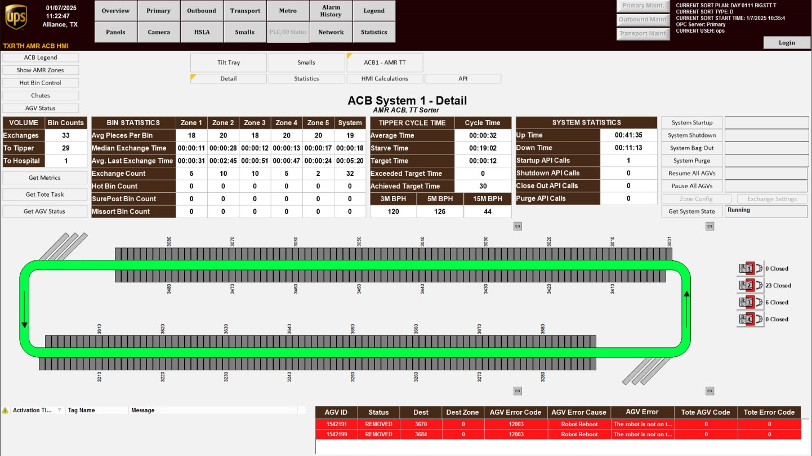

# Open the ACB System Overview Screen in the System HMI

## Runbook Header

| Field | Value |
| --- | --- |
| Procedure ID | `proc_open_acb_system_overview_screen_in_the_system_hmi_v1` |
| Title | Open the ACB System Overview Screen in the System HMI |
| Procedure Type | `operation` |
| Primary Role | `operator` |
| Supporting Roles | None |
| Support Safe | Yes |
| Validation Status | `needs_sme_review` |
| Merge Status | `source_finalized` |

## Summary

Navigate in the System HMI to the ACB System overview screen using the documented menu path: SMALLS > ACB > ACB1 - AMT TT.

## When To Use

Use this procedure when an operator needs to open the ACB System overview screen in the System HMI to view the tilt-tray system layout and color-coded status information.

## Access Or Tools Needed

* Access to the System HMI

## Related Operational Context

* ctx_manual_system_hmi_overview_screens_v1

## Procedure Steps

### Step 1 — Press SMALLS on the System HMI

**Responsible role:** operator

**Instruction:**
On the System HMI, press "SMALLS".

**Expected result:**
The HMI enters the SMALLS navigation context used to access the ACB menu path.

**Screens / Images:**

*Reference the SMALLS-related System HMI screen context.*

**Stop or Escalate If:**

* Stop if the documented menu options are not present.
* Escalate if the System HMI does not match the documented navigation path.

---

### Step 2 — Select ACB from the drop-down menu

**Responsible role:** operator

**Instruction:**
Select "ACB" from the drop-down menu.

**Expected result:**
The ACB option is selected from the available menu choices.

**Screens / Images:**

*Use the SMALLS-related HMI context while locating the drop-down menu path.*

**Stop or Escalate If:**

* Stop if the documented menu options are not present.
* Escalate if the System HMI does not match the documented navigation path.

---

### Step 3 — Select ACB1 - AMT TT

**Responsible role:** operator

**Instruction:**
Select "ACB1 - AMT TT" from the available options.

**Expected result:**
The HMI opens the ACB1 - AMT TT selection associated with the ACB System overview screen.

**Screens / Images:**

*Reference the ACB System overview screen associated with the ACB1 - AMT TT selection.*

**Stop or Escalate If:**

* Stop if the documented menu options are not present.
* Escalate if the System HMI does not match the documented navigation path.

---

### Step 4 — Verify the ACB System overview screen is displayed

**Responsible role:** operator

**Instruction:**
Verify that the ACB System overview screen is displayed.

**Expected result:**
The ACB System overview screen is open in the System HMI.

**Screens / Images:**

*Compare the displayed screen to the ACB System overview screen showing system status information.*

*Use the figure as a reference for the ACB System Overview interface.*

*Use the legend to interpret indicators shown on the ACB System overview display.*

**Stop or Escalate If:**

* Stop if the screen does not open as described.
* Escalate if the System HMI does not match the documented navigation path.

---

## Success Criteria

* The ACB System overview screen is open in the System HMI.
* The displayed screen matches the documented ACB System overview screen.
* The screen shows the tilt-tray system layout and color-coded status information.

## Failure Conditions

* The SMALLS option is not present or does not respond.
* The ACB drop-down option is not present.
* The ACB1 - AMT TT option is not available.
* The ACB System overview screen does not open as described.
* The System HMI does not match the documented navigation path.

## Escalation Guidance

* Stop if the documented menu options are not present or the screen does not open as described.
* Escalate if the System HMI does not match the documented navigation path.

## Missing Details / Known Gaps

* The source does not provide an estimated completion time.
* The source does not specify additional system preconditions beyond access to the System HMI.
* The source does not provide explicit do-not-use cases.
* The source does not define additional validation details beyond reaching and recognizing the screen.
* The source does not provide commands.

## Source Lineage

- Candidate IDs: candidate_access_acb_system_overview_screen
- Source ID: `manual_optisweep_om_v3`
- Source Type: `manual`
