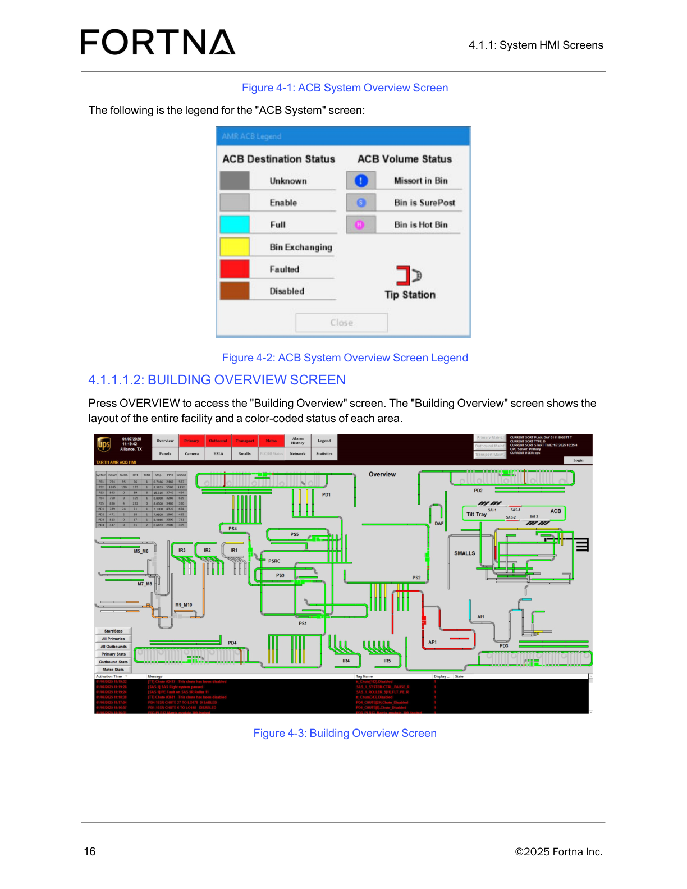
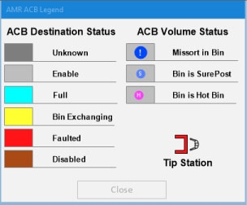

# Access the Building Overview Screen and View Area Status

## Runbook Header

| Field | Value |
| --- | --- |
| Procedure ID | `proc_access_the_building_overview_screen_and_view_area_status_v1` |
| Title | Access the Building Overview Screen and View Area Status |
| Procedure Type | `operation` |
| Primary Role | `operator` |
| Supporting Roles | None |
| Support Safe | Yes |
| Validation Status | `needs_sme_review` |
| Merge Status | `source_finalized` |

## Summary

Open the Building Overview HMI screen by pressing OVERVIEW, then use the screen to view the layout of the entire facility and the color-coded status of each area.

## When To Use

Use this procedure when an operator needs to access the Building Overview HMI screen to view the facility-wide layout and observe the color-coded status shown for each area.

## Do Not Use For

* Do not use this procedure to interpret the meaning of displayed colors unless a source-backed legend or status mapping is available.

## Safety And Operational Notes

* This procedure is documented as an HMI viewing/navigation action only.
* Do not assign meaning to the displayed colors unless a source-backed legend or status mapping is available.

## Access Or Tools Needed

* Access to the system HMI
* OVERVIEW navigation control
* Building Overview screen display

## Related Operational Context

* ctx_manual_building_overview_screen_v1

## Procedure Steps

### Step 1 — Press OVERVIEW from the HMI

**Responsible role:** operator

**Instruction:**
From the HMI, press OVERVIEW to access the "Building Overview" screen.

**Expected result:**
The system opens the Building Overview screen.

**Screens / Images:**

*Reference image of the Building Overview screen that is opened by pressing OVERVIEW.*

*Related HMI context from the same manual page where overview navigation is discussed.*

**Stop or Escalate If:**

* Escalate if the Building Overview screen cannot be accessed by pressing OVERVIEW.

---

### Step 2 — Confirm the Building Overview screen is displayed

**Responsible role:** operator

**Instruction:**
Confirm that the "Building Overview" screen is displayed.

**Expected result:**
The displayed screen is the Building Overview screen.

**Screens / Images:**

*Compare the displayed HMI to the Building Overview screen layout shown in Figure 4-3.*

**Stop or Escalate If:**

* Escalate if the expected Building Overview screen is not displayed after pressing OVERVIEW.

---

### Step 3 — View the facility layout

**Responsible role:** operator

**Instruction:**
View the layout of the entire facility shown on the screen.

**Expected result:**
The operator can see the facility-wide layout on the Building Overview screen.

**Screens / Images:**

*The facility layout presented on the Building Overview screen.*

**Stop or Escalate If:**

* Escalate if the Building Overview screen does not show the layout of the entire facility.

---

### Step 4 — Observe area color-coded status

**Responsible role:** operator

**Instruction:**
Observe the color-coded status shown for each area on the screen.

**Expected result:**
The operator can see a color-coded status for each area on the Building Overview screen.

**Screens / Images:**

*Area-level color-coded status indicators shown on the Building Overview screen.*

**Stop or Escalate If:**

* Escalate if area-level color-coded status is not visible on the Building Overview screen.
* Stop and do not assign meaning to the displayed colors unless a source-backed legend or status mapping is available.

---

## Success Criteria

* The Building Overview screen is displayed.
* The operator can see the layout of the entire facility.
* The operator can observe the color-coded status of each area.

## Failure Conditions

* The Building Overview screen cannot be accessed by pressing OVERVIEW.
* The expected Building Overview screen does not display.
* The facility layout is not visible on the screen.
* Area-level color-coded status is not visible on the screen.
* The source section does not provide a legend or status mapping for interpreting the displayed colors.

## Escalation Guidance

* Escalate if the Building Overview screen cannot be accessed by pressing OVERVIEW.
* Escalate if the expected Building Overview screen does not display or does not show the facility layout and area status.
* Do not interpret displayed colors beyond noting their presence unless a source-backed legend or status mapping is available.

## Missing Details / Known Gaps

* The source does not provide the meaning of the colors shown on the Building Overview screen in this section.
* The source does not provide an estimated completion time.
* The source does not specify whether production stop or LOTO is required.
* The source does not define additional supporting roles or approval requirements.

## Source Lineage

- Candidate IDs: candidate_access_building_overview_screen_and_view_area_status
- Source ID: `manual_optisweep_om_v3`
- Source Type: `manual`
