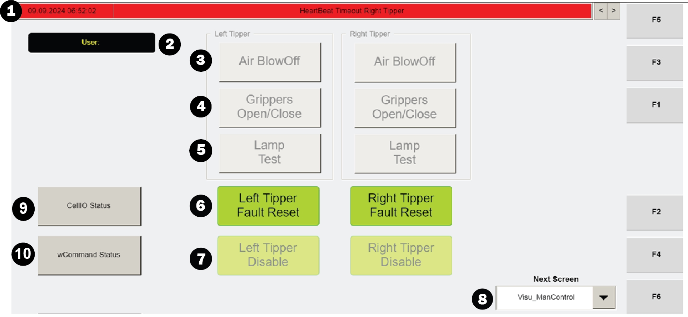

# Check Operator Station Fault Beacon To Identify A Tipper Fault

## Runbook Header

| Field | Value |
| --- | --- |
| Procedure ID | `proc_check_operator_station_fault_beacon_to_identify_a_tipper_fault_v1` |
| Title | Check Operator Station Fault Beacon To Identify A Tipper Fault |
| Procedure Type | `diagnostic` |
| Primary Role | `L1_support` |
| Supporting Roles | None |
| Support Safe | Yes |
| Validation Status | `needs_sme_review` |
| Merge Status | `source_finalized` |

## Summary

Use the documented operator station fault beacon as an indicator when investigating a tipper fault associated with AGVs being directed to the hospital.

## When To Use

Use when investigating the troubleshooting condition described in the source as too many AGVs being directed to the hospital and the listed cause is a tipper fault. The source directs the user to look for the fault beacon on the operator station as the indication to check.

## Do Not Use For

* Do not use this runbook as a complete tipper fault correction procedure because the supplied source section does not provide the corrective steps.
* Do not use this runbook to infer additional recovery actions, commands, or HMI operations not explicitly provided in the source.

## Safety And Operational Notes

* Use only the visual inspection and documentation actions supported by the source.
* Do not invent tipper fault correction steps because the source section only states to correct the fault and return the tipper to service without providing the corrective procedure.

## Access Or Tools Needed

* Access to the affected operator station
* Visual access to the operator station fault beacon

## Related Operational Context

* ctx_manual_hmi_fault_beacon_operator_station_v1

## Procedure Steps

### Step 1 — Go to the affected tipper operator station

**Responsible role:** L1_support

**Instruction:**
Go to the operator station for the affected tipper associated with the AGVs being directed to the hospital.

**Expected result:**
You are positioned at the affected tipper operator station.

**Screens / Images:**

*Use as a reference for operator station context while locating the affected tipper operator station.*

**Stop or Escalate If:**

* The affected tipper cannot be determined from the available troubleshooting context.
* The operator station cannot be accessed safely or its status cannot be inspected.

---

### Step 2 — Inspect the operator station fault beacon

**Responsible role:** L1_support

**Instruction:**
Look for the fault beacon on the operator station.

**Expected result:**
The beacon state is visually determined as present or not present.

**Screens / Images:**

*Use as the closest available operator station visual reference in the packet while inspecting the operator station area for the fault beacon.*

**Stop or Escalate If:**

* The beacon cannot be located on the operator station.
* The beacon state cannot be determined with confidence.

---

### Step 3 — Use the beacon as the documented tipper fault indication

**Responsible role:** L1_support

**Instruction:**
Use the presence of the fault beacon as the documented indication associated with the tipper fault in this troubleshooting scenario.

**Expected result:**
The inspection result is interpreted using the source-backed indicator only.

**Stop or Escalate If:**

* The beacon observation does not clearly support or rule out the documented tipper fault indication.
* Additional diagnosis would require unsupported assumptions beyond the supplied source.

---

### Step 4 — Document limits of the source and escalate corrective action as needed

**Responsible role:** L1_support

**Instruction:**
Record that the source directs the user to correct the fault and return the tipper to service, but do not invent additional corrective steps from this section. If correction cannot be performed from other approved source-backed procedures available to your team, escalate for further support.

**Expected result:**
The finding is documented and unsupported corrective actions are avoided.

**Stop or Escalate If:**

* The fault cannot be corrected from available source-backed procedures.
* The beacon state cannot be determined.
* Proceeding would require invented corrective steps not present in the supplied source.

---

## Success Criteria

* The user confirms whether the documented fault beacon indication is present at the operator station for the affected tipper.
* The inspection result is documented without adding unsupported corrective actions.

## Failure Conditions

* The affected operator station cannot be identified or accessed.
* The fault beacon cannot be located or its state cannot be determined.
* The fault cannot be corrected using available approved source-backed procedures.
* Additional action would require invented steps not present in the supplied source.

## Escalation Guidance

* Escalate for further support if the beacon state cannot be determined.
* Escalate if the fault cannot be corrected from available source-backed procedures.
* Do not invent tipper fault correction steps because the source does not provide them in this section.

## Missing Details / Known Gaps

* The supplied source section does not describe the exact physical location, color, or behavior of the fault beacon.
* The supplied source section does not provide the corrective procedure for the tipper fault.
* The supplied source section does not provide commands, HMI button sequences, or timing details for correction.
* No packet artifact explicitly shows the fault beacon itself; attached visuals are operator-station-related context only.

## Source Lineage

- Candidate IDs: candidate_check_operator_station_fault_beacon_for_tipper_fault
- Source ID: `manual_optisweep_om_v3`
- Source Type: `manual`
