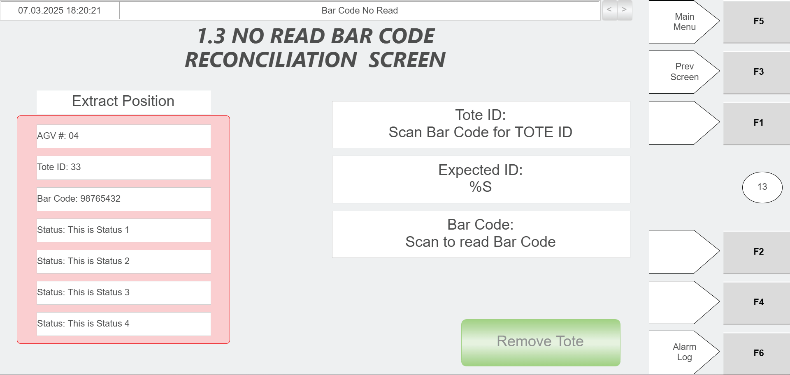
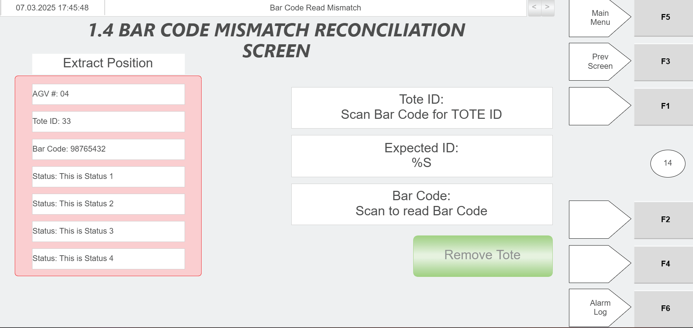

# Perform Daily Preventive Inspection Of Each Hospital Station

## Runbook Header

| Field | Value |
| --- | --- |
| Procedure ID | `proc_perform_daily_preventive_inspection_of_each_hospital_station_v1` |
| Title | Perform Daily Preventive Inspection Of Each Hospital Station |
| Procedure Type | `diagnostic` |
| Primary Role | `L2_support` |
| Supporting Roles | None |
| Support Safe | Yes |
| Validation Status | `needs_sme_review` |
| Merge Status | `source_finalized` |

## Summary

Inspect each hospital station as part of daily preventive maintenance to verify the barcode scanner is operational, the stacklight is operational, and the tabletop is free of debris.

## When To Use

Use during the documented daily preventive maintenance inspection for each hospital station.

## Do Not Use For

* Corrective repair of a failed barcode scanner
* Corrective repair of a failed stacklight
* Detailed scanner setup or replacement
* Any cleaning or corrective method not explicitly supported by the source

## Safety And Operational Notes

* This source provides inspection points only and does not provide corrective maintenance actions.
* Do not perform unsupported repair, setup, or adjustment actions based on this runbook alone.

## Access Or Tools Needed

* Physical access to each hospital station
* Visual access to the barcode scanner, stacklight, and tabletop

## Related Operational Context

* ctx_manual_daily_preventive_maintenance_overview_v1
* ctx_manual_hospital_station_scanner_reference_v1

## Procedure Steps

### Step 1 — Go to each hospital station

**Responsible role:** L2_support

**Instruction:**
Go to each hospital station and prepare to inspect the documented daily preventive maintenance items at that station.

**Expected result:**
The inspector is physically present at a hospital station and ready to verify the listed inspection points.

**Stop or Escalate If:**

* A hospital station cannot be accessed for inspection
* The inspection cannot be completed for every hospital station

---

### Step 2 — Verify barcode scanner is operational

**Responsible role:** L2_support

**Instruction:**
Verify that the barcode scanner at the hospital station is operational. Use only source-supported observation and context; the source does not define a detailed test method in this maintenance section.

**Expected result:**
The barcode scanner is confirmed operational for the hospital station.

**Screens / Images:**

*Barcode scan workflow context showing use of the green scanner and barcode/Tote ID population.*

*Hospital station barcode-related screen context for no-read conditions.*

*Hospital station barcode-related screen context for mismatch conditions.*

*Hospital station operation context describing scanning the tote barcode using the green scanner.*

**Stop or Escalate If:**

* The barcode scanner is not operational
* The barcode scanner operational state cannot be confirmed using source-supported inspection

---

### Step 3 — Verify stacklight is operational

**Responsible role:** L2_support

**Instruction:**
Verify that the stacklight at the hospital station is operational. The source identifies this as an inspection point but does not provide a detailed test method.

**Expected result:**
The stacklight is confirmed operational for the hospital station.

**Screens / Images:**

*Hospital HMI screen used when a tote bar code cannot be read at the Operator Station and must be handled manually at the Hospital Station.*

**Stop or Escalate If:**

* The stacklight is not operational
* The stacklight operational state cannot be confirmed using source-supported inspection

---

### Step 4 — Inspect tabletop for debris

**Responsible role:** L2_support

**Instruction:**
Inspect the tabletop and confirm it is free of debris.

**Expected result:**
The tabletop is confirmed free of debris.

**Stop or Escalate If:**

* The tabletop is not free of debris
* Debris cannot be cleared using source-approved methods

---

## Success Criteria

* Each hospital station has been inspected.
* Each hospital station barcode scanner is operational.
* Each hospital station stacklight is operational.
* Each hospital station tabletop is free of debris.

## Failure Conditions

* Any hospital station barcode scanner is not operational.
* Any hospital station stacklight is not operational.
* Any hospital station tabletop contains debris.
* Any hospital station cannot be inspected.

## Escalation Guidance

* Escalate if the barcode scanner is not operational.
* Escalate if the stacklight is not operational.
* Escalate if tabletop debris cannot be cleared using source-approved methods.
* Escalate when corrective action is required because this source provides inspection points only and does not provide corrective actions.

## Missing Details / Known Gaps

* The source does not define a detailed method to test barcode scanner operation during daily preventive maintenance.
* The source does not define a detailed method to test stacklight operation during daily preventive maintenance.
* The source does not provide corrective actions for failed inspection items.
* The source does not specify whether production stop or LOTO is required for this inspection.
* The source does not provide an estimated completion time.

## Source Lineage

- Candidate IDs: candidate_daily_inspect_hospital_station_condition_and_cleanliness
- Source ID: `manual_optisweep_om_v3`
- Source Type: `manual`
