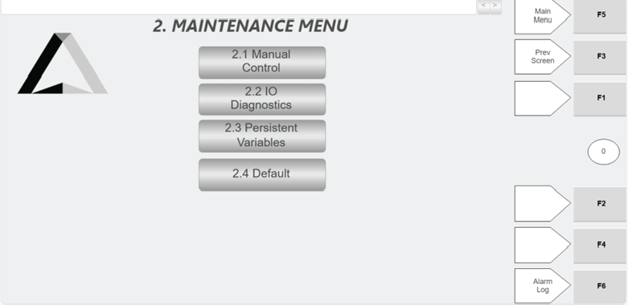

# Identify Available Buttons On The Hospital HMI Maintenance Menu

## Runbook Header

| Field | Value |
| --- | --- |
| Procedure ID | `proc_identify_available_buttons_on_the_hospital_hmi_maintenance_menu_v1` |
| Title | Identify Available Buttons On The Hospital HMI Maintenance Menu |
| Procedure Type | `reference` |
| Primary Role | `L1_support` |
| Supporting Roles | None |
| Support Safe | Yes |
| Validation Status | `needs_sme_review` |
| Merge Status | `source_finalized` |

## Summary

Use the Hospital HMI Maintenance Menu screen to identify the four available buttons and confirm which information areas are accessible from that menu.

## When To Use

Use when verifying the contents of the Hospital HMI Maintenance Menu screen or confirming which information areas are available from that menu.

## Do Not Use For

* Do not use this runbook to infer the function or behavior of any button beyond the source-stated access to information.
* Do not use this runbook as a procedure for operating the Manual Control, IO Diagnostics, Persistent Variables, or Default screens.

## Safety And Operational Notes

* This runbook is limited to identification and verification of menu entries only.
* Do not infer the function or behavior of any button beyond the source-stated access to information.

## Access Or Tools Needed

* Access to the Hospital HMI Maintenance Menu screen
* Figure 4-38 or equivalent documented Maintenance Menu reference

## Related Operational Context

* ctx_manual_hospital_hmi_maintenance_menu_v1
* ctx_manual_hospital_hmi_manual_control_entry_v1
* ctx_manual_hospital_hmi_io_diagnostics_entry_v1
* ctx_manual_hospital_hmi_persistent_variables_entry_v1
* ctx_manual_hospital_hmi_default_entry_v1

## Procedure Steps

### Step 1 — Open or view the Maintenance Menu screen

**Responsible role:** L1_support

**Instruction:**
Open or view the Hospital HMI Maintenance Menu screen.

**Expected result:**
The Hospital HMI Maintenance Menu screen is visible for review.

**Screens / Images:**

*Overall Maintenance Menu screen layout and available maintenance access buttons.*

**Stop or Escalate If:**

* The Maintenance Menu screen cannot be accessed for viewing.
* The visible screen does not appear to be the documented Maintenance Menu.

---

### Step 2 — Confirm the screen title and menu identity

**Responsible role:** L1_support

**Instruction:**
Confirm the screen is the "Maintenance Menu."

**Expected result:**
The displayed screen is identified as the Maintenance Menu.

**Screens / Images:**

*Screen title and overall layout corresponding to Figure 4-38.*

**Stop or Escalate If:**

* The displayed screen cannot be confirmed as the Maintenance Menu.
* The screen layout differs from the documented Maintenance Menu reference.

---

### Step 3 — Locate the four documented menu buttons

**Responsible role:** L1_support

**Instruction:**
Locate the four buttons shown on the menu: "2.1 Manual Control," "2.2 IO Diagnostics," "2.3 Persistent Variables," and "2.4 Default."

**Expected result:**
All four documented buttons are visible on the Maintenance Menu.

**Screens / Images:**

*The four Maintenance Menu buttons: 2.1 Manual Control, 2.2 IO Diagnostics, 2.3 Persistent Variables, and 2.4 Default.*

**Stop or Escalate If:**

* The visible Maintenance Menu does not show the four documented buttons.

---

### Step 4 — Compare the visible menu to the documented list

**Responsible role:** L1_support

**Instruction:**
Compare the visible buttons on the screen to the documented list of four Maintenance Menu entries.

**Expected result:**
The visible menu entries match the documented list of four buttons.

**Screens / Images:**

*Documented Maintenance Menu entries for one-to-one comparison with the live or viewed screen.*

**Stop or Escalate If:**

* The visible Maintenance Menu does not show the four documented buttons.
* Any discrepancy exists between the displayed menu and the documented list.

---

### Step 5 — Record the available information areas

**Responsible role:** L1_support

**Instruction:**
Record which of the documented information areas are available from the Maintenance Menu.

**Expected result:**
The available information areas are recorded as Manual Control, IO Diagnostics, Persistent Variables, and Default.

**Screens / Images:**

*The four documented Maintenance Menu entries to record as available information areas.*

**Stop or Escalate If:**

* The visible Maintenance Menu does not show the four documented buttons.
* The available information areas cannot be recorded exactly as documented.

---

## Success Criteria

* The Hospital HMI Maintenance Menu is identified correctly.
* The four documented buttons are confirmed as visible: 2.1 Manual Control, 2.2 IO Diagnostics, 2.3 Persistent Variables, and 2.4 Default.
* The available information areas are recorded exactly as documented by the source.

## Failure Conditions

* The Maintenance Menu screen cannot be confirmed.
* One or more of the four documented buttons are missing or do not match the source.
* The user attempts to infer button behavior beyond the source-supported description.

## Escalation Guidance

* Escalate if the visible Maintenance Menu does not show the four documented buttons.
* Escalate if the displayed screen cannot be matched to Figure 4-38.
* Do not infer the function or behavior of any button beyond the source-stated access to information.

## Missing Details / Known Gaps

* The source does not provide a time estimate for this verification.
* The source does not specify exact navigation steps to open the Maintenance Menu from another screen within this section.
* The source does not describe the detailed behavior of the Manual Control, IO Diagnostics, Persistent Variables, or Default buttons within the Maintenance Menu section.
* The source does not specify whether production stop or LOTO is required for this reference activity.

## Source Lineage

- Candidate IDs: candidate_hospital_hmi_identify_maintenance_menu_buttons
- Source ID: `manual_optisweep_om_v3`
- Source Type: `manual`
