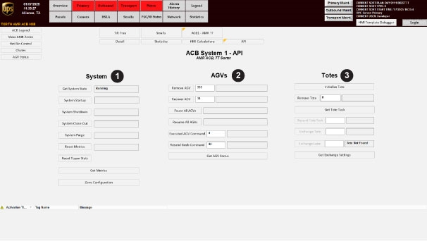
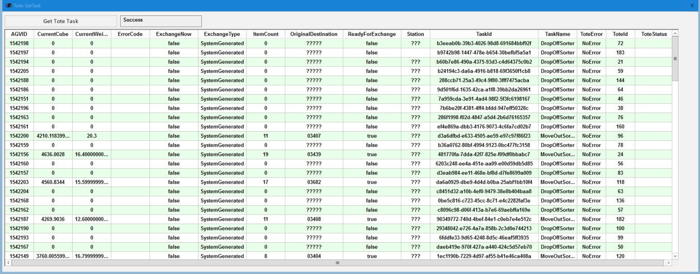
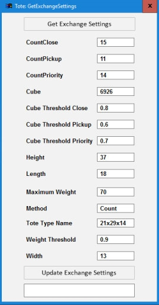

# Identify the OptiSweep System, AGV, and Tote Control Areas on the ACB API Screen

## Runbook Header

| Field | Value |
| --- | --- |
| Procedure ID | `proc_identify_control_domains_on_acb_api_screen_v1` |
| Title | Identify the OptiSweep System, AGV, and Tote Control Areas on the ACB API Screen |
| Procedure Type | `reference` |
| Primary Role | `operator` |
| Supporting Roles | None |
| Support Safe | Yes |
| Validation Status | `needs_sme_review` |
| Merge Status | `source_finalized` |

## Summary

Use the documented ACB API screen layout to identify which screen areas correspond to the OptiSweep system, AGVs, and totes before reviewing or performing actions on that screen.

## When To Use

Use this reference when navigating to the ACB API screen and confirming which numbered screen areas correspond to the OptiSweep system, AGVs, and totes.

## Do Not Use For

* Do not use this runbook to perform specific system, AGV, or tote control actions, because the source provided here only supports identification of the control domains on the ACB API screen.
* Do not use this runbook to interpret alternate or modified ACB API layouts not matching the documented three-domain screen.

## Safety And Operational Notes

* This runbook is a screen-identification reference only.
* If the displayed screen does not match the documented three-domain layout, stop and escalate because the source provides no alternate layout interpretation.

## Access Or Tools Needed

* Access to the System HMI
* ACB API screen
* Figure 4-8 or equivalent documented screen reference

## Related Operational Context

* ctx_manual_acb_api_screen_reference_v1
* ctx_manual_acb_api_control_domains_v1

## Procedure Steps

### Step 1 — Open the ACB API screen

**Responsible role:** operator

**Instruction:**
From the "ACB System" screen, press API to access the ACB API screen.

**Expected result:**
The ACB API screen is displayed.

**Screens / Images:**

*The ACB API interface used to control the OptiSweep system, AGVs, and totes.*

*The ACB System screen context from which the API button is accessed.*

**Stop or Escalate If:**

* The displayed screen does not match the documented ACB API screen layout.
* The API screen cannot be accessed from the "ACB System" screen.

---

### Step 2 — Locate the numbered control areas

**Responsible role:** operator

**Instruction:**
On the ACB API screen, locate the areas labeled as items (1), (2), and (3) using Figure 4-8 as the reference.

**Expected result:**
The three numbered screen areas are identified on the displayed ACB API screen.

**Screens / Images:**

*Figure 4-8 showing the labeled screen sections and numbered items (1), (2), and (3).*

**Stop or Escalate If:**

* The displayed screen does not show the documented three numbered control areas.
* The screen layout differs from Figure 4-8.

---

### Step 3 — Identify item (1) as the OptiSweep system control area

**Responsible role:** operator

**Instruction:**
Identify item (1) on the ACB API screen as the OptiSweep system control area.

**Expected result:**
Item (1) is recognized as the OptiSweep system control area.

**Screens / Images:**

*The numbered item (1) on the ACB API screen.*

*The system control area context associated with the System section of the API screen.*

**Stop or Escalate If:**

* Item (1) cannot be confidently matched to the OptiSweep system using the documented screen.

---

### Step 4 — Identify item (2) as the AGV control area

**Responsible role:** operator

**Instruction:**
Identify item (2) on the ACB API screen as the AGV control area.

**Expected result:**
Item (2) is recognized as the AGV control area.

**Screens / Images:**

*The numbered item (2) on the ACB API screen.*

*The AGV control area context associated with the AGV section of the API screen.*

**Stop or Escalate If:**

* Item (2) cannot be confidently matched to AGVs using the documented screen.

---

### Step 5 — Identify item (3) as the tote control area

**Responsible role:** operator

**Instruction:**
Identify item (3) on the ACB API screen as the tote control area.

**Expected result:**
Item (3) is recognized as the tote control area.

**Screens / Images:**

*The numbered item (3) on the ACB API screen.*

*Tote-related API context associated with the tote section of the API screen.*

*Additional tote control context related to tote exchange settings.*

**Stop or Escalate If:**

* Item (3) cannot be confidently matched to totes using the documented screen.

---

### Step 6 — Confirm the intended action matches the correct control domain

**Responsible role:** operator

**Instruction:**
Before proceeding with any review or control action, verify that the action you intend to review or perform is associated with the correct domain: OptiSweep system, AGVs, or totes.

**Expected result:**
The intended action is matched to the correct control domain on the ACB API screen.

**Screens / Images:**

*The three documented control domains on the ACB API screen.*

**Stop or Escalate If:**

* The displayed screen does not match the documented three-domain layout.
* The intended action cannot be associated with the correct domain using the source-provided screen reference.

---

## Success Criteria

* The ACB API screen is accessed from the "ACB System" screen.
* The user identifies the three documented control domains on the ACB API screen.
* Item (1) is identified as the OptiSweep system control area.
* Item (2) is identified as the AGV control area.
* Item (3) is identified as the tote control area.
* The intended review or action is confirmed against the correct domain before proceeding.

## Failure Conditions

* The displayed screen does not match the documented three-domain layout.
* The numbered areas cannot be located or interpreted from the displayed screen.
* The user cannot confidently determine whether an intended action belongs to the system, AGV, or tote domain.

## Escalation Guidance

* Escalate if the displayed screen does not match the documented three-domain layout, because the source provides no alternate layout interpretation.
* Escalate if the ACB API screen cannot be accessed from the "ACB System" screen using the documented API navigation.
* Escalate if the intended action cannot be associated with one of the three documented control domains using the source-provided reference.

## Missing Details / Known Gaps

* The source does not provide an estimated completion time.
* The source does not define specific controls or actions available within each domain in this section.
* The source does not specify alternate layouts, troubleshooting steps, or recovery actions if the screen differs from Figure 4-8.
* The source does not specify production stop or LOTO requirements for this reference activity.

## Source Lineage

- Candidate IDs: candidate_identify_control_domains_on_acb_api_screen
- Source ID: `manual_optisweep_om_v3`
- Source Type: `manual`
