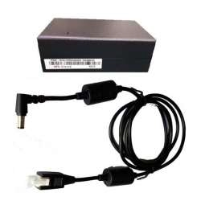
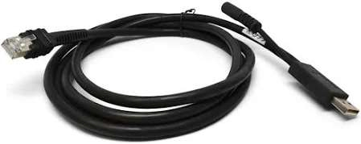
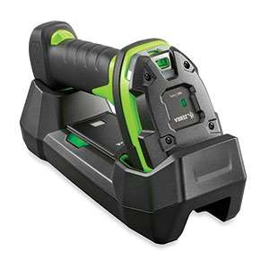

# Check Barcode Interface Connectivity Status and Calibrate the Scanner if Needed

## Runbook Header

| Field | Value |
| --- | --- |
| Procedure ID | `proc_check_barcode_interface_connectivity_status_and_calibrate_the_scanner_if_needed_v1` |
| Title | Check Barcode Interface Connectivity Status and Calibrate the Scanner if Needed |
| Procedure Type | `diagnostic` |
| Primary Role | `L1_support` |
| Supporting Roles | None |
| Support Safe | Yes |
| Validation Status | `needs_sme_review` |
| Merge Status | `source_finalized` |

## Summary

Use the Barcode Interface application on a Windows laptop to check the bottom-right connectivity indicator and perform the documented calibration action if the indicator is red.

## When To Use

Use this procedure when verifying scanner connectivity status in the Barcode Interface application during scanner setup or troubleshooting, and when the documented bottom-right connectivity indicator must be checked to determine whether calibration is needed.

## Do Not Use For

* Do not use this procedure to perform undocumented scanner configuration changes beyond the documented connectivity check and calibration action.
* Do not use this procedure when Barcode Interface cannot be launched or when the connectivity indicator is not visible; escalate instead.

## Safety And Operational Notes

* Follow only the documented Barcode Interface actions from the source.
* Do not add undocumented calibration steps; follow the onscreen instructions when calibration is required.

## Access Or Tools Needed

* Windows laptop with Barcode Interface.exe installed
* Access to the Barcode Interface application
* Scanner connected through the documented dock setup

## Related Operational Context

* ctx_manual_barcode_interface_connectivity_indicator_v1

## Procedure Steps

### Step 1 — Launch Barcode Interface

**Responsible role:** L1_support

**Instruction:**
Launch the Barcode Interface application on the laptop.

**Expected result:**
Barcode Interface opens and is available for connectivity inspection.

**Screens / Images:**

*Barcode Interface application context from the Scanner Setup section.*

*Scanner Setup procedure artifact accompanying Barcode Interface use.*

**Stop or Escalate If:**

* Barcode Interface application cannot be launched.

---

### Step 2 — Inspect the bottom-right connectivity indicator

**Responsible role:** L1_support

**Instruction:**
Look at the connectivity indicator at the bottom right of the screen.

**Expected result:**
The bottom-right connectivity indicator is visible for status evaluation.

**Screens / Images:**

*Barcode Interface screen context from the Scanner Setup section, specifically the bottom-right connectivity area if shown.*

*Scanner Setup visual context associated with the connectivity check.*

**Stop or Escalate If:**

* Connectivity indicator is not visible.

---

### Step 3 — Determine whether the indicator is green or red

**Responsible role:** L1_support

**Instruction:**
Identify whether the indicator is green or red using the documented status colors.

**Expected result:**
The connectivity state is identified as green or red.

**Screens / Images:**

*Connectivity indicator color state on the Barcode Interface screen if visible.*

---

### Step 4 — Calibrate the scanner if the indicator is red

**Responsible role:** L1_support

**Instruction:**
If the indicator is red, click "Calibrate Scanner" and follow the onscreen instructions.

**Expected result:**
The calibration process is started and completed by following the onscreen instructions.

**Screens / Images:**

*Barcode Interface procedure context related to the Calibrate Scanner action.*

*Scanner Setup visual context that may show or accompany the Calibrate Scanner control.*

**Stop or Escalate If:**

* Calibration cannot be started.
* Calibration instructions cannot be completed.
* Connectivity indicator remains red after following the onscreen calibration instructions.

---

### Step 5 — Recheck the connectivity indicator

**Responsible role:** L1_support

**Instruction:**
Recheck the connectivity indicator after the onscreen calibration process.

**Expected result:**
The connectivity indicator is reviewed again after calibration.

**Screens / Images:**

*Bottom-right connectivity indicator after calibration.*

**Stop or Escalate If:**

* Connectivity indicator remains red after following the onscreen calibration instructions.

---

## Success Criteria

* The Barcode Interface application is launched.
* The bottom-right connectivity indicator is visible and its state is determined.
* If the indicator is green, no calibration action is needed.
* If the indicator is red, the documented Calibrate Scanner action is performed and the indicator is rechecked.

## Failure Conditions

* Barcode Interface application cannot be launched.
* Connectivity indicator is not visible.
* Calibration cannot be started or completed using the onscreen instructions.
* Connectivity indicator remains red after following the onscreen calibration instructions.

## Escalation Guidance

* Escalate if the connectivity indicator remains red after following the onscreen calibration instructions.
* Escalate if the Barcode Interface application cannot be launched or the connectivity indicator is not visible.

## Missing Details / Known Gaps

* The source packet does not provide a direct screenshot explicitly confirming the exact appearance of the bottom-right connectivity indicator or the Calibrate Scanner control.
* The source does not provide a time estimate for this procedure.
* The source does not specify whether production stop or LOTO is required.
* The source does not provide detailed calibration substeps beyond following onscreen instructions.

## Source Lineage

- Candidate IDs: candidate_l1_check_barcode_interface_connectivity_and_calibrate_scanner
- Source ID: `manual_optisweep_om_v3`
- Source Type: `manual`
