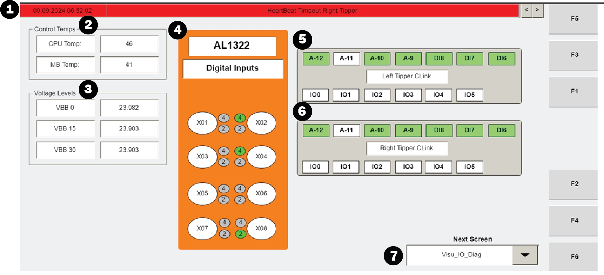

# Check Station Switch Input States On VISU_IO_DIAG Screen

## Runbook Header

| Field | Value |
| --- | --- |
| Procedure ID | `proc_check_station_switch_input_states_on_visu_io_diag_screen_v1` |
| Title | Check Station Switch Input States On VISU_IO_DIAG Screen |
| Procedure Type | `diagnostic` |
| Primary Role | `L1_support` |
| Supporting Roles | None |
| Support Safe | Yes |
| Validation Status | `needs_sme_review` |
| Merge Status | `source_finalized` |

## Summary

Use the read-only VISU_IO_DIAG screen on the Operator Station HMI to observe which station-related inputs are shown as on or off and, when needed, select an input section to open a window with more information about the inputs.

## When To Use

Use this procedure when troubleshooting from the Operator Station HMI and you need to inspect the station-mounted switch input states or view additional information about displayed inputs on the VISU_IO_DIAG screen.

## Do Not Use For

* Do not use this procedure to perform corrective actions, because the source only documents observation and information viewing on this screen.
* Do not use this procedure to infer undocumented meanings for on/off states beyond what the screen displays.

## Safety And Operational Notes

* VISU_IO_DIAG is a read-only screen and can be used for troubleshooting.
* Do not infer undocumented meanings for on/off states beyond what the screen displays.

## Access Or Tools Needed

* Access to the Operator Station HMI
* VISU_IO_DIAG screen

## Related Operational Context

* ctx_manual_visu_io_diag_screen_overview_v1
* ctx_manual_visu_io_diag_station_switch_inputs_v1

## Procedure Steps

### Step 1 — Open the VISU_IO_DIAG screen

**Responsible role:** L1_support

**Instruction:**
Open the VISU_IO_DIAG screen on the Operator Station HMI.

**Expected result:**
The VISU_IO_DIAG screen is displayed and available for read-only troubleshooting use.

**Screens / Images:**

*Read-only HMI diagnostics screen for viewing operator station I/O status, alarms, temperatures, and voltage levels.*

**Stop or Escalate If:**

* Escalate if the VISU_IO_DIAG screen cannot be accessed.

---

### Step 2 — Locate the station switch input section

**Responsible role:** L1_support

**Instruction:**
Locate the section on VISU_IO_DIAG that corresponds to the switch mounted on the station.

**Expected result:**
The station switch section is identified on the screen.

**Screens / Images:**

*VISU_IO_DIAG screen area corresponding to the station-mounted switch inputs.*

**Stop or Escalate If:**

* Escalate if the station switch section cannot be identified on VISU_IO_DIAG.

---

### Step 3 — Observe displayed input on/off states

**Responsible role:** L1_support

**Instruction:**
Observe which inputs in the station switch section are shown as on and which are shown as off.

**Expected result:**
The displayed on/off state of the station-related inputs is identified.

**Screens / Images:**

*The station switch section that conveys which inputs are on and off.*

**Stop or Escalate If:**

* Escalate if the displayed input states cannot be read from the screen.
* Stop if interpretation would require assumptions not documented by the source.

---

### Step 4 — Locate the input sections

**Responsible role:** L1_support

**Instruction:**
Locate the input sections shown on the VISU_IO_DIAG screen.

**Expected result:**
The input sections are identified and available for selection.

**Screens / Images:**

*Read-only HMI diagnostics screen area showing the selectable input sections.*

**Stop or Escalate If:**

* Escalate if the input sections described by the source are not present.

---

### Step 5 — Open an input information window

**Responsible role:** L1_support

**Instruction:**
Select one of the input sections to open the window that provides more information on what the inputs are.

**Expected result:**
A window opens with more information about the selected inputs.

**Screens / Images:**

*Selectable input sections on VISU_IO_DIAG that can be used to open more detailed input information.*

**Stop or Escalate If:**

* Escalate if the input sections do not open the additional information window as described.

---

### Step 6 — Record displayed states and input details

**Responsible role:** L1_support

**Instruction:**
Record the observed on/off states and any additional input information displayed.

**Expected result:**
The displayed input states and any additional input details are documented.

**Stop or Escalate If:**

* Stop if documenting the result would require inferring meanings not shown by the screen.

---

## Success Criteria

* The VISU_IO_DIAG screen is opened on the Operator Station HMI.
* The section corresponding to the station-mounted switch is identified.
* Displayed station input states are observed as on or off.
* At least one input section can be selected to open additional input information when needed.
* Observed states and any displayed input details are recorded.

## Failure Conditions

* VISU_IO_DIAG cannot be accessed.
* The station switch section or input sections cannot be identified.
* Displayed input states cannot be read.
* Selecting an input section does not open the additional information window.

## Escalation Guidance

* Escalate if the input sections do not open the additional information window as described.
* Escalate if the VISU_IO_DIAG screen or required sections cannot be accessed or identified.
* Do not infer undocumented meanings for on/off states beyond what the screen displays.

## Missing Details / Known Gaps

* The source packet does not provide navigation steps for reaching VISU_IO_DIAG from another screen.
* The source does not define the meaning of specific on/off input states.
* The source does not provide corrective actions based on observed input states.
* The source does not provide an estimated completion time.
* The source does not specify whether production stop or LOTO is required.

## Source Lineage

- Candidate IDs: candidate_l1_check_visu_io_diag_station_inputs
- Source ID: `manual_optisweep_om_v3`
- Source Type: `manual`
