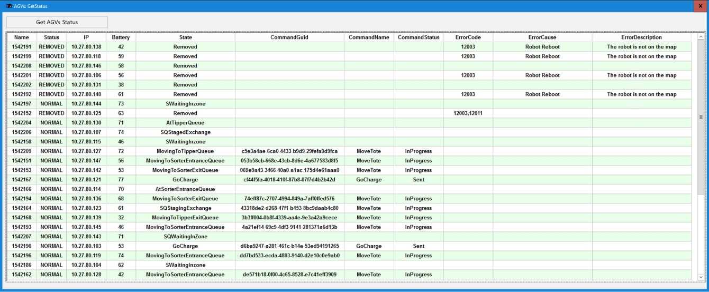

# View AGV Status Details Using The Get AGV Status Pop-Up

## Runbook Header

| Field | Value |
| --- | --- |
| Procedure ID | `proc_view_agv_status_details_using_the_get_agv_status_pop_up_v1` |
| Title | View AGV Status Details Using The Get AGV Status Pop-Up |
| Procedure Type | `diagnostic` |
| Primary Role | `L1_support` |
| Supporting Roles | None |
| Support Safe | Yes |
| Validation Status | `needs_sme_review` |
| Merge Status | `source_finalized` |

## Summary

Open the Get AGV Status pop-up from the AGV API Controls area of the System HMI and review the per-AGV details shown there, including battery status, command status, error codes, and AGV state.

## When To Use

Use this procedure when you need to view AGV status details from the System HMI API screen and confirm what battery status, command status, error codes, and AGV state are currently displayed for each AGV.

## Do Not Use For

* Do not use this procedure to interpret whether displayed AGV values are normal or abnormal, because the source does not define acceptable ranges or expected values for the displayed fields.
* Do not use this procedure to change AGV state or perform AGV recovery actions.

## Safety And Operational Notes

* This source-supported procedure is a status-viewing activity only.
* The source does not define normal versus abnormal values for battery status, command status, error codes, or AGV state.

## Access Or Tools Needed

* Access to the System HMI API screen
* AGVs section of the API screen
* GET AGV STATUS function

## Related Operational Context

* ctx_manual_tote_api_controls_overview_v1
* ctx_manual_get_agv_status_popup_v1
* ctx_manual_agv_status_metrics_v1

## Procedure Steps

### Step 1 — Open the AGVs section of the API screen

**Responsible role:** L1_support

**Instruction:**
Open the AGVs section of the API screen in the System HMI.

**Expected result:**
The AGV API Controls area is visible and the GET AGV STATUS option is available.

**Screens / Images:**

*The AGV API Controls area and the location of the GET AGV STATUS option.*

*The API screen used to access AGV controls.*

**Stop or Escalate If:**

* Stop or escalate if the AGVs section of the API screen cannot be opened.
* Stop or escalate if the GET AGV STATUS option is not available.

---

### Step 2 — Click GET AGV STATUS

**Responsible role:** L1_support

**Instruction:**
Click GET AGV STATUS in the AGV API Controls area to open the status pop-up screen.

**Expected result:**
The Get AGV Status pop-up opens.

**Screens / Images:**

*The GET AGV STATUS control in the AGV API Controls area.*

*The pop-up screen that should appear after clicking GET AGV STATUS.*

**Stop or Escalate If:**

* Stop or escalate if the GET AGV STATUS pop-up does not open.

---

### Step 3 — Inspect the AGV details shown in the pop-up

**Responsible role:** L1_support

**Instruction:**
In the pop-up, inspect the details shown for each AGV.

**Expected result:**
The pop-up displays the documented AGV detail fields for each AGV.

**Screens / Images:**

*The fields shown for each AGV in the Get AGV Status pop-up.*

**Stop or Escalate If:**

* Stop or escalate if the expected AGV details are not displayed.

---

### Step 4 — Check battery status for each AGV

**Responsible role:** L1_support

**Instruction:**
Check the battery status shown for each AGV.

**Expected result:**
Battery status is visible for each AGV listed in the pop-up.

**Screens / Images:**

*The battery status field for each AGV.*

**Stop or Escalate If:**

* Stop or escalate if battery status is not displayed for one or more AGVs.
* Stop or escalate if the source-required AGV details are incomplete.

---

### Step 5 — Check command status for each AGV

**Responsible role:** L1_support

**Instruction:**
Check the command status shown for each AGV.

**Expected result:**
Command status is visible for each AGV listed in the pop-up.

**Screens / Images:**

*The command status field for each AGV.*

**Stop or Escalate If:**

* Stop or escalate if command status is not displayed for one or more AGVs.
* Stop or escalate if the source-required AGV details are incomplete.

---

### Step 6 — Check error codes for each AGV

**Responsible role:** L1_support

**Instruction:**
Check any error codes shown for each AGV.

**Expected result:**
Error code information is visible for each AGV listed in the pop-up.

**Screens / Images:**

*The error code field for each AGV.*

**Stop or Escalate If:**

* Stop or escalate if error code information is not displayed for one or more AGVs.
* Stop or escalate if the source-required AGV details are incomplete.

---

### Step 7 — Check AGV state for each AGV

**Responsible role:** L1_support

**Instruction:**
Check the state shown for each AGV.

**Expected result:**
AGV state is visible for each AGV listed in the pop-up.

**Screens / Images:**

*The AGV state field for each AGV.*

**Stop or Escalate If:**

* Stop or escalate if AGV state is not displayed for one or more AGVs.
* Stop or escalate if the source-required AGV details are incomplete.

---

## Success Criteria

* The Get AGV Status pop-up opens from the AGV API Controls area.
* The pop-up displays per-AGV battery status, command status, error codes, and AGV state for review.

## Failure Conditions

* The GET AGV STATUS pop-up does not open.
* The expected AGV details are not displayed.
* One or more of the documented fields—battery status, command status, error codes, or AGV state—are missing.

## Escalation Guidance

* Escalate if the GET AGV STATUS pop-up does not open.
* Escalate if the expected AGV details are not displayed.
* Escalate to a higher support level or SME if interpretation of displayed values is required, because the source does not define normal versus abnormal values for the displayed fields.

## Missing Details / Known Gaps

* The source does not define normal versus abnormal values for battery status, command status, error codes, or AGV state.
* The source does not provide estimated completion time.
* The source does not specify whether production stop or LOTO is required.
* The source does not provide commands, thresholds, or interpretation guidance for the displayed AGV fields.

## Source Lineage

- Candidate IDs: candidate_l1_get_agv_status_details_from_popup
- Source ID: `manual_optisweep_om_v3`
- Source Type: `manual`
