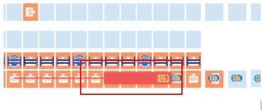

# Identify Whether an AGV Fault Matches the Documented Bump Fault Exception Codes

## Runbook Header

| Field | Value |
| --- | --- |
| Procedure ID | `proc_identify_whether_an_agv_fault_matches_the_documented_bump_fault_exception_codes_v1` |
| Title | Identify Whether an AGV Fault Matches the Documented Bump Fault Exception Codes |
| Procedure Type | `reference` |
| Primary Role | `L1_support` |
| Supporting Roles | None |
| Support Safe | Yes |
| Validation Status | `needs_sme_review` |
| Merge Status | `source_finalized` |

## Summary

Use the documented AGV Bump fault screen and exception code table to determine whether a reported AGV fault matches the source-defined Bump fault conditions. A match is supported only when the reported exception code is 21057 or 21060 and the displayed exception information aligns with the documented meaning for that code.

## When To Use

Use when reviewing AGV fault information to determine whether the reported fault corresponds to the documented Bump fault category in the manual.

## Do Not Use For

* Do not use to interpret AGV exception codes other than 21057 or 21060.
* Do not use to infer additional meanings for codes or descriptions not listed in the source.

## Safety And Operational Notes

* This runbook is a reference check only and does not authorize recovery actions beyond identifying whether the fault matches the documented Bump fault entries.
* Do not infer additional meanings for codes not listed in the source.

## Access Or Tools Needed

* Access to AGV fault information
* Documented exception code table for Bump faults

## Related Operational Context

* ctx_manual_bump_exception_codes_v1
* ctx_manual_agv_bump_fault_screen_v1

## Procedure Steps

### Step 1 — Open the AGV fault information

**Responsible role:** L1_support

**Instruction:**
Open the AGV fault information and locate the reported exception code and exception information on the AGV "Bump" fault screen.

**Expected result:**
The reported exception code and exception information are visible for review.

**Screens / Images:**

*Look for the AGV "Bump" fault interface and the displayed exception code and exception information.*

**Stop or Escalate If:**

* Escalate if the observed exception code or description cannot be located in the AGV fault information.

---

### Step 2 — Check the exception code

**Responsible role:** L1_support

**Instruction:**
Check whether the reported exception code is 21057 or 21060.

**Expected result:**
The reported exception code is identified as either matching or not matching one of the documented Bump fault codes.

**Screens / Images:**

*Look at the exception code shown on the AGV Bump fault screen.*

**Stop or Escalate If:**

* Escalate if the observed exception code does not match 21057 or 21060.

---

### Step 3 — Compare the exception information to the documented meanings

**Responsible role:** L1_support

**Instruction:**
Compare the displayed exception information to the documented meanings: 21057 is "Robot front collision bar triggers" and 21060 is "The robot triggers the obstacle avoidance."

**Expected result:**
The displayed exception information is confirmed as aligned or not aligned with the documented meaning for the reported code.

**Screens / Images:**

*Look at the exception information shown on the AGV Bump fault screen and compare it to the documented table entries.*

**Stop or Escalate If:**

* Escalate if the observed exception description does not match the documented meaning for the reported code.
* Escalate if the code and description do not align with the documented Bump fault entries.

---

### Step 4 — Record whether the fault matches the documented Bump fault

**Responsible role:** L1_support

**Instruction:**
Record that the fault matches the documented Bump fault only if the code and description align with the source table.

**Expected result:**
A documented determination is made that the fault either matches or does not match the source-defined Bump fault entries.

**Stop or Escalate If:**

* Escalate if the observed exception code or description does not match the documented Bump fault entries.
* Stop and do not infer additional meanings for codes not listed in the source.

---

## Success Criteria

* The reported AGV exception code has been checked against the documented Bump fault codes.
* The displayed exception information has been compared to the documented meaning for the reported code.
* A determination has been recorded using only the documented source table entries.

## Failure Conditions

* The exception code is not 21057 or 21060.
* The displayed exception information does not align with the documented meaning for the reported code.
* The AGV fault information does not provide enough detail to verify both code and description.

## Escalation Guidance

* Escalate if the observed exception code or description does not match the documented Bump fault entries.
* Escalate if the exception code or exception information cannot be verified from the available AGV fault information.
* Do not infer additional meanings for codes not listed in the source.

## Missing Details / Known Gaps

* The source packet does not provide a time estimate for completing this reference check.
* The source does not specify whether production stop or LOTO is required for this identification-only procedure.
* The source does not provide explicit role boundaries beyond the candidate's likely role requirement.
* The source packet does not provide exact field labels visible on Figure 5-2 beyond the figure title and related retrieval text.

## Source Lineage

- Candidate IDs: candidate_l1_identify_agv_bump_fault_from_exception_code
- Source ID: `manual_optisweep_om_v3`
- Source Type: `manual`
