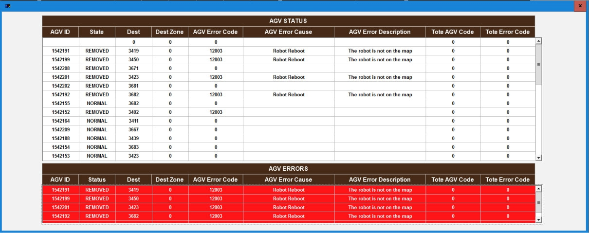

# Use the AGV Status Screen to Identify Current AGV Location and Presence of Error Codes

## Runbook Header

| Field | Value |
| --- | --- |
| Procedure ID | `proc_use_the_agv_status_screen_to_identify_current_agv_location_and_presence_of_error_codes_v1` |
| Title | Use the AGV Status Screen to Identify Current AGV Location and Presence of Error Codes |
| Procedure Type | `reference` |
| Primary Role | `L1_support` |
| Supporting Roles | None |
| Support Safe | Yes |
| Validation Status | `needs_sme_review` |
| Merge Status | `source_finalized` |

## Summary

Use the documented AGV Status HMI screen as a reference to view AGV location information and determine whether any current AGV error codes are displayed.

## When To Use

Use when a user needs to access the AGV Status screen and verify what AGV location information is shown and whether current AGV error codes are displayed.

## Do Not Use For

* Do not use this runbook to interpret the meaning of AGV error codes, because this source only states that current error codes are shown.
* Do not use this runbook for AGV recovery, command execution, or control actions, because this source only documents screen access and displayed status information.

## Safety And Operational Notes

* This source describes a screen-reference activity only and does not document physical intervention or control actions.
* Do not infer the meaning of an error code from this source alone.

## Access Or Tools Needed

* Access to the system HMI display
* Documented AGV Status screen
* Figure 4-17 AGV Status Screen

## Related Operational Context

* ctx_manual_agv_status_screen_v1
* ctx_manual_agv_location_and_error_visibility_v1

## Procedure Steps

### Step 1 — Open the AGV Status screen

**Responsible role:** L1_support

**Instruction:**
On the HMI display, press AGV STATUS in the upper-left corner of the display to access the AGV Status screen.

**Expected result:**
The AGV Status screen opens.

**Screens / Images:**

*The AGV STATUS access point and the AGV Status screen layout.*

**Stop or Escalate If:**

* Escalate if the screen contents do not match the documented screen purpose.

---

### Step 2 — Identify AGV location information

**Responsible role:** L1_support

**Instruction:**
Review the AGV Status screen and identify the information showing the location of AGVs.

**Expected result:**
AGV location information is identified on the AGV Status screen.

**Screens / Images:**

*The AGV Status screen area showing AGV location information.*

**Stop or Escalate If:**

* Escalate if the screen contents do not match the documented screen purpose.

---

### Step 3 — Check for current AGV error codes

**Responsible role:** L1_support

**Instruction:**
Review the AGV Status screen and identify whether any current error codes are displayed for an AGV.

**Expected result:**
The user determines whether current AGV error codes are displayed.

**Screens / Images:**

*The AGV Status screen area where current AGV error codes are displayed.*

**Stop or Escalate If:**

* Escalate if the screen contents do not match the documented screen purpose.
* Stop and escalate if interpretation of an error code meaning is required, because this source only states that current error codes are shown.

---

### Step 4 — Compare the display to the documented screen purpose

**Responsible role:** L1_support

**Instruction:**
Compare what is shown on the AGV Status screen to the documented purpose of the screen: showing AGV locations and any error codes the AGV is currently experiencing.

**Expected result:**
The displayed screen content matches the documented AGV Status screen purpose.

**Screens / Images:**

*The overall AGV Status screen and whether it presents AGV locations and current AGV error codes.*

**Stop or Escalate If:**

* Escalate if the screen contents do not match the documented screen purpose.

---

### Step 5 — Record observed AGV status information

**Responsible role:** L1_support

**Instruction:**
Record the observed AGV location information and whether any current error codes are present on the AGV Status screen.

**Expected result:**
Observed AGV location information and current error code presence are documented.

**Screens / Images:**

*The AGV Status screen information being recorded for AGV locations and current error code presence.*

**Stop or Escalate If:**

* Stop and escalate if interpretation of an error code meaning is required, because this source only states that current error codes are shown.

---

## Success Criteria

* The AGV Status screen is accessed successfully.
* AGV location information is identified from the screen.
* The user determines whether current AGV error codes are displayed.
* Observed AGV location information and error code presence are recorded.

## Failure Conditions

* The AGV Status screen cannot be accessed.
* The displayed screen contents do not match the documented purpose of the AGV Status screen.
* AGV location information cannot be identified.
* Current AGV error code presence cannot be determined from the screen.
* An error code meaning must be interpreted using information not provided by this source.

## Escalation Guidance

* Escalate if the screen contents do not match the documented screen purpose.
* Escalate if the AGV Status screen cannot be accessed from the documented AGV STATUS control.
* Escalate if interpretation of an AGV error code is required, because this source does not define error code meanings.

## Missing Details / Known Gaps

* The source does not provide AGV field names or labels on the AGV Status screen.
* The source does not define any AGV error codes or their meanings.
* The source does not provide expected AGV values, thresholds, or examples of normal versus abnormal states.
* The source does not specify where or how observations should be recorded.

## Source Lineage

- Candidate IDs: candidate_l1_interpret_agv_status_screen_for_current_agv_state_evidence
- Source ID: `manual_optisweep_om_v3`
- Source Type: `manual`
