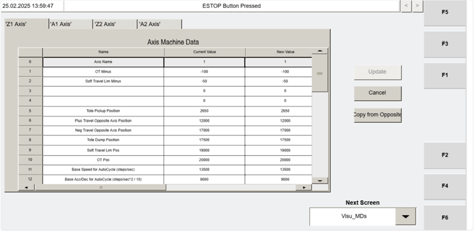
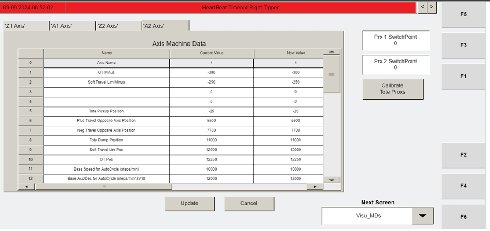
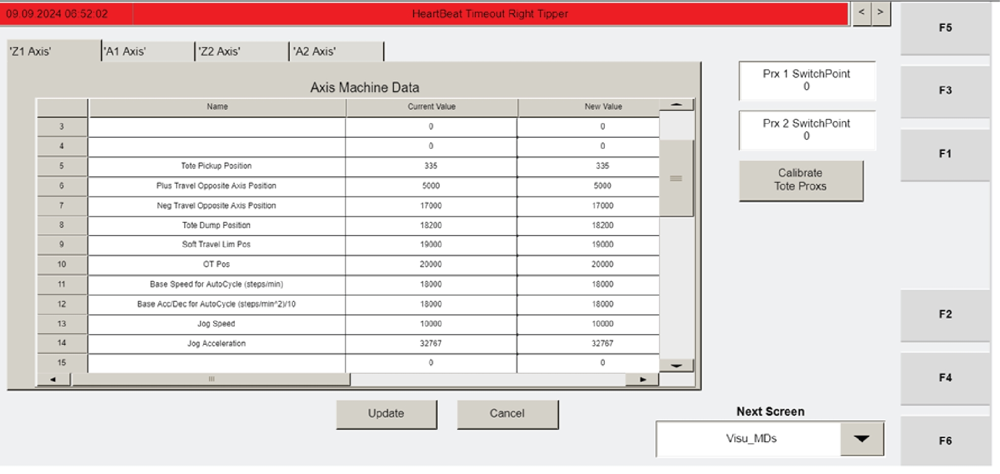
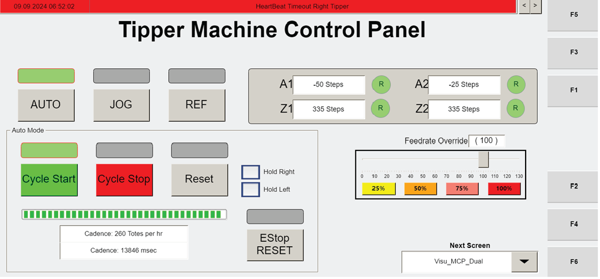
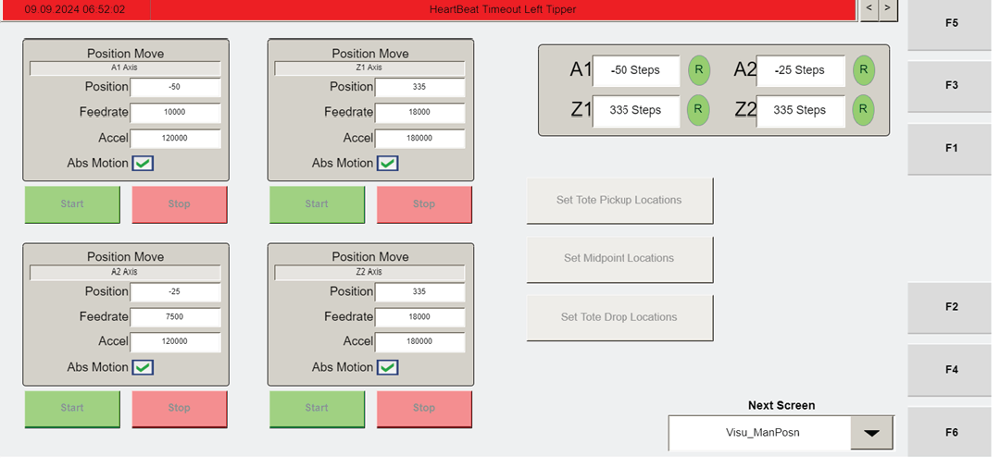

# Interpret VISU_MDS Machine Data IDs and Identify Which Values Are Expected to Be Unique

## Runbook Header

| Field | Value |
| --- | --- |
| Procedure ID | `proc_interpret_visu_mds_machine_data_ids_and_expected_uniqueness_v1` |
| Title | Interpret VISU_MDS Machine Data IDs and Identify Which Values Are Expected to Be Unique |
| Procedure Type | `reference` |
| Primary Role | `L1_support` |
| Supporting Roles | None |
| Support Safe | Yes |
| Validation Status | `needs_sme_review` |
| Merge Status | `source_finalized` |

## Summary

Use the VISU_MDS Machine Data screen and Table 4-10 to identify a machine data field by ID and determine whether the source treats that value as one that should match from machine to machine or as one of the documented unique exceptions.

## When To Use

Use when reviewing a value on the VISU_MDS Machine Data screen and you need to identify the field by ID and interpret whether the value is generally expected to match across machines or is documented as unique for each machine and axis.

## Do Not Use For

* Do not use for IDs that are not clearly listed in the provided source material.
* Do not assign meaning to IDs marked N/A in Table 4-10.
* Do not use this runbook as the operator station alignment procedure; the source only states that MD5 and MD21 are measured during alignment procedures and does not provide those procedures here.
* Do not use this runbook as authorization to change Machine Data values; the related source context states these parameters generally do not require changing unless a motor is replaced.

## Safety And Operational Notes

* This is a reference procedure for interpretation only.
* VISU_MDS Machine Data parameters generally should not be changed unless a motor is replaced.
* MD5 Tote Pickup Position and MD21 Home Offset are stated to be measured during operator station alignment procedures; this runbook does not include those alignment steps.

## Access Or Tools Needed

* Access to the operator station HMI
* VISU_MDS Machine Data screen
* Table 4-10 Visu_MDs Values

## Related Operational Context

* ctx_manual_visu_mds_parameter_change_guidance_v1
* ctx_manual_visu_mds_matching_values_exceptions_v1
* ctx_manual_visu_data_runtime_meters_v1

## Procedure Steps

### Step 1 — Open the VISU_MDS Machine Data screen and locate the reviewed ID

**Responsible role:** L1_support

**Instruction:**
Open the VISU_MDS "Machine Data" screen and locate the machine data entry being reviewed by its ID number.

**Expected result:**
The reviewed machine data entry is visible on the VISU_MDS Machine Data screen and its ID can be read.

**Screens / Images:**

*Machine Data screen layout and machine data entries for axes such as Z1, A1, Z2, and A2.*

*Operator station HMI context showing navigation to the Visu_MDs screen using F2.*

**Stop or Escalate If:**

* The reviewed ID is not clearly listed in the provided source material.
* The VISU_MDS Machine Data screen cannot be accessed or the entry cannot be confidently identified.

---

### Step 2 — Identify the field meaning from Table 4-10

**Responsible role:** L1_support

**Instruction:**
Use Table 4-10 to identify the meaning of the displayed ID. The source lists fields including ID 0 Axis Name, 1 OT Minus, 5 Tote Pickup Position, 6 Plus Travel Opposite Axis Position, 7 Neg Travel Opposite Axis Position, 8 Tote Dump Position, 9 Soft Travel Lim Pos, 10 OT Pos, 11 Base Speed for AutoCycle, 12 Base Acc/Dec for AutoCycle, 13 Jog Speed, 14 Jog Acceleration, 16 Tote Prox Simulation, 20 Home Position, 21 Home Offset, 22 Homing Speed, 23 Homing CAM Speed, and 24 Homing Acceleration.

**Expected result:**
The reviewed ID is matched to a documented field name from Table 4-10.

**Screens / Images:**

*The Machine Data entry being reviewed so its ID can be cross-referenced to Table 4-10.*

**Stop or Escalate If:**

* The reviewed ID is not clearly listed in the provided source material.
* The table marks the reviewed ID as N/A.
* The field meaning cannot be supported directly from Table 4-10.

---

### Step 3 — Classify MD5 and MD21 as unique exceptions

**Responsible role:** L1_support

**Instruction:**
If the reviewed field is MD5 Tote Pickup Position or MD21 Home Offset, interpret it as unique for every machine and every axis.

**Expected result:**
MD5 and MD21 are recognized as unique values rather than match-across-machine values.

**Screens / Images:**

*The reviewed Machine Data entry after identifying whether it is MD5 Tote Pickup Position or MD21 Home Offset.*

*Home Offset reference on the Visu_MDs screen in commissioning context.*

*Tote Pickup Position reference in commissioning context.*

**Stop or Escalate If:**

* The reviewed field appears to be MD5 or MD21 but cannot be confirmed from the source table.
* Additional alignment procedure detail is needed; this section does not provide the operator station alignment procedure.

---

### Step 4 — Classify other documented listed values as match-across-machine values

**Responsible role:** L1_support

**Instruction:**
If the reviewed field is one of the other documented machine data values in this section, interpret it as a value that should match from machine to machine. Do not override the explicit exceptions for MD5 Tote Pickup Position and MD21 Home Offset.

**Expected result:**
The reviewed field is classified as a generally matching value when it is one of the documented listed values other than the two exceptions.

**Screens / Images:**

*The reviewed Machine Data entry after identifying its field name from the listed values.*

*Tote Dump Position reference on the Visu_MDs screen in commissioning context.*

*Additional Tote Dump Position HMI context tied to Visu_MDs.*

**Stop or Escalate If:**

* The reviewed ID is not one of the documented listed values.
* The reviewed entry is marked N/A in Table 4-10.
* The source does not clearly support whether the value should match or be unique.

---

### Step 5 — Record the field name and interpretation

**Responsible role:** L1_support

**Instruction:**
Record the field name and whether the source treats it as a matching value or a unique value.

**Expected result:**
A documented record exists showing the reviewed field name and its interpretation category.

**Screens / Images:**

*The reviewed Machine Data entry while documenting the ID and field name.*

**Stop or Escalate If:**

* The field name cannot be supported from the source.
* The value classification cannot be supported from the source.
* The reviewed ID is unlisted or marked N/A.

---

## Success Criteria

* The reviewed VISU_MDS Machine Data entry is identified by ID using the source-supported table.
* The field name is mapped to a documented Table 4-10 entry.
* The value is correctly interpreted as either generally matching across machines or as one of the two documented unique exceptions.
* The interpretation is recorded without assigning unsupported meaning to N/A or unlisted IDs.

## Failure Conditions

* The reviewed ID is not clearly listed in the provided source material.
* The reviewed entry is marked N/A in Table 4-10.
* A user assigns meaning or classification not supported by the source.
* A user attempts to derive operator station alignment steps from this section even though the procedure is not provided here.

## Escalation Guidance

* Escalate if the reviewed ID is not clearly listed in the provided source material.
* Escalate if the reviewed entry is marked N/A and additional interpretation is requested.
* Escalate if alignment-procedure detail is needed for MD5 Tote Pickup Position or MD21 Home Offset, because this section only states those values are measured during operator station alignment procedures.
* Escalate if a parameter change is being considered; related source context states these values generally do not require changing unless a motor is replaced.

## Missing Details / Known Gaps

* The packet does not provide the full OCR text of section 4.1.2.4, only summarized source references.
* The source section in this packet does not provide the full Table 4-10 contents for every ID, only the listed IDs and note that several others are N/A.
* The source does not provide the operator station alignment procedure referenced for MD5 and MD21.
* The source does not provide a required recording format or destination for documenting the interpretation.
* The packet does not provide a source-supported time estimate for this reference procedure.

## Source Lineage

- Candidate IDs: candidate_l1_interpret_visu_mds_machine_data_ids_and_expected_uniqueness
- Source ID: `manual_optisweep_om_v3`
- Source Type: `manual`
