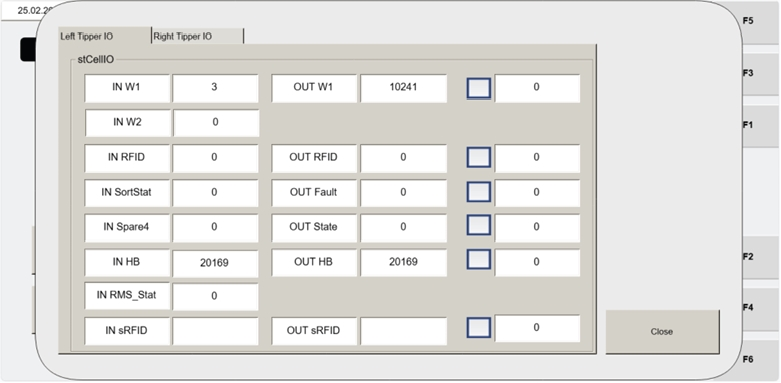

# Open CellIO Status Screen From VISU_MANCONTROL To View Tipper I/O Values

## Runbook Header

| Field | Value |
| --- | --- |
| Procedure ID | `proc_open_cellio_status_screen_from_visu_mancontrol_to_view_tipper_io_values_v1` |
| Title | Open CellIO Status Screen From VISU_MANCONTROL To View Tipper I/O Values |
| Procedure Type | `diagnostic` |
| Primary Role | `L1_support` |
| Supporting Roles | None |
| Support Safe | Yes |
| Validation Status | `needs_sme_review` |
| Merge Status | `source_finalized` |

## Summary

Navigate from the Operator Station VISU_MANCONTROL screen to the CellIO screen using the CELLIO STATUS button, then view and record the cell control input and output values shown for the tipper.

## When To Use

Use when support personnel need to open the CellIO screen from VISU_MANCONTROL to observe cell control input and output values per tipper on the Operator Station HMI.

## Do Not Use For

* Do not use this procedure to interpret the meaning or correctness of specific I/O states; the source only supports navigation and observation.
* Do not use this procedure to change controller parameters, command words, or other settings not described in the source.

## Safety And Operational Notes

* This is a screen navigation and observation procedure only.
* The VISU_MANCONTROL screen shown in the source is identified as the screen seen by personnel logged in as maintenance.

## Access Or Tools Needed

* Operator Station HMI access
* VISU_MANCONTROL screen
* CELLIO STATUS button
* CellIO screen

## Related Operational Context

* ctx_manual_visu_mancontrol_screen_overview_v1
* ctx_manual_cellio_screen_reference_v1

## Procedure Steps

### Step 1 — Open the VISU_MANCONTROL screen

**Responsible role:** L1_support

**Instruction:**
At the Operator Station HMI, open the VISU_MANCONTROL screen.

**Expected result:**
The VISU_MANCONTROL screen is displayed on the Operator Station HMI.

**Screens / Images:**

*The Operator Station HMI manual control screen layout for maintenance users.*

*The display controls and screen navigation references showing access to Visu_ManControl.*

**Stop or Escalate If:**

* VISU_MANCONTROL cannot be accessed on the Operator Station HMI.
* The displayed screen does not match the documented manual control screen.

---

### Step 2 — Locate the CELLIO STATUS button

**Responsible role:** L1_support

**Instruction:**
On the VISU_MANCONTROL screen, locate the CELLIO STATUS button.

**Expected result:**
The CELLIO STATUS button is visible on the manual control screen.

**Screens / Images:**

*The CELLIO STATUS access point on the VISU_MANCONTROL screen.*

**Stop or Escalate If:**

* The CELLIO STATUS button is missing from the VISU_MANCONTROL screen.
* The screen layout does not provide the documented status access.

---

### Step 3 — Press CELLIO STATUS to open the CellIO screen

**Responsible role:** L1_support

**Instruction:**
Press the CELLIO STATUS button on the VISU_MANCONTROL screen to open the CellIO screen.

**Expected result:**
The CellIO screen opens.

**Screens / Images:**

*The CELLIO STATUS button on the VISU_MANCONTROL screen before selection.*

*The target CellIO screen that should appear after pressing CELLIO STATUS.*

**Stop or Escalate If:**

* The CELLIO STATUS button does not open the CellIO screen.

---

### Step 4 — Review the CellIO input and output values

**Responsible role:** L1_support

**Instruction:**
On the CellIO screen, review the cell control input and output values for the tipper.

**Expected result:**
The CellIO screen displays the cell control input and output values for the tipper.

**Screens / Images:**

*The CellIO screen fields showing cell control input and output values per tipper.*

**Stop or Escalate If:**

* The expected cell control input and output values are not visible after opening the screen.

---

### Step 5 — Record the displayed values exactly as shown

**Responsible role:** L1_support

**Instruction:**
Record the displayed input and output values exactly as shown on the CellIO screen.

**Expected result:**
A complete record of the displayed CellIO input and output values is captured.

**Screens / Images:**

*The displayed CellIO input and output values to be copied exactly.*

**Stop or Escalate If:**

* The displayed values cannot be read clearly enough to record exactly.
* The CellIO screen does not remain available long enough to capture the values.

---

## Success Criteria

* VISU_MANCONTROL is opened on the Operator Station HMI.
* The CELLIO STATUS button is located and used successfully.
* The CellIO screen opens.
* Cell control input and output values for the tipper are visible.
* Displayed values are recorded exactly as shown.

## Failure Conditions

* VISU_MANCONTROL cannot be opened.
* The CELLIO STATUS button cannot be found on the manual control screen.
* Pressing CELLIO STATUS does not open the CellIO screen.
* Expected cell control input and output values are not visible on the CellIO screen.
* Displayed values cannot be recorded exactly as shown.

## Escalation Guidance

* Escalate if the CELLIO STATUS button does not open the CellIO screen.
* Escalate if the expected cell control input and output values are not visible after opening the screen.

## Missing Details / Known Gaps

* The source does not define expected normal or abnormal I/O values.
* The source does not provide interpretation guidance for the displayed CellIO values.
* The source does not specify whether production must be stopped before performing this screen-viewing procedure.
* The source does not provide a time estimate for completing this procedure.

## Source Lineage

- Candidate IDs: candidate_l1_open_cellio_status_from_visu_mancontrol
- Source ID: `manual_optisweep_om_v3`
- Source Type: `manual`
