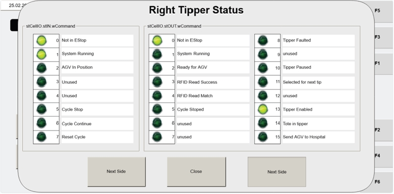

# Open wCommand Screen And View Command Word Values For Each Tipper

## Runbook Header

| Field | Value |
| --- | --- |
| Procedure ID | `proc_open_wcommand_screen_and_view_command_word_values_for_each_tipper_v1` |
| Title | Open wCommand Screen And View Command Word Values For Each Tipper |
| Procedure Type | `diagnostic` |
| Primary Role | `L1_support` |
| Supporting Roles | None |
| Support Safe | Yes |
| Validation Status | `needs_sme_review` |
| Merge Status | `source_finalized` |

## Summary

Open the VISU_MANCONTROL screen, use the WCOMMAND button to access the wCommand screen, and review the displayed input and output Command Word values for each tipper side. Use NEXT SIDE to switch between left and right tipper views and observe the current communication shown between the WCS and the operator station.

## When To Use

Use when L1 support needs to view the current input and output Command Word values for a tipper from the operator station HMI and verify the communication display between the WCS and the operator station.

## Do Not Use For

* Do not use this procedure to interpret the meaning of specific Command Word values, because the source only supports viewing the values and does not provide interpretation rules.
* Do not use this procedure as a troubleshooting decision tree or corrective action procedure.

## Safety And Operational Notes

* This is a diagnostic viewing procedure based on operator station HMI screens.
* The source does not provide any lockout, production stop, or physical intervention requirements for this viewing task.

## Access Or Tools Needed

* Operator Station HMI access
* VISU_MANCONTROL screen
* WCOMMAND button
* NEXT SIDE button
* wCommand screen

## Related Operational Context

* ctx_manual_visu_mancontrol_screen_overview_v1
* ctx_manual_wcommand_screen_reference_v1

## Procedure Steps

### Step 1 — Open the VISU_MANCONTROL screen

**Responsible role:** L1_support

**Instruction:**
Open the VISU_MANCONTROL screen on the Operator Station HMI.

**Expected result:**
The VISU_MANCONTROL screen is displayed on the operator station.

**Screens / Images:**

*Screen-navigation controls and mapping showing access to Visu_ManControl.*

*Overall VISU_MANCONTROL screen layout for maintenance users.*

**Stop or Escalate If:**

* VISU_MANCONTROL cannot be accessed on the operator station HMI.
* The displayed screen does not match the documented manual control screen.

---

### Step 2 — Press WCOMMAND to open the wCommand screen

**Responsible role:** L1_support

**Instruction:**
On the VISU_MANCONTROL screen, locate and press the WCOMMAND button to open the wCommand screen.

**Expected result:**
The wCommand screen opens.

**Screens / Images:**

*The WCOMMAND button on the VISU_MANCONTROL screen.*

*The resulting wCommand screen after WCOMMAND is pressed.*

**Stop or Escalate If:**

* The WCOMMAND button does not open the wCommand screen.

---

### Step 3 — Review the displayed Command Word values for the current tipper side

**Responsible role:** L1_support

**Instruction:**
Review the input and output Command Word values shown on the wCommand screen for the respective tipper.

**Expected result:**
Input and output Command Word values are visible for the currently displayed tipper side.

**Screens / Images:**

*The command value display area showing input and output Command Word values.*

**Stop or Escalate If:**

* Command Word values are not displayed when the screen is opened.

---

### Step 4 — Use NEXT SIDE to switch between left and right tipper views

**Responsible role:** L1_support

**Instruction:**
Press the NEXT SIDE button to navigate between the left and right tipper views.

**Expected result:**
The displayed tipper side changes between left and right.

**Screens / Images:**

*The wCommand screen while switching between left and right tipper views.*

*Reference manual control screen context for access path to wCommand.*

**Stop or Escalate If:**

* NEXT SIDE does not navigate between left and right tipper views as documented.

---

### Step 5 — Observe Command Word values on each side

**Responsible role:** L1_support

**Instruction:**
On each side, observe the displayed Command Word values that represent the current communication between the WCS and the operator station.

**Expected result:**
The current communication values are visible for each viewed tipper side.

**Screens / Images:**

*Displayed input and output Command Word values for the currently selected left or right tipper side.*

**Stop or Escalate If:**

* The displayed values are not visible for a selected side.
* The screen does not show the current communication display described by the source.

---

### Step 6 — Record the displayed values exactly as shown

**Responsible role:** L1_support

**Instruction:**
Record the displayed values for the viewed side or sides exactly as shown.

**Expected result:**
The observed Command Word values are documented exactly as displayed on the screen.

**Screens / Images:**

*The exact displayed Command Word values to be recorded.*

**Stop or Escalate If:**

* The displayed values are not available to record.
* The screen does not show values for the viewed side or sides.

---

## Success Criteria

* The wCommand screen opens from VISU_MANCONTROL using WCOMMAND.
* The user can navigate between left and right tipper views using NEXT SIDE.
* Input and output Command Word values are visible for the viewed tipper side or sides.
* The displayed values are recorded exactly as shown.

## Failure Conditions

* The WCOMMAND button does not open the wCommand screen.
* NEXT SIDE does not navigate between left and right tipper views as documented.
* Command Word values are not displayed when the screen is opened.
* The expected communication values are not visible for one or both sides.

## Escalation Guidance

* Escalate if the WCOMMAND button does not open the wCommand screen.
* Escalate if NEXT SIDE does not navigate between left and right tipper views as documented.
* Escalate if Command Word values are not displayed when the screen is opened.
* Escalate if the screen shown does not match the documented VISU_MANCONTROL or wCommand screen references.

## Missing Details / Known Gaps

* The source does not provide interpretation rules for specific Command Word values.
* The source does not define expected numeric or bit-pattern values for healthy versus faulty communication.
* The source does not provide a time estimate for completing this procedure.
* The source does not specify whether production must be stopped before performing this viewing task.
* The source does not specify any command-line, API, or service commands for this procedure.

## Source Lineage

- Candidate IDs: candidate_l1_open_wcommand_and_view_left_right_tipper_command_words
- Source ID: `manual_optisweep_om_v3`
- Source Type: `manual`
