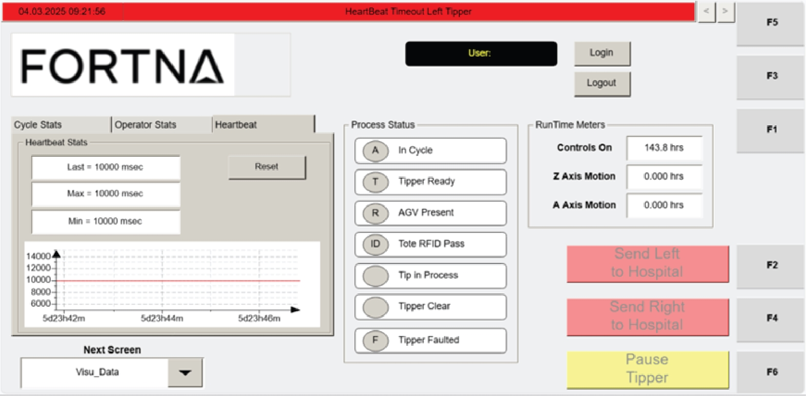
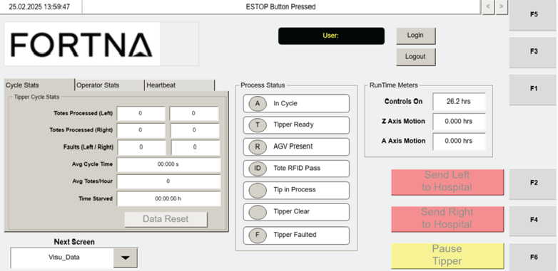

# Review Heartbeat Statistics On The VISU_DATA Screen

## Runbook Header

| Field | Value |
| --- | --- |
| Procedure ID | `proc_review_heartbeat_statistics_on_the_visu_data_screen_v1` |
| Title | Review Heartbeat Statistics On The VISU_DATA Screen |
| Procedure Type | `diagnostic` |
| Primary Role | `L1_support` |
| Supporting Roles | None |
| Support Safe | Yes |
| Validation Status | `needs_sme_review` |
| Merge Status | `source_finalized` |

## Summary

Use the Heartbeat section on the VISU_DATA screen to review Last, Max, and Min heartbeat signal times between the tipper and WCS in milliseconds and determine whether a signal longer than 10 seconds is present, which the manual warns can cause operation issues due to mis-synchronization.

## When To Use

Use when troubleshooting communication-health or synchronization concerns between the tipper and WCS and when heartbeat timing evidence is needed from the operator station HMI VISU_DATA screen.

## Do Not Use For

* Not for performing a recovery action for heartbeat-related issues, because the source provides a warning threshold condition but no recovery path.
* Not for cases where the Heartbeat section is unavailable or values are unreadable; escalate instead.

## Safety And Operational Notes

* The manual warns that a heartbeat signal longer than 10 seconds can cause operation issues with the tipper due to mis-synchronization.

## Access Or Tools Needed

* Access to the operator station HMI
* VISU_DATA screen

## Related Operational Context

* ctx_manual_hmi_agv_state_reference_v1

## Procedure Steps

### Step 1 — Open VISU_DATA and locate the Heartbeat section

**Responsible role:** L1_support

**Instruction:**
Open the VISU_DATA screen on the operator station HMI and locate the Heartbeat section that shows Last, Max, Min, and RESET.

**Expected result:**
The Heartbeat section is visible on the VISU_DATA screen.

**Screens / Images:**

*Heartbeat section with Last, Max, Min, and RESET.*

*Overall VISU_DATA screen layout to orient to the data screen.*

**Stop or Escalate If:**

* Heartbeat section is unavailable.
* Displayed values are unreadable.

---

### Step 2 — Read the Last heartbeat value

**Responsible role:** L1_support

**Instruction:**
Read the Last heartbeat value and interpret it as the most recent signal time in milliseconds.

**Expected result:**
The most recent heartbeat signal time is identified from the Last field.

**Screens / Images:**

*The Last field in the Heartbeat section.*

**Stop or Escalate If:**

* The Last value is unreadable or unavailable.

---

### Step 3 — Read the Max heartbeat value

**Responsible role:** L1_support

**Instruction:**
Read the Max heartbeat value and interpret it as the longest signal time in milliseconds.

**Expected result:**
The longest heartbeat signal time is identified from the Max field.

**Screens / Images:**

*The Max field in the Heartbeat section.*

**Stop or Escalate If:**

* The Max value is unreadable or unavailable.

---

### Step 4 — Read the Min heartbeat value

**Responsible role:** L1_support

**Instruction:**
Read the Min heartbeat value and interpret it as the shortest signal time in milliseconds.

**Expected result:**
The shortest heartbeat signal time is identified from the Min field.

**Screens / Images:**

*The Min field in the Heartbeat section.*

**Stop or Escalate If:**

* The Min value is unreadable or unavailable.

---

### Step 5 — Check for heartbeat signal time longer than 10 seconds

**Responsible role:** L1_support

**Instruction:**
Check whether any displayed heartbeat signal time is longer than 10 seconds, using the source warning that signals longer than 10 seconds can cause operation issues with the tipper due to mis-synchronization.

**Expected result:**
You determine whether the longer-than-10-seconds condition is present.

**Screens / Images:**

*Displayed Last, Max, and Min heartbeat timing values in the Heartbeat section.*

**Stop or Escalate If:**

* A heartbeat signal longer than 10 seconds is observed because the manual states this can cause operation issues with the tipper due to mis-synchronization.

---

### Step 6 — Record displayed heartbeat values for troubleshooting evidence

**Responsible role:** L1_support

**Instruction:**
Record the displayed Last, Max, and Min values if needed for troubleshooting evidence.

**Expected result:**
The displayed heartbeat values are documented for later review or escalation.

**Screens / Images:**

*The Last, Max, and Min values to be recorded.*

**Stop or Escalate If:**

* The displayed values cannot be read or recorded.

---

## Success Criteria

* The Heartbeat section on the VISU_DATA screen is located.
* The Last, Max, and Min heartbeat values are read and interpreted as milliseconds.
* A determination is made about whether any displayed heartbeat signal time is longer than 10 seconds.
* Displayed values are recorded if needed for troubleshooting evidence.

## Failure Conditions

* A heartbeat signal longer than 10 seconds is observed.
* The Heartbeat section is unavailable.
* Displayed heartbeat values are unreadable.

## Escalation Guidance

* Escalate if a heartbeat signal longer than 10 seconds is observed because the source states this can cause operation issues with the tipper due to mis-synchronization.
* Escalate if the Heartbeat section is unavailable or values are unreadable.

## Missing Details / Known Gaps

* The source does not provide a recovery procedure or corrective action if the longer-than-10-seconds condition is present.
* The source does not provide a documented normal operating threshold for Last, Max, or Min other than the warning about signals longer than 10 seconds.
* The source does not provide an estimated completion time.
* The source mentions RESET in the Heartbeat section artifact retrieval text, but the candidate does not include using RESET and no reset action is included here.

## Source Lineage

- Candidate IDs: candidate_l1_review_heartbeat_stats_on_visu_data_screen
- Source ID: `manual_optisweep_om_v3`
- Source Type: `manual`
