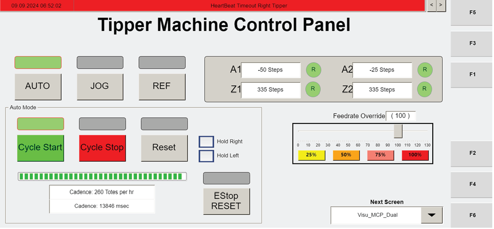

# Review Alarm Messages And Logged-In User On VISU_MANCONTROL Screen

## Runbook Header

| Field | Value |
| --- | --- |
| Procedure ID | `proc_review_alarm_messages_and_logged_in_user_on_visu_mancontrol_screen_v1` |
| Title | Review Alarm Messages And Logged-In User On VISU_MANCONTROL Screen |
| Procedure Type | `diagnostic` |
| Primary Role | `L1_support` |
| Supporting Roles | None |
| Support Safe | Yes |
| Validation Status | `needs_sme_review` |
| Merge Status | `source_finalized` |

## Summary

Use the VISU_MANCONTROL screen on the Operator Station HMI to inspect the informational banner for alarm or informational messages, navigate through available messages using the banner arrows, and verify the ID of the user currently logged in.

## When To Use

Use when an operator or support user needs to view alarm or informational messages shown on the VISU_MANCONTROL screen and confirm which user ID is currently logged in on that screen.

## Do Not Use For

* Do not use this procedure to interpret the meaning of messages, because the source only documents how to view and navigate them.
* Do not use this procedure to change settings, reset faults, or operate manual controls on the VISU_MANCONTROL screen.

## Safety And Operational Notes

* This is a screen inspection procedure derived from documented HMI display elements.
* The source packet does not provide message interpretation guidance; record displayed information exactly as shown.

## Access Or Tools Needed

* Operator Station HMI access
* VISU_MANCONTROL screen

## Related Operational Context

* ctx_manual_visu_mancontrol_screen_overview_v1
* ctx_manual_visu_mancontrol_banner_and_status_v1

## Procedure Steps

### Step 1 — Open the VISU_MANCONTROL screen

**Responsible role:** L1_support

**Instruction:**
Open the VISU_MANCONTROL screen on the Operator Station HMI.

**Expected result:**
The VISU_MANCONTROL screen is displayed.

**Screens / Images:**

*Overall VISU_MANCONTROL layout, including the informational banner and logged-in user ID area.*

*Display controls showing access to the Visu_ManControl screen.*

**Stop or Escalate If:**

* Stop or escalate if the VISU_MANCONTROL screen cannot be accessed from the Operator Station HMI.

---

### Step 2 — Locate the informational banner

**Responsible role:** L1_support

**Instruction:**
Locate the informational banner on the VISU_MANCONTROL screen.

**Expected result:**
The banner area used for alarms or informational messages is identified.

**Screens / Images:**

*Informational banner area on the VISU_MANCONTROL screen.*

**Stop or Escalate If:**

* Escalate if the informational banner is not displayed when expected.

---

### Step 3 — Observe the current banner message

**Responsible role:** L1_support

**Instruction:**
Observe the current message shown in the informational banner.

**Expected result:**
The currently displayed message is visible for review.

**Screens / Images:**

*Current alarm or informational message displayed in the banner.*

**Stop or Escalate If:**

* Escalate if the banner is present but the message cannot be read.

---

### Step 4 — Navigate through additional banner messages

**Responsible role:** L1_support

**Instruction:**
Use the arrows on the right side of the banner to navigate through additional messages, if present.

**Expected result:**
Additional messages can be reviewed using the banner navigation arrows.

**Screens / Images:**

*Arrows on the right side of the informational banner used to navigate messages.*

**Stop or Escalate If:**

* Escalate if messages cannot be navigated with the banner arrows as documented.

---

### Step 5 — Read the logged-in user ID

**Responsible role:** L1_support

**Instruction:**
Locate and read the ID of the user currently logged in.

**Expected result:**
The currently logged-in user ID is visible and can be read.

**Screens / Images:**

*Area of the VISU_MANCONTROL screen that displays the ID of the currently logged-in user.*

**Stop or Escalate If:**

* Escalate if the logged-in user ID is not displayed when expected.

---

### Step 6 — Record displayed messages and user ID

**Responsible role:** L1_support

**Instruction:**
Record the displayed messages and the logged-in user ID exactly as shown.

**Expected result:**
The observed banner messages and logged-in user ID are documented exactly as displayed.

**Screens / Images:**

*Banner message area and logged-in user ID area while documenting exactly what is displayed.*

**Stop or Escalate If:**

* Escalate if the displayed information cannot be captured exactly as shown.

---

## Success Criteria

* The VISU_MANCONTROL screen is opened successfully.
* The informational banner is located and reviewed.
* Any available banner messages are viewed, including additional messages navigated with the banner arrows when present.
* The currently logged-in user ID is identified.
* Displayed messages and the logged-in user ID are recorded exactly as shown.

## Failure Conditions

* The VISU_MANCONTROL screen cannot be accessed.
* The informational banner is not visible or readable.
* Banner arrows do not navigate messages as documented.
* The logged-in user ID is not displayed when expected.

## Escalation Guidance

* Escalate if messages cannot be navigated with the banner arrows as documented.
* Escalate if the logged-in user ID is not displayed when expected.
* Escalate if the VISU_MANCONTROL screen cannot be accessed or does not display as expected.

## Missing Details / Known Gaps

* The source does not define the meaning or required response for specific alarm or informational messages.
* The source does not specify where or how recorded observations should be logged.
* The source does not provide a time estimate for completing this check.
* The source does not state whether production stop or lockout/tagout is required for this screen review.

## Source Lineage

- Candidate IDs: candidate_l1_review_visu_mancontrol_alarm_banner_and_logged_in_user
- Source ID: `manual_optisweep_om_v3`
- Source Type: `manual`
