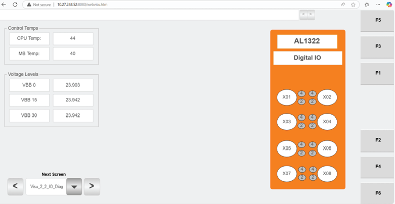

# Verify Hospital HMI IO Diagnostics Input States

## Runbook Header

| Field | Value |
| --- | --- |
| Procedure ID | `proc_verify_hospital_hmi_io_diagnostics_input_states_v1` |
| Title | Verify Hospital HMI IO Diagnostics Input States |
| Procedure Type | `diagnostic` |
| Primary Role | `L1_support` |
| Supporting Roles | None |
| Support Safe | Yes |
| Validation Status | `needs_sme_review` |
| Merge Status | `source_finalized` |

## Summary

Use the Hospital HMI IO Diagnostics screen to check which station-related inputs are on and off and review HMI temperature and voltage readings shown on that screen.

## When To Use

Use this procedure when troubleshooting or documenting Hospital HMI station input status from the IO Diagnostics screen, including review of station switch-related input on/off indications and the HMI's displayed temperature and voltage readings.

## Do Not Use For

* Do not use this procedure to assign normal or abnormal meaning to specific temperature values because the source does not provide thresholds.
* Do not use this procedure to assign normal or abnormal meaning to specific voltage values because the source does not provide thresholds.
* Do not use this procedure as a corrective action procedure because the source only supports observation and documentation of the IO Diagnostics screen.

## Safety And Operational Notes

* This is a read-only diagnostic observation procedure based on the Hospital HMI IO Diagnostics screen.
* The temperature readings and voltages shown on the IO Diagnostics screen pertain to the HMI itself.
* Do not infer acceptable or unacceptable temperature or voltage ranges from this source because no thresholds are provided.

## Access Or Tools Needed

* Access to the Hospital HMI
* Hospital HMI IO Diagnostics screen

## Related Operational Context

* ctx_manual_hospital_hmi_io_diagnostics_screen_v1
* ctx_manual_agv_status_metrics_v1

## Procedure Steps

### Step 1 — Open the Hospital HMI IO Diagnostics screen

**Responsible role:** L1_support

**Instruction:**
Open the Hospital HMI "IO Diagnostics" screen from the Hospital HMI maintenance area.

**Expected result:**
The Hospital HMI IO Diagnostics screen is visible.

**Screens / Images:**

*Maintenance Menu button set showing access to 2.2 IO Diagnostics.*

*Hospital HMI screen labeled "IO Diagnostics" with the relevant diagnostics area visible.*

**Stop or Escalate If:**

* Escalate if the required IO Diagnostics screen is not available.

---

### Step 2 — Identify the station switch input indicators

**Responsible role:** L1_support

**Instruction:**
Identify the input indicators on the IO Diagnostics screen that correspond to the switch mounted on the station.

**Expected result:**
The relevant station-related input indicators are identified on the screen.

**Screens / Images:**

*The area corresponding to the switch mounted on the station and its input indicators.*

**Stop or Escalate If:**

* Escalate if the observed input states cannot be matched to the station-mounted switch context using the available source information.

---

### Step 3 — Observe input on and off states

**Responsible role:** L1_support

**Instruction:**
Observe which identified inputs are shown as on and which are shown as off.

**Expected result:**
The current on/off state of the station-related inputs is observed.

**Screens / Images:**

*The station switch-related input indicators showing which inputs are on and which are off.*

**Stop or Escalate If:**

* Escalate if the required indicators are not available on the IO Diagnostics screen.

---

### Step 4 — Review HMI temperature readings

**Responsible role:** L1_support

**Instruction:**
Review the temperature readings shown on the screen and note that these readings pertain to the HMI itself.

**Expected result:**
The displayed temperature readings are observed and understood to be HMI-related values.

**Screens / Images:**

*The temperature readings shown on the IO Diagnostics screen.*

**Stop or Escalate If:**

* Escalate if the temperature readings are not available on the IO Diagnostics screen.

---

### Step 5 — Review HMI voltage readings

**Responsible role:** L1_support

**Instruction:**
Review the voltage readings shown on the screen and note that these readings pertain to the HMI itself.

**Expected result:**
The displayed voltage readings are observed and understood to be HMI-related values.

**Screens / Images:**

*The voltage readings shown on the IO Diagnostics screen.*

**Stop or Escalate If:**

* Escalate if the voltage readings are not available on the IO Diagnostics screen.

---

### Step 6 — Record observed input, temperature, and voltage values

**Responsible role:** L1_support

**Instruction:**
Record the observed input on/off states and the displayed HMI temperature and voltage values for comparison or troubleshooting.

**Expected result:**
A documented snapshot of the station-related input states and displayed HMI temperature and voltage values is created.

**Screens / Images:**

*Station switch input states together with the HMI temperature and voltage readings to be documented.*

**Stop or Escalate If:**

* Escalate if the required IO Diagnostics indicators or readings are not available for documentation.

---

## Success Criteria

* The Hospital HMI IO Diagnostics screen was accessed successfully.
* The station-related input indicators were identified and their on/off states were observed.
* The displayed HMI temperature readings were reviewed.
* The displayed HMI voltage readings were reviewed.
* The observed input states and displayed HMI readings were documented for troubleshooting or comparison.

## Failure Conditions

* The required IO Diagnostics screen or indicators are not available.
* The observed input states cannot be matched to the station-mounted switch context using the available source information.
* Temperature or voltage readings cannot be reviewed on the screen.
* Specific temperature or voltage values cannot be judged as normal or abnormal because the source provides no thresholds.

## Escalation Guidance

* Escalate if the required IO Diagnostics screen or indicators are not available.
* Escalate if the observed input states cannot be matched to the station-mounted switch context using the available source information.
* Escalate for interpretation of temperature or voltage values if threshold-based judgment is required, because the source does not provide thresholds.

## Missing Details / Known Gaps

* The source does not provide explicit navigation steps from the main menu to the IO Diagnostics screen beyond showing that 2.2 IO Diagnostics exists on the Maintenance Menu.
* The source does not provide thresholds or acceptable ranges for the displayed temperature readings.
* The source does not provide thresholds or acceptable ranges for the displayed voltage readings.
* The source does not provide corrective actions based on observed input, temperature, or voltage values.
* The source does not provide a time estimate for completing this diagnostic check.

## Source Lineage

- Candidate IDs: candidate_l1_verify_hospital_hmi_io_input_states
- Source ID: `manual_optisweep_om_v3`
- Source Type: `manual`
