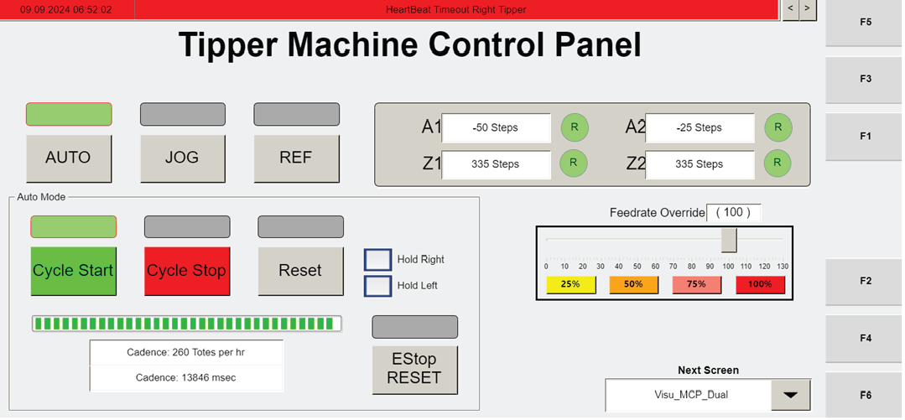

# Verify Tipper Jog Axis Selection And Movement Direction On The HMI

## Runbook Header

| Field | Value |
| --- | --- |
| Procedure ID | `proc_verify_tipper_jog_axis_selection_and_movement_direction_on_the_hmi_v1` |
| Title | Verify Tipper Jog Axis Selection And Movement Direction On The HMI |
| Procedure Type | `reference` |
| Primary Role | `L1_support` |
| Supporting Roles | `operator` |
| Support Safe | Yes |
| Validation Status | `needs_sme_review` |
| Merge Status | `source_finalized` |

## Summary

Use the documented Manual Mode control mapping on the operator station HMI jogging screen to identify which axis control affects the left or right tipper and to interpret the expected movement direction for the plus and minus buttons.

## When To Use

Use when reviewing or verifying tipper jog control labeling and expected motion direction on the operator station HMI, including guided troubleshooting, evidence gathering, or interpretation of the Visu_Dual_MCP jogging interface.

## Do Not Use For

* Do not use this runbook as authority to drive an axis into a hard stop.
* Do not use this runbook for unsupported maintenance or recovery actions beyond identifying axis mapping and expected jog direction.

## Safety And Operational Notes

* If you push the axis until it hits a hard stop, the axis will register a fault.
* Stop the check if movement reaches a hard stop.
* Use the documented mapping as a reference before or during any guided movement verification.

## Access Or Tools Needed

* Operator station HMI or documented jogging screen view
* Documented Manual Mode axis mapping
* Documented plus/minus movement direction mapping

## Related Operational Context

* ctx_manual_visu_dual_mcp_jog_screen_v1
* ctx_manual_tipper_jog_direction_reference_v1
* ctx_manual_tipper_hard_stop_fault_v1

## Procedure Steps

### Step 1 — Open or view the jogging interface

**Responsible role:** L1_support

**Instruction:**
Open or view the operator station HMI jogging interface associated with the Visu_Dual_MCP screen.

**Expected result:**
The jogging interface is visible for review.

**Screens / Images:**

*Manual Mode jogging screen with the available axis controls.*

*Operator station control panel reference showing access to JOG from the main operator screen.*

*Visu_Dual_MCP-related operator station screen context.*

*Additional Visu_Dual_MCP-related operator station screen context.*

**Stop or Escalate If:**

* Escalate if the expected jogging interface associated with Visu_Dual_MCP cannot be identified.

---

### Step 2 — Identify the axis control under review

**Responsible role:** L1_support

**Instruction:**
Identify whether the control to be checked is Z1 AXIS, A1 AXIS, Z2 AXIS, or A2 AXIS.

**Expected result:**
The selected HMI control is matched to one of the four documented axis labels.

**Screens / Images:**

*Axis labels Z1 AXIS, A1 AXIS, Z2 AXIS, and A2 AXIS on the jogging screen.*

*Related Manual Mode axis labels on the operator station HMI.*

**Stop or Escalate If:**

* Escalate if the observed control labeling does not match the documented axis names.

---

### Step 3 — Match the axis to the documented tipper function

**Responsible role:** L1_support

**Instruction:**
Compare the selected control to the documented mapping: Z1 AXIS is left tipper vertical movement, A1 AXIS is left tipper gripper rotation, Z2 AXIS is right tipper vertical movement, and A2 AXIS is right tipper movement.

**Expected result:**
The selected axis is mapped to the correct tipper side and motion type.

**Screens / Images:**

*Which axis buttons correspond to left tipper versus right tipper on the jogging screen.*

*Related jog mode reference noting A1/Z1 for the left axis and A2/Z2 for the right tipper.*

**Stop or Escalate If:**

* Escalate if the observed control labeling or behavior does not match the documented mapping.

---

### Step 4 — Verify plus direction behavior

**Responsible role:** L1_support

**Instruction:**
Check the movement command direction mapping: + should move the Z-axis up and rotate the A-axis towards the operator.

**Expected result:**
The plus command is interpreted according to the documented direction mapping.

**Screens / Images:**

*Plus control on the jogging screen and the selected axis context.*

*Related plus/minus controls shown with Manual Mode axis controls.*

**Stop or Escalate If:**

* Escalate if the observed movement behavior does not match the documented plus direction mapping.
* Stop if movement reaches a hard stop.

---

### Step 5 — Verify minus direction behavior

**Responsible role:** L1_support

**Instruction:**
Check the movement command direction mapping: – should move the Z-axis down and rotate the A-axis away from the operator.

**Expected result:**
The minus command is interpreted according to the documented direction mapping.

**Screens / Images:**

*Minus control on the jogging screen and the selected axis context.*

*Related plus/minus controls shown with Manual Mode axis controls.*

**Stop or Escalate If:**

* Escalate if the observed movement behavior does not match the documented minus direction mapping.
* Stop if movement reaches a hard stop.

---

### Step 6 — Record any mismatch

**Responsible role:** L1_support

**Instruction:**
Record any mismatch between the observed control labeling or behavior and the documented mapping.

**Expected result:**
Any discrepancy is documented for escalation or review.

**Screens / Images:**

*Use the jogging screen as the visual reference when documenting any mismatch.*

**Stop or Escalate If:**

* Escalate if the observed control labeling or movement behavior does not match the documented mapping.

---

### Step 7 — Avoid driving the axis into a hard stop

**Responsible role:** L1_support

**Instruction:**
Verify that the axis is not driven into a hard stop while checking movement behavior.

**Expected result:**
The check is completed without causing a hard stop fault.

**Screens / Images:**

*Jogging screen context while monitoring axis movement behavior.*

**Stop or Escalate If:**

* Stop if movement reaches a hard stop, because the axis will register a fault.
* Escalate if a hard stop fault is registered during the check.

---

## Success Criteria

* The user can identify whether the selected control is Z1 AXIS, A1 AXIS, Z2 AXIS, or A2 AXIS.
* The user can determine which tipper and motion type the selected axis controls using the documented mapping.
* The user can interpret the expected plus and minus movement directions from the documented reference.
* No hard stop fault is caused during the check.
* Any mismatch between observed labeling or behavior and the documented mapping is recorded for escalation.

## Failure Conditions

* Observed control labeling does not match Z1 AXIS, A1 AXIS, Z2 AXIS, or A2 AXIS as documented.
* Observed control behavior does not match the documented left/right tipper mapping.
* Observed plus or minus direction behavior does not match the documented direction mapping.
* The axis is pushed into a hard stop and registers a fault.
* The jogging interface associated with Visu_Dual_MCP cannot be accessed or identified.

## Escalation Guidance

* Escalate if the observed control labeling or movement behavior does not match the documented mapping.
* Stop and escalate if movement reaches a hard stop or an axis fault is registered.
* Escalate if the expected jogging interface associated with Visu_Dual_MCP cannot be identified from the available HMI view.

## Missing Details / Known Gaps

* The source packet does not provide a time estimate for completing this reference check.
* The source packet does not explicitly state whether production stop is required for this verification activity.
* The source packet does not explicitly state whether lockout/tagout is required for this verification activity.
* The source packet does not provide a formal documentation location or template for recording mismatches.
* The source packet does not provide explicit role boundaries beyond the candidate framing of L1_support.

## Source Lineage

- Candidate IDs: candidate_l1_verify_tipper_jog_axis_mapping_and_direction
- Source ID: `manual_optisweep_om_v3`
- Source Type: `manual`
