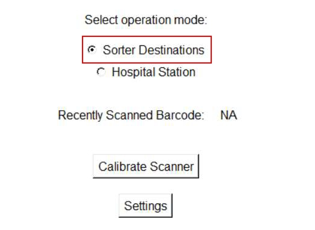

# Verify a Manually Removed Tote Is Returned With the Same Tote ID to Its Original Sorter Position

## Runbook Header

| Field | Value |
| --- | --- |
| Procedure ID | `proc_verify_manually_removed_tote_returned_same_tote_id_original_sorter_position_v1` |
| Title | Verify a Manually Removed Tote Is Returned With the Same Tote ID to Its Original Sorter Position |
| Procedure Type | `diagnostic` |
| Primary Role | `L1_support` |
| Supporting Roles | None |
| Support Safe | Yes |
| Validation Status | `needs_sme_review` |
| Merge Status | `source_finalized` |

## Summary

Verify that a tote manually removed from the sorter stand is returned with the same Tote ID to its original sorter position so the system maintains the correct tote-to-location association and avoids operational errors.

## When To Use

Use this procedure during sorter manual tote handling when a tote has been manually removed from the sorter stand and must be checked before or during return to service. This applies to manual operations at the sorter supported by the Zebra scanner, including tote replacement, maintenance, repair, and damaged tote handling contexts described by the source.

## Do Not Use For

* Do not use this as a full tote initialization procedure.
* Do not use this as a substitute for rescanning when the same Tote ID is not returned to the original position.
* Do not use this procedure to define corrective actions beyond the documented rescanning requirement.

## Safety And Operational Notes

* The source frames this as a support-safe verification activity during manual sorter tote management.
* Do not invent additional corrective handling beyond the documented rescanning requirement if Tote ID and position association is not preserved.

## Access Or Tools Needed

* Access to the sorter stand
* Access to the tote being removed and returned
* Zebra scanner

## Related Operational Context

* ctx_manual_sorter_scanner_operation_overview_v1
* ctx_manual_sorter_scanner_manual_tote_management_v1
* ctx_manual_sorter_tote_id_position_association_v1

## Procedure Steps

### Step 1 — Identify the manually removed tote

**Responsible role:** L1_support

**Instruction:**
Identify the tote that was manually removed from the sorter stand and determine the original sorter position from which it was removed before returning it.

**Expected result:**
The removed tote and its original sorter position are clearly identified.

**Screens / Images:**

*Sorter scanner operation context for manual tote handling at the sorter.*

**Stop or Escalate If:**

* Stop if the original sorter position cannot be identified.
* Escalate if there is uncertainty about which tote was removed.

---

### Step 2 — Check the Tote ID of the tote being returned

**Responsible role:** L1_support

**Instruction:**
Check the Tote ID of the tote being returned using the documented scanner process or visible Tote ID information supported by the source. Where the scanner workflow is used, verify the Tote ID is displayed correctly.

**Expected result:**
The Tote ID of the tote being returned is available for comparison.

**Screens / Images:**

*Add Tote screen context, tote barcode scan, and Tote ID verification on page 93.*

**Stop or Escalate If:**

* Stop if the Tote ID cannot be verified.
* Escalate if the scanner process does not provide a readable or correct Tote ID.

---

### Step 3 — Verify the returned tote has the same Tote ID

**Responsible role:** L1_support

**Instruction:**
Verify that the tote being returned has the same Tote ID as the tote that was removed.

**Expected result:**
The Tote ID of the returned tote matches the Tote ID of the removed tote.

**Screens / Images:**

*Tote ID information used to confirm the returned tote matches the removed tote.*

**Stop or Escalate If:**

* Stop if the Tote ID does not match.
* Rescanning is required if the same Tote ID is not returned to the original position.

---

### Step 4 — Verify the tote is returned to the original sorter position

**Responsible role:** L1_support

**Instruction:**
Verify that the tote is being returned to its original position on the sorter stand.

**Expected result:**
The tote is aligned with the same sorter position from which it was removed.

**Screens / Images:**

*Sorter stand position barcode scanning context relevant to position association and rescanning if needed.*

**Stop or Escalate If:**

* Stop if the tote is not being returned to the original position.
* Rescanning is required if the tote cannot be returned with the same Tote ID to the original position.

---

### Step 5 — Confirm tote-to-location association is preserved

**Responsible role:** L1_support

**Instruction:**
Confirm that the tote-to-location association is preserved by returning the same Tote ID to the original position. If this condition is not met, use rescanning as required by the source to properly associate the tote with its designated location.

**Expected result:**
The system association is preserved because the same Tote ID has been returned to the original position, or rescanning is identified as required.

**Screens / Images:**

*Manual sorter scanner operation context stating same Tote ID must return to original position and that proper scanning avoids operational errors.*

*Rescanning context for pairing sorter position barcode and tote barcode when reassociation is required.*

**Stop or Escalate If:**

* Stop normal return flow if the same Tote ID is not returned to the original position.
* Use rescanning if the tote must be properly associated with its designated location.
* Escalate if rescanning cannot be completed or association remains uncertain.

---

## Success Criteria

* The manually removed tote is returned with the same Tote ID.
* The tote is returned to its original sorter position.
* The tote-to-location association is preserved.
* Operational errors related to incorrect placement are avoided.

## Failure Conditions

* The returned tote does not have the same Tote ID as the removed tote.
* The tote is returned to a different sorter position.
* The tote-to-location association is not preserved.
* The Tote ID cannot be verified through the supported process.
* Rescanning is required because correct association was not maintained.

## Escalation Guidance

* If the same Tote ID is not returned to the original position, rescanning is required to properly associate the tote with its designated location.
* Do not apply undocumented corrective actions beyond the rescanning requirement from the source.
* Escalate when the removed tote, original position, or resulting association cannot be confidently verified.

## Missing Details / Known Gaps

* The source does not provide a detailed operator sequence for recording the original Tote ID before removal.
* The source does not specify exact UI field names for the sorter verification beyond Add Tote and Tote ID verification context.
* The source does not define a formal escalation path or named downstream team.
* The source does not provide an estimated completion time.
* The source does not explicitly state whether production stop or LOTO is required for this verification activity.

## Source Lineage

- Candidate IDs: candidate_l1_verify_tote_id_matches_original_sorter_position_after_manual_removal
- Source ID: `manual_optisweep_om_v3`
- Source Type: `manual`
