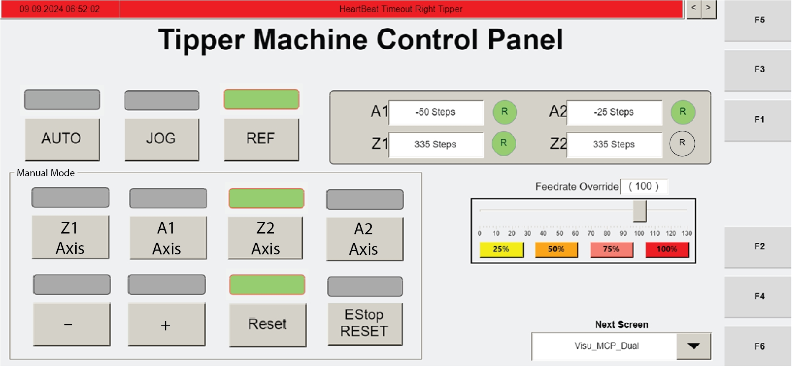
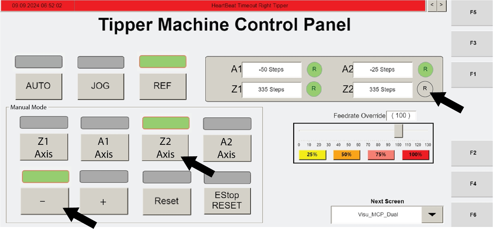

# Identify Which Axis Needs Referencing Using the Circled R Indicator

## Runbook Header

| Field | Value |
| --- | --- |
| Procedure ID | `proc_identify_which_axis_needs_referencing_using_the_circled_r_indicator_v1` |
| Title | Identify Which Axis Needs Referencing Using the Circled R Indicator |
| Procedure Type | `reference` |
| Primary Role | `L2_support` |
| Supporting Roles | None |
| Support Safe | No |
| Validation Status | `needs_sme_review` |
| Merge Status | `source_finalized` |

## Summary

Use the REF screen axis status indicator to determine which axis requires referencing before starting manual movement. Open the Visu_Dual_MCP screen, stop the automatic tipping cycle, open the REF screen, and check the circled "R" next to each axis information entry. If the circled "R" is clear, that axis needs to be referenced.

## When To Use

Use this procedure when working from the operator station HMI to determine which tipper axis needs referencing from the REF screen before manual movement or related maintenance positioning activity.

## Do Not Use For

* Do not use this procedure to infer meanings for any circled "R" appearance other than the documented condition that a clear circled "R" means the axis needs to be referenced.
* Do not use this procedure as authorization to perform manual axis movement or referencing steps beyond identifying the axis needing reference unless those steps are separately documented and authorized.

## Safety And Operational Notes

* The candidate is marked not support-safe and is kept at L2_support because the interpretation is embedded in a maintenance context involving manual movement.
* Stop the automatic tipping cycle with CYCLE STOP before opening the reference controls.
* Do not invent additional status meanings beyond the documented statement that a clear circled "R" means the axis needs to be referenced.

## Access Or Tools Needed

* Access to the operator station HMI
* Visu_Dual_MCP screen
* REF screen with axis information and circled R indicators

## Procedure Steps

### Step 1 — Open the Visu_Dual_MCP screen

**Responsible role:** L2_support

**Instruction:**
On the operator station HMI, navigate to the "Visu_Dual_MCP" screen using F3.

**Expected result:**
The Visu_Dual_MCP screen is displayed on the operator station HMI.

**Screens / Images:**

*Operator station HMI context for the Visu_Dual_MCP screen and F3 navigation.*

*Operator station HMI artifact associated with manually referencing axes and Visu_Dual_MCP access.*

**Stop or Escalate If:**

* The operator station HMI is unavailable.
* The Visu_Dual_MCP screen cannot be accessed using F3.

---

### Step 2 — Stop the automatic tipping cycle

**Responsible role:** L2_support

**Instruction:**
Press CYCLE STOP to stop the automatic tipping cycle before opening the reference controls.

**Expected result:**
The automatic tipping cycle is stopped.

**Screens / Images:**

*Operator station HMI context showing the step to stop the automatic tipping cycle.*

*Operator station HMI artifact associated with CYCLE STOP in the manual referencing context.*

*CYCLE STOP control on the operator station control panel.*

**Stop or Escalate If:**

* CYCLE STOP does not stop the automatic tipping cycle.
* The machine remains in automatic operation and the REF screen should not be opened under the documented sequence.

---

### Step 3 — Open the REF screen

**Responsible role:** L2_support

**Instruction:**
Press REF to open the reference screen.

**Expected result:**
The reference screen opens and displays axis-related reference information.

**Screens / Images:**

*REF button or control on the operator station control panel.*

*REF screen context related to axis reference status.*

*Manual-referencing screen context showing REF screen access and axis reference status area.*

**Stop or Escalate If:**

* The REF screen cannot be opened.
* The displayed screen does not show the expected reference information.

---

### Step 4 — Locate the circled R indicators in the axis information area

**Responsible role:** L2_support

**Instruction:**
Review the axis information area and locate the circled "R" next to each axis.

**Expected result:**
The circled "R" indicator for each axis is visible for inspection.

**Screens / Images:**

*Axis information area and circled R indicators on the REF screen.*

*Reference screen context showing where the axis status indicator appears.*

**Stop or Escalate If:**

* The axis information area is not visible.
* The circled "R" indicators cannot be located for one or more axes.

---

### Step 5 — Identify any axis that needs referencing

**Responsible role:** L2_support

**Instruction:**
Identify any axis where the circled "R" is clear. The source states that this axis needs to be referenced.

**Expected result:**
Any axis needing reference is identified based on the clear circled "R" condition.

**Screens / Images:**

*Circled R status next to each axis information entry.*

*Reference screen context for identifying the axis needing reference.*

**Stop or Escalate If:**

* The circled "R" state cannot be determined clearly.
* There is uncertainty about indicator meaning beyond the documented clear circled "R" condition.

---

### Step 6 — Record or communicate the identified axis

**Responsible role:** L2_support

**Instruction:**
Record or communicate which axis needs referencing without inventing additional status meanings beyond the documented clear circled "R" condition.

**Expected result:**
The identified axis needing reference is communicated or recorded accurately.

**Stop or Escalate If:**

* There is pressure to assign meanings not supported by the source.
* The identified axis cannot be communicated clearly from the visible HMI information.

---

## Success Criteria

* The REF screen is opened successfully from the Visu_Dual_MCP screen after stopping the automatic tipping cycle.
* The axis information area is reviewed and the circled "R" indicators are visible.
* The user identifies which axis needs referencing based only on the documented rule that a clear circled "R" means the axis needs to be referenced.
* The identified axis is recorded or communicated without unsupported interpretation.

## Failure Conditions

* The operator station HMI or Visu_Dual_MCP screen cannot be accessed.
* The automatic tipping cycle cannot be stopped with CYCLE STOP.
* The REF screen cannot be opened.
* The axis information area or circled "R" indicators cannot be viewed clearly.
* The user attempts to infer meanings for indicator states not documented by the source.

## Escalation Guidance

* Escalate if the HMI does not allow access to Visu_Dual_MCP, CYCLE STOP, or REF as described.
* Escalate if the circled "R" indicators are not visible or cannot be interpreted clearly.
* Escalate if additional interpretation of indicator states is requested beyond the documented clear circled "R" condition.
* Keep execution at L2_support unless lower-role authorization is documented elsewhere.

## Missing Details / Known Gaps

* The source packet does not provide a time estimate for completing this procedure.
* The source packet does not define meanings for circled "R" states other than a clear circled "R" meaning the axis needs to be referenced.
* The source packet does not specify a required follow-on recording system or communication channel for reporting the identified axis.
* The source packet does not provide explicit LOTO requirements for this interpretation-only procedure.

## Source Lineage

- Candidate IDs: candidate_l2_identify_axes_needing_reference_by_circled_r_indicator
- Source ID: `manual_optisweep_om_v3`
- Source Type: `manual`
