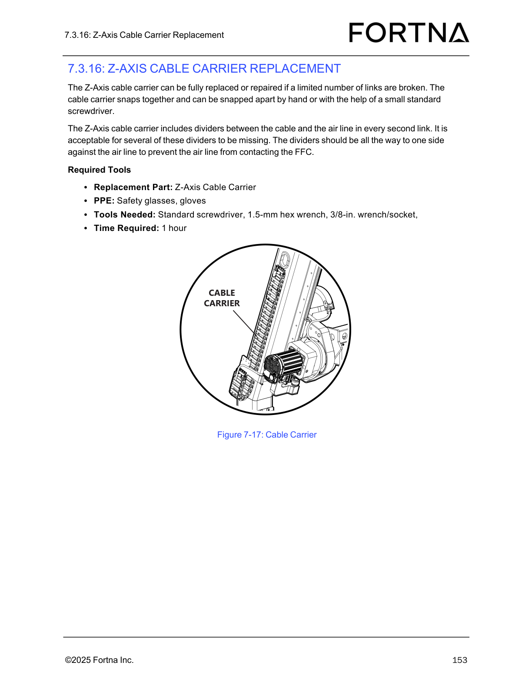

# Inspect Z-Axis Cable Carrier Installation After Replacement

## Runbook Header

| Field | Value |
| --- | --- |
| Procedure ID | `proc_inspect_z_axis_cable_carrier_installation_after_replacement_v1` |
| Title | Inspect Z-Axis Cable Carrier Installation After Replacement |
| Procedure Type | `diagnostic` |
| Primary Role | `L2_support` |
| Supporting Roles | None |
| Support Safe | No |
| Validation Status | `needs_sme_review` |
| Merge Status | `source_finalized` |

## Summary

Verify that a replaced Z-axis cable carrier is fully closed, properly seated, not pressing on the FFC, and visually uniform before returning the station to service.

## When To Use

Use after Z-axis cable carrier replacement work to confirm the installed carrier passes the documented visual and fit checks before panel reinstallation and operator station restart.

## Do Not Use For

* Do not use as a cable carrier replacement procedure.
* Do not use when any inspection check fails, including open cross bars, dividers pressing on the FFC, joints not fully seated, or non-uniform carrier appearance end to end.

## Safety And Operational Notes

* This inspection is tied to replacement work and guarded access; the candidate assigns the safer role as L2_support.
* Do not return the station to service if any cross bar is open, any divider presses on the FFC, any joint is not fully seated, or the carrier does not look uniform end to end.

## Access Or Tools Needed

* Visual access to the installed cable carrier
* Access to side panels as needed
* Starting The Operator Station procedure

## Procedure Steps

### Step 1 — Confirm all cable carrier cross bars are closed

**Responsible role:** L2_support

**Instruction:**
Visually inspect the installed Z-axis cable carrier and confirm that all cross bars are closed.

**Expected result:**
All cross bars on the cable carrier are closed.

**Screens / Images:**

*Overall cable carrier construction and link/cross-bar arrangement for the Z-axis cable carrier.*

**Stop or Escalate If:**

* Any cross bar is open.

---

### Step 2 — Verify dividers are not pressing on the FFC

**Responsible role:** L2_support

**Instruction:**
Check the internal dividers in the installed cable carrier and verify they are not pressing on the FFC.

**Expected result:**
The dividers do not press on the FFC.

**Screens / Images:**

*Cable carrier divider locations and routing area between the cable and air line.*

*Identification of the flat-flex cable (FFC) referenced by the inspection criteria.*

**Stop or Escalate If:**

* Any divider presses on the FFC.

---

### Step 3 — Check that all cable carrier joints are fully seated

**Responsible role:** L2_support

**Instruction:**
Inspect the cable carrier joints and verify that all joints are fully seated.

**Expected result:**
All cable carrier joints are fully seated.

**Screens / Images:**

*Link-to-link joints and snap-together connection points on the cable carrier.*

**Stop or Escalate If:**

* Any joint is not fully seated.

---

### Step 4 — Verify the cable carrier looks uniform end to end

**Responsible role:** L2_support

**Instruction:**
Compare the cable carrier appearance from one end to the other and verify it looks uniform end to end.

**Expected result:**
The cable carrier appearance is uniform end to end.

**Screens / Images:**

*Overall end-to-end cable carrier appearance for a consistent, uniform installation.*

**Stop or Escalate If:**

* The carrier does not look uniform end to end.

---

### Step 5 — Reinstall panels and restart the operator station after a passing inspection

**Responsible role:** L2_support

**Instruction:**
If the inspection passes, reinstall the top and/or bottom side panels if necessary and restart the operator station using the referenced startup procedure.

**Expected result:**
Panels are reinstalled as needed and the operator station restart procedure is initiated using the referenced source procedure.

**Screens / Images:**

*System/operator station screen context associated with startup actions referenced by the manual.*

**Stop or Escalate If:**

* Any inspection check failed before panel reinstallation or restart.
* The referenced startup procedure cannot be completed.

---

## Success Criteria

* All cable carrier cross bars are closed.
* Internal dividers are not pressing on the FFC.
* All cable carrier joints are fully seated.
* The cable carrier looks uniform end to end.
* After passing inspection, panels are reinstalled as needed and the operator station can be restarted using the referenced startup procedure.

## Failure Conditions

* Any cross bar is open.
* Any divider presses on the FFC.
* Any joint is not fully seated.
* The carrier does not look uniform end to end.
* The station is not ready to return to service after inspection.

## Escalation Guidance

* Stop the procedure if any cross bar is open, any divider presses on the FFC, any joint is not fully seated, or the carrier does not look uniform end to end.
* Do not reinstall panels and do not restart the operator station until the inspection passes.
* Use L2_support for this inspection because it is tied to replacement work and guarded access.

## Missing Details / Known Gaps

* The packet does not provide the full quoted source text for page 155 inspection wording.
* The packet does not provide explicit production-stop status.
* The packet does not provide explicit LOTO status for this inspection-only procedure.
* The packet does not provide an estimated time for this inspection.
* The packet does not provide a source-specific acceptable reference image explicitly labeled as a passing end-to-end uniform appearance example beyond Figure 7-17 context.

## Source Lineage

- Candidate IDs: candidate_l2_inspect_z_axis_cable_carrier_after_replacement
- Source ID: `manual_optisweep_om_v3`
- Source Type: `manual`
