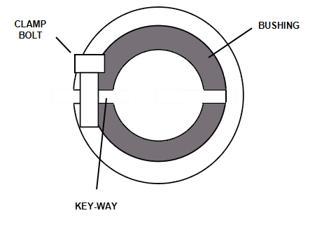

# Install Replacement Motor Onto Gearbox

## Runbook Header

| Field | Value |
| --- | --- |
| Procedure ID | `proc_install_replacement_motor_onto_gearbox_v1` |
| Title | Install Replacement Motor Onto Gearbox |
| Procedure Type | `recovery` |
| Primary Role | `L2_support` |
| Supporting Roles | None |
| Support Safe | No |
| Validation Status | `needs_sme_review` |
| Merge Status | `source_finalized` |

## Summary

Install a replacement motor onto the gearbox using the documented shaft alignment, clamp collar positioning, mounting fasteners, orientation, torque values, electrical reconnection, and restart preparation steps from the motor installation section.

## When To Use

Use this procedure when a replacement motor is being installed onto the gearbox as part of the documented motor replacement process for the OptiSweep A-axis or Z-axis.

## Do Not Use For

* Do not use when the correct motor variant for A-axis left, A-axis right, Z-axis left, or Z-axis right cannot be verified.
* Do not use as a substitute for the separate motor configuration procedure when manufacturer application configuration is required.
* Do not use as a substitute for the separate operator station startup procedure; this source only references that procedure.
* Do not use if the motor cannot be fully inserted with the documented shaft and clamp collar or bushing alignment.

## Safety And Operational Notes

* This procedure is not marked support-safe in the candidate.
* Do not over-tighten the clamp collar during the temporary tightening step.
* Re-install the top and or bottom side guarding, if necessary, before returning the system toward service.
* The source section references separate startup and configuration procedures that are not included here.

## Access Or Tools Needed

* Replacement motor
* Gearbox access
* Hex key
* 4-mm hex wrench for Z-axis clamp collar
* 5-mm hex wrench for A-axis clamp collar
* Torque tool capable of 7 Nm, 9.5 Nm, and 16.5 Nm
* Four M5 socket-head screws
* Access to electrical connections
* Manufacturer application if motor configuration is required
* Access to operator station startup procedure

## Procedure Steps

### Step 1 — Clean the motor shaft

**Responsible role:** L2_support

**Instruction:**
Clean the motor shaft of any grease or debris before installation.

**Expected result:**
The motor shaft is clean and ready for alignment and insertion.

**Stop or Escalate If:**

* Stop or escalate if the shaft cannot be cleaned to a condition suitable for installation.

---

### Step 2 — Verify the replacement motor variant

**Responsible role:** L2_support

**Instruction:**
Verify the correct motor is being installed: A-axis left, A-axis right, Z-axis left, or Z-axis right.

**Expected result:**
The replacement motor variant matches the intended installation location.

**Screens / Images:**

*Motor identification figure associated with the motor replacement section.*

**Stop or Escalate If:**

* Escalate if the correct motor variant cannot be verified for A-axis left, A-axis right, Z-axis left, or Z-axis right.

---

### Step 3 — Align the shaft bushing and clamp collar openings

**Responsible role:** L2_support

**Instruction:**
Inside the gearbox, align the opening in the shaft bushing with the opening in the clamp collar.

**Expected result:**
The shaft bushing opening and clamp collar opening are aligned.

**Screens / Images:**

*Clamp collar and motor mounting area used during motor installation.*

**Stop or Escalate If:**

* Stop or escalate if the shaft bushing opening and clamp collar opening cannot be aligned.

---

### Step 4 — Insert the hex key through the access hole

**Responsible role:** L2_support

**Instruction:**
Insert the hex key through the access hole into the clamp collar fastener to help prevent the clamp collar from rotating.

**Expected result:**
The hex key is engaged through the access hole into the clamp collar fastener.

**Screens / Images:**

*Access hole and clamp collar location on the gearbox during motor installation.*

**Stop or Escalate If:**

* Stop or escalate if the clamp collar fastener cannot be accessed through the access hole.
* Stop or escalate if the clamp collar cannot be prevented from rotating.

---

### Step 5 — Align and fully insert the motor shaft

**Responsible role:** L2_support

**Instruction:**
Align the key-way or flat in the motor shaft, if present, with the opening in the clamp collar or bushing and fully insert the motor shaft.

**Expected result:**
The motor shaft is fully inserted with the key-way or flat aligned as documented.

**Screens / Images:**

*Motor shaft alignment and insertion area at the clamp collar or bushing opening.*

**Stop or Escalate If:**

* Escalate if the motor cannot be fully inserted with the documented shaft and clamp collar or bushing alignment.

---

### Step 6 — Temporarily tighten the clamp collar

**Responsible role:** L2_support

**Instruction:**
Temporarily tighten the clamp collar and do not over-tighten.

**Expected result:**
The clamp collar is temporarily tightened enough to hold position without over-tightening.

**Screens / Images:**

*Clamp collar connection point used for temporary tightening.*

**Stop or Escalate If:**

* Stop if the clamp collar is being over-tightened.
* Stop or escalate if temporary tightening does not hold the motor position.

---

### Step 7 — Mount the motor to the gearbox

**Responsible role:** L2_support

**Instruction:**
Mount the motor to the gearbox using four M5 socket-head screws and tighten them to 7 Nm (62 in-lb).

**Expected result:**
The motor is mounted to the gearbox with four M5 socket-head screws tightened to the specified torque.

**Screens / Images:**

*Four motor-to-gearbox M5 socket-head screw mounting points.*

**Stop or Escalate If:**

* Stop or escalate if all four M5 socket-head screws cannot be installed.
* Stop or escalate if the specified 7 Nm (62 in-lb) torque cannot be applied.

---

### Step 8 — Orient the motor with connections facing down

**Responsible role:** L2_support

**Instruction:**
Orient the motor with the electrical connections facing down.

**Expected result:**
The motor is oriented so the electrical connections face down.

**Screens / Images:**

*Correct motor orientation relative to the gearbox and connection end.*

**Stop or Escalate If:**

* Stop or escalate if the motor cannot be oriented with the electrical connections facing down.

---

### Step 9 — Apply final clamp collar torque by axis

**Responsible role:** L2_support

**Instruction:**
Loosen then re-tighten the clamp collar using the axis-specific tool and torque: Z-axis uses a 4-mm hex wrench to 9.5 Nm (84 in-lb); A-axis uses a 5-mm hex wrench to 16.5 Nm (146 in-lb).

**Expected result:**
The clamp collar is loosened and re-tightened to the correct axis-specific torque using the correct hex wrench.

**Screens / Images:**

*Clamp collar location used for final axis-specific tightening.*

**Stop or Escalate If:**

* Stop or escalate if the correct axis-specific tool is not available.
* Stop or escalate if the specified axis-specific torque cannot be applied.

---

### Step 10 — Replace the access hole plug and reconnect electrical connections

**Responsible role:** L2_support

**Instruction:**
Replace the access hole plug and reconnect the electrical connections.

**Expected result:**
The access hole plug is replaced and the motor electrical connections are reconnected.

**Screens / Images:**

*Motor installation area associated with access hole and connection end.*

**Stop or Escalate If:**

* Stop or escalate if the access hole plug cannot be replaced.
* Stop or escalate if the electrical connections cannot be reconnected.

---

### Step 11 — Configure the motor if required

**Responsible role:** L2_support

**Instruction:**
If the motor has not been configured with the manufacturer application, follow the documented configuration steps.

**Expected result:**
The motor is either already configured or the separate documented configuration procedure is followed.

**Screens / Images:**

*Motor figure associated with the Teknic software download and configuration context.*

**Stop or Escalate If:**

* Escalate if motor configuration with the manufacturer application is required but not available in the provided source section.

---

### Step 12 — Reinstall guarding if necessary

**Responsible role:** L2_support

**Instruction:**
Re-install the top and or bottom side guarding, if necessary.

**Expected result:**
Any removed top and or bottom side guarding is reinstalled.

**Stop or Escalate If:**

* Stop or escalate if required guarding cannot be reinstalled.

---

### Step 13 — Restart the operator station

**Responsible role:** L2_support

**Instruction:**
Re-start the operator station using the documented startup procedure.

**Expected result:**
The operator station restart is initiated using the separate documented startup procedure.

**Stop or Escalate If:**

* Stop or escalate if the documented startup procedure is not available.
* Stop or escalate if the operator station cannot be restarted using the documented startup procedure.

---

## Success Criteria

* The replacement motor is installed on the gearbox.
* The motor shaft is fully inserted with documented alignment to the clamp collar or bushing.
* The motor is mounted using four M5 socket-head screws tightened to 7 Nm (62 in-lb).
* The motor is oriented with the electrical connections facing down.
* The clamp collar is re-tightened using the correct axis-specific tool and torque.
* The access hole plug is replaced and electrical connections are reconnected.
* Any required motor configuration is completed through the referenced separate procedure.
* Any necessary guarding is reinstalled.
* The operator station is restarted using the documented startup procedure.

## Failure Conditions

* Correct motor variant cannot be verified.
* Motor shaft cannot be fully inserted with the documented alignment.
* Clamp collar is over-tightened during temporary tightening.
* Specified mounting or clamp collar torque cannot be applied.
* Motor cannot be oriented with electrical connections facing down.
* Access hole plug or electrical connections cannot be restored.
* Motor configuration is required but the manufacturer application or documented configuration steps are unavailable.
* Required guarding cannot be reinstalled.
* Documented startup procedure is unavailable.

## Escalation Guidance

* Escalate if the correct motor variant cannot be verified for A-axis left, A-axis right, Z-axis left, or Z-axis right.
* Escalate if the motor cannot be fully inserted with the documented shaft and clamp collar or bushing alignment.
* Escalate if motor configuration with the manufacturer application is required but not available in the provided source section.
* Escalate if required torque values cannot be applied with the specified tools.
* Escalate if the documented startup procedure is not available.

## Missing Details / Known Gaps

* The source packet does not provide the full OCR text of section 7.3.5.3, so step wording is grounded primarily in the candidate and supplied source summaries.
* The source does not provide explicit LOTO status for this installation subsection.
* The source does not provide an estimated completion time for this installation subsection.
* The separate motor configuration steps are referenced but not included in this packet.
* The separate operator station startup procedure is referenced but not included in this packet.
* No source-supported role boundary beyond L2_support is provided.

## Source Lineage

- Candidate IDs: candidate_l2_install_replacement_motor_on_gearbox
- Source ID: `manual_optisweep_om_v3`
- Source Type: `manual`
