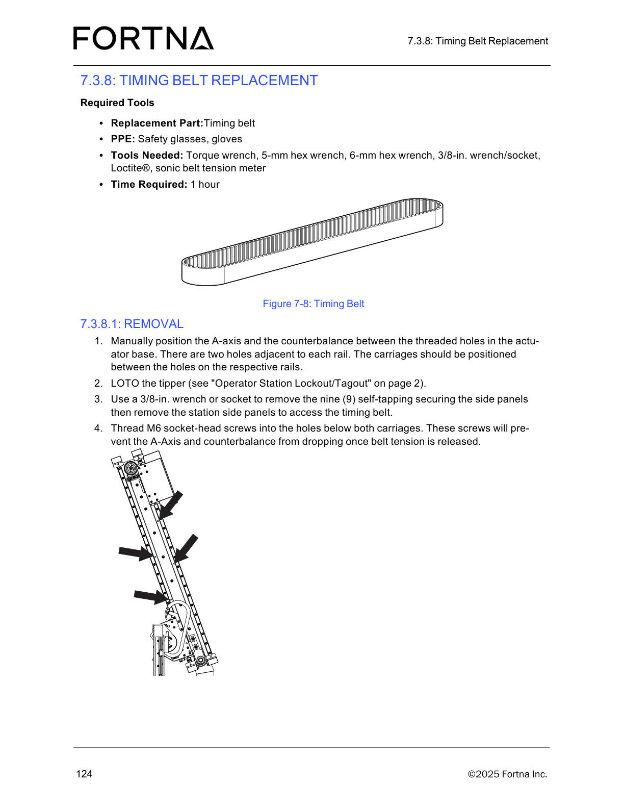
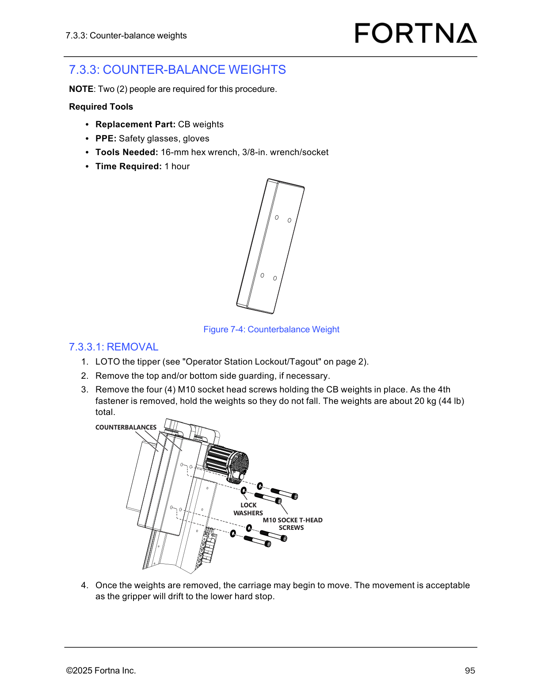
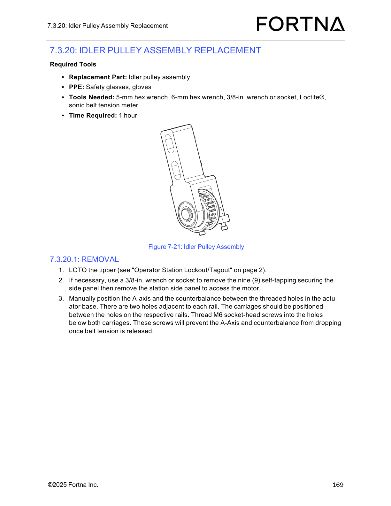

# Install Replacement Timing Belt and Set Belt Tension

## Runbook Header

| Field | Value |
| --- | --- |
| Procedure ID | `proc_install_replacement_timing_belt_and_set_belt_tension_v1` |
| Title | Install Replacement Timing Belt and Set Belt Tension |
| Procedure Type | `recovery` |
| Primary Role | `L2_support` |
| Supporting Roles | None |
| Support Safe | No |
| Validation Status | `needs_sme_review` |
| Merge Status | `source_finalized` |

## Summary

Install a new timing belt, position the counter-balance carriage and idler assembly, set belt tension using equal tension screw adjustment and sonic tension meter verification, secure the idler assembly and belt clamps, reinstall side panels, and restart the operator station using the separately referenced procedure.

## When To Use

Use after timing belt replacement when performing the documented installation and tension-setting portion of the procedure for the OptiSweep timing belt.

## Do Not Use For

* Do not use as a standalone operator station restart procedure; the source only references 'Starting The Operator Station' on page 66 and does not provide those steps here.
* Do not use when acceptable belt tension readings cannot be achieved or three acceptable readings in a row are not obtained.
* Do not use if belt clamp alignment with the belt teeth cannot be achieved without pinching the belt.

## Safety And Operational Notes

* This procedure involves mechanical work on belt, carriage, pulley, and clamp components and is safer for L2_support.
* Maintain equal adjustment of the two tension screws so they apply the same amount of force.
* Excessive ambient noise such as forklifts beeping or conveyors running can interfere with sonic tension meter readings.
* Ensure belt clamps align with the belt teeth and do not pinch the belt.

## Access Or Tools Needed

* Replacement timing belt
* Access to pulleys
* Access to counter-balance carriage and lower hard stop
* M8x25 screws / fasteners
* Two M6x35 tension screws
* Gates 508c Sonic Tension Meter if that meter is used
* Access to actuator base
* Torque capability for 21.2 Nm (188 in-lbs)
* Loctite®
* Six M6 screws for the A-axis belt clamp
* Six M6 screws for the counter-balance belt clamp
* Access to side panels
* Referenced 'Starting The Operator Station' procedure on page 66

## Procedure Steps

### Step 1 — Place the new timing belt on the pulleys

**Responsible role:** L2_support

**Instruction:**
Place the new timing belt on the pulleys.

**Expected result:**
The replacement timing belt is seated on the pulleys.

**Screens / Images:**

*Timing belt location and routing context.*

*Pulley identification while placing the belt.*

**Stop or Escalate If:**

* Stop if the belt cannot be placed correctly on the pulleys.

---

### Step 2 — Lower the counter-balance carriage to the lower hard stop

**Responsible role:** L2_support

**Instruction:**
Slightly lift the counter-balance carriage, remove the M6 fastener supporting it, and lower the counter-balance carriage to rest on the lower hard stop.

**Expected result:**
The supporting M6 fastener is removed and the counter-balance carriage rests on the lower hard stop.

**Screens / Images:**

*Counter-balance area referenced for carriage positioning.*

**Stop or Escalate If:**

* Stop if the counter-balance carriage cannot be positioned to rest on the lower hard stop.

---

### Step 3 — Loosely position the idler pulley assembly

**Responsible role:** L2_support

**Instruction:**
Very lightly tighten the M8x25 screws holding the idler pulley assembly so the assembly is not loose but can still slide under the fasteners.

**Expected result:**
The idler pulley assembly is retained but still able to slide for adjustment.

**Screens / Images:**

*Idler pulley assembly being held by the M8x25 fasteners.*

**Stop or Escalate If:**

* Stop if the idler pulley assembly cannot be set so it is retained but still slides.

---

### Step 4 — Seat the tension screws against the actuator base

**Responsible role:** L2_support

**Instruction:**
Insert the two M6x35 tension screws until they make firm contact with the actuator base.

**Expected result:**
Both tension screws are installed and in firm contact with the actuator base.

**Stop or Escalate If:**

* Stop if the tension screws cannot be seated firmly against the actuator base.

---

### Step 5 — Apply belt tension evenly with both tension screws

**Responsible role:** L2_support

**Instruction:**
Equally tighten the two tension screws to add belt tension, making sure both screws are turned the exact same amount so they apply the same amount of force.

**Expected result:**
Belt tension increases while both screws remain equally adjusted.

**Screens / Images:**

*Idler assembly adjustment area where equal tension screw movement is applied.*

**Stop or Escalate If:**

* Stop if equal adjustment of the two tension screws cannot be maintained, because both screws need to apply the same amount of force.

---

### Step 6 — Measure belt tension on the counter-balance leg only

**Responsible role:** L2_support

**Instruction:**
Check belt tension only on the counter-balance leg of the belt.

**Expected result:**
The tension measurement is taken from the specified belt leg.

**Screens / Images:**

*Timing belt path to identify the counter-balance leg for measurement.*

**Stop or Escalate If:**

* Stop if the correct counter-balance leg cannot be identified for the tension check.

---

### Step 7 — Set the Gates 508c Sonic Tension Meter parameters

**Responsible role:** L2_support

**Instruction:**
If using a Gates 508c Sonic Tension Meter, set Mass to 4.86 g/m, Width to 20 mm, and Span to 1200 mm.

**Expected result:**
The Gates 508c Sonic Tension Meter is configured with the documented values.

**Stop or Escalate If:**

* Stop if the Gates 508c Sonic Tension Meter cannot be set to Mass 4.86 g/m, Width 20 mm, and Span 1200 mm when that meter is being used.

---

### Step 8 — Adjust tension until three acceptable readings in a row are obtained

**Responsible role:** L2_support

**Instruction:**
Gradually increase and adjust the belt tension until 471 N is reached, with an acceptable range between 448 N and 494 N, and continue adjusting/checking until three acceptable readings in a row are received.

**Expected result:**
The belt tension is verified at 471 N target, within the acceptable range of 448 N to 494 N, with three acceptable readings in a row.

**Stop or Escalate If:**

* Stop if acceptable belt tension readings cannot be obtained.
* Stop if three acceptable readings in a row are not achieved.

---

### Step 9 — Control ambient noise during sonic tension measurement

**Responsible role:** L2_support

**Instruction:**
Account for excessive area noise because forklifts beeping, conveyors running, or similar noise can interfere with sonic meter readings.

**Expected result:**
Sonic tension readings are taken with awareness of ambient noise interference.

**Stop or Escalate If:**

* Stop or delay measurement if excessive ambient noise is interfering with sonic meter readings.

---

### Step 10 — Lock the idler assembly in place

**Responsible role:** L2_support

**Instruction:**
Tighten the M8x25 fasteners to 21.2 Nm (188 in-lbs) to lock the idler assembly in place.

**Expected result:**
The idler assembly is locked in place at the specified torque.

**Screens / Images:**

*Idler pulley assembly fastener location for final locking.*

**Stop or Escalate If:**

* Stop if the M8x25 fasteners cannot be tightened to 21.2 Nm (188 in-lbs).

---

### Step 11 — Raise the counter-balance carriage to mid-travel and reinstall support screws

**Responsible role:** L2_support

**Instruction:**
Raise the counter-balance carriage back to mid-travel and insert the M6 socket-head screws for the carriage to rest against.

**Expected result:**
The counter-balance carriage is at mid-travel and the M6 socket-head screws are inserted.

**Screens / Images:**

*Counter-balance area while returning the carriage to mid-travel.*

**Stop or Escalate If:**

* Stop if the counter-balance carriage cannot be raised to mid-travel or supported as described.

---

### Step 12 — Re-attach the A-axis belt clamp

**Responsible role:** L2_support

**Instruction:**
Re-attach the A-axis belt clamp using the six M6 screws and Loctite®, making sure the clamp aligns with the belt teeth and does not pinch the belt; move the belt slightly if needed so the clamp lines up properly.

**Expected result:**
The A-axis belt clamp is reattached with six M6 screws and Loctite®, aligned to the belt teeth without pinching the belt.

**Screens / Images:**

*Timing belt tooth alignment context while reattaching the A-axis clamp.*

**Stop or Escalate If:**

* Escalate if the belt clamp cannot be aligned with the belt teeth without pinching the belt.

---

### Step 13 — Re-attach the counter-balance belt clamp

**Responsible role:** L2_support

**Instruction:**
Re-attach the counter-balance belt clamp using the six M6 screws and Loctite®, making sure the clamp aligns with the belt teeth and does not pinch the belt; lift the counter-balance slightly if needed so the clamp lines up properly.

**Expected result:**
The counter-balance belt clamp is reattached with six M6 screws and Loctite®, aligned to the belt teeth without pinching the belt.

**Screens / Images:**

*Timing belt tooth alignment context while reattaching the counter-balance clamp.*

*Counter-balance area referenced when slight lifting is needed for clamp alignment.*

**Stop or Escalate If:**

* Escalate if the belt clamp cannot be aligned with the belt teeth without pinching the belt.

---

### Step 14 — Remove the temporary support screws

**Responsible role:** L2_support

**Instruction:**
Remove the M6 socket-head screws supporting the A-axis and counter-balance.

**Expected result:**
The temporary support screws are removed from the A-axis and counter-balance supports.

**Stop or Escalate If:**

* Stop if the temporary support screws cannot be removed safely.

---

### Step 15 — Reinstall the side panels

**Responsible role:** L2_support

**Instruction:**
Reinstall the side panels.

**Expected result:**
The side panels are reinstalled.

**Stop or Escalate If:**

* Stop if the side panels cannot be reinstalled correctly.

---

### Step 16 — Restart the operator station using the referenced procedure

**Responsible role:** L2_support

**Instruction:**
Re-start the operator station using the referenced 'Starting The Operator Station' procedure on page 66.

**Expected result:**
The operator station restart is handed off to the referenced procedure.

**Stop or Escalate If:**

* Escalate if the referenced 'Starting The Operator Station' procedure on page 66 is unavailable or restart cannot be completed.

---

## Success Criteria

* The replacement timing belt is installed on the pulleys.
* Belt tension is verified on the counter-balance leg using the documented method.
* If using a Gates 508c Sonic Tension Meter, the meter is set to Mass 4.86 g/m, Width 20 mm, and Span 1200 mm.
* Belt tension reaches the 471 N target within the acceptable range of 448 N to 494 N.
* Three acceptable belt tension readings in a row are obtained.
* The M8x25 fasteners are tightened to 21.2 Nm (188 in-lbs) to lock the idler assembly in place.
* Both belt clamps are reattached with six M6 screws and Loctite®, aligned with the belt teeth, without pinching the belt.
* Side panels are reinstalled.
* The operator station restart is performed using the referenced page 66 procedure.

## Failure Conditions

* Equal adjustment of the two tension screws cannot be maintained.
* Acceptable belt tension readings cannot be obtained.
* Three acceptable readings in a row are not achieved.
* Excessive ambient noise interferes with sonic meter readings.
* The belt clamps cannot be aligned with the belt teeth without pinching the belt.
* The idler assembly cannot be locked in place at 21.2 Nm (188 in-lbs).
* The side panels cannot be reinstalled correctly.
* The referenced operator station startup procedure cannot be completed.

## Escalation Guidance

* Stop if equal adjustment of the two tension screws cannot be maintained.
* Stop if acceptable belt tension readings cannot be obtained or if three acceptable readings in a row are not achieved.
* Delay or repeat measurement if excessive ambient noise is interfering with sonic meter readings.
* Escalate if the belt clamps cannot be aligned with the belt teeth without pinching the belt.
* Escalate if the referenced 'Starting The Operator Station' procedure on page 66 is unavailable or restart cannot be completed.

## Missing Details / Known Gaps

* The source section text in this packet is empty, so step wording is grounded primarily in the candidate and attached source references rather than direct OCR quotes.
* No explicit production stop requirement is provided in this packet.
* No explicit LOTO requirement is provided for this installation subsection in this packet.
* No estimated time is provided for this specific installation subsection in this packet.
* The restart steps for 'Starting The Operator Station' are not included in this packet and therefore are not expanded.

## Source Lineage

- Candidate IDs: candidate_l2_install_replacement_timing_belt_and_set_tension
- Source ID: `manual_optisweep_om_v3`
- Source Type: `manual`
