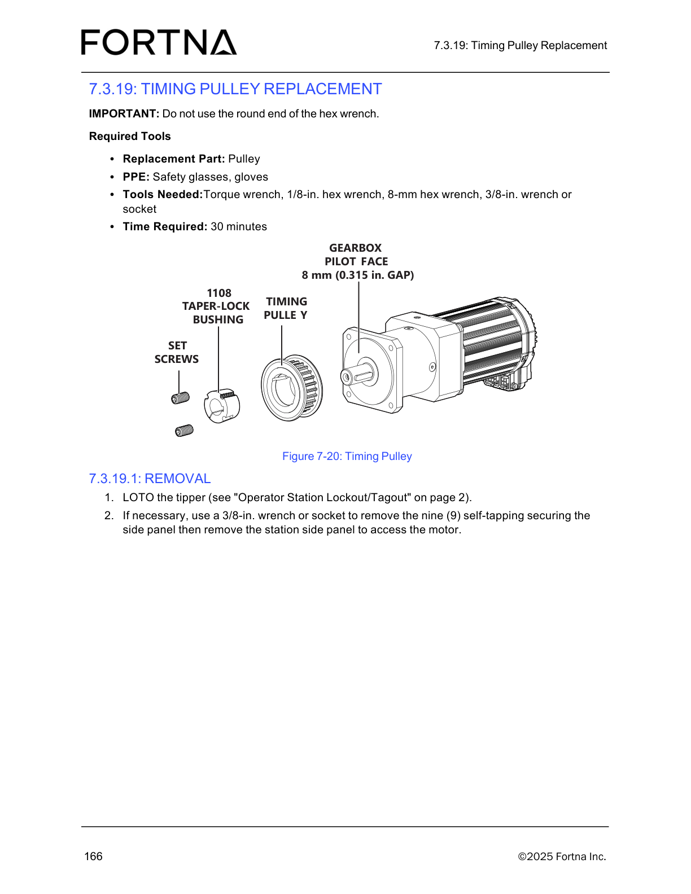

# Install Timing Pulley On Gearbox Shaft After Replacement

## Runbook Header

| Field | Value |
| --- | --- |
| Procedure ID | `proc_install_timing_pulley_on_gearbox_shaft_after_replacement_v1` |
| Title | Install Timing Pulley On Gearbox Shaft After Replacement |
| Procedure Type | `operation` |
| Primary Role | `L2_support` |
| Supporting Roles | None |
| Support Safe | No |
| Validation Status | `needs_sme_review` |
| Merge Status | `source_finalized` |

## Summary

Install the timing pulley assembly onto the gearbox shaft by loosely assembling the taper lock bushing into the pulley, selecting the correct set screw holes, aligning the keyway with the gearbox shaft key if present, positioning the pulley 8 mm (0.315 in.) from the gearbox pilot face, tightening the set screws alternately to 5.6 Nm (49.5 in-lb), reinstalling panels as needed, and restarting the operator station using the referenced procedure.

## When To Use

Use after timing pulley replacement when reinstalling the timing pulley assembly onto the gearbox shaft and the source procedure on page 184 is the governing installation reference.

## Do Not Use For

* Do not use as a complete safety isolation procedure; the source excerpt does not provide full isolation or guarded-access prerequisites.
* Do not use when the pulley cannot be aligned with the gearbox shaft key or the documented 8 mm spacing cannot be achieved.
* Do not use when the set screws cannot be tightened in the documented alternating pattern to 5.6 Nm.

## Safety And Operational Notes

* This source excerpt is installation-only and does not provide full safety isolation or guarded-access prerequisites.
* Use higher-skill support review before execution because prerequisite safety controls are not included in the excerpt.
* Use the documented set screw torque of 5.6 Nm (49.5 in-lb).

## Access Or Tools Needed

* Access to the timing pulley and gearbox shaft
* Taper lock bushing
* Set screws
* Torque tool capable of 5.6 Nm (49.5 in-lb)
* 8-mm hex wrench
* Access to top and/or bottom side panels
* Referenced procedure: Starting The Operator Station

## Procedure Steps

### Step 1 — Loosely assemble taper lock bushing into pulley

**Responsible role:** L2_support

**Instruction:**
Loosely assemble the taper lock bushing into the pulley and align all three holes.

**Expected result:**
The taper lock bushing is seated in the pulley loosely enough to allow alignment, and all three holes are aligned.

**Screens / Images:**

*Timing pulley and 1108 taper-lock bushing relationship and labeled assembly components.*

**Stop or Escalate If:**

* Stop if the bushing cannot be assembled into the pulley with all three holes aligned.

---

### Step 2 — Install set screws in the correct holes

**Responsible role:** L2_support

**Instruction:**
Thread set screws into the two holes opposite each other. Use the holes that have threads on the pulley half and are smooth on the bushing half.

**Expected result:**
Both set screws are installed in the correct opposing holes.

**Screens / Images:**

*Set screw locations and pulley versus bushing features used to identify the correct opposing holes.*

**Stop or Escalate If:**

* Stop if the correct opposing holes cannot be identified.
* Stop if the set screws do not thread into the documented pulley-threaded, bushing-smooth holes.

---

### Step 3 — Install pulley assembly onto gearbox shaft

**Responsible role:** L2_support

**Instruction:**
Slip the assembly onto the shaft with the keyway slot aligned with the gearbox shaft key, if present.

**Expected result:**
The pulley assembly is installed onto the shaft with the keyway aligned to the shaft key if present.

**Screens / Images:**

*Timing pulley assembly orientation relative to the gearbox shaft and pilot face.*

**Stop or Escalate If:**

* Stop if the pulley cannot be aligned with the gearbox shaft key.

---

### Step 4 — Set pulley spacing from gearbox pilot face

**Responsible role:** L2_support

**Instruction:**
Position the pulley so the final location is 8 mm (0.315 in.) from the gearbox pilot face. A spacer may be placed between the gearbox pilot face and pulley to maintain the spacing, and an 8-mm hex wrench can be used for this task.

**Expected result:**
The pulley is positioned 8 mm (0.315 in.) from the gearbox pilot face.

**Screens / Images:**

*The labeled gearbox pilot face and the 8 mm (0.315 in.) gap between the pilot face and timing pulley.*

**Stop or Escalate If:**

* Stop if the documented 8 mm spacing cannot be achieved.

---

### Step 5 — Tighten set screws alternately to final torque

**Responsible role:** L2_support

**Instruction:**
Tighten both set screws in small increments, alternating between them until the set screw torque reaches 5.6 Nm (49.5 in-lb).

**Expected result:**
Both set screws are tightened evenly to 5.6 Nm (49.5 in-lb).

**Screens / Images:**

*Set screw locations on the timing pulley assembly while applying alternating tightening.*

**Stop or Escalate If:**

* Stop if the set screws cannot be tightened in the documented alternating pattern to 5.6 Nm.
* Stop if final torque of 5.6 Nm (49.5 in-lb) cannot be achieved.

---

### Step 6 — Reinstall side panels if needed

**Responsible role:** L2_support

**Instruction:**
Reinstall the top and/or bottom side panels, if necessary.

**Expected result:**
Any removed top and/or bottom side panels are reinstalled.

**Stop or Escalate If:**

* Stop if removed panels cannot be reinstalled as needed.

---

### Step 7 — Restart operator station using referenced procedure

**Responsible role:** L2_support

**Instruction:**
Re-start the operator station using the referenced procedure "Starting The Operator Station" on page 66.

**Expected result:**
The operator station restart is performed using the referenced procedure.

**Stop or Escalate If:**

* Stop if the referenced procedure "Starting The Operator Station" is not available.
* Escalate if the operator station cannot be restarted using the referenced procedure.

---

## Success Criteria

* The timing pulley is installed on the gearbox shaft.
* The taper lock bushing and pulley holes are aligned as documented.
* The keyway slot is aligned with the gearbox shaft key, if present.
* The pulley final location is 8 mm (0.315 in.) from the gearbox pilot face.
* Both set screws are tightened in alternating increments to 5.6 Nm (49.5 in-lb).
* Top and/or bottom side panels are reinstalled as needed.
* The operator station restart is performed using the referenced procedure.

## Failure Conditions

* Pulley cannot be aligned with the gearbox shaft key.
* The documented 8 mm spacing cannot be achieved.
* Set screws cannot be tightened in the documented alternating pattern to 5.6 Nm.
* The source excerpt does not provide full safety isolation or guarded-access prerequisites.

## Escalation Guidance

* Escalate for higher-skill support review before execution because the excerpt does not include full safety isolation or guarded-access prerequisites.
* Stop and escalate if the pulley cannot be aligned with the gearbox shaft key.
* Stop and escalate if the documented 8 mm spacing cannot be achieved.
* Stop and escalate if the set screws cannot be tightened in the documented alternating pattern to 5.6 Nm.
* Escalate if the referenced operator station startup procedure is unavailable or restart cannot be completed.

## Missing Details / Known Gaps

* The source packet does not include the OCR text for page 184 section 7.3.19.2 installation.
* The source excerpt does not provide complete safety isolation, LOTO, or guarded-access prerequisites for this installation step sequence.
* The source does not provide an estimated completion time for this installation procedure in the supplied packet.
* The restart step depends on the separate referenced procedure "Starting The Operator Station" on page 66, which is not included in this packet.
* No source-supported role boundaries beyond L2_support selection are explicitly stated in the supplied packet.

## Source Lineage

- Candidate IDs: candidate_l2_install_timing_pulley_on_gearbox_shaft
- Source ID: `manual_optisweep_om_v3`
- Source Type: `manual`
