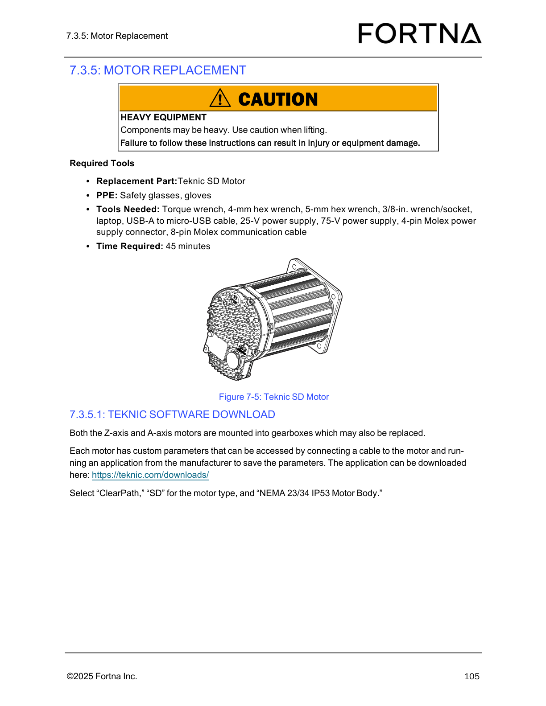
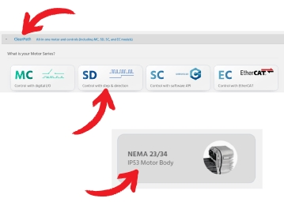

# Load a Saved Configuration File to a Replacement Motor

## Runbook Header

| Field | Value |
| --- | --- |
| Procedure ID | `proc_load_a_saved_configuration_file_to_a_replacement_motor_v1` |
| Title | Load a Saved Configuration File to a Replacement Motor |
| Procedure Type | `operation` |
| Primary Role | `L2_support` |
| Supporting Roles | None |
| Support Safe | No |
| Validation Status | `needs_sme_review` |
| Merge Status | `source_finalized` |

## Summary

Upload a previously saved .mtr configuration file to a new motor by connecting the replacement motor to power and a laptop running Teknic ClearPath, using File > Load Configuration, and disconnecting the cables when finished.

## When To Use

Use when a replacement motor needs to receive a previously saved configuration file before installation or testing.

## Do Not Use For

* Do not use this procedure to save or download configuration from a working motor.
* Do not use this procedure when the saved .mtr configuration file is unavailable.

## Safety And Operational Notes

* If the motor will be tested, make sure it is clamped down.
* This procedure may include powered testing on a replacement motor.

## Access Or Tools Needed

* Replacement motor
* Laptop containing ClearPath software
* Saved .mtr configuration file
* Power supply cable (4-pin Molex)
* USB cable
* Means to clamp the motor if testing is planned

## Procedure Steps

### Step 1 — Clamp the motor if testing is planned

**Responsible role:** L2_support

**Instruction:**
If the motor will be tested, make sure it is clamped down before proceeding.

**Expected result:**
The motor is secured against movement before any powered testing.

**Screens / Images:**

*Identify the Teknic SD motor referenced by the procedure.*

**Stop or Escalate If:**

* Stop if testing is planned and the motor cannot be clamped down safely.

---

### Step 2 — Connect power and USB to the replacement motor

**Responsible role:** L2_support

**Instruction:**
Connect the power supply cable (4-pin Molex) and the USB cable to the new motor and to the laptop containing the ClearPath software.

**Expected result:**
The replacement motor is connected to power and to the laptop running ClearPath.

**Screens / Images:**

*Locate the motor USB access point or USB port cover associated with configuration transfer.*

*Identify the Teknic SD motor being connected for configuration upload.*

**Stop or Escalate If:**

* Escalate if the required power supply cable (4-pin Molex) or USB cable is unavailable.
* Escalate if the replacement motor cannot be connected to the laptop containing ClearPath software.

---

### Step 3 — Load the saved configuration file in ClearPath

**Responsible role:** L2_support

**Instruction:**
Open the File menu in the ClearPath software and select Load Configuration to load the saved configuration file.

**Expected result:**
The saved .mtr configuration file is loaded to the replacement motor.

**Screens / Images:**

*Reference the page 122 motor replacement workflow associated with Teknic ClearPath usage for saving or uploading .mtr files.*

**Stop or Escalate If:**

* Escalate if the saved configuration file is unavailable.
* Escalate if the saved configuration file cannot be loaded to the new motor.

---

### Step 4 — Disconnect the cables after upload

**Responsible role:** L2_support

**Instruction:**
Disconnect the cables when the configuration upload is finished.

**Expected result:**
The power and USB cables are disconnected after the upload completes.

**Stop or Escalate If:**

* Escalate if the upload does not finish and the motor cannot be left in a normal disconnected state.

---

## Success Criteria

* The saved .mtr configuration file is loaded onto the replacement motor.
* The upload procedure is completed and the cables are disconnected when finished.

## Failure Conditions

* The saved .mtr configuration file is unavailable.
* The saved configuration file cannot be loaded to the new motor.
* Required power or USB connections cannot be made.
* Testing is planned but the motor is not clamped down.

## Escalation Guidance

* Escalate to L2 support review if the saved configuration file is unavailable.
* Escalate if ClearPath cannot load the saved configuration file to the replacement motor.
* Escalate if the replacement motor cannot be connected to the required power and USB interfaces.

## Missing Details / Known Gaps

* The source packet does not provide a verification method beyond completing the Load Configuration action.
* The source packet does not provide an estimated time for this procedure.
* The source packet does not state whether production stop or LOTO is required for this configuration upload task.
* The source packet does not provide detailed ClearPath screen imagery for the File > Load Configuration action.

## Source Lineage

- Candidate IDs: candidate_l2_load_saved_configuration_to_replacement_motor
- Source ID: `manual_optisweep_om_v3`
- Source Type: `manual`
