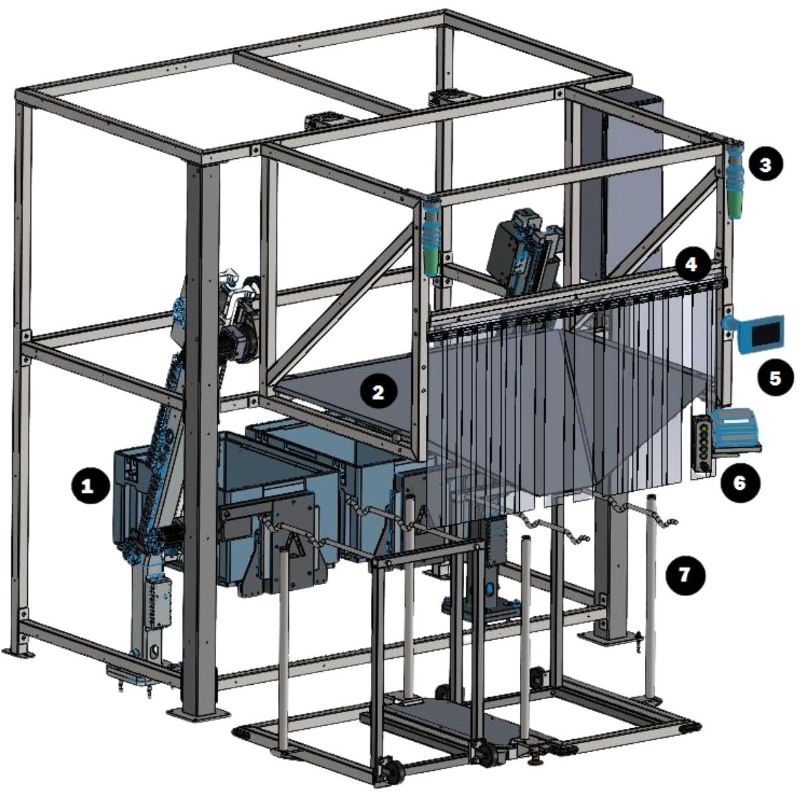

# Inspect Operator Station During Daily Preventive Maintenance

## Runbook Header

| Field | Value |
| --- | --- |
| Procedure ID | `proc_inspect_operator_station_during_daily_preventive_maintenance_v1` |
| Title | Inspect Operator Station During Daily Preventive Maintenance |
| Procedure Type | `diagnostic` |
| Primary Role | `L2_support` |
| Supporting Roles | None |
| Support Safe | Yes |
| Validation Status | `needs_sme_review` |
| Merge Status | `source_finalized` |

## Summary

Perform the documented daily preventive maintenance inspection for the operator station by checking for controller damage, verifying stacklights are operational, and confirming the chute is free of debris including stuck labels.

## When To Use

Use during the documented daily preventive maintenance inspection scope for the OptiSweep operator station.

## Do Not Use For

* Do not use this runbook for repair or corrective maintenance actions because the source provides inspection checks only.
* Do not use this runbook for P40 (V2.0) robot maintenance; the source directs users to the P40A (V2.0) user manual, Document version V1.1 (20231206).
* Do not use this runbook for tipper maintenance; the source directs users to contact Lifecycle Performance Services (LPS) at 888-444-4647.

## Safety And Operational Notes

* This source-supported procedure is limited to visual/functional inspection checks only.
* Do not invent repair, recovery, or adjustment actions when an inspection item fails.
* For tipper maintenance, contact Lifecycle Performance Services (LPS) at 888-444-4647.
* For P40 (V2.0) robot maintenance, reference the P40A (V2.0) user manual, Document version V1.1 (20231206).

## Access Or Tools Needed

* Physical access to the operator station
* Visual access to the controller, stacklights, and chute
* Daily preventive maintenance documentation

## Related Operational Context

* ctx_manual_daily_preventive_maintenance_overview_v1

## Procedure Steps

### Step 1 — Inspect the controller for damage

**Responsible role:** L2_support

**Instruction:**
Go to the operator station and inspect the controller for damage.

**Expected result:**
No damage is observed on the controller.

**Screens / Images:**

*Use the operator station reference image to orient to the operator station hardware while locating the inspection area.*

**Stop or Escalate If:**

* Visible damage is found on the controller.
* Corrective maintenance is required but not provided by this source.

---

### Step 2 — Check that stacklights are operational

**Responsible role:** L2_support

**Instruction:**
Check that the operator station stacklights are operational.

**Expected result:**
The stacklights are operational.

**Screens / Images:**

*Use the operator station reference image to identify the stacklights mounted on the top of the frame on either side of the chute.*

**Stop or Escalate If:**

* The stacklights are not operational.
* Corrective maintenance is required but not provided by this source.

---

### Step 3 — Inspect the chute for debris

**Responsible role:** L2_support

**Instruction:**
Inspect the chute and verify it is free of debris, including stuck labels.

**Expected result:**
The chute is free of debris and no stuck labels are present.

**Screens / Images:**

*Use the operator station reference image to identify the chute location for inspection.*

**Stop or Escalate If:**

* Debris or stuck labels are found in the chute and corrective action is not defined by this source.
* Additional maintenance beyond inspection is required.

---

## Success Criteria

* No visible damage is found on the controller.
* The operator station stacklights are operational.
* The chute is free of debris, including stuck labels.

## Failure Conditions

* Visible damage to the controller.
* Stacklights are not operational.
* Debris or stuck labels are present in the chute.
* A failed inspection item requires corrective action not provided in this source.

## Escalation Guidance

* If maintenance is needed for the tipper, contact Lifecycle Performance Services (LPS) at 888-444-4647.
* For maintenance related to the P40 (V2.0) robots, reference the P40A (V2.0) user manual, Document version V1.1 (20231206).
* If an inspection item fails, stop at inspection findings and seek SME or maintenance guidance because the source does not provide corrective actions.

## Missing Details / Known Gaps

* The source section in this packet does not provide corrective actions for failed inspection items.
* The source does not specify whether production stop is required for this inspection.
* The source does not specify whether LOTO is required for this inspection.
* The source does not provide an estimated completion time.
* The source does not explicitly define a supporting role or approval/review requirement.
* No source-supported commands are provided for this procedure.
* No operator-station-specific inspection image on page 97 is included in the packet; Figure 3-1 is used only as a general orientation reference.

## Source Lineage

- Candidate IDs: candidate_l2_operator_station_daily_preventive_inspection
- Source ID: `manual_optisweep_om_v3`
- Source Type: `manual`
