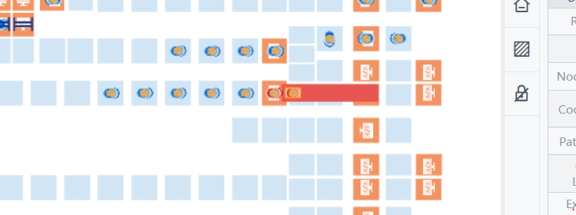
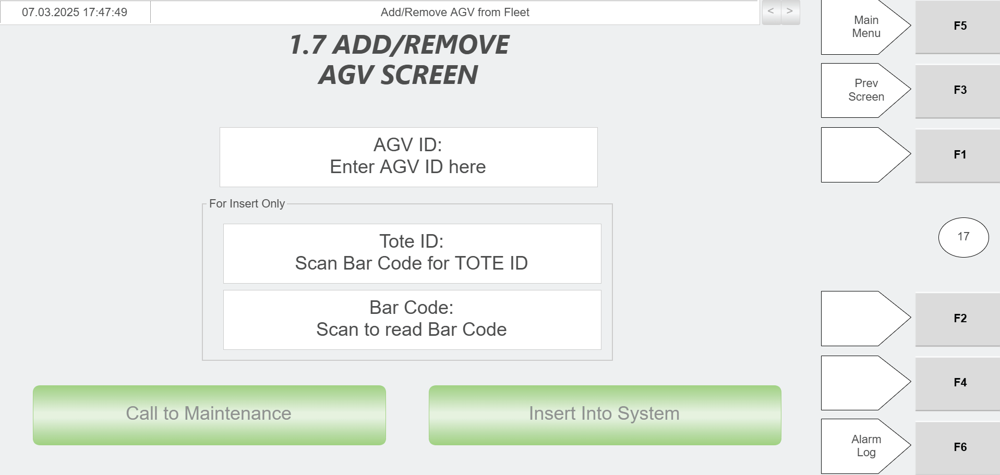

# Recover an AGV That Lost a Tote Without Faulting

## Runbook Header

| Field | Value |
| --- | --- |
| Procedure ID | `proc_recover_an_agv_that_lost_a_tote_without_faulting_v1` |
| Title | Recover an AGV That Lost a Tote Without Faulting |
| Procedure Type | `recovery` |
| Primary Role | `L2_support` |
| Supporting Roles | None |
| Support Safe | No |
| Validation Status | `needs_sme_review` |
| Merge Status | `source_finalized` |

## Summary

Restore an AGV and tote to service after an AGV loses a tote without faulting by stopping RMS, manually moving the AGV to the Hospital, removing and re-adding the AGV at the Hospital station PC, power cycling the AGV, positioning it over the QR code in front of the Inbound Hospital Station, and removing and re-adding the missing tote so the AGV can return the tote to the sorter.

## When To Use

Use when an AGV has lost a tote without faulting and must be restored to service through the Hospital workflow described in section 5.8.2.6.

## Do Not Use For

* Do not use when the AGV is faulted; the packet references separate faulted-AGV recovery content.
* Do not use when the missing tote cannot be removed or added back using the documented tote procedures.
* Do not use when the AGV cannot be physically moved to the Hospital or cannot be re-added through the Hospital station PC.

## Safety And Operational Notes

* This procedure is not marked support-safe in the candidate.
* The procedure includes E-stop use, brake release use, manual AGV movement, and AGV power cycling.
* Only maintenance or a supervisor should remove an AGV from the system, per the Add/Remove AGV source reference attached to the Hospital HMI screen artifact.

## Access Or Tools Needed

* Access to RMS E-stop control
* Physical access to the AGV
* Access to the AGV brake release
* Access to the Hospital area
* Access to the Hospital station PC
* Access to the Inbound Hospital Station QR code location
* Access to documented Add/Remove AGV procedure
* Access to documented Remove Tote procedure
* Access to documented Add Tote procedure

## Related Operational Context

* ctx_manual_hospital_hmi_agv_management_v1
* ctx_manual_rms_estop_resume_reference_v1

## Procedure Steps

### Step 1 — E-stop the RMS

**Responsible role:** L2_support

**Instruction:**
E-stop the RMS before beginning recovery of the AGV that lost a tote without faulting.

**Expected result:**
RMS is in an E-stopped or shut-down state suitable for recovery work.

**Screens / Images:**

*System shut-down mode visual context for stopped system state.*

*Recovery-related screen context showing E-stop use in AGV/tote recovery.*

**Stop or Escalate If:**

* RMS cannot be E-stopped.
* The system does not enter a stopped state needed for recovery.

---

### Step 2 — Release the AGV brake

**Responsible role:** L2_support

**Instruction:**
Press the brake release on the AGV that lost a tote.

**Expected result:**
The AGV brake is released so the AGV can be rolled manually.

**Stop or Escalate If:**

* The brake release cannot be used.
* The AGV cannot be prepared for manual movement.

---

### Step 3 — Move the AGV to the Hospital

**Responsible role:** L2_support

**Instruction:**
Push the AGV over to the Hospital.

**Expected result:**
The AGV is physically positioned at the Hospital.

**Screens / Images:**

*Hospital station area context for tote handling and AGV arrival.*

**Stop or Escalate If:**

* The AGV cannot be moved to the Hospital.
* The Hospital area cannot be accessed for recovery.

---

### Step 4 — Remove and re-add the AGV at the Hospital station PC

**Responsible role:** L2_support

**Instruction:**
At the Hospital station PC, remove the AGV and then add the AGV back into the system.

**Expected result:**
The AGV is removed and then reinserted into the system through the Hospital station interface.

**Screens / Images:**

*AGV ID entry and the Hospital HMI controls used to remove an AGV and INSERT INTO SYSTEM.*

*Related AGV Remove AGV and Recover AGV controls context.*

**Stop or Escalate If:**

* The Hospital station PC/Hospital HMI does not allow AGV removal.
* The AGV cannot be added back into the system.
* Required AGV management controls are unavailable.

---

### Step 5 — Power cycle the AGV

**Responsible role:** L2_support

**Instruction:**
Turn the AGV off, then turn it on again.

**Expected result:**
The AGV powers back on and proceeds toward a normal status indication.

**Stop or Escalate If:**

* The AGV does not power back on.
* The AGV lights do not turn green after the power cycle.

---

### Step 6 — Position the AGV over the Inbound Hospital Station QR code

**Responsible role:** L2_support

**Instruction:**
When the AGV lights turn green, roll it over the QR code in front of the Inbound Hospital Station.

**Expected result:**
The AGV is positioned over the QR code in front of the Inbound Hospital Station.

**Stop or Escalate If:**

* The AGV lights do not turn green.
* The AGV cannot be positioned over the QR code in front of the Inbound Hospital Station.

---

### Step 7 — Locate the missing tote and remove it from the system

**Responsible role:** L2_support

**Instruction:**
Locate the missing tote and bring it to the Hospital to remove it from the system.

**Expected result:**
The missing tote is at the Hospital and has been removed from the system using the documented tote-removal process.

**Screens / Images:**

*Hospital HMI tote scan fields and REMOVE TOTE button.*

*Hospital station tote handling flow, including scanning tote barcode and extracting tote from the system.*

**Stop or Escalate If:**

* The missing tote cannot be located.
* The tote cannot be removed from the system using the documented tote procedure.

---

### Step 8 — Add the tote back into the system

**Responsible role:** L2_support

**Instruction:**
Add the tote back into the system. The AGV should then take the tote back to the sorter.

**Expected result:**
The tote is added back into the system and the AGV takes the tote back to the sorter.

**Screens / Images:**

*Add Tote screen workflow: scan tote barcode, verify Tote ID, and press Confirm & Execute.*

*Hospital station tote placement context if the tote is going back into the system.*

**Stop or Escalate If:**

* The tote cannot be added back using the documented Add Tote procedure.
* The AGV does not take the tote back to the sorter after tote add-back.

---

## Success Criteria

* The AGV has been removed and added back into the system at the Hospital station PC.
* The AGV lights turn green after the power cycle.
* The AGV is rolled over the QR code in front of the Inbound Hospital Station.
* The missing tote is located, removed from the system, and added back into the system.
* The AGV takes the tote back to the sorter.

## Failure Conditions

* Brake release cannot be used.
* AGV cannot be moved to the Hospital.
* AGV cannot be removed and added back at the Hospital station PC.
* AGV lights do not turn green after the power cycle.
* Missing tote cannot be located.
* Missing tote cannot be removed and re-added using the documented tote procedures.
* After tote add-back, the AGV does not take the tote back to the sorter.

## Escalation Guidance

* Escalate if the brake release cannot be used or the AGV cannot be moved to the Hospital.
* Escalate if the AGV cannot be removed and added back at the Hospital station PC.
* Escalate if the AGV lights do not turn green after the power cycle.
* Escalate if the missing tote cannot be located or cannot be removed and re-added using the documented tote procedures.

## Missing Details / Known Gaps

* The packet does not provide the exact RMS resume step for this specific procedure, so no resume action was added.
* The packet does not provide the exact Hospital station PC field-by-field sequence for AGV removal/add-back in section 5.8.2.6 beyond remove then add back.
* The packet does not provide a visual artifact for the QR code in front of the Inbound Hospital Station.
* The packet does not provide an estimated completion time.
* The packet does not explicitly state whether production stop or LOTO is required for this procedure.

## Source Lineage

- Candidate IDs: candidate_l2_recover_agv_lost_tote_no_fault
- Source ID: `manual_optisweep_om_v3`
- Source Type: `manual`
