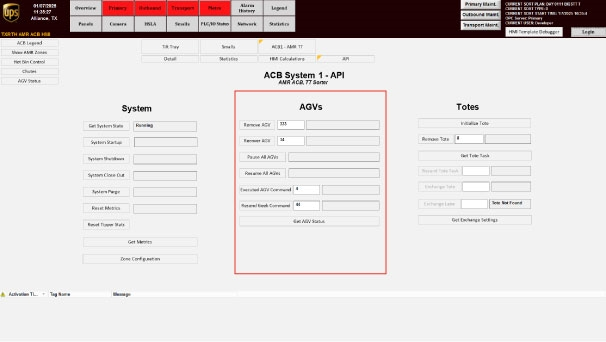
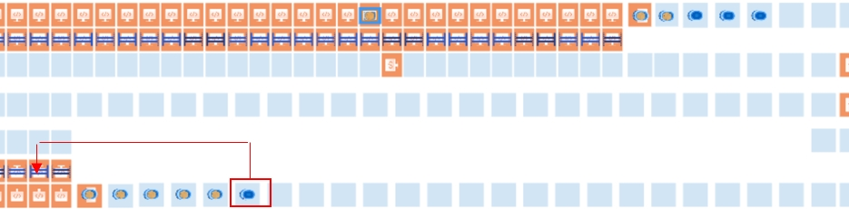
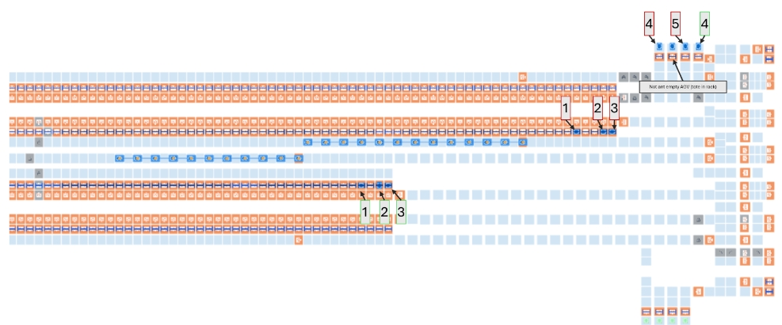

# Recover Empty AGVs That Lost Tasks After an RMS Restart

## Runbook Header

| Field | Value |
| --- | --- |
| Procedure ID | `proc_recover_empty_agvs_that_lost_tasks_after_rms_restart_v1` |
| Title | Recover Empty AGVs That Lost Tasks After an RMS Restart |
| Procedure Type | `recovery` |
| Primary Role | `L2_support` |
| Supporting Roles | None |
| Support Safe | No |
| Validation Status | `needs_sme_review` |
| Merge Status | `source_finalized` |

## Summary

Restore empty AGVs after task loss caused by an RMS restart by stopping RMS, removing and re-adding AGVs without totes twice using Tote API Controls, verifying the documented HMI state when restart is involved, and then resuming RMS using the documented start procedure.

## When To Use

Use when empty AGVs have lost their tasks because the RMS was restarted.

## Do Not Use For

* Do not use for AGVs with totes; this candidate and source evidence are specific to empty AGVs without totes.
* Do not use to assume restart readiness if AGVs are not in the documented "szonestaging" state when restart-related actions are required.

## Safety And Operational Notes

* This procedure includes E-stop use and system recovery actions.
* If the system needs to be restarted, make sure the AGVs are in the "szonestaging" state.
* The manual notes that the best practice is to shut down and restart to ensure everything is in sync.

## Access Or Tools Needed

* RMS access
* Tote API Controls
* HMI access to AGV state/status

## Related Operational Context

* ctx_manual_agvs_lost_tasks_recovery_context_v1
* ctx_manual_agv_szonestaging_status_v1

## Procedure Steps

### Step 1 — E-stop RMS

**Responsible role:** L2_support

**Instruction:**
E-stop RMS.

**Expected result:**
RMS is stopped so AGV recovery actions can be performed.

**Stop or Escalate If:**

* RMS cannot be E-stopped as required by the documented recovery procedure.

---

### Step 2 — Remove and re-add empty AGVs twice

**Responsible role:** L2_support

**Instruction:**
Remove and re-add AGVs without totes twice using the Tote API Controls referenced by the manual.

**Expected result:**
The affected empty AGVs have been removed and re-added twice through the documented controls.

**Screens / Images:**

*AGV API Controls for Remove AGV and Recover AGV functions used to remove and add AGVs back into the system.*

**Stop or Escalate If:**

* The AGV has a tote; this source-backed procedure is for AGVs without totes.
* Tote API Controls needed for Remove AGV or Recover AGV are not available.
* The AGV cannot be successfully removed and re-added twice.

---

### Step 3 — Verify AGVs are in "szonestaging" before restart-related actions

**Responsible role:** L2_support

**Instruction:**
If the system is to be restarted, verify on the HMI that the AGVs are in the "szonestaging" state.

**Expected result:**
The AGV state shown on the HMI is confirmed as "szonestaging" when restart-related actions are needed.

**Screens / Images:**

*The recovery screen context associated with verifying AGV status is "szonestaging" on the HMI.*

**Stop or Escalate If:**

* AGVs are not in the documented "szonestaging" state before restart-related actions.
* AGV state cannot be verified on the HMI.

---

### Step 4 — Press the E-stop again when ready to resume

**Responsible role:** L2_support

**Instruction:**
Press the E-stop again when ready to resume.

**Expected result:**
The documented pre-resume E-stop action has been completed.

**Stop or Escalate If:**

* System is not ready to resume after recovery actions.
* Required restart-related verification has not been completed when applicable.

---

### Step 5 — Resume RMS using the documented start procedure

**Responsible role:** L2_support

**Instruction:**
Resume RMS using the documented system start procedure.

**Expected result:**
RMS is resumed using the referenced starting procedure.

**Screens / Images:**

*System shut-down/startup context associated with restarting and resuming the system.*

**Stop or Escalate If:**

* RMS cannot be resumed using the documented start procedure.
* AGVs are not in the required state for restart-related actions when applicable.

---

## Success Criteria

* Empty AGVs that lost tasks have been removed and re-added twice using Tote API Controls.
* When restart-related actions are involved, AGVs are verified on the HMI to be in the "szonestaging" state.
* RMS is resumed using the documented system start procedure.

## Failure Conditions

* RMS cannot be E-stopped or resumed as required.
* Affected AGVs cannot be removed and re-added twice.
* AGVs are not in the documented "szonestaging" state before restart-related actions.
* The required HMI state cannot be verified.
* System synchronization concerns remain after recovery actions.

## Escalation Guidance

* Do not assume readiness if AGVs are not in the documented "szonestaging" state before restart-related actions.
* If recovery does not restore synchronization, follow the manual note that best practice is to shut down and restart to ensure everything is in sync.
* Escalate if RMS stop/resume actions or AGV remove/re-add actions cannot be completed with the documented controls.

## Missing Details / Known Gaps

* The source packet does not provide the exact control/button sequence for E-stop RMS.
* The source packet does not provide the exact click-by-click Tote API Controls sequence for removing and re-adding AGVs twice.
* The source packet references "Starting the System" on page 65 but does not include that procedure text in this packet.
* The source packet does not provide an estimated completion time.
* The source packet does not explicitly state whether production stop or LOTO is required.

## Source Lineage

- Candidate IDs: candidate_l2_recover_empty_agvs_lost_tasks_after_rms_restart
- Source ID: `manual_optisweep_om_v3`
- Source Type: `manual`
