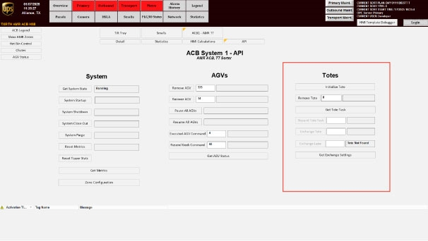

# Remove An AGV From The System Using The API Screen

## Runbook Header

| Field | Value |
| --- | --- |
| Procedure ID | `proc_remove_an_agv_from_the_system_using_the_api_screen_v1` |
| Title | Remove An AGV From The System Using The API Screen |
| Procedure Type | `recovery` |
| Primary Role | `L2_support` |
| Supporting Roles | None |
| Support Safe | No |
| Validation Status | `needs_sme_review` |
| Merge Status | `source_finalized` |

## Summary

Remove a specified AGV from the system from the AGVs section of the API screen by entering the AGV ID and using the Remove AGV control. The source also states that if the AGV has an issue it must be physically removed from the system, and if it has a tote it must be taken to the hospital where the tote is removed and later recovered when put back in the system.

## When To Use

Use when a specified AGV must be removed from the system using its AGV ID from the AGVs section of the API screen, including recovery situations where the AGV has an issue and must be removed from service.

## Do Not Use For

* Do not use for adding an AGV back into the system; the source identifies Recover AGV as the add-back control.
* Do not use when detailed hospital tote removal or tote recovery instructions are required beyond the brief source note in this section.

## Safety And Operational Notes

* The source states that if an AGV has an issue, it must be physically removed from the system.
* If the AGV has a tote, it must be taken to the hospital where the tote is removed.
* This source section does not provide detailed physical handling or hospital safety steps; follow site-specific safety and handling procedures.

## Access Or Tools Needed

* Access to the System HMI API screen
* AGVs section of the API screen
* AGV ID
* Physical access to remove the AGV from the system
* Access to the hospital area for tote removal

## Related Operational Context

* ctx_manual_tote_api_controls_overview_v1
* ctx_manual_tote_api_controls_agv_recovery_reference_v1

## Procedure Steps

### Step 1 — Open the AGVs section of the API screen

**Responsible role:** L2_support

**Instruction:**
Open the API screen and navigate to the AGVs section.

**Expected result:**
The AGVs section of the API screen is visible.

**Screens / Images:**

*API screen entry point and overall ACB API interface.*

*AGVs section of the API screen and the Remove AGV control.*

**Stop or Escalate If:**

* The API screen cannot be opened.
* The AGVs section is not available.

---

### Step 2 — Locate the Remove AGV control and AGV ID field

**Responsible role:** L2_support

**Instruction:**
In the AGVs section, locate the Remove AGV control and the AGV ID entry field.

**Expected result:**
The Remove AGV control and AGV ID field are identified and ready for use.

**Screens / Images:**

*Remove AGV control and AGV ID entry area in the AGV API Controls screen.*

**Stop or Escalate If:**

* The Remove AGV control is missing.
* The AGV ID entry field is not present or not usable.

---

### Step 3 — Enter the AGV ID

**Responsible role:** L2_support

**Instruction:**
Enter the AGV ID for the AGV to be removed.

**Expected result:**
The target AGV ID is entered in the AGV ID field.

**Screens / Images:**

*AGV ID entry field used with Remove AGV.*

**Stop or Escalate If:**

* The correct AGV ID is not known.
* The AGV ID cannot be entered.

---

### Step 4 — Use Remove AGV to remove the AGV from the system

**Responsible role:** L2_support

**Instruction:**
Use the Remove AGV control to remove that AGV from the system.

**Expected result:**
The specified AGV is removed from the system.

**Screens / Images:**

*Remove AGV control in the AGV API Controls screen.*

**Stop or Escalate If:**

* The AGV is not removed from the system after using Remove AGV.
* The system does not accept the removal action.

---

### Step 5 — Physically remove the AGV if it has an issue

**Responsible role:** L2_support

**Instruction:**
If the AGV has an issue, physically remove the AGV from the system.

**Expected result:**
The issue-affected AGV is physically removed from the system.

**Screens / Images:**

*Hospital HMI Add/Remove AGV screen associated with removing an AGV from service.*

**Stop or Escalate If:**

* The AGV cannot be physically removed from the system.
* Physical removal requires additional undocumented handling steps.

---

### Step 6 — Take a tote-carrying AGV to the hospital and remove the tote

**Responsible role:** L2_support

**Instruction:**
If the AGV has a tote, take the AGV to the hospital and remove the tote there.

**Expected result:**
The tote is removed from the AGV at the hospital.

**Screens / Images:**

*Hospital HMI Add/Remove AGV screen for AGV handling at the hospital station.*

**Stop or Escalate If:**

* The AGV cannot be taken to the hospital.
* The tote cannot be removed at the hospital.
* Detailed hospital handling instructions are needed but not available in this source section.

---

### Step 7 — Return the tote to the system for recovery

**Responsible role:** L2_support

**Instruction:**
Return the tote to the system so it can be recovered when it is put back in the system.

**Expected result:**
The tote is returned for recovery back into the system.

**Screens / Images:**

*Add Tote or confirmation-related screen associated with returning a tote into the system.*

*Tote API Controls area relevant to tote-related system actions.*

**Stop or Escalate If:**

* The tote cannot be returned to the system.
* The tote recovery process cannot be completed with available documented procedures.

---

## Success Criteria

* The specified AGV is removed from the system using the AGV ID.
* If the AGV had an issue, it is physically removed from the system.
* If the AGV had a tote, the tote is removed at the hospital and returned to the system for recovery.

## Failure Conditions

* The API screen or AGVs section cannot be accessed.
* The Remove AGV control or AGV ID field cannot be used.
* The AGV is not removed from the system after the removal action.
* A problem AGV cannot be physically removed from the system.
* A tote on the AGV cannot be removed at the hospital or cannot be returned for recovery.

## Escalation Guidance

* Escalate if the AGV cannot be removed from the system using the API screen.
* Escalate if the AGV has an issue and cannot be physically removed from the system.
* Escalate if tote removal at the hospital cannot be completed.
* Escalate if tote recovery back into the system cannot be completed with available documented procedures.
* Escalate when additional physical handling, confirmation prompts, or hospital workflow details are required but not provided in this source.

## Missing Details / Known Gaps

* The source does not provide exact button press order beyond entering the AGV ID and using Remove AGV.
* The source does not provide confirmation prompts, validation messages, or post-removal verification details.
* The source does not provide detailed physical removal instructions for the AGV.
* The source does not provide detailed hospital tote removal workflow in this section.
* The source does not provide a complete tote recovery procedure in this section.
* The source does not specify whether production stop or LOTO is required.

## Source Lineage

- Candidate IDs: candidate_l2_remove_agv_from_system_by_agv_id
- Source ID: `manual_optisweep_om_v3`
- Source Type: `manual`
