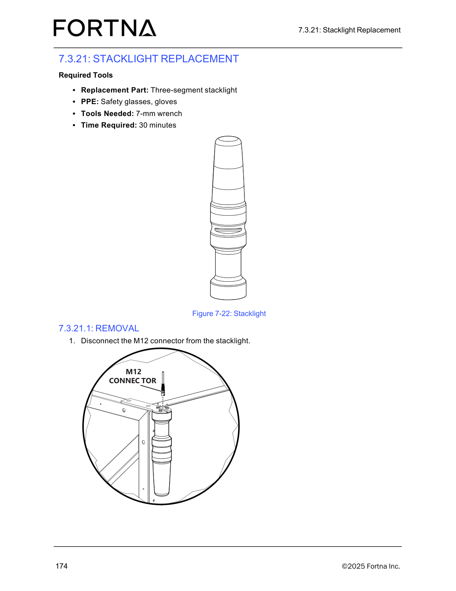

# Begin Stacklight Removal by Disconnecting the M12 Connector

## Runbook Header

| Field | Value |
| --- | --- |
| Procedure ID | `proc_begin_stacklight_removal_by_disconnecting_the_m12_connector_v1` |
| Title | Begin Stacklight Removal by Disconnecting the M12 Connector |
| Procedure Type | `recovery` |
| Primary Role | `L2_support` |
| Supporting Roles | None |
| Support Safe | No |
| Validation Status | `needs_sme_review` |
| Merge Status | `source_finalized` |

## Summary

This source-specific maintenance runbook captures the documented initial stacklight replacement removal activity from the OptiSweep Operation and Maintenance Manual. The source supports required PPE, required replacement part and tool context, an estimated duration, and one explicit removal instruction: disconnect the M12 connector from the stacklight.

## When To Use

Use this runbook when beginning the documented stacklight replacement removal procedure and the task to be performed is the initial source-supported action of disconnecting the M12 connector from the stacklight.

## Do Not Use For

* Do not use this runbook as a complete stacklight replacement procedure.
* Do not use this runbook for reinstallation, restoration, or any additional removal steps not present in the supplied source excerpt.
* Do not use this runbook when additional maintenance controls are required but are not specified in this source excerpt.

## Safety And Operational Notes

* Wear safety glasses.
* Wear gloves.
* The supplied source excerpt is incomplete and supports only the initial removal action.
* Stop and escalate if additional removal, replacement, or restoration steps are needed but are not present in the source.

## Access Or Tools Needed

* Replacement three-segment stacklight
* Safety glasses
* Gloves
* 7-mm wrench
* Physical access to the stacklight and its M12 connector

## Related Operational Context

* ctx_manual_stacklight_component_reference_v1
* ctx_manual_stacklight_replacement_safety_v1

## Procedure Steps

### Step 1 — Gather documented replacement items and PPE

**Responsible role:** L2_support

**Instruction:**
Gather the documented items for stacklight replacement: replacement three-segment stacklight, safety glasses, gloves, and a 7-mm wrench.

**Expected result:**
The documented replacement part, PPE, and tool are available for the task.

**Screens / Images:**

*Use the stacklight photo as the source-supported visual reference for the component involved in this replacement task.*

**Stop or Escalate If:**

* Required PPE is not available.
* The replacement three-segment stacklight is not available.
* The 7-mm wrench is not available.

---

### Step 2 — Identify the stacklight to be replaced

**Responsible role:** L2_support

**Instruction:**
Identify the stacklight to be replaced using the source-supported stacklight visual reference.

**Expected result:**
The stacklight targeted for replacement is identified.

**Screens / Images:**

*Look at Figure 7-22 to identify the stacklight component referenced by the replacement procedure.*

**Stop or Escalate If:**

* The stacklight cannot be identified with confidence.
* The physical component does not match the source-supported visual reference.

---

### Step 3 — Locate the M12 connector on the stacklight

**Responsible role:** L2_support

**Instruction:**
Locate the M12 connector on the stacklight using the source-supported stacklight reference.

**Expected result:**
The M12 connector associated with the stacklight is located.

**Screens / Images:**

*Use the stacklight photo to orient to the stacklight assembly and locate the connector area referenced by the procedure.*

**Stop or Escalate If:**

* The M12 connector cannot be located.
* The connector location is unclear from the source-supported material.
* Physical access to the connector is not available.

---

### Step 4 — Disconnect the M12 connector from the stacklight

**Responsible role:** L2_support

**Instruction:**
Disconnect the M12 connector from the stacklight.

**Expected result:**
The M12 connector is disconnected from the stacklight.

**Screens / Images:**

*Use the stacklight photo as the visual reference for the component while disconnecting the M12 connector.*

**Stop or Escalate If:**

* The connector cannot be disconnected.
* Additional removal or replacement steps are needed but are not present in the source excerpt.
* The component or connector does not match the source-supported reference.

---

## Success Criteria

* The documented PPE and tool context have been prepared.
* The correct stacklight has been identified.
* The M12 connector on the stacklight has been located.
* The M12 connector is disconnected from the stacklight.

## Failure Conditions

* Required PPE, replacement part, or tool is missing.
* The stacklight cannot be identified.
* The M12 connector cannot be located or accessed.
* The M12 connector cannot be disconnected.
* Additional removal, replacement, or restoration steps are required but not present in the source excerpt.

## Escalation Guidance

* Stop and escalate if the task requires steps beyond disconnecting the M12 connector from the stacklight.
* Stop and escalate if the source excerpt is insufficient to safely continue the replacement.
* Stop and escalate if the stacklight or connector cannot be confidently identified from the supplied source and artifact.

## Missing Details / Known Gaps

* The supplied source excerpt does not provide the full stacklight replacement procedure.
* The supplied source excerpt does not provide reinstallation or restoration steps.
* The supplied source excerpt does not explicitly state whether production stop is required.
* The supplied source excerpt does not explicitly state whether LOTO is required.
* The supplied source excerpt does not provide detailed connector handling technique beyond the instruction to disconnect it.

## Source Lineage

- Candidate IDs: candidate_l2_remove_stacklight_disconnect_m12
- Source ID: `manual_optisweep_om_v3`
- Source Type: `manual`
