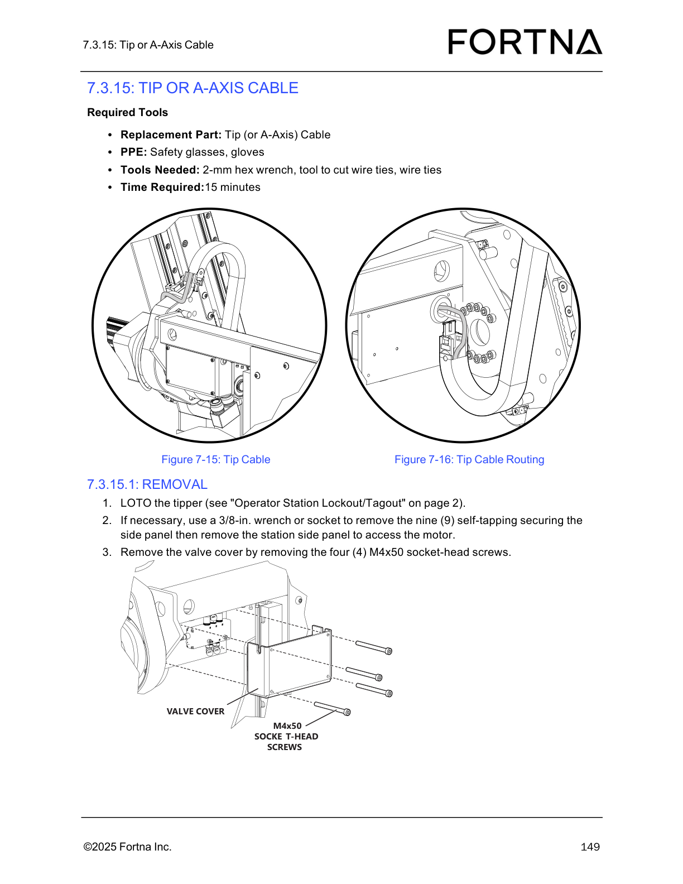

# Remove the Tip or A-Axis Cable

## Runbook Header

| Field | Value |
| --- | --- |
| Procedure ID | `proc_remove_the_tip_or_a_axis_cable_v1` |
| Title | Remove the Tip or A-Axis Cable |
| Procedure Type | `recovery` |
| Primary Role | `L2_support` |
| Supporting Roles | None |
| Support Safe | No |
| Validation Status | `needs_sme_review` |
| Merge Status | `source_finalized` |

## Summary

Safely remove the existing tip or A-axis cable from the tipper by locking out the equipment, gaining access to the cable path, disconnecting the four M8 connectors, opening the cable carrier, documenting and cutting cable ties, unplugging the cable from the A-axis PCA, and preserving cable markings for replacement.

## When To Use

Use this procedure when the documented maintenance task is to remove the existing Tip or A-Axis cable so it can be replaced on the tipper assembly.

## Do Not Use For

* General operator use
* Situations where the referenced Operator Station Lockout/Tagout procedure is unavailable or cannot be completed
* Tasks requiring installation of the replacement cable; this runbook covers removal only

## Safety And Operational Notes

* This procedure is not support-safe for general operator use.
* LOTO the tipper using the referenced Operator Station Lockout/Tagout procedure before beginning removal.
* Use safety glasses and gloves.
* Preserve routing and tie-position evidence by marking the cable and taking a picture before removal.

## Access Or Tools Needed

* Access to the tipper
* Operator Station Lockout/Tagout procedure
* Replacement Tip or A-Axis Cable
* Safety glasses
* Gloves
* 2-mm hex wrench
* 3/8-in. wrench or socket if side panel removal is necessary
* Tool to cut wire ties
* Wire ties
* Tape or marker
* Camera or phone to take a picture of cable tie placement

## Procedure Steps

### Step 1 — Lock out and tag out the tipper

**Responsible role:** L2_support

**Instruction:**
LOTO the tipper using the referenced Operator Station Lockout/Tagout procedure before performing any removal work.

**Expected result:**
The tipper is in the required lockout/tagout state for maintenance.

**Stop or Escalate If:**

* The referenced lockout/tagout procedure is not available
* Lockout/tagout cannot be completed

---

### Step 2 — Remove the station side panel if needed

**Responsible role:** L2_support

**Instruction:**
If necessary, use a 3/8-in. wrench or socket to remove the nine self-tapping screws securing the side panel, then remove the station side panel to access the motor.

**Expected result:**
The side panel is removed when needed and the motor access area is exposed.

**Screens / Images:**

*Side panel access context for the Tip Cable removal procedure.*

*Cable routing context near the motor access area after side panel removal.*

**Stop or Escalate If:**

* The side panel cannot be removed as described
* Access to the motor or cable path cannot be obtained

---

### Step 3 — Remove the valve cover

**Responsible role:** L2_support

**Instruction:**
Remove the valve cover by removing the four M4x50 socket-head screws. Verify the correct cover and fasteners before removal.

**Expected result:**
The valve cover is removed and the covered cable area is accessible.

**Screens / Images:**

*Valve cover area associated with the Tip Cable removal procedure.*

**Stop or Escalate If:**

* The correct cover and fasteners cannot be identified
* The valve cover cannot be removed as described

---

### Step 4 — Disconnect the four M8 connectors

**Responsible role:** L2_support

**Instruction:**
Disconnect all four M8 connectors.

**Expected result:**
All four M8 connectors are disconnected from the cable assembly.

**Screens / Images:**

*The four M8 connectors referenced in the removal procedure.*

**Stop or Escalate If:**

* Any M8 connector cannot be accessed
* Any M8 connector cannot be disconnected as described

---

### Step 5 — Feed the connectors through the grommet

**Responsible role:** L2_support

**Instruction:**
Pull the jacketed part of the cable out of the grommet, then feed the M8 connectors through the grommet one at a time.

**Expected result:**
The cable jacket and all four M8 connectors are passed through the grommet opening.

**Screens / Images:**

*The grommet where the jacketed cable passes through and the connector pass-through path.*

**Stop or Escalate If:**

* The cable cannot be removed from the grommet
* The connectors cannot be fed through the grommet one at a time

---

### Step 6 — Open the cable carrier cross bars

**Responsible role:** L2_support

**Instruction:**
Open all cross bars on the outside of the cable carrier by snapping them open.

**Expected result:**
The cable carrier cross bars are open and the cable is accessible along the carrier path.

**Screens / Images:**

*Cable carrier cross bars that snap open on the outside of the carrier.*

**Stop or Escalate If:**

* The cable carrier cross bars cannot be opened
* The cable remains inaccessible after opening the carrier

---

### Step 7 — Mark the cable at both carrier entry points

**Responsible role:** L2_support

**Instruction:**
Use tape or a marker to mark the cable on both ends where the cable enters the cable carrier.

**Expected result:**
The cable is clearly marked at both ends where it enters the cable carrier.

**Screens / Images:**

*Cable routing path and carrier entry locations to preserve marking positions.*

*Cable carrier entry points where the cable should be marked on both ends.*

**Stop or Escalate If:**

* The cable entry points cannot be identified
* Markings cannot be applied or preserved

---

### Step 8 — Document and cut the cable ties

**Responsible role:** L2_support

**Instruction:**
Note how the cable ties are situated at both ends of the carrier, take a picture, and cut the cable ties holding the cable to the carrier at both ends and at the tie point on the A-axis carriage.

**Expected result:**
Tie placement is documented and the cable is released from the documented tie points.

**Screens / Images:**

*Cable routing and likely tie placement context along the carrier.*

*Cable tie locations at both ends of the carrier and the tie point on the A-axis carriage.*

**Stop or Escalate If:**

* Tie placement cannot be documented before removal
* Cable ties cannot be cut or accessed as described

---

### Step 9 — Unplug the cable from the A-axis PCA and remove it

**Responsible role:** L2_support

**Instruction:**
Unplug the cable from the A-axis PCA and remove the cable from the cable carrier. Cut one more cable tie near the PCA if present.

**Expected result:**
The cable is unplugged from the A-axis PCA and fully removed from the cable carrier and tipper.

**Screens / Images:**

*Cable connection at the A-axis PCA and nearby tie location.*

**Stop or Escalate If:**

* The cable cannot be unplugged from the A-axis PCA
* The cable cannot be removed from the cable carrier
* A tie near the PCA prevents removal and cannot be cleared

---

### Step 10 — Transfer the cable markings to the new cable

**Responsible role:** L2_support

**Instruction:**
Transfer the cable markings to the new cable.

**Expected result:**
The replacement cable carries the same routing reference markings as the removed cable.

**Screens / Images:**

*Routing context that the transferred markings are intended to preserve.*

**Stop or Escalate If:**

* The original cable markings are not available or are unclear
* The replacement cable cannot be marked to preserve routing reference

---

## Success Criteria

* The existing tip or A-axis cable is fully removed from the tipper.
* The cable is disconnected from all four M8 connectors and the A-axis PCA.
* The cable has been removed from the grommet and cable carrier.
* Routing and marking information has been preserved for installation of the replacement cable.

## Failure Conditions

* The referenced lockout/tagout procedure is unavailable or cannot be completed.
* The side panel, valve cover, connectors, cable carrier, or A-axis PCA connection cannot be accessed or removed as described.
* Cable routing or tie-position evidence is not preserved before removal.
* The cable cannot be fully removed from the tipper.

## Escalation Guidance

* Escalate if the referenced lockout/tagout procedure is not available or cannot be completed.
* Escalate if the side panel, valve cover, connectors, cable carrier, or A-axis PCA connection cannot be accessed or removed as described.
* Stop and preserve evidence if cable routing or tie placement cannot be documented before removal.

## Missing Details / Known Gaps

* The packet does not provide the full OCR text of section 7.3.15.1, so step wording is grounded primarily in the candidate and artifact retrieval text.
* No explicit do-not-use cases beyond operator-unsuitable use and inability to complete LOTO are provided by the source packet.
* The packet does not explicitly state whether production stop is required.
* No source-supported command-line or HMI commands are provided.
* Some related artifacts in the packet are from other manual sections and were not attached because they are not source-specific evidence for this procedure.

## Source Lineage

- Candidate IDs: candidate_l2_remove_tip_or_a_axis_cable
- Source ID: `manual_optisweep_om_v3`
- Source Type: `manual`
