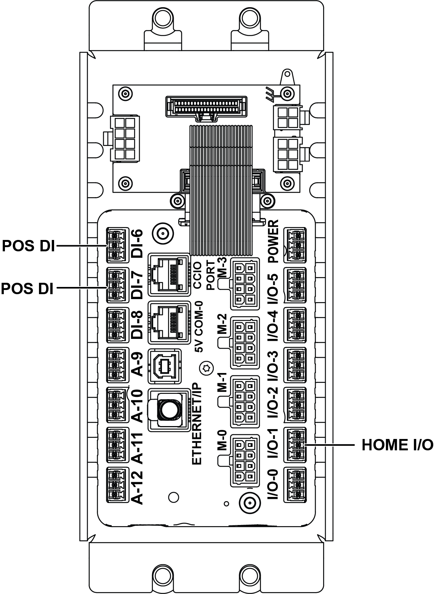

# Replace And Install The ClearLink (CLINK) Controller

## Runbook Header

| Field | Value |
| --- | --- |
| Procedure ID | `proc_replace_and_install_the_clearlink_clink_controller_v1` |
| Title | Replace And Install The ClearLink (CLINK) Controller |
| Procedure Type | `recovery` |
| Primary Role | `L2_support` |
| Supporting Roles | None |
| Support Safe | No |
| Validation Status | `needs_sme_review` |
| Merge Status | `source_finalized` |

## Summary

Install a new ClearLink (CLINK) controller in place of the old controller, secure the controller box and panels, and restart the operator station using the referenced startup procedure.

## When To Use

Use when replacing an existing ClearLink (CLINK) controller with a new controller and restoring the operator station to service, as described in the installation section of the source manual.

## Do Not Use For

* Do not use when connection transfer details are unclear from the source or hardware labeling.
* Do not use as a substitute for the separate operator station startup procedure; the source only references that procedure on page 66 and does not restate it here.

## Safety And Operational Notes

* Do not pinch any wires when feeding excess cable back into the stand.
* Stop if connection transfer details are unclear from the source or hardware labeling.
* Stop if wires cannot be routed back into the stand without pinching.
* Escalate if the operator station does not restart normally after installation.

## Access Or Tools Needed

* Replacement ClearLink (CLINK) controller
* Access to the controller box and stand
* Two (2) M5 socket-head screws
* Four (4) M8 button-head screws
* Access to top and/or bottom side panels if removed
* Documented operator station restart procedure on page 66

## Procedure Steps

### Step 1 — Transfer controller connections

**Responsible role:** L2_support

**Instruction:**
Transfer all the connections from the old controller to the new controller.

**Expected result:**
All connections from the old controller are moved to the new controller.

**Screens / Images:**

*Controller replacement context, connection points, wiring transfer locations, and any labeled ports or terminals related to reconnection.*

*Controller and controller box identification to confirm the correct hardware being replaced.*

**Stop or Escalate If:**

* Stop if connection transfer details are unclear from the source or hardware labeling.

---

### Step 2 — Mount the new controller in the box

**Responsible role:** L2_support

**Instruction:**
Place the new controller in the box and fasten it with the two (2) M5 socket-head screws.

**Expected result:**
The new controller is positioned in the box and secured with the specified screws.

**Stop or Escalate If:**

* Stop if the new controller cannot be secured with the two (2) M5 socket-head screws.

---

### Step 3 — Hang the control box and route excess cable

**Responsible role:** L2_support

**Instruction:**
Hang the control box on the M8 button-head screws on the stand, and feed excess cable back into the stand without pinching any wires.

**Expected result:**
The control box is hung on the stand and excess cable is routed back into the stand without wire damage.

**Screens / Images:**

*Controller replacement context on page 159 for control box placement and cable routing orientation.*

*Controller box location and replacement context relative to the stand.*

**Stop or Escalate If:**

* Stop if wires cannot be routed back into the stand without pinching.
* Stop if the control box cannot be properly hung on the M8 button-head screws on the stand.

---

### Step 4 — Tighten the controller box mounting screws

**Responsible role:** L2_support

**Instruction:**
Tighten the four (4) M8 button-head screws securing the controller box to the stand.

**Expected result:**
The controller box is firmly secured to the stand.

**Screens / Images:**

*Controller replacement context showing controller box mounting area on page 159.*

*Controller box location to confirm the correct mounting assembly.*

**Stop or Escalate If:**

* Stop if the controller box cannot be secured to the stand with the four (4) M8 button-head screws.

---

### Step 5 — Reinstall side panels if necessary

**Responsible role:** L2_support

**Instruction:**
Reinstall the top and/or bottom side panels, if necessary.

**Expected result:**
Any removed top and/or bottom side panels are reinstalled.

**Stop or Escalate If:**

* Stop if required top and/or bottom side panels cannot be reinstalled.

---

### Step 6 — Restart the operator station

**Responsible role:** L2_support

**Instruction:**
Re-start the operator station using the documented procedure referenced as "Starting The Operator Station" on page 66.

**Expected result:**
The operator station restarts normally using the referenced startup procedure.

**Stop or Escalate If:**

* Escalate if the operator station does not restart normally after installation.

---

## Success Criteria

* All connections from the old controller have been transferred to the new controller.
* The new controller is installed in the box and fastened with two (2) M5 socket-head screws.
* The control box is hung on the stand, excess cable is routed back into the stand without pinching wires, and the four (4) M8 button-head screws are tightened.
* Any necessary top and/or bottom side panels are reinstalled.
* The operator station restarts normally using the referenced startup procedure.

## Failure Conditions

* Connection transfer details are unclear from the source or hardware labeling.
* Wires cannot be routed back into the stand without pinching.
* The controller or controller box cannot be secured with the specified hardware.
* Required side panels cannot be reinstalled.
* The operator station does not restart normally after installation.

## Escalation Guidance

* Stop work if connection transfer details are unclear from the source or hardware labeling.
* Stop work if excess cable cannot be routed back into the stand without pinching wires.
* Escalate if the operator station does not restart normally after installation.

## Missing Details / Known Gaps

* The source packet does not provide the detailed startup steps for "Starting The Operator Station"; it only references page 66.
* The source packet does not provide torque values for the M5 or M8 hardware used in this installation section.
* The source packet does not provide explicit LOTO requirements for this installation section.
* The source packet does not provide a time estimate for this installation section.
* The source packet does not provide detailed connection mapping beyond instructing transfer from old controller to new controller.

## Source Lineage

- Candidate IDs: candidate_l2_replace_and_install_clearlink_controller
- Source ID: `manual_optisweep_om_v3`
- Source Type: `manual`
