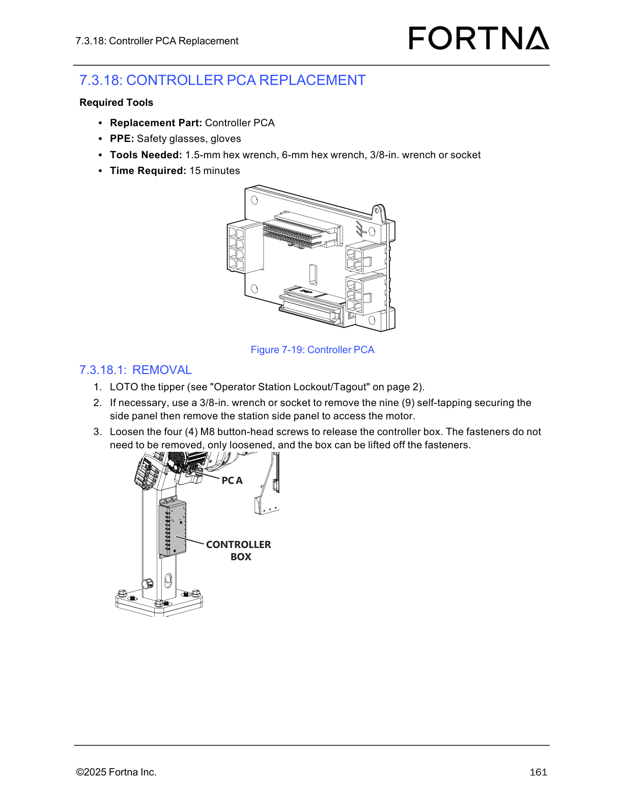

# Replace the Flat-Flex Cable (FFC) on the Tipper

## Runbook Header

| Field | Value |
| --- | --- |
| Procedure ID | `proc_replace_flat_flex_cable_on_tipper_v1` |
| Title | Replace the Flat-Flex Cable (FFC) on the Tipper |
| Procedure Type | `recovery` |
| Primary Role | `L2_support` |
| Supporting Roles | None |
| Support Safe | No |
| Validation Status | `needs_sme_review` |
| Merge Status | `source_finalized` |

## Summary

Remove the existing flat-flex cable and install a replacement FFC through the A-axis PCA, cable carrier, column, and controller PCA, then return the operator station to service.

## When To Use

Use this procedure when the tipper flat-flex cable requires replacement and the source-supported replacement path includes the A-axis PCA, cable carrier, column, and controller PCA.

## Do Not Use For

* Do not use this procedure if cable routing, loop size, clamp placement, or connection orientation cannot be matched to the removed cable using source-backed observations.
* Do not use this procedure to interchange left and right ClearLink controller hardware; the source notes the hardware is the same but not interchangeable because IP addresses are different.

## Safety And Operational Notes

* LOTO the tipper before beginning this replacement.
* Use safety glasses and gloves.
* Do not remove the four M8 button-head screws when releasing the controller box; loosen them and lift the box off the loosened fasteners.
* Make sure no wires are pinched when rehanging the control box and feeding excess cable back into the stand.
* Ensure the correct controller is installed; left and right ClearLink controller hardware is the same but not interchangeable because IP addresses are different.

## Access Or Tools Needed

* Replacement flat-flex cable
* Safety glasses
* Gloves
* 3/8-in. wrench or socket
* 4-mm hex wrench
* 6-mm hex wrench
* Tool to cut wire ties
* Wire ties
* Access to the tipper and controller box
* Access to the referenced LOTO and operator station restart procedures

## Procedure Steps

### Step 1 — Lock out and tag out the tipper

**Responsible role:** L2_support

**Instruction:**
LOTO the tipper using the referenced Operator Station Lockout/Tagout procedure before beginning the flat-flex cable replacement.

**Expected result:**
The tipper is in a locked out and tagged out state and safe for maintenance access.

**Stop or Escalate If:**

* The referenced LOTO procedure is not available.
* The tipper cannot be placed in a locked out/tagged out state.

---

### Step 2 — Gather replacement part, PPE, and tools

**Responsible role:** L2_support

**Instruction:**
Gather the replacement flat-flex cable, safety glasses, gloves, 3/8-in. wrench or socket, 4-mm hex wrench, 6-mm hex wrench, tool to cut wire ties, and wire ties.

**Expected result:**
All listed parts, PPE, and tools are available at the work area.

**Stop or Escalate If:**

* The replacement flat-flex cable is not available.
* Required PPE or tools are not available.

---

### Step 3 — Remove the station side panel if needed

**Responsible role:** L2_support

**Instruction:**
If necessary, remove the nine self-tapping screws with a 3/8-in. wrench or socket and remove the station side panel to access the motor.

**Expected result:**
The side panel is removed when needed and the internal access area is exposed.

**Screens / Images:**

*Overall flat-flex cable area and related clamp hardware after access is opened.*

**Stop or Escalate If:**

* The side panel cannot be removed without damage.
* Required access to the motor or cable area is still not available after panel removal.

---

### Step 4 — Replace the FFC at the A-axis PCA

**Responsible role:** L2_support

**Instruction:**
At the A-axis PCA, remove the four M3 socket-head screws holding the two FFC clamps, unplug the old FFC, plug in the new FFC, and reinstall the FFC clamps with the M3 socket-head screws.

**Expected result:**
The new FFC is connected at the A-axis PCA and the two FFC clamps are reinstalled.

**Screens / Images:**

*FFC clamps and M3 socket-head screw hardware used during flat-flex cable replacement.*

*Tip PCA / A-axis PCA connection area for the FFC.*

**Stop or Escalate If:**

* The connection orientation cannot be matched to the removed cable.
* The clamps or M3 socket-head screws cannot be reinstalled correctly.

---

### Step 5 — Document the existing cable routing

**Responsible role:** L2_support

**Instruction:**
Note how the old FFC routes into the cable carrier and take a picture before removal.

**Expected result:**
A visual reference of the original routing is captured for comparison during installation.

**Screens / Images:**

*Routing path reference to compare with the existing cable path into the cable carrier.*

**Stop or Escalate If:**

* The original routing cannot be observed clearly enough to document.
* The cable path cannot be matched later to the removed condition.

---

### Step 6 — Remove carrier-end clamp hardware and wire ties

**Responsible role:** L2_support

**Instruction:**
Remove the M3 socket-head screws holding the FFC clamps, cut the one wire tie at both ends of the cable carrier, and remove the FFC clamps from the FFC while noting how the FFC feeds through the clamp.

**Expected result:**
The old FFC is released from the cable carrier entry hardware and the clamp orientation is noted.

**Screens / Images:**

*Clamp hardware associated with the flat-flex cable.*

*Cable routing and entry area reference for the cable carrier.*

**Stop or Escalate If:**

* Clamp position or feed orientation through the clamp cannot be determined.
* The cable carrier end hardware cannot be removed cleanly.

---

### Step 7 — Remove the old FFC from the cable carrier

**Responsible role:** L2_support

**Instruction:**
Pull the old FFC through and out of the cable carrier.

**Expected result:**
The old FFC is fully removed from the cable carrier.

**Stop or Escalate If:**

* The old FFC cannot be removed from the cable carrier.
* Unexpected obstruction or damage is encountered in the cable carrier.

---

### Step 8 — Feed the new FFC through the cable carrier

**Responsible role:** L2_support

**Instruction:**
Feed the new FFC through the cable carrier, paying attention to how the FFC loops as it enters the cable carrier.

**Expected result:**
The new FFC is routed through the cable carrier with loop behavior matching the removed cable as closely as possible.

**Screens / Images:**

*Routing path and loop behavior reference for the cable entering the carrier.*

**Stop or Escalate If:**

* The loop size or routing cannot be matched to the removed cable.
* The cable does not feed cleanly through the carrier.

---

### Step 9 — Install and position the carrier-entry clamp

**Responsible role:** L2_support

**Instruction:**
Install the FFC clamp onto the FFC as it enters the cable carrier, making sure the small leg is under the FFC; adjust the clamp placement until the loop is a similar size as when removed, then mount it with the two M3 socket-head screws.

**Expected result:**
The clamp is installed with the small leg under the FFC and the loop size is similar to the removed condition.

**Screens / Images:**

*Clamp hardware associated with the flat-flex cable.*

**Stop or Escalate If:**

* The clamp orientation cannot be confirmed.
* The loop size cannot be adjusted to a similar size as when removed.

---

### Step 10 — Secure the air line to the clamp

**Responsible role:** L2_support

**Instruction:**
Use a wire tie to secure the air line to the FFC clamp as before.

**Expected result:**
The air line is secured to the FFC clamp with a wire tie in the same manner as before removal.

**Stop or Escalate If:**

* The previous air line tie position cannot be matched.
* The air line cannot be secured to the clamp.

---

### Step 11 — Release the controller box

**Responsible role:** L2_support

**Instruction:**
Loosen the four M8 button-head screws to release the controller box; do not remove the fasteners, and lift the box off the loosened fasteners.

**Expected result:**
The controller box is released and lifted off the loosened fasteners for access.

**Screens / Images:**

*Controller box location and the four M8 button-head screws used to release it.*

**Stop or Escalate If:**

* The controller box cannot be released from the loosened fasteners.
* The box cannot be moved without risking wire damage.

---

### Step 12 — Disconnect the old FFC from the controller PCA and remove it from the column

**Responsible role:** L2_support

**Instruction:**
Unplug the FFC from the controller PCA and pull the FFC down through and out of the column.

**Expected result:**
The old FFC is disconnected from the controller PCA and removed from the column.

**Screens / Images:**

*Controller PCA and the FFC connection point.*

**Stop or Escalate If:**

* The controller PCA connection cannot be identified.
* The cable cannot be pulled through the column.

---

### Step 13 — Feed the new FFC through the column

**Responsible role:** L2_support

**Instruction:**
Feed the new FFC into and down through the column until it comes out of the upper grommet at the control box.

**Expected result:**
The new FFC is routed through the column and exits at the upper grommet at the control box.

**Screens / Images:**

*Control box area where the cable exits near the controller box.*

**Stop or Escalate If:**

* The upper grommet location cannot be identified.
* The cable cannot be routed through the column.

---

### Step 14 — Connect the new FFC to the controller PCA

**Responsible role:** L2_support

**Instruction:**
Plug the FFC into the controller PCA at the documented FFC connection.

**Expected result:**
The new FFC is connected to the controller PCA.

**Screens / Images:**

*Documented FFC connection on the controller PCA.*

**Stop or Escalate If:**

* The controller PCA FFC connection cannot be identified.
* Connection orientation cannot be matched to the removed cable.

---

### Step 15 — Rehang the control box and check for pinched wires

**Responsible role:** L2_support

**Instruction:**
Hang the control box on the M8 button-head screws on the stand, feed excess cable back into the stand, and make sure no wires are pinched.

**Expected result:**
The control box is rehung on the stand and excess cable is managed without pinching wires.

**Screens / Images:**

*FFC and related hardware after routing and before final tightening.*

*Controller box mounting position on the stand.*

**Stop or Escalate If:**

* The controller box cannot be repositioned without pinching wires.
* Excess cable cannot be fed back into the stand safely.

---

### Step 16 — Tighten the controller box mounting screws

**Responsible role:** L2_support

**Instruction:**
Tighten the four M8 button-head screws holding the controller box to the stand.

**Expected result:**
The controller box is secured to the stand.

**Screens / Images:**

*Final installed cable and related hardware after controller box reattachment.*

*Controller box mounting fastener locations.*

**Stop or Escalate If:**

* The controller box does not seat correctly on the stand.
* The M8 button-head screws cannot be tightened securely.

---

### Step 17 — Reinstall any removed side panels

**Responsible role:** L2_support

**Instruction:**
Reinstall the top and/or bottom side panels if they were removed.

**Expected result:**
Any removed side panels are reinstalled.

**Stop or Escalate If:**

* A removed panel cannot be reinstalled.
* Guarding cannot be restored to its prior condition.

---

### Step 18 — Restart the operator station

**Responsible role:** L2_support

**Instruction:**
Re-start the operator station using the referenced Starting The Operator Station procedure.

**Expected result:**
The operator station is restarted using the referenced procedure.

**Stop or Escalate If:**

* The referenced restart procedure is not available.
* The operator station does not return to service after restart.

---

## Success Criteria

* The replacement FFC is installed and connected at the A-axis PCA and controller PCA.
* The FFC is routed through the cable carrier and column with similar loop and clamp placement as before removal.
* The controller box is reinstalled and secured to the stand.
* Any removed panels are reinstalled.
* The operator station is restarted.

## Failure Conditions

* Cable routing, loop size, clamp placement, or connection orientation cannot be matched to the removed cable using source-backed observations.
* The controller box cannot be repositioned without pinching wires.
* The FFC cannot be connected correctly at the A-axis PCA or controller PCA.
* The cable cannot be routed through the cable carrier or column.

## Escalation Guidance

* Stop and escalate if the cable routing, loop size, clamp placement, or connection orientation cannot be matched to the removed cable using source-backed observations.
* Stop and escalate if the controller box cannot be repositioned without pinching wires.
* Stop and escalate if the tipper cannot be locked out/tagged out before work begins.
* Verify the correct controller is installed; left and right ClearLink controller hardware is the same but not interchangeable because IP addresses are different.

## Missing Details / Known Gaps

* The source packet does not provide the full OCR text for pages 161-164, so step-level quoted text beyond the candidate and artifact summaries is limited.
* No source-supported estimated time for the FFC replacement procedure is present in the packet.
* No torque values are provided in the packet for the M3 or M8 fasteners.
* No explicit post-restart functional verification steps are provided in the packet.
* No command-line or HMI commands are provided in the packet.

## Source Lineage

- Candidate IDs: candidate_l2_replace_flat_flex_cable_on_tipper
- Source ID: `manual_optisweep_om_v3`
- Source Type: `manual`
