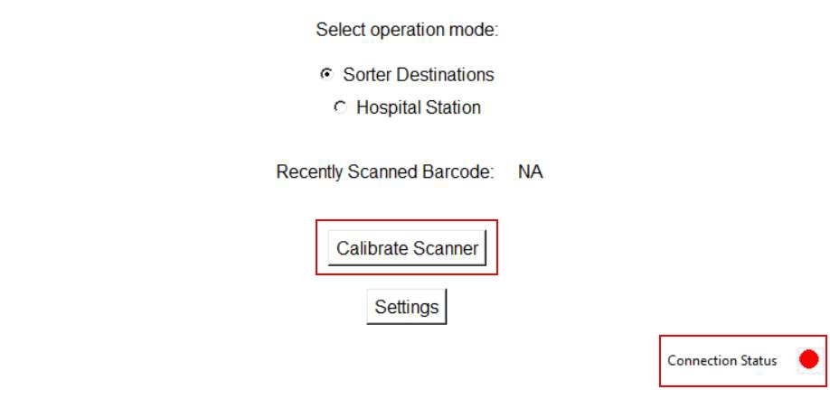
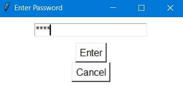
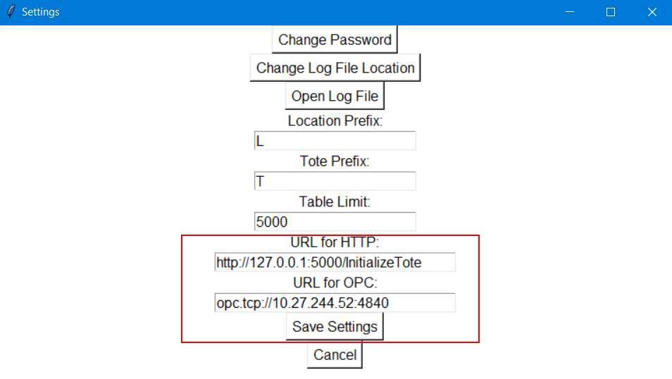

# Set Up a Replacement Scanner Using Barcode Interface

## Runbook Header

| Field | Value |
| --- | --- |
| Procedure ID | `proc_set_up_replacement_scanner_using_barcode_interface_v1` |
| Title | Set Up a Replacement Scanner Using Barcode Interface |
| Procedure Type | `operation` |
| Primary Role | `L2_support` |
| Supporting Roles | None |
| Support Safe | No |
| Validation Status | `needs_sme_review` |
| Merge Status | `source_finalized` |

## Summary

Configure a replacement Zebra DS3608-SR scanner using a Windows laptop and Barcode Interface application by confirming required hardware and network connectivity, connecting and charging the scanner dock, logging in with a FORTNA account, checking connectivity status, accessing settings, verifying prefixes, updating HTTP and OPC URLs with the documented control IP addresses, and saving the settings.

## When To Use

Use when a scanner has been replaced and the new scanner needs to be set up using the Barcode Interface application.

## Safety And Operational Notes

* This procedure is not marked support-safe in the candidate.
* Use the documented 120 VAC outlets and power adapter for the scanner dock.
* Stop if the dock does not light up after the documented power and cable connections are made.
* Stop if the scanner does not charge to a green battery indication when placed on the dock.

## Access Or Tools Needed

* Windows 10 or 11 laptop
* Barcode Interface.exe installed on the laptop
* FORTNA account login for the laptop
* Zebra DS3608-SR scanner dock
* USB cable
* Power adapter
* 120 VAC outlets
* Network connectivity to AGV and Hospital control
* AGV control IP address
* Hospital control IP address

## Related Operational Context

* ctx_manual_scanner_setup_overview_v1
* ctx_manual_barcode_interface_connectivity_indicator_v1
* ctx_manual_scanner_settings_access_v1
* ctx_manual_scanner_prefix_and_url_configuration_v1
* ctx_manual_estop_reset_reference_v1

## Procedure Steps

### Step 1 — Gather setup requirements and verify network connectivity

**Responsible role:** L2_support

**Instruction:**
Gather a Windows 10 or 11 laptop with Barcode Interface.exe installed, a Zebra DS3608-SR scanner dock, USB cable, power adapter, and access to 120 VAC outlets. Confirm network connectivity to the AGV and Hospital control by pinging their IP addresses, and ensure the AGV control and Hospital control IP addresses are available for later configuration.

**Expected result:**
All required hardware, software, power, and network prerequisites are available and connectivity to both control endpoints is validated.

**Screens / Images:**

*Overall scanner setup procedure context and required setup components.*

*Replacement scanner setup visuals associated with required hardware and connectivity preparation.*

*Scanner setup visuals associated with dock connection and connectivity preparation.*

**Stop or Escalate If:**

* Escalate if network connectivity to the AGV and Hospital control cannot be validated by ping.
* Escalate if the required AGV control or Hospital control IP addresses are not available.

---

### Step 2 — Connect and power the scanner dock

**Responsible role:** L2_support

**Instruction:**
Connect the RJ45 side of the USB cable to the back of the scanner dock, connect the USB side to the laptop, connect the auxiliary lead to the power adapter, and plug the adapter into a 120 VAC outlet. Confirm the dock lights up.

**Expected result:**
The scanner dock is connected to the laptop and power, and the dock lights up.

**Screens / Images:**

*Scanner dock connection points and setup arrangement.*

*Dock, cable, and power connection context.*

**Stop or Escalate If:**

* Stop if the dock does not light up after the documented power and cable connections are made.

---

### Step 3 — Charge the scanner if needed

**Responsible role:** L2_support

**Instruction:**
If the scanner is uncharged, place it on the dock and wait until the red battery symbol shown on top turns green.

**Expected result:**
The scanner battery indication changes from red to green while on the dock.

**Screens / Images:**

*Scanner and dock setup context related to charging state.*

**Stop or Escalate If:**

* Stop if the scanner does not charge to a green battery indication when placed on the dock.

---

### Step 4 — Log into the laptop with a FORTNA account

**Responsible role:** L2_support

**Instruction:**
Log into the laptop with a FORTNA account.

**Expected result:**
The laptop session is accessible under a FORTNA account.

---

### Step 5 — Launch Barcode Interface

**Responsible role:** L2_support

**Instruction:**
Launch the Barcode Interface application from the desktop.

**Expected result:**
The Barcode Interface application opens on the laptop.

**Screens / Images:**

*Barcode Interface application context associated with scanner setup.*

---

### Step 6 — Check connectivity status and calibrate if needed

**Responsible role:** L2_support

**Instruction:**
Check the connectivity indicator at the bottom right of the screen. If it is green, continue. If it is red, click "Calibrate Scanner" and follow the onscreen instructions.

**Expected result:**
The connectivity indicator is acceptable for continuing, either already green or addressed through the documented calibration flow.

**Screens / Images:**

*Barcode Interface screen area associated with connectivity status and calibration.*

*Connectivity indicator and calibration-related screen context.*

*Scanner setup screen context for bottom-right connectivity indication.*

---

### Step 7 — Open scanner settings

**Responsible role:** L2_support

**Instruction:**
Click the settings button and supply the password. By default, the password is "Opti."

**Expected result:**
The scanner settings screen is opened.

**Screens / Images:**

*Settings button and settings access screen.*

*Scanner settings screen associated with password-protected access.*

*Settings area used for scanner configuration.*

**Stop or Escalate If:**

* Escalate if settings access is blocked and the documented password does not work.

---

### Step 8 — Verify configured prefixes

**Responsible role:** L2_support

**Instruction:**
Verify the configured prefixes match the labels on the totes and locations.

**Expected result:**
Configured prefixes match the tote and location labels.

**Screens / Images:**

*Prefix values on the scanner settings screen for comparison to tote and location labels.*

*Settings fields related to prefix configuration.*

*Scanner configuration screen area used to verify prefixes.*

---

### Step 9 — Update HTTP and OPC URLs

**Responsible role:** L2_support

**Instruction:**
Change the URL for the HTTP setting to contain the AGV control IP address and change the URL for the OPC setting to contain the Hospital control IP address respectively.

**Expected result:**
The HTTP URL contains the AGV control IP address and the OPC URL contains the Hospital control IP address.

**Screens / Images:**

*HTTP and OPC URL fields on the scanner settings screen.*

*Configuration fields used to enter AGV control and Hospital control IP addresses.*

*Settings screen area related to URL configuration.*

**Stop or Escalate If:**

* Escalate if the required AGV control or Hospital control IP addresses are not available.

---

### Step 10 — Save scanner settings

**Responsible role:** L2_support

**Instruction:**
Save the configuration with the "Save Settings" button.

**Expected result:**
The scanner settings are saved.

**Screens / Images:**

*The "Save Settings" button and surrounding configuration screen.*

*Settings screen used before saving configuration.*

*Configuration screen context for final save action.*

---

## Success Criteria

* The replacement scanner is connected and powered.
* The dock lights up after the documented connections are made.
* If the scanner was uncharged, the battery indication turns green on the dock.
* Barcode Interface is launched successfully.
* Connectivity is acceptable or calibrated per the application.
* Prefixes match tote and location labels.
* HTTP and OPC URL settings contain the documented control IP addresses.
* The settings are saved.

## Failure Conditions

* Dock does not light up after the documented power and cable connections are made.
* Scanner does not charge to a green battery indication when placed on the dock.
* Network connectivity to the AGV and Hospital control cannot be validated by ping.
* Settings access is blocked and the documented password does not work.
* Required AGV control or Hospital control IP addresses are not available.
* Connectivity indicator remains red or calibration cannot be completed using the documented onscreen flow.
* Prefixes do not match tote and location labels.
* Settings are not saved successfully.

## Escalation Guidance

* Escalate if network connectivity to the AGV and Hospital control cannot be validated by ping.
* Escalate if settings access is blocked and the documented password does not work.
* Escalate if the required AGV control or Hospital control IP addresses are not available.
* Stop work if the dock does not light up after the documented power and cable connections are made.
* Stop work if the scanner does not charge to a green battery indication when placed on the dock.

## Missing Details / Known Gaps

* The source does not provide exact ping commands or command syntax for validating connectivity.
* The source does not provide exact AGV control or Hospital control IP address values.
* The source does not provide estimated completion time.
* The source does not specify whether production stop or LOTO is required.
* The source does not describe the exact calibration substeps beyond following onscreen instructions.
* The packet includes some unrelated artifacts and context records that are not used as primary evidence for this scanner setup procedure.

## Source Lineage

- Candidate IDs: candidate_l2_setup_replacement_scanner_with_barcode_interface
- Source ID: `manual_optisweep_om_v3`
- Source Type: `manual`
