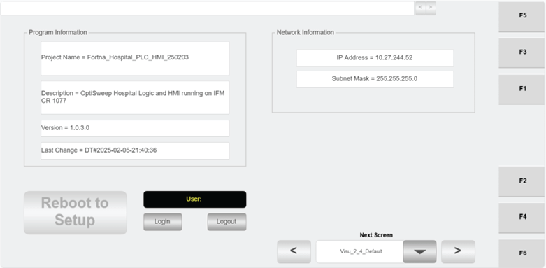

# Use REBOOT TO SETUP on the Hospital HMI When Updating HMI Date or Time

## Runbook Header

| Field | Value |
| --- | --- |
| Procedure ID | `proc_use_reboot_to_setup_on_the_hospital_hmi_when_updating_hmi_date_or_time_v1` |
| Title | Use REBOOT TO SETUP on the Hospital HMI When Updating HMI Date or Time |
| Procedure Type | `operation` |
| Primary Role | `L2_support` |
| Supporting Roles | None |
| Support Safe | No |
| Validation Status | `needs_sme_review` |
| Merge Status | `source_finalized` |

## Summary

This source-specific runbook captures the documented entry point and access restriction for using the REBOOT TO SETUP button on the Hospital HMI Default screen when an HMI date or time update is needed. The source only confirms where the control is located and that only maintenance personnel should use it; it does not provide the subsequent setup or date/time change procedure.

## When To Use

Use this procedure when access to REBOOT TO SETUP on the Hospital HMI is needed specifically for updating the HMI date or time, and maintenance-authorized personnel are available.

## Do Not Use For

* Do not use this procedure as an operator or general user.
* Do not use this procedure for tasks other than updating the HMI date or time unless supported by another source.
* Do not treat this runbook as the full date/time update procedure; the source excerpt does not provide the setup steps after using REBOOT TO SETUP.

## Safety And Operational Notes

* Only maintenance personnel should use the REBOOT TO SETUP button if they need to update the date or time on the HMI.
* The source does not provide the subsequent setup or date/time update steps, so stop and escalate if those steps are required and not otherwise documented.

## Access Or Tools Needed

* Access to the Hospital HMI
* Hospital HMI Default screen
* Maintenance-authorized access

## Related Operational Context

* ctx_manual_hospital_hmi_default_screen_v1
* ctx_manual_hospital_hmi_reboot_to_setup_access_v1

## Procedure Steps

### Step 1 — Open the Hospital HMI Default screen

**Responsible role:** L2_support

**Instruction:**
Open the Hospital HMI "Default" screen.

**Expected result:**
The Hospital HMI Default screen is displayed.

**Screens / Images:**

*Hospital HMI 2.4 Default screen layout, including installed software information, station IP address, login/logout access, and the REBOOT TO SETUP button area.*

*Maintenance Menu access point for the 2.4 Default screen.*

**Stop or Escalate If:**

* Stop and escalate if the Hospital HMI Default screen cannot be located.
* Stop and escalate if the visible screen does not match the documented Default screen context.

---

### Step 2 — Locate the REBOOT TO SETUP button

**Responsible role:** L2_support

**Instruction:**
Locate the REBOOT TO SETUP button on the Default screen.

**Expected result:**
The REBOOT TO SETUP button is identified on the Hospital HMI Default screen.

**Screens / Images:**

*The REBOOT TO SETUP button on the Hospital HMI 2.4 Default screen.*

**Stop or Escalate If:**

* Stop and escalate if the REBOOT TO SETUP button is not present on the Default screen.

---

### Step 3 — Confirm the task is limited to HMI date or time update

**Responsible role:** L2_support

**Instruction:**
Verify that the task is limited to updating the date or time on the HMI.

**Expected result:**
The intended use is confirmed as an HMI date or time update.

**Screens / Images:**

*Default screen context associated with the REBOOT TO SETUP restriction for date or time updates.*

**Stop or Escalate If:**

* Stop and escalate if the task is not specifically to update the HMI date or time.
* Stop and escalate if the intended use of REBOOT TO SETUP cannot be confirmed from the available request or context.

---

### Step 4 — Restrict use to maintenance-authorized personnel

**Responsible role:** L2_support

**Instruction:**
Have only maintenance-authorized personnel use the REBOOT TO SETUP button.

**Expected result:**
Use of the REBOOT TO SETUP button is limited to maintenance-authorized personnel.

**Screens / Images:**

*REBOOT TO SETUP button on the Default screen and the surrounding login/logout context.*

**Stop or Escalate If:**

* Stop and escalate if maintenance-authorized personnel are not available.
* Stop and escalate if a non-maintenance user is being asked to use REBOOT TO SETUP.

---

### Step 5 — Record limited completion and escalate for missing setup steps

**Responsible role:** L2_support

**Instruction:**
Record that the button was used for date or time update access, because the source does not provide the subsequent setup steps.

**Expected result:**
The use of REBOOT TO SETUP for date/time update access is documented, and any need for further setup steps is escalated.

**Screens / Images:**

*Default screen reference associated with REBOOT TO SETUP and date/time update access.*

**Stop or Escalate If:**

* Stop and escalate for the actual date or time update steps because the source excerpt does not provide them.

---

## Success Criteria

* The Hospital HMI Default screen is identified.
* The REBOOT TO SETUP button is identified on the Default screen.
* The task is confirmed to be an HMI date or time update.
* Only maintenance-authorized personnel are identified to use the control.
* The limited scope of the source is documented and follow-on setup steps are escalated if needed.

## Failure Conditions

* The Default screen cannot be accessed or identified.
* The REBOOT TO SETUP button cannot be located.
* The requested task is not limited to updating the HMI date or time.
* A non-maintenance user attempts to use the REBOOT TO SETUP button.
* Personnel require the actual date/time update steps, but those steps are not present in this source.

## Escalation Guidance

* Escalate if date or time updates are needed but maintenance-authorized personnel are not available.
* Escalate if an operator or general user is asked to perform this procedure.
* Escalate for the actual date or time update steps because the source excerpt does not provide them.

## Missing Details / Known Gaps

* The source does not provide the actual steps to update the HMI date or time after using REBOOT TO SETUP.
* The source does not state whether production must be stopped.
* The source does not state whether LOTO is required.
* The source does not provide an estimated completion time.
* The source does not provide explicit navigation steps to reach the Default screen from other Hospital HMI screens.

## Source Lineage

- Candidate IDs: candidate_l2_use_reboot_to_setup_for_hmi_date_time_update
- Source ID: `manual_optisweep_om_v3`
- Source Type: `manual`
