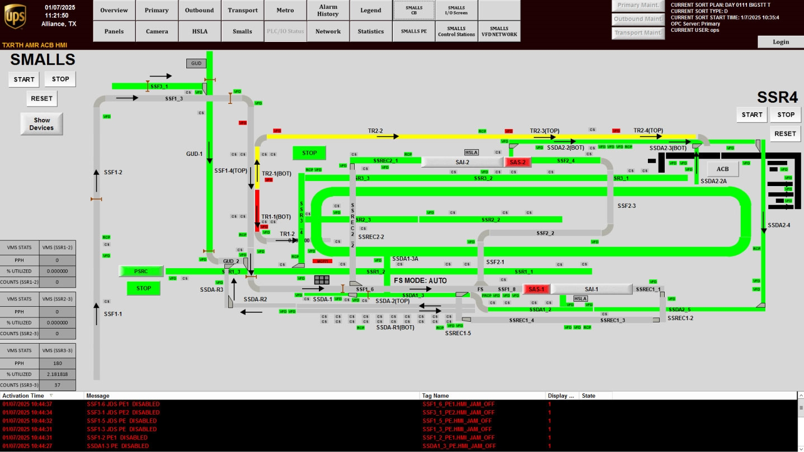

# Check Smalls System Layout and Color-Coded Status on the Overview Screen

## Runbook Header

| Field | Value |
| --- | --- |
| Procedure ID | `proc_check_smalls_system_layout_and_color_coded_status_on_the_overview_screen_v1` |
| Title | Check Smalls System Layout and Color-Coded Status on the Overview Screen |
| Procedure Type | `diagnostic` |
| Primary Role | `operator` |
| Supporting Roles | None |
| Support Safe | Yes |
| Validation Status | `needs_sme_review` |
| Merge Status | `source_finalized` |

## Summary

Use the Smalls overview screen in the system HMI to inspect the displayed smalls system layout and observe the color-coded status shown for each part of the system.

## When To Use

Use this procedure when an operator needs to view the Smalls overview screen and observe the displayed smalls system layout and the color-coded status of each part of the system.

## Do Not Use For

* Do not use this procedure to assign undocumented meanings to specific colors.
* Do not use this procedure for control actions, startup, shutdown, purge, or other system-changing operations not described in this source section.

## Safety And Operational Notes

* This source supports observation of HMI information only.
* Do not assign undocumented meanings to specific colors because this source section does not define them.

## Access Or Tools Needed

* Access to the system HMI
* Smalls overview screen

## Related Operational Context

* ctx_manual_smalls_overview_screen_v1
* ctx_manual_acb_system_overview_navigation_v1
* ctx_manual_smalls_system_layout_reference_v1

## Procedure Steps

### Step 1 — Open the Smalls overview screen

**Responsible role:** operator

**Instruction:**
On the system HMI, press SMALLS to access the "Smalls" overview screen.

**Expected result:**
The Smalls overview screen opens.

**Screens / Images:**

*The Smalls overview screen reached after pressing SMALLS.*

**Stop or Escalate If:**

* The overview screen is not accessible from SMALLS.

---

### Step 2 — Observe the displayed smalls system layout

**Responsible role:** operator

**Instruction:**
Observe the overall smalls system layout shown on the Smalls overview screen.

**Expected result:**
The operator can see the smalls system layout on the screen.

**Screens / Images:**

*The overall smalls system layout displayed on the overview screen.*

**Stop or Escalate If:**

* The screen does not show the expected system layout.

---

### Step 3 — Inspect the color-coded status shown for each part of the system

**Responsible role:** operator

**Instruction:**
Inspect each represented part of the system for its displayed color-coded status.

**Expected result:**
The operator can identify the displayed color-coded status for each part of the system.

**Screens / Images:**

*The color-coded status indications shown for each part of the smalls system.*

**Stop or Escalate If:**

* The screen does not display color-coded status for system parts.
* A color indication is present but its meaning is not defined in this source section and interpretation beyond observation is required.

---

### Step 4 — Compare the displayed statuses across the system

**Responsible role:** operator

**Instruction:**
Compare the displayed status indications across the parts of the system to identify the current shown state of the overall smalls system.

**Expected result:**
The operator can describe the currently shown overall state of the smalls system based on the displayed statuses.

**Screens / Images:**

*The full overview screen so statuses across multiple system parts can be compared.*

**Stop or Escalate If:**

* The screen content is incomplete or does not allow comparison across the shown system parts.

---

### Step 5 — Record the observed displayed statuses

**Responsible role:** operator

**Instruction:**
Record the observed color-coded statuses using only the screen information provided by the HMI.

**Expected result:**
The observed displayed statuses are documented based only on what is shown on the screen.

**Screens / Images:**

*The displayed layout and color-coded statuses to be recorded exactly as shown.*

**Stop or Escalate If:**

* The screen is unavailable or incomplete.
* Interpretation of color meaning beyond what is shown is required.

---

## Success Criteria

* The Smalls overview screen is accessible from SMALLS.
* The operator can view the smalls system layout on the overview screen.
* The operator can identify the displayed color-coded status for each shown part of the system.
* The observed displayed statuses are recorded using only information shown on the HMI.

## Failure Conditions

* The overview screen is not accessible from SMALLS.
* The screen does not show the expected system layout.
* The screen does not display color-coded status for system parts.
* The procedure would require assigning undocumented meanings to specific colors.

## Escalation Guidance

* Escalate if the overview screen is not accessible from SMALLS.
* Escalate if the screen does not show the expected system layout or does not display color-coded status for system parts.
* Escalate if interpretation of specific color meanings is required, because this source section does not define them.

## Missing Details / Known Gaps

* This source section does not define the meaning of individual colors shown on the Smalls overview screen.
* This source section does not provide acceptance thresholds or decision criteria beyond observing displayed status.
* This source section does not specify a required recording location or format for captured observations.
* This source section does not provide an estimated completion time.

## Source Lineage

- Candidate IDs: candidate_operator_check_smalls_system_status_on_overview
- Source ID: `manual_optisweep_om_v3`
- Source Type: `manual`
