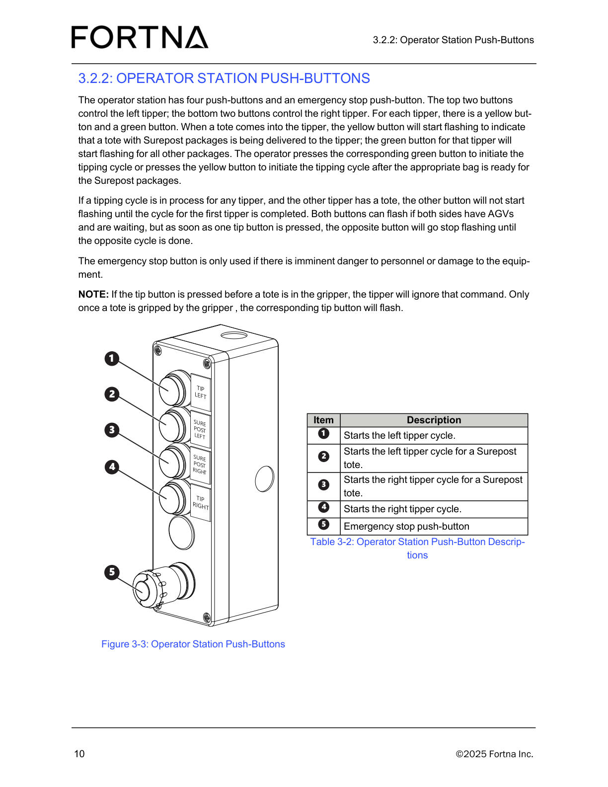

# Identify The Correct Operator Station Push-Button For Left, Right, And Surepost Tipper Actions

## Runbook Header

| Field | Value |
| --- | --- |
| Procedure ID | `proc_identify_the_correct_operator_station_push_button_for_left_right_and_surepost_tipper_actions_v1` |
| Title | Identify The Correct Operator Station Push-Button For Left, Right, And Surepost Tipper Actions |
| Procedure Type | `reference` |
| Primary Role | `operator` |
| Supporting Roles | None |
| Support Safe | Yes |
| Validation Status | `needs_sme_review` |
| Merge Status | `source_finalized` |

## Summary

Use the documented operator station push-button figure and item mapping to identify which push-button starts each left tipper, right tipper, and Surepost tote cycle, and which push-button is the emergency stop.

## When To Use

Use this reference when an operator needs to confirm which physical operator station push-button corresponds to the left tipper cycle, left Surepost tote cycle, right Surepost tote cycle, right tipper cycle, or the emergency stop before use.

## Do Not Use For

* Do not use this runbook as authorization to operate the tipper beyond identifying the documented push-button functions.
* Do not use the emergency stop push-button as a normal operating control.

## Safety And Operational Notes

* The emergency stop button is only used if there is imminent danger to personnel or damage to the equipment.
* Do not use the emergency stop push-button as a normal operating control.
* Escalate if the physical button arrangement or labeling does not match the documented figure and table.

## Access Or Tools Needed

* Physical or visual access to the operator station push-buttons
* Figure 3-3
* Table 3-2

## Related Operational Context

* ctx_manual_operator_station_push_buttons_overview_v1
* ctx_manual_tipper_axis_mapping_v1
* ctx_manual_operator_station_emergency_stop_use_v1

## Procedure Steps

### Step 1 — Locate the operator station push-button panel

**Responsible role:** operator

**Instruction:**
Go to the operator station and locate the push-button panel shown in the operator station push-button figure.

**Expected result:**
The operator station push-button panel is located and visible.

**Screens / Images:**

*The operator station push-button arrangement and item labels.*

*The operator station area where the push-buttons are part of the operator-facing components.*

**Stop or Escalate If:**

* The physical operator station push-button panel cannot be located.
* The visible control area does not match the documented operator station figure.

---

### Step 2 — Identify left and right tipper button groups

**Responsible role:** operator

**Instruction:**
Identify the top two push-buttons as the left tipper controls and the bottom two push-buttons as the right tipper controls.

**Expected result:**
The operator can distinguish which two buttons belong to the left tipper and which two belong to the right tipper.

**Screens / Images:**

*The top two versus bottom two push-button positions in the documented arrangement.*

**Stop or Escalate If:**

* The top two and bottom two button groups do not match the documented left/right tipper assignment.

---

### Step 3 — Identify item 1 as the left tipper cycle start button

**Responsible role:** operator

**Instruction:**
Using the documented item mapping, identify item 1 as the push-button that starts the left tipper cycle.

**Expected result:**
Item 1 is recognized as the left tipper cycle start button.

**Screens / Images:**

*Item 1 in the push-button photo and its mapping to the left tipper cycle start function.*

**Stop or Escalate If:**

* Item 1 cannot be identified on the physical panel.
* The physical item 1 location or labeling does not match the documented mapping.

---

### Step 4 — Identify item 2 as the left Surepost tote cycle start button

**Responsible role:** operator

**Instruction:**
Using the documented item mapping, identify item 2 as the push-button that starts the left tipper cycle for a Surepost tote.

**Expected result:**
Item 2 is recognized as the left Surepost tote cycle start button.

**Screens / Images:**

*Item 2 in the push-button photo and its mapping to the left Surepost tote cycle start function.*

**Stop or Escalate If:**

* Item 2 cannot be identified on the physical panel.
* The physical item 2 location or labeling does not match the documented mapping.

---

### Step 5 — Identify item 3 as the right Surepost tote cycle start button

**Responsible role:** operator

**Instruction:**
Using the documented item mapping, identify item 3 as the push-button that starts the right tipper cycle for a Surepost tote.

**Expected result:**
Item 3 is recognized as the right Surepost tote cycle start button.

**Screens / Images:**

*Item 3 in the push-button photo and its mapping to the right Surepost tote cycle start function.*

**Stop or Escalate If:**

* Item 3 cannot be identified on the physical panel.
* The physical item 3 location or labeling does not match the documented mapping.

---

### Step 6 — Identify item 4 as the right tipper cycle start button

**Responsible role:** operator

**Instruction:**
Using the documented item mapping, identify item 4 as the push-button that starts the right tipper cycle.

**Expected result:**
Item 4 is recognized as the right tipper cycle start button.

**Screens / Images:**

*Item 4 in the push-button photo and its mapping to the right tipper cycle start function.*

**Stop or Escalate If:**

* Item 4 cannot be identified on the physical panel.
* The physical item 4 location or labeling does not match the documented mapping.

---

### Step 7 — Identify item 5 as the emergency stop push-button

**Responsible role:** operator

**Instruction:**
Identify item 5 as the emergency stop push-button and distinguish it from the normal tipper cycle buttons. Treat it as reserved for imminent danger to personnel or damage to equipment.

**Expected result:**
Item 5 is recognized as the emergency stop push-button and is not confused with normal operating controls.

**Screens / Images:**

*Item 5 in the push-button photo and its mapping to the emergency stop push-button.*

**Stop or Escalate If:**

* The emergency stop push-button cannot be clearly distinguished from the normal tipper cycle buttons.
* The physical button arrangement or labeling does not match the documented figure and table.

---

## Success Criteria

* The operator can correctly identify the top two buttons as left tipper controls and the bottom two buttons as right tipper controls.
* The operator can correctly identify item 1 as left tipper cycle start, item 2 as left Surepost tote cycle start, item 3 as right Surepost tote cycle start, item 4 as right tipper cycle start, and item 5 as the emergency stop push-button.
* The emergency stop push-button is distinguished from normal operating controls.

## Failure Conditions

* The physical button arrangement or labeling does not match the documented figure and table.
* A push-button cannot be confidently matched to its documented item number or function.
* The emergency stop push-button cannot be clearly distinguished from normal tipper cycle buttons.

## Escalation Guidance

* Escalate if the physical button arrangement or labeling does not match the documented figure and table.
* Escalate if any push-button function cannot be confidently identified from the source-supported figure and table.
* Stop and escalate if there is any uncertainty about the emergency stop push-button identification.

## Missing Details / Known Gaps

* The source packet does not provide an estimated time for this identification task.
* The source packet does not specify whether production stop or LOTO is required for this reference activity.
* The source packet does not provide additional role boundaries beyond operator use.
* The source packet does not include the full OCR text of section 3.2.2 beyond referenced summaries.

## Source Lineage

- Candidate IDs: candidate_operator_identify_operator_station_push_button_functions
- Source ID: `manual_optisweep_om_v3`
- Source Type: `manual`
