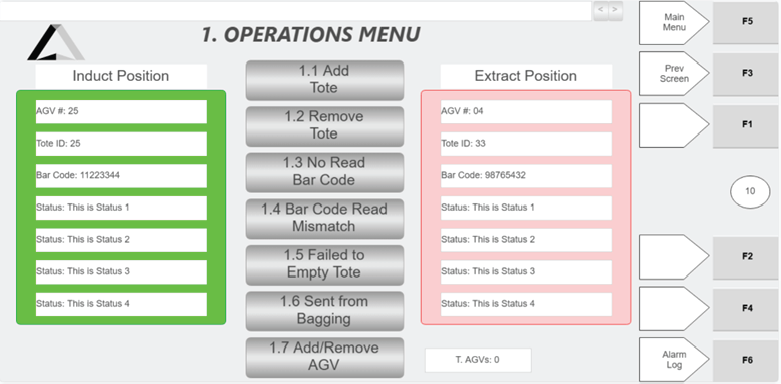

# Interpret Tote Status Guidance From the Hospital HMI Operations Menu

## Runbook Header

| Field | Value |
| --- | --- |
| Procedure ID | `proc_interpret_tote_status_guidance_from_the_hospital_hmi_operations_menu_v1` |
| Title | Interpret Tote Status Guidance From the Hospital HMI Operations Menu |
| Procedure Type | `reference` |
| Primary Role | `operator` |
| Supporting Roles | None |
| Support Safe | Yes |
| Validation Status | `needs_sme_review` |
| Merge Status | `source_finalized` |

## Summary

Use the Hospital HMI Operations Menu read-only status information to understand why a tote is at the station and identify the menu and action indicated by the WCS status message.

## When To Use

Use this reference when a station operator needs to read tote-related information on the Hospital HMI Operations Menu and determine, from the WCS-provided status message, why a tote is present at the induct or extract side and what menu and action are indicated.

## Do Not Use For

* Do not use this procedure to edit or change Induct Position or Extract Position information, because the source states this information is read-only and received from the WCS.
* Do not use this procedure as a complete follow-on action procedure for specific tote exceptions, because this section does not provide the detailed actions for each status message.

## Safety And Operational Notes

* Induct Position and Extract Position information on this screen is read-only and received from the WCS.
* Do not edit or attempt to change the displayed Induct Position or Extract Position information.

## Access Or Tools Needed

* Access to the Hospital HMI Operations Menu screen
* Visibility of the Induct Position and Extract Position fields
* WCS-provided status message displayed on the screen

## Related Operational Context

* ctx_manual_hospital_operations_menu_screen_v1
* ctx_manual_hospital_operations_menu_status_messages_v1

## Procedure Steps

### Step 1 — View the Hospital HMI Operations Menu screen

**Responsible role:** operator

**Instruction:**
Open or view the Hospital HMI Operations Menu screen and locate the Induct Position and Extract Position areas.

**Expected result:**
The Operations Menu screen is visible and the operator can see the tote information areas for both station sides.

**Screens / Images:**

*Figure 4-30 showing the Hospital HMI Operations Screen with Induct Position and Extract Position areas.*

**Stop or Escalate If:**

* The Hospital HMI Operations Menu screen cannot be accessed or viewed.
* The Induct Position and Extract Position areas are not visible on the screen.

---

### Step 2 — Identify the relevant station side

**Responsible role:** operator

**Instruction:**
Identify whether the tote information to review is in the Induct Position area or the Extract Position area.

**Expected result:**
The operator knows which side of the station contains the tote information to interpret.

**Screens / Images:**

*The separate Induct Position and Extract Position areas on the Operations Menu screen.*

**Stop or Escalate If:**

* It is unclear which side contains the tote information to be reviewed.

---

### Step 3 — Read the AGV number

**Responsible role:** operator

**Instruction:**
Read the displayed AGV# field for the selected side to identify the AGV at that side of the station.

**Expected result:**
The AGV number for the selected side is identified from the screen.

**Screens / Images:**

*The AGV# field within the selected Induct Position or Extract Position area.*

**Stop or Escalate If:**

* The AGV# field is not visible or cannot be read.

---

### Step 4 — Read the tote ID

**Responsible role:** operator

**Instruction:**
Read the displayed Tote ID field for the selected side to identify the tote at that side of the station.

**Expected result:**
The tote ID for the selected side is identified from the screen.

**Screens / Images:**

*The Tote ID field within the selected Induct Position or Extract Position area.*

**Stop or Escalate If:**

* The Tote ID field is not visible or cannot be read.

---

### Step 5 — Read the bar code field

**Responsible role:** operator

**Instruction:**
Read the displayed Bar Code field for the selected side to capture the information received from the tote bar code.

**Expected result:**
The bar code information for the selected side is identified from the screen.

**Screens / Images:**

*The Bar Code field within the selected Induct Position or Extract Position area.*

**Stop or Escalate If:**

* The Bar Code field is not visible or cannot be read.

---

### Step 6 — Interpret the status message

**Responsible role:** operator

**Instruction:**
Read the Status field for the selected side and use the displayed WCS status message to determine why the tote is there and what menu and action the station operator needs to use or perform.

**Expected result:**
The operator understands the tote's purpose at the station and the menu/action indicated by the status message.

**Screens / Images:**

*The Status field in the selected position area, which contains the WCS-provided tote status message.*

*Example of a related Add Tote screen that may correspond to status-driven operator guidance.*

*Example of a related Remove Tote screen that may correspond to status-driven operator guidance.*

*Example of a related No Read Bar Code screen for a status-driven exception workflow.*

*Example of a related Bar Code Mismatch screen for a status-driven exception workflow.*

*Example of a related Tote Failed to Empty screen for a status-driven exception workflow.*

*Example of a related Sent from Bagging Station screen for a status-driven exception workflow.*

**Stop or Escalate If:**

* The displayed status message does not clearly indicate the needed menu or action.
* The Status field is not visible or cannot be read.
* The source section does not provide the detailed follow-on actions for the displayed status message.

---

### Step 7 — Treat position information as read-only

**Responsible role:** operator

**Instruction:**
Treat the Induct Position and Extract Position information as read-only information received from the WCS.

**Expected result:**
The operator uses the displayed information for interpretation only and does not attempt to modify it.

**Screens / Images:**

*The Induct Position and Extract Position information areas described as read-only and received from the WCS.*

**Stop or Escalate If:**

* There is any need to change the displayed position information.
* A user is attempting to edit read-only WCS-provided information.

---

## Success Criteria

* The operator can identify whether the relevant tote information is in the Induct Position or Extract Position area.
* The operator can read the AGV#, Tote ID, Bar Code, and Status fields for the selected side.
* The operator can use the WCS status message to understand why the tote is at the station and what menu and action are indicated.
* The operator does not attempt to modify read-only WCS-provided position information.

## Failure Conditions

* The Operations Menu screen cannot be viewed.
* The operator cannot determine whether the tote information is in the Induct Position or Extract Position area.
* AGV#, Tote ID, Bar Code, or Status fields are missing or unreadable.
* The displayed status message does not clearly indicate the needed menu or action.
* An attempt is made to edit or change read-only Induct Position or Extract Position information.

## Escalation Guidance

* Escalate or seek additional guidance if the displayed status message does not clearly indicate the needed menu or action.
* Escalate if the required follow-on action is not described in this source section, because the source states the status message indicates the menu and action but does not provide the detailed follow-on steps here.
* Escalate if the Operations Menu screen or required fields cannot be viewed.

## Missing Details / Known Gaps

* The source does not provide detailed follow-on procedures for each possible status message in this section.
* The source does not provide an estimated completion time.
* The source does not specify supporting roles beyond the station operator.
* The source does not state whether production stop or LOTO is required.
* The source does not provide commands or system navigation steps for opening the Operations Menu screen in this section.

## Source Lineage

- Candidate IDs: candidate_operator_interpret_hospital_hmi_operations_menu_tote_status
- Source ID: `manual_optisweep_om_v3`
- Source Type: `manual`
