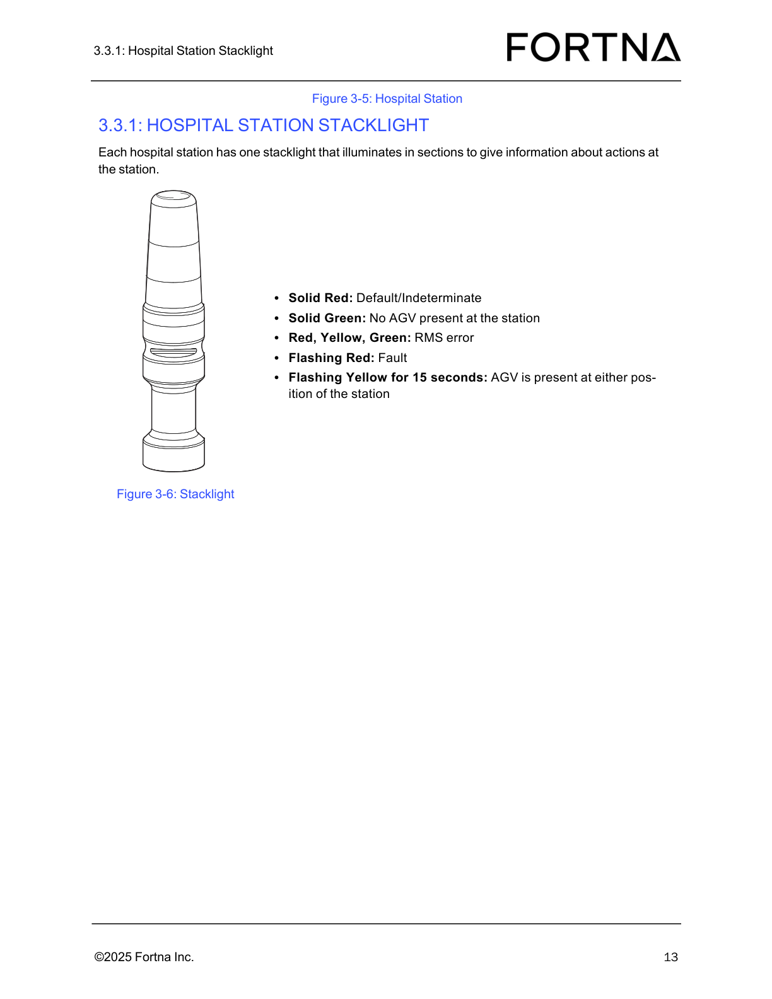

# Determine Hospital Station Status From Stacklight Indication

## Runbook Header

| Field | Value |
| --- | --- |
| Procedure ID | `proc_determine_hospital_station_status_from_stacklight_indication_v1` |
| Title | Determine Hospital Station Status From Stacklight Indication |
| Procedure Type | `reference` |
| Primary Role | `operator` |
| Supporting Roles | None |
| Support Safe | Yes |
| Validation Status | `needs_sme_review` |
| Merge Status | `source_finalized` |

## Summary

Use the documented hospital station stacklight colors and flashing patterns to determine the current station status or condition.

## When To Use

Use this reference procedure when an operator needs to identify the documented meaning of a hospital station stacklight indication, including station status, AGV presence, fault indication, or RMS error.

## Do Not Use For

* Do not use this source to determine corrective or recovery actions.
* Do not use this source to interpret stacklight patterns that do not match one of the documented indications.

## Safety And Operational Notes

* This source supports status interpretation only.
* Do not infer corrective actions from this source section because it provides status meanings only.

## Access Or Tools Needed

* Visual access to the hospital station stacklight
* Documented hospital station stacklight status mapping

## Related Operational Context

* ctx_manual_hospital_station_stacklight_overview_v1
* ctx_manual_hospital_station_stacklight_reference_v1
* ctx_manual_hospital_station_stacklight_fault_and_error_indicators_v1
* ctx_manual_hospital_station_stacklight_agv_presence_indicator_v1

## Procedure Steps

### Step 1 — Locate the hospital station and its stacklight

**Responsible role:** operator

**Instruction:**
Go to the hospital station and identify its single stacklight.

**Expected result:**
The hospital station and its associated stacklight are visually identified.

**Screens / Images:**

*Overall hospital station appearance and the associated stacklight location.*

*The stacklight assembly associated with the hospital station.*

**Stop or Escalate If:**

* The hospital station or its stacklight cannot be positively identified.

---

### Step 2 — Observe illuminated sections and flashing behavior

**Responsible role:** operator

**Instruction:**
Observe which stacklight section or sections are illuminated and whether the indication is solid or flashing.

**Expected result:**
The observed stacklight pattern is identified by color combination and whether it is solid or flashing.

**Screens / Images:**

*Which color sections are illuminated and whether the indication appears solid or flashing.*

**Stop or Escalate If:**

* The stacklight indication cannot be clearly observed.

---

### Step 3 — Match the observed pattern to the documented meaning

**Responsible role:** operator

**Instruction:**
Compare the observed indication to the documented meanings: solid red = default or indeterminate; solid green = no AGV present at the station; red, yellow, and green illuminated = RMS error; flashing red = fault; flashing yellow for 15 seconds = AGV present at either position of the station.

**Expected result:**
A documented status meaning is assigned to the observed stacklight pattern.

**Screens / Images:**

*Documented color and flashing pattern meanings for the hospital station stacklight.*

**Stop or Escalate If:**

* The observed stacklight pattern does not match one of the documented indications.

---

### Step 4 — Record or communicate the documented status meaning

**Responsible role:** operator

**Instruction:**
Record or communicate the documented status meaning based only on the observed stacklight pattern.

**Expected result:**
The station status is recorded or communicated using the documented meaning only.

**Screens / Images:**

*Reference image for the documented stacklight meanings when recording or communicating status.*

**Stop or Escalate If:**

* The observed pattern does not match one of the documented indications.
* Additional corrective or recovery action is requested from this source section.

---

## Success Criteria

* The hospital station stacklight is identified.
* The observed indication is matched to one of the documented meanings.
* The resulting status is recorded or communicated based only on the documented mapping.

## Failure Conditions

* The stacklight cannot be located or clearly observed.
* The observed pattern does not match one of the documented indications.
* The user attempts to infer corrective or recovery actions from this source section.

## Escalation Guidance

* Escalate if the observed stacklight pattern does not match one of the documented indications.
* Escalate if the stacklight cannot be clearly observed or identified.
* Do not infer corrective actions from this source section because it provides status meanings only.

## Missing Details / Known Gaps

* The source does not provide an estimated completion time.
* The source does not define corrective or recovery actions for fault or RMS error indications.
* The source does not specify required supporting roles beyond the operator.
* The source does not provide explicit production stop or LOTO requirements for this reference procedure.
* The source section text body is not included in the packet; interpretation is grounded in supplied source references, figures, and context records.

## Source Lineage

- Candidate IDs: candidate_operator_interpret_hospital_station_stacklight_status
- Source ID: `manual_optisweep_om_v3`
- Source Type: `manual`
