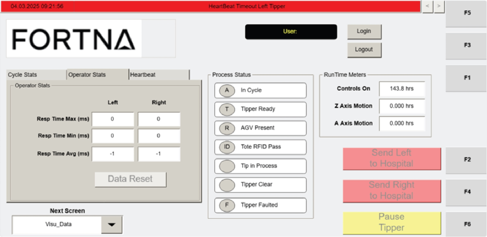

# Interpret Operator Stats On The VISU_DATA Screen

## Runbook Header

| Field | Value |
| --- | --- |
| Procedure ID | `proc_interpret_operator_stats_on_the_visu_data_screen_v1` |
| Title | Interpret Operator Stats On The VISU_DATA Screen |
| Procedure Type | `reference` |
| Primary Role | `operator` |
| Supporting Roles | None |
| Support Safe | Yes |
| Validation Status | `needs_sme_review` |
| Merge Status | `source_finalized` |

## Summary

Use the Operator Stats section on the VISU_DATA screen to identify and interpret Resp Time Max, Resp Time Min, and Resp Time Avg values in milliseconds for the left and right tippers.

## When To Use

Use this reference procedure when viewing the VISU_DATA screen to read operator response-time statistics for the left and right tippers and understand what each displayed metric represents.

## Do Not Use For

* Do not use this source to determine acceptable response-time thresholds.
* Do not use this procedure if the Operator Stats fields are missing or unreadable.

## Safety And Operational Notes

* This source describes interpretation of displayed HMI statistics only.
* Do not infer acceptable response-time thresholds from this source section.
* Escalate if the Operator Stats fields are missing or unreadable.

## Access Or Tools Needed

* Access to the operator station HMI
* VISU_DATA screen

## Related Operational Context

* ctx_manual_agv_status_metrics_v1

## Procedure Steps

### Step 1 — Open the VISU_DATA screen and locate Operator Stats

**Responsible role:** operator

**Instruction:**
Open the VISU_DATA screen on the operator station HMI and locate the Operator Stats section.

**Expected result:**
The Operator Stats section is visible on the VISU_DATA screen.

**Screens / Images:**

*The Operator Stats section and the Resp Time Max, Resp Time Min, and Resp Time Avg fields for left and right tippers.*

*Overall VISU_DATA screen layout to help identify the correct operator station data screen.*

**Stop or Escalate If:**

* The Operator Stats fields are missing.
* The Operator Stats fields are unreadable.

---

### Step 2 — Read Resp Time Max values

**Responsible role:** operator

**Instruction:**
Read the Resp Time Max (ms) fields and identify the longest time it took an operator to press the button to initiate tipping after the tote was gripped for the left and right tippers.

**Expected result:**
The maximum response-time values in milliseconds are identified for both the left and right tippers.

**Screens / Images:**

*The Resp Time Max (ms) fields and the left/right field positions in the Operator Stats section.*

**Stop or Escalate If:**

* The Resp Time Max fields are missing or unreadable.

---

### Step 3 — Read Resp Time Min values

**Responsible role:** operator

**Instruction:**
Read the Resp Time Min (ms) fields and identify the shortest time it took an operator to press the button to initiate tipping after the tote was gripped for the left and right tippers.

**Expected result:**
The minimum response-time values in milliseconds are identified for both the left and right tippers.

**Screens / Images:**

*The Resp Time Min (ms) fields and the left/right field positions in the Operator Stats section.*

**Stop or Escalate If:**

* The Resp Time Min fields are missing or unreadable.

---

### Step 4 — Read Resp Time Avg values

**Responsible role:** operator

**Instruction:**
Read the Resp Time Avg (ms) fields and identify the average time it took an operator to press the button to initiate tipping after the tote was gripped for the left and right tippers.

**Expected result:**
The average response-time values in milliseconds are identified for both the left and right tippers.

**Screens / Images:**

*The Resp Time Avg (ms) fields and the left/right field positions in the Operator Stats section.*

**Stop or Escalate If:**

* The Resp Time Avg fields are missing or unreadable.

---

### Step 5 — Compare and record the displayed metrics

**Responsible role:** operator

**Instruction:**
Compare the left and right values if needed and record the displayed response-time metrics in milliseconds.

**Expected result:**
The displayed left and right Resp Time Max, Resp Time Min, and Resp Time Avg values are documented as shown on the HMI.

**Screens / Images:**

*All displayed Resp Time Max, Resp Time Min, and Resp Time Avg values for left and right tippers.*

**Stop or Escalate If:**

* The displayed values cannot be read clearly.
* A user attempts to assign acceptable thresholds or limits from this source.

---

## Success Criteria

* The Operator Stats section is located on the VISU_DATA screen.
* Resp Time Max, Resp Time Min, and Resp Time Avg values are identified for both left and right tippers.
* The user correctly interprets these values as operator response times measured from tote grip to button press initiating tipping.
* The displayed metrics are recorded in milliseconds if needed.

## Failure Conditions

* The Operator Stats section is missing.
* The Operator Stats fields are unreadable.
* The displayed values cannot be clearly associated with left and right tippers.
* A user attempts to derive acceptable thresholds from this source section.

## Escalation Guidance

* Escalate if the Operator Stats fields are missing or unreadable.
* Escalate if the VISU_DATA screen cannot be used to clearly identify the left and right response-time metrics.
* Do not infer acceptable response-time thresholds from this source; seek additional guidance if thresholds are needed.

## Missing Details / Known Gaps

* The source packet does not provide navigation steps for reaching the VISU_DATA screen.
* The source does not provide acceptable or target response-time thresholds.
* The source does not specify any required logging location or recording format for the metrics.
* The related context record appears unrelated to Operator Stats and is preserved from the packet without expansion.

## Source Lineage

- Candidate IDs: candidate_operator_interpret_operator_stats_on_visu_data_screen
- Source ID: `manual_optisweep_om_v3`
- Source Type: `manual`
