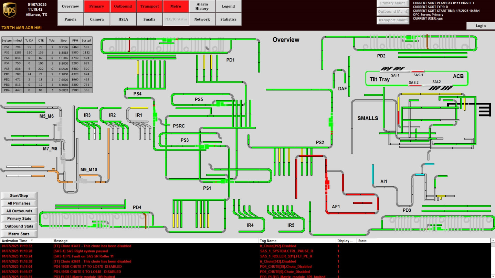

# Open the ACB System Statistics Screen and Review Displayed Metrics

## Runbook Header

| Field | Value |
| --- | --- |
| Procedure ID | `proc_open_the_acb_system_statistics_screen_and_review_displayed_metrics_v1` |
| Title | Open the ACB System Statistics Screen and Review Displayed Metrics |
| Procedure Type | `operation` |
| Primary Role | `operator` |
| Supporting Roles | None |
| Support Safe | Yes |
| Validation Status | `needs_sme_review` |
| Merge Status | `source_finalized` |

## Summary

Navigate from the ACB System screen to the ACB System Statistics screen and review the statistical information displayed there, including robot faults, system faults, cycle time, and tipping station bag counts.

## When To Use

Use this procedure when an operator needs to access the ACB System Statistics screen from the ACB System screen and review the displayed ACB statistical information.

## Safety And Operational Notes

* This procedure is limited to HMI navigation and review of displayed information.
* Do not assume acceptable numeric ranges or interpretations for displayed values; the source only states which metrics are shown.

## Access Or Tools Needed

* Access to the system HMI
* ACB System screen
* STATISTICS control on the ACB System screen
* ACB System Statistics screen

## Related Operational Context

* ctx_manual_acb_system_statistics_screen_v1
* ctx_manual_acb_robot_and_system_fault_counts_v1
* ctx_manual_tipping_station_metrics_reference_v1

## Procedure Steps

### Step 1 — Go to the ACB System screen

**Responsible role:** operator

**Instruction:**
Go to the "ACB System" screen on the HMI.

**Expected result:**
The ACB System screen is displayed.

**Screens / Images:**

*Reference information for the ACB System screen.*

**Stop or Escalate If:**

* The ACB System screen cannot be accessed.

---

### Step 2 — Press STATISTICS to open the statistics screen

**Responsible role:** operator

**Instruction:**
Press STATISTICS on the "ACB System" screen to access the ACB System Statistics screen.

**Expected result:**
The ACB System Statistics screen is displayed.

**Screens / Images:**

*The ACB System Statistics screen reached by pressing STATISTICS from the ACB System screen.*

**Stop or Escalate If:**

* The ACB System screen does not provide the STATISTICS control described by the source.
* Pressing STATISTICS does not display the ACB System Statistics screen.

---

### Step 3 — Identify the displayed statistical information

**Responsible role:** operator

**Instruction:**
On the ACB System Statistics screen, identify the displayed statistical information.

**Expected result:**
The screen shows the statistical information described by the source.

**Screens / Images:**

*The statistical information areas on the ACB System Statistics screen.*

**Stop or Escalate If:**

* The ACB System Statistics screen does not display the documented statistical information.

---

### Step 4 — Check the robot fault count

**Responsible role:** operator

**Instruction:**
Check the number of robot faults shown on the screen.

**Expected result:**
The robot fault count is visible on the ACB System Statistics screen.

**Screens / Images:**

*The robot faults value on the ACB System Statistics screen.*

**Stop or Escalate If:**

* The robot fault count is not displayed.

---

### Step 5 — Check the system fault count

**Responsible role:** operator

**Instruction:**
Check the number of system faults shown on the screen.

**Expected result:**
The system fault count is visible on the ACB System Statistics screen.

**Screens / Images:**

*The system faults value on the ACB System Statistics screen.*

**Stop or Escalate If:**

* The system fault count is not displayed.

---

### Step 6 — Check the cycle time

**Responsible role:** operator

**Instruction:**
Check the cycle time shown on the screen.

**Expected result:**
The cycle time is visible on the ACB System Statistics screen.

**Screens / Images:**

*The cycle time value on the ACB System Statistics screen.*

**Stop or Escalate If:**

* The cycle time is not displayed.

---

### Step 7 — Check the tipping station bag counts

**Responsible role:** operator

**Instruction:**
Check the tipping station bag counts shown on the screen.

**Expected result:**
The tipping station bag counts are visible on the ACB System Statistics screen.

**Screens / Images:**

*The tipping station bag count values on the ACB System Statistics screen.*

**Stop or Escalate If:**

* The tipping station bag counts are not displayed.

---

## Success Criteria

* The ACB System Statistics screen is displayed.
* The operator can view robot fault count, system fault count, cycle time, and tipping station bag counts.

## Failure Conditions

* The ACB System screen does not provide the STATISTICS control described by the source.
* The ACB System Statistics screen does not display the documented statistical information.
* One or more expected metrics are not visible on the screen.

## Escalation Guidance

* Escalate if the ACB System screen does not provide the STATISTICS control described by the source.
* Escalate if the ACB System Statistics screen does not display the documented statistical information.

## Missing Details / Known Gaps

* The source does not provide acceptable ranges, thresholds, or interpretation guidance for robot faults, system faults, cycle time, or tipping station bag counts.
* The source does not specify whether login, permissions, or a particular HMI state is required before accessing the ACB System screen.
* The source does not provide a time estimate for completing this procedure.
* The source does not specify production impact, LOTO requirements, or explicit do-not-use cases.

## Source Lineage

- Candidate IDs: candidate_operator_open_acb_system_statistics_screen_and_review_displayed_metrics
- Source ID: `manual_optisweep_om_v3`
- Source Type: `manual`
