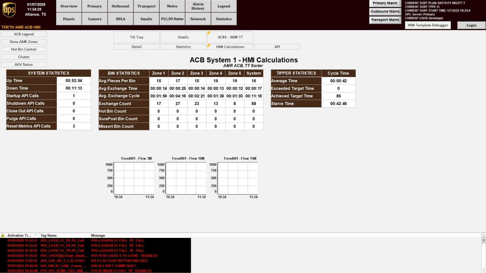

# Review Information Categories on the HMI Calculations Screen

## Runbook Header

| Field | Value |
| --- | --- |
| Procedure ID | `proc_review_information_categories_on_the_hmi_calculations_screen_v1` |
| Title | Review Information Categories on the HMI Calculations Screen |
| Procedure Type | `reference` |
| Primary Role | `operator` |
| Supporting Roles | None |
| Support Safe | Yes |
| Validation Status | `needs_sme_review` |
| Merge Status | `source_finalized` |

## Summary

Use the HMI Calculations screen to identify and review the documented categories of operational information shown on the Tilt Tray overview.

## When To Use

Use this reference procedure when an operator needs to confirm that the HMI Calculations screen presents the documented information categories on the Tilt Tray overview: system operations, bin statistics, and tipper statistics.

## Do Not Use For

* Do not use this procedure to infer meanings, thresholds, or corrective actions for the displayed information because the source does not provide them.
* Do not use this procedure to validate individual field names, values, or interpretation rules because the source does not provide them.

## Safety And Operational Notes

* This candidate is marked support safe.
* Use only the documented category names from the source when recording or communicating what is shown on the screen.
* Do not infer meanings, thresholds, or corrective actions for displayed information because the source does not provide them.

## Access Or Tools Needed

* Access to the HMI
* HMI Calculations screen
* Figure 4-6 or equivalent documented screen reference

## Related Operational Context

* ctx_manual_hmi_calculations_screen_reference_v1
* ctx_manual_hmi_calculations_information_categories_v1

## Procedure Steps

### Step 1 — Open the HMI Calculations screen

**Responsible role:** operator

**Instruction:**
From the "ACB System" screen, press HMI CALCULATIONS to access the "Tilt Tray" overview screen.

**Expected result:**
The HMI Calculations screen is displayed.

**Screens / Images:**

*The HMI Calculations screen reached from the "ACB System" screen.*

*The "ACB System" screen used as the navigation starting point.*

**Stop or Escalate If:**

* Escalate if the displayed screen does not match the documented HMI Calculations screen context.
* Escalate if HMI CALCULATIONS cannot be accessed from the "ACB System" screen.

---

### Step 2 — Identify the documented information areas

**Responsible role:** operator

**Instruction:**
Review the displayed HMI Calculations screen and identify the information areas associated with system operations, bin statistics, and tipper statistics.

**Expected result:**
The operator can identify the three documented information categories on the screen.

**Screens / Images:**

*The areas of the HMI Calculations screen that correspond to system operations, bin statistics, and tipper statistics.*

**Stop or Escalate If:**

* Escalate if the displayed screen does not show the documented information categories.

---

### Step 3 — Compare visible content to documented categories

**Responsible role:** operator

**Instruction:**
Compare the visible screen content to the documented categories: system operations, bin statistics, and tipper statistics.

**Expected result:**
The displayed content aligns with the three documented category names from the source.

**Screens / Images:**

*The overall HMI Calculations screen content for comparison against the documented category names.*

**Stop or Escalate If:**

* Escalate if the displayed screen does not show the documented information categories.
* Stop and do not infer meanings, thresholds, or corrective actions for the displayed information because the source does not provide them.

---

### Step 4 — Record or communicate the category names

**Responsible role:** operator

**Instruction:**
Record or communicate which of the documented information categories are being viewed, using only the source-provided category names.

**Expected result:**
The viewed categories are recorded or communicated as system operations, bin statistics, and/or tipper statistics using source terminology only.

**Screens / Images:**

*The HMI Calculations screen while confirming the category names to record or communicate.*

**Stop or Escalate If:**

* Stop if recording or communication would require inferred meanings, thresholds, or corrective actions not provided by the source.
* Escalate if the displayed screen does not show the documented information categories.

---

## Success Criteria

* The HMI Calculations screen is accessed from the "ACB System" screen.
* The operator confirms that the screen presents information related to system operations, bin statistics, and tipper statistics.
* Any record or communication uses only the documented category names from the source.

## Failure Conditions

* The HMI Calculations screen cannot be accessed from the "ACB System" screen.
* The displayed screen does not show the documented information categories.
* The user attempts to infer meanings, thresholds, field definitions, or corrective actions not provided by the source.

## Escalation Guidance

* Escalate if the displayed screen does not show the documented information categories.
* Escalate if HMI CALCULATIONS cannot be accessed from the "ACB System" screen.
* If additional interpretation of values, thresholds, or corrective actions is needed, escalate because the source does not provide that guidance.

## Missing Details / Known Gaps

* The source does not provide field names, values, thresholds, or interpretation rules for the HMI Calculations screen.
* The source does not provide corrective actions tied to the displayed information categories.
* The source does not provide an estimated completion time.
* The source does not specify whether production stop or LOTO is required.

## Source Lineage

- Candidate IDs: candidate_operator_review_hmi_calculations_information_categories
- Source ID: `manual_optisweep_om_v3`
- Source Type: `manual`
