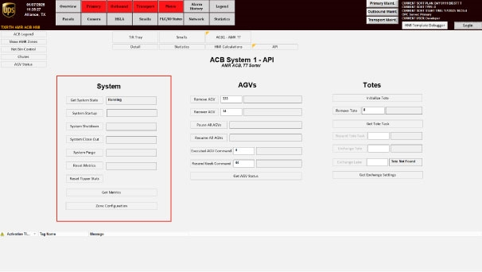

# Shut Down The System From The System API Screen

## Runbook Header

| Field | Value |
| --- | --- |
| Procedure ID | `proc_shut_down_the_system_from_the_system_api_screen_v1` |
| Title | Shut Down The System From The System API Screen |
| Procedure Type | `operation` |
| Primary Role | `operator` |
| Supporting Roles | None |
| Support Safe | Yes |
| Validation Status | `needs_sme_review` |
| Merge Status | `source_finalized` |

## Summary

Use the system HMI System API screen to initiate system shutdown so AGVs go to the documented shutdown queue.

## When To Use

Use when shutting down the OptiSweep system from the system HMI. The supplied context record states the system should be shut down between sorts to allow AGVs to charge.

## Do Not Use For

* Do not use this procedure for system startup.
* Do not use this procedure for system purge or system close out.

## Safety And Operational Notes

* Use only the documented SYSTEM SHUTDOWN control on the system HMI System API screen.
* The source does not provide additional safety controls, lockout/tagout requirements, or production stop requirements for this procedure.

## Access Or Tools Needed

* Access to the system HMI
* System API screen

## Related Operational Context

* ctx_manual_system_shutdown_queue_v1

## Procedure Steps

### Step 1 — Navigate to the System API screen

**Responsible role:** operator

**Instruction:**
On the system HMI, navigate to the System API screen.

**Expected result:**
The System API screen is displayed on the system HMI.

**Screens / Images:**

*System HMI screen associated with the shutdown procedure on page 82.*

*System API Controls figure showing the System section and the SYSTEM SHUTDOWN control.*

**Stop or Escalate If:**

* Stop if the System API screen cannot be accessed.
* Stop if the SYSTEM SHUTDOWN control is not available on the displayed screen.

---

### Step 2 — Press SYSTEM SHUTDOWN

**Responsible role:** operator

**Instruction:**
Press SYSTEM SHUTDOWN on the System API screen.

**Expected result:**
The system shutdown action is initiated from the HMI.

**Screens / Images:**

*Locate the System section and the SYSTEM SHUTDOWN control.*

*Page 82 system screen associated with the shutdown procedure.*

**Stop or Escalate If:**

* Stop if SYSTEM SHUTDOWN is not present on the System API screen.
* Stop if pressing SYSTEM SHUTDOWN does not appear to initiate shutdown.

---

### Step 3 — Observe AGVs go to the shutdown queue

**Responsible role:** operator

**Instruction:**
Observe that the AGVs go to a shutdown queue.

**Expected result:**
AGVs go to the shutdown queue.

**Screens / Images:**

*Reference the System API Controls figure that documents shutdown behavior sending AGVs to a shutdown queue.*

**Stop or Escalate If:**

* Escalate if AGVs do not go to the shutdown queue.
* Escalate if shutdown completion cannot be confirmed from the available HMI indications.

---

## Success Criteria

* SYSTEM SHUTDOWN is initiated from the System API screen.
* AGVs go to the shutdown queue.
* The system is shut down as documented by the source.

## Failure Conditions

* The System API screen cannot be accessed.
* The SYSTEM SHUTDOWN control is not available or cannot be used.
* AGVs do not go to the shutdown queue.
* The source provides no additional confirmation checks beyond observing AGVs go to the shutdown queue.

## Escalation Guidance

* If AGVs do not go to the shutdown queue, escalate for SME or support review.
* The source does not provide additional escalation steps, recovery actions, or confirmation checks for shutdown failure.

## Missing Details / Known Gaps

* The source does not provide a shutdown duration or estimated completion time.
* The source does not provide additional confirmation checks beyond observing AGVs go to a shutdown queue.
* The source does not provide detailed escalation or recovery actions if AGVs do not go to the shutdown queue.
* The source does not specify production stop or lockout/tagout requirements for this procedure.

## Source Lineage

- Candidate IDs: candidate_operator_shutdown_system_from_system_api_screen
- Source ID: `manual_optisweep_om_v3`
- Source Type: `manual`
