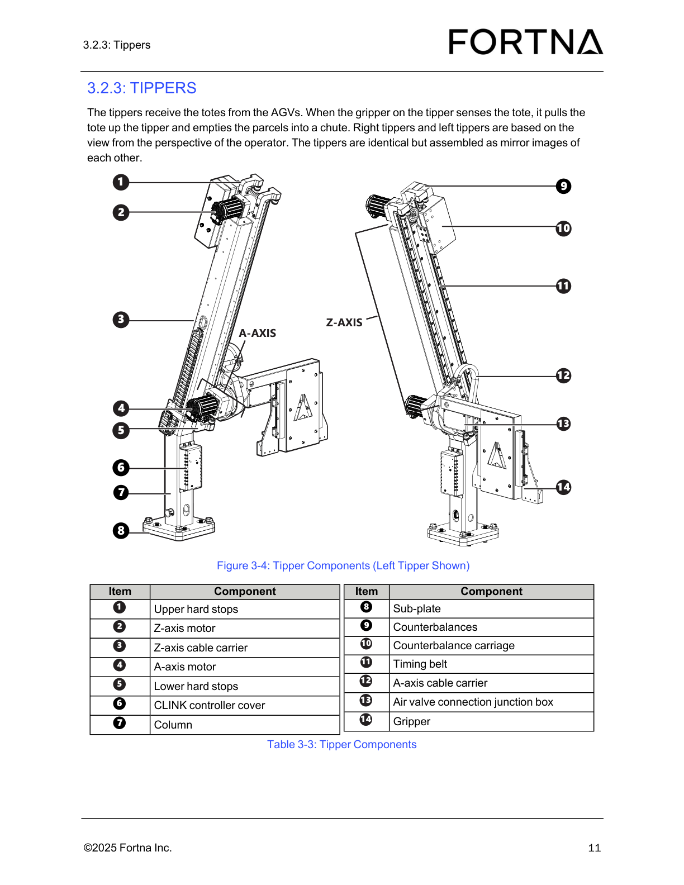

# Home Left And Right Tipper Axes Using AUTO REF

## Runbook Header

| Field | Value |
| --- | --- |
| Procedure ID | `proc_home_left_and_right_tipper_axes_using_auto_ref_v1` |
| Title | Home Left And Right Tipper Axes Using AUTO REF |
| Procedure Type | `operation` |
| Primary Role | `operator` |
| Supporting Roles | None |
| Support Safe | Yes |
| Validation Status | `needs_sme_review` |
| Merge Status | `source_finalized` |

## Summary

Home the left and right tipper axes at the operator station using AUTO REF for the documented axes Z1, A1, Z2, and A2, and verify the HMI motion indication and stop-at-home behavior described in the manual.

## When To Use

Use during operator station startup or whenever the documented source procedure requires homing the left and right tipper axes using AUTO REF.

## Do Not Use For

* Do not use for undocumented axis-specific fault handling or troubleshooting when an axis does not move, does not change color, or does not stop at home.
* Do not use as a manual jogging or manual referencing procedure.

## Safety And Operational Notes

* Use only the documented AUTO REF homing action from the source.
* The source does not provide additional troubleshooting if an axis does not move, does not change color, or does not stop at home.
* Do not infer undocumented controls, thresholds, or recovery actions.

## Access Or Tools Needed

* Operator station HMI or controls with AUTO REF
* Ability to observe axis button color indication

## Related Operational Context

* ctx_manual_tipper_axis_homing_reference_v1
* ctx_manual_hmi_axis_button_status_v1

## Procedure Steps

### Step 1 — Identify the documented tipper axes to home

**Responsible role:** operator

**Instruction:**
Identify the documented axes to be homed: Z1 and A1 for the left tipper, and Z2 and A2 for the right tipper.

**Expected result:**
The operator has identified all four documented axes that must be homed.

**Screens / Images:**

*Look for the axis labels Z1 AXIS, A1 AXIS, Z2 AXIS, and A2 AXIS on the operator station screen.*

*Look for the startup/operator station context where AUTO REF homing of the documented axes is described.*

**Stop or Escalate If:**

* The documented axes cannot be identified from the available HMI/control context.
* The operator is uncertain whether the selected axes are Z1, A1, Z2, and A2.

---

### Step 2 — Press AUTO REF

**Responsible role:** operator

**Instruction:**
Press AUTO REF.

**Expected result:**
The automatic homing action begins for the documented tipper axes.

**Screens / Images:**

*Look for the startup/operator station screen context where AUTO REF is used to home the axes.*

*Look at the operator station control panel context for the main HMI/control layout.*

**Stop or Escalate If:**

* AUTO REF cannot be located on the operator station controls/HMI.
* Pressing AUTO REF does not appear to initiate homing behavior.

---

### Step 3 — Observe axis motion indication on the HMI

**Responsible role:** operator

**Instruction:**
Observe the axis button change from green to yellow to indicate the axis is moving.

**Expected result:**
The axis button changes from green to yellow while the axis is moving.

**Screens / Images:**

*Look at the operator station HMI screen for the axis buttons associated with Z1, A1, Z2, and A2.*

*Look at the primary operator HMI/control panel context for active control indications.*

*Use as supplemental reference for referencing-related HMI screen context.*

*Use as supplemental reference for referencing-related HMI screen context.*

**Stop or Escalate If:**

* The axis button does not change from green to yellow.
* Axis movement cannot be confirmed from the HMI indication.

---

### Step 4 — Allow the tipper motor to move to home and stop

**Responsible role:** operator

**Instruction:**
Allow the tipper motor to move until it senses the home proximity switch and stops.

**Expected result:**
The tipper motor moves to the home position and stops after sensing the home proximity switch.

**Screens / Images:**

*Look for the startup context describing homing completion behavior.*

*Use as component reference for tipper axis/motor context while observing homing behavior.*

**Stop or Escalate If:**

* The tipper motor does not move.
* The tipper motor does not stop at the home proximity switch.
* Observed behavior differs from the documented stop-at-home behavior.

---

### Step 5 — Confirm all documented axes are homed

**Responsible role:** operator

**Instruction:**
Confirm every documented axis has been homed before proceeding.

**Expected result:**
All four documented axes have been homed.

**Screens / Images:**

*Verify all documented axis controls are accounted for on the operator station screen.*

*Use the startup context artifact to confirm the full set of axes that must be homed.*

**Stop or Escalate If:**

* Any of Z1, A1, Z2, or A2 cannot be confirmed as homed.
* The operator cannot verify completion for every documented axis.

---

## Success Criteria

* The left tipper axes Z1 and A1 are homed.
* The right tipper axes Z2 and A2 are homed.
* The HMI shows the documented green-to-yellow motion indication during movement.
* The tipper motor stops after sensing the home proximity switch.
* Every documented axis has been confirmed as homed before proceeding.

## Failure Conditions

* An axis does not move during AUTO REF.
* An axis button does not change from green to yellow during movement.
* The tipper motor does not stop at the home proximity switch.
* One or more documented axes cannot be confirmed as homed.
* The source provides no additional troubleshooting for these failure cases.

## Escalation Guidance

* Escalate for SME or maintenance review if an axis does not move, does not change color, or does not stop at home, because the source does not provide additional troubleshooting.
* Do not infer undocumented axis-specific fault handling or recovery actions.

## Missing Details / Known Gaps

* The source does not provide a time estimate for this procedure.
* The source does not specify whether production stop or LOTO is required for this homing action.
* The source does not provide detailed screen layout or per-axis button locations for AUTO REF homing.
* The source does not provide additional troubleshooting if an axis does not move, does not change color, or does not stop at home.
* The source does not provide explicit completion indicators beyond motion color change and stop-at-home behavior.

## Source Lineage

- Candidate IDs: candidate_operator_station_home_tipper_axes_with_auto_ref
- Source ID: `manual_optisweep_om_v3`
- Source Type: `manual`
